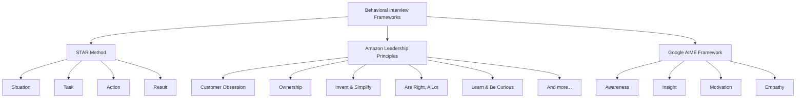
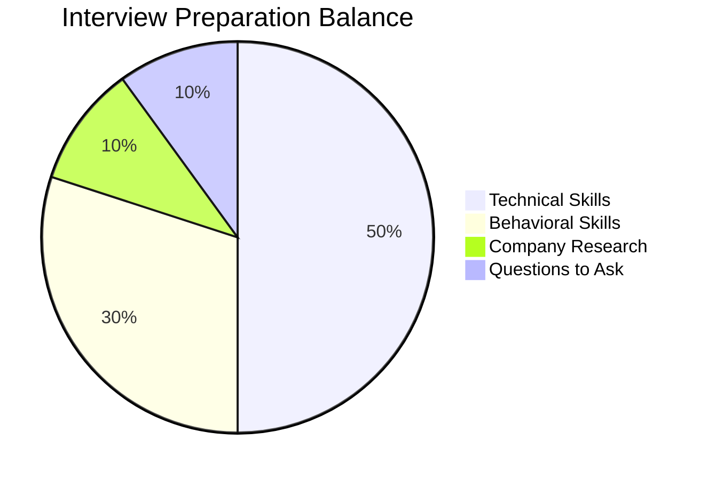

# Technical vs Behavioral Interviews

## Introduction

When applying for software development positions, you'll typically encounter two distinct types of interviews: technical interviews and behavioral interviews. Both are critical components of the hiring process, but they evaluate completely different aspects of your candidacy. Understanding the differences between these interview types and how to prepare for each is essential for interview success.

In this guide, we'll explore:
- What technical and behavioral interviews are
- Key differences between the two interview types
- Common questions and formats for each
- Preparation strategies and best practices
- How to present yourself effectively in both settings

## Understanding Technical Interviews

Technical interviews assess your programming knowledge, problem-solving abilities, and technical skills relevant to the position. These interviews evaluate whether you have the technical competencies required to perform the job effectively.

### Common Technical Interview Formats

Technical interviews can take several forms:

<div className="technical-interview-formats">

1. **Coding Challenges**: Solving programming problems in real-time, often on a whiteboard or using a code editor.
2. **System Design Questions**: Designing scalable systems or architectures.
3. **Knowledge-Based Questions**: Questions about programming languages, data structures, algorithms, etc.
4. **Take-Home Assignments**: Completing a programming task within a specified timeframe.
5. **Pair Programming**: Collaboratively solving a problem with an interviewer.

</div>

### Example Technical Interview Questions

```javascript
// Example 1: Array manipulation problem
function findMissingNumber(nums) {
  // Find the missing number in an array containing n distinct numbers in the range [0, n]
  const n = nums.length;
  let expectedSum = (n * (n + 1)) / 2;
  let actualSum = nums.reduce((sum, num) => sum + num, 0);
  return expectedSum - actualSum;
}

// Input: [3, 0, 1]
// Output: 2
// Explanation: The array should contain numbers from 0 to 3, but 2 is missing.
```

```python
# Example 2: String manipulation problem
def is_palindrome(s):
    # Remove non-alphanumeric characters and convert to lowercase
    filtered_chars = [c.lower() for c in s if c.isalnum()]
    # Check if the string reads the same forward and backward
    return filtered_chars == filtered_chars[::-1]

# Input: "A man, a plan, a canal: Panama"
# Output: True
# Explanation: The string is a palindrome when considering only alphanumeric characters.
```

### Key Areas to Focus On

- **Data Structures**: Arrays, linked lists, trees, graphs, stacks, queues, hash tables
- **Algorithms**: Sorting, searching, recursion, dynamic programming
- **Time & Space Complexity**: Big O notation and optimization techniques
- **Programming Language Proficiency**: Deep knowledge of your primary language
- **Problem-Solving Process**: How you approach and solve problems step-by-step

## Understanding Behavioral Interviews

Behavioral interviews assess your soft skills, personality traits, and past behaviors to predict your future performance. The underlying principle is that past behavior is the best predictor of future behavior.

### Common Behavioral Interview Frameworks

Many companies use structured frameworks for behavioral interviews:



### The STAR Method

The STAR method is a structured approach to answering behavioral questions:

- **Situation**: Describe the context or background
- **Task**: Explain the challenge or responsibility you faced
- **Action**: Detail the steps you took to address the situation
- **Result**: Share the outcomes and what you learned

### Example Behavioral Interview Questions

1. **Teamwork**: "Tell me about a time when you had a conflict with a team member. How did you resolve it?"

2. **Problem-Solving**: "Describe a situation where you faced a complex problem. How did you approach solving it?"

3. **Leadership**: "Give me an example of when you had to lead a team through a difficult situation."

4. **Adaptability**: "Tell me about a time when you had to quickly adapt to a significant change at work."

5. **Time Management**: "How do you prioritize tasks when you have multiple deadlines approaching?"

### Sample STAR Response

<div className="example-response">

**Question**: "Tell me about a time when you had to work under pressure to meet a deadline."

**Response**:

- **Situation**: "During my internship at XYZ Company, our team was working on a critical feature for our web application that needed to be shipped within three days due to a major client presentation."

- **Task**: "I was responsible for implementing the authentication system that would integrate with the client's existing infrastructure."

- **Action**: "First, I broke down the task into smaller components and estimated the time for each. Realizing some parts were more crucial than others, I prioritized the core functionality. I stayed late for two nights, communicated constantly with the team about my progress, and requested help from a senior developer on a particularly tricky OAuth implementation."

- **Result**: "We successfully launched the feature on time, and it worked flawlessly during the client presentation. The client was impressed and signed a year-long contract. Personally, I learned valuable lessons about time estimation, prioritization, and the importance of asking for help when needed."

</div>

## Key Differences Between Technical and Behavioral Interviews

| Aspect | Technical Interviews | Behavioral Interviews |
|--------|---------------------|----------------------|
| Focus | Hard skills, technical knowledge | Soft skills, past behaviors |
| Evaluation | Problem-solving ability, technical proficiency | Communication, teamwork, leadership |
| Format | Coding challenges, technical questions | Conversation, storytelling |
| Preparation | Practice coding problems, review concepts | Reflect on past experiences, prepare stories |
| Common Questions | "How would you implement X?" | "Tell me about a time when you..." |

## Preparation Strategies

### For Technical Interviews

1. **Practice Coding Problems**:
   - Use platforms like LeetCode, HackerRank, or CodeSignal
   - Practice writing code on a whiteboard or Google Doc (without auto-completion)
   - Time yourself to simulate interview conditions

2. **Review Computer Science Fundamentals**:
   ```javascript
   // Example: Implementing a basic hash table
   class HashTable {
     constructor(size = 53) {
       this.keyMap = new Array(size);
     }
     
     _hash(key) {
       let total = 0;
       const WEIRD_PRIME = 31;
       for (let i = 0; i < Math.min(key.length, 100); i++) {
         const char = key[i];
         const value = char.charCodeAt(0) - 96;
         total = (total * WEIRD_PRIME + value) % this.keyMap.length;
       }
       return total;
     }
     
     set(key, value) {
       const index = this._hash(key);
       if (!this.keyMap[index]) {
         this.keyMap[index] = [];
       }
       this.keyMap[index].push([key, value]);
     }
     
     get(key) {
       const index = this._hash(key);
       if (!this.keyMap[index]) return undefined;
       for (let i = 0; i < this.keyMap[index].length; i++) {
         if (this.keyMap[index][i][0] === key) {
           return this.keyMap[index][i][1];
         }
       }
       return undefined;
     }
   }
   ```

3. **Study System Design**:
   - Understand scalability concepts
   - Learn about databases, caching, load balancing
   - Practice drawing system architectures

4. **Mock Interviews**:
   - Practice with friends or use platforms like Pramp
   - Record yourself to identify areas for improvement
   - Ask for feedback on both your solution and communication

### For Behavioral Interviews

1. **Compile Your Stories**:
   - Create a "story bank" of 10-15 professional experiences
   - Ensure stories cover different competencies (leadership, teamwork, conflict resolution)
   - Structure each story using the STAR method

2. **Research the Company**:
   - Understand the company's values and culture
   - Align your stories with their core principles
   - Prepare questions that demonstrate your interest in their mission

3. **Practice Delivery**:
   - Rehearse your stories out loud
   - Time your responses (aim for 2-3 minutes per question)
   - Record yourself to check for filler words and body language

4. **Prepare for Follow-up Questions**:
   - Anticipate deeper questions about your decisions
   - Be ready to provide additional context or details
   - Practice handling unexpected questions

## Balancing Technical and Behavioral Preparation

Many candidates make the mistake of focusing solely on technical preparation, neglecting behavioral aspects. A balanced approach is crucial:



## Interview Day Strategies

### For Technical Interviews

1. **Think Out Loud**:
   - Verbalize your thought process
   - Explain your approach before diving into code
   - Discuss trade-offs in your solution

2. **Ask Clarifying Questions**:
   - Ensure you understand the problem requirements
   - Discuss constraints and edge cases
   - Confirm input/output expectations

3. **Start with a Simple Solution**:
   - Begin with a working solution, even if inefficient
   - Optimize incrementally
   - Analyze time and space complexity

### For Behavioral Interviews

1. **Be Authentic**:
   - Share genuine experiences rather than what you think the interviewer wants to hear
   - Include both successes and learning opportunities
   - Show self-awareness and growth mindset

2. **Focus on Your Role**:
   - Emphasize your specific contributions in team settings
   - Use "I" statements when describing your actions
   - Give credit to team members when appropriate

3. **Connect to the Job**:
   - Relate your experiences to the role you're applying for
   - Highlight transferable skills relevant to the position
   - Show how your past experiences have prepared you for this opportunity

## Common Mistakes to Avoid

### In Technical Interviews

- Jumping into coding without understanding the problem
- Not testing your code with example inputs
- Being unable to explain your solution's time/space complexity
- Getting stuck and not asking for hints
- Giving up too easily on challenging problems

### In Behavioral Interviews

- Providing generic answers without specific examples
- Rambling or going off-topic
- Not following the STAR format
- Speaking negatively about previous employers or colleagues
- Failing to show what you learned from difficult situations

## Summary

Technical and behavioral interviews play complementary roles in the hiring process:

- **Technical interviews** assess your programming skills, problem-solving abilities, and technical knowledge.
- **Behavioral interviews** evaluate your soft skills, cultural fit, and how you've handled situations in the past.

Success in the job search requires preparation for both types of interviews. Technical prowess alone won't secure a job offer if you can't demonstrate teamwork, communication, and other essential soft skills. Similarly, great interpersonal skills won't compensate for lacking the necessary technical abilities.

By understanding the distinct purposes and formats of these interviews and preparing accordingly, you'll be well-positioned to showcase your full range of qualifications and stand out as a well-rounded candidate.

## Additional Resources

### For Technical Interview Preparation

- **Books**: "Cracking the Coding Interview" by Gayle Laakmann McDowell
- **Online Platforms**: LeetCode, HackerRank, AlgoExpert
- **Courses**: Data Structures and Algorithms refreshers on platforms like Coursera or edX

### For Behavioral Interview Preparation

- **Books**: "STAR Interview: Complete Guide to Dominating Your Job Interview" by Steve Gold
- **Resources**: Articles on company-specific interview frameworks (Amazon Leadership Principles, Google AIME)
- **Practice**: Mock interview services like interviewing.io or Pramp

### Exercises

1. **Technical Practice**: Solve 3-5 coding problems per week on platforms like LeetCode, focusing on different data structures and algorithms.

2. **Behavioral Practice**:
   - Write out 10 STAR stories covering different competencies
   - Practice delivering these stories in under 3 minutes each
   - Record yourself and review for clarity and conciseness

3. **Mock Interviews**: Schedule at least 3 mock interviews (both technical and behavioral) before your actual interviews to get feedback and build confidence.

Remember that interview skills improve with practice. The more interviews you do, the more comfortable and proficient you'll become at navigating both technical and behavioral assessments.