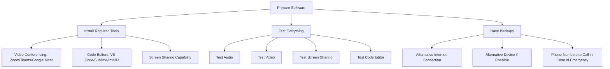

# Remote Interview Strategies

## Introduction

Remote technical interviews have become increasingly common in the programming industry, especially since the global shift to remote work. Unlike traditional in-person interviews, remote interviews present unique challenges and opportunities for candidates. This guide will help you navigate the virtual interview process with confidence, covering everything from technical preparation to environmental setup and communication strategies.

## Why Remote Interviews Are Different

Remote interviews differ from traditional in-person interviews in several key ways:

- You interact with interviewers through video conferencing tools
- You code in shared editors or specialized platforms instead of whiteboards
- Your home environment becomes your interview space
- Technical issues can affect the interview experience
- Non-verbal communication is limited to what's visible on camera

Understanding these differences is crucial for adequately preparing and performing well in remote interviews.

## Technical Setup Essentials

### Hardware Requirements

Your technical setup can significantly impact your interview experience. Here's what you need:

- **Reliable computer**: Ensure your device can handle video conferencing without lagging
- **Stable internet connection**: Ideally hardwired (Ethernet) rather than Wi-Fi where possible
- **Quality webcam**: Clear video helps establish rapport with interviewers
- **Working microphone**: Clear audio is essential for effective communication
- **Headphones**: Prevent echo and improve audio quality

### Software Preparation



Familiarize yourself with common remote interview platforms:

- **Video conferencing tools**: Zoom, Microsoft Teams, Google Meet
- **Collaborative coding platforms**: CoderPad, HackerRank, LeetCode, CodeSignal
- **Screen sharing tools**: Know how to share your screen effectively

Before the interview:

```javascript
// Example preparation checklist function
function prepareForRemoteInterview() {
  const tasks = [
    "Update all software to latest versions",
    "Test microphone and camera",
    "Practice screen sharing",
    "Set up backup internet connection (mobile hotspot)",
    "Have interviewer's contact information handy",
    "Close unnecessary applications and browser tabs",
    "Disable notifications"
  ];
  
  return tasks.map(task => ({
    task: task,
    completed: false
  }));
}

// Output
// [
//   { task: "Update all software to latest versions", completed: false },
//   { task: "Test microphone and camera", completed: false },
//   ...and so on
// ]
```

## Environment Setup

Creating the right environment helps you make a positive impression:

### Physical Space

- **Quiet location**: Choose a space with minimal background noise
- **Clean background**: Remove distracting elements from what's visible on camera
- **Good lighting**: Position yourself so your face is clearly visible
- **Comfortable seating**: You'll be sitting for potentially hours

### Professional Appearance

Dress professionally even though you're at home. Research the company culture to determine the appropriate level of formality, but generally, business casual is a safe choice.

## Pre-Interview Technical Preparation

### Coding Practice

Practice coding in an environment similar to the one you'll use in the interview:

```python
# Example: Practice using a timer to simulate interview conditions
def practice_coding_question(problem_link, time_limit_minutes):
    """
    Function to structure your practice sessions
    
    Args:
        problem_link: Link to the practice problem
        time_limit_minutes: Time to allocate for solving
        
    Returns:
        Dictionary with reflection notes
    """
    # Set timer for time_limit_minutes
    
    # Solve problem without external help
    
    return {
        "completed_within_time": True/False,
        "solution_optimal": True/False,
        "areas_to_improve": ["Time complexity analysis", "Edge cases"],
        "confidence_level": 7  # Scale of 1-10
    }

# Example output:
# {
#   "completed_within_time": True,
#   "solution_optimal": False,
#   "areas_to_improve": ["Time complexity analysis", "Edge cases"],
#   "confidence_level": 7
# }
```

### Common Remote Interview Formats

Prepare for various formats:

1. **Live coding interviews**: Solving problems in real-time while explaining your thought process
2. **Take-home assignments**: Completing a project or specific task on your own time
3. **Technical discussions**: Explaining concepts, architecture decisions, or previous projects
4. **System design interviews**: Creating high-level designs for complex systems

## Communication Strategies

### Verbal Communication

In remote settings, clear verbal communication becomes even more important:

- **Speak clearly and at a moderate pace**: Remote audio can sometimes cut out
- **Avoid talking over the interviewer**: Slight delays can lead to awkward interruptions
- **Verbalize your thought process**: Explain what you're thinking as you work through problems

```javascript
// Example of verbalizing your thought process while coding
function findMaxSubarraySum(arr) {
  // "First, I need to understand what we're looking for - the maximum sum of a contiguous subarray"
  
  // "I'll use Kadane's algorithm which has O(n) time complexity"
  let maxSoFar = arr[0];
  let maxEndingHere = arr[0];
  
  // "Now I'll iterate through the array starting from the second element"
  for (let i = 1; i < arr.length; i++) {
    // "For each element, I need to decide whether to start a new subarray or extend the existing one"
    // "I'll take the maximum of the current element and the current element plus the previous sum"
    maxEndingHere = Math.max(arr[i], maxEndingHere + arr[i]);
    
    // "Then update our global maximum if needed"
    maxSoFar = Math.max(maxSoFar, maxEndingHere);
    
    // "I'm keeping track of both the maximum ending at this position and the overall maximum"
  }
  
  // "Finally, return the maximum subarray sum we found"
  return maxSoFar;
}

// Example Input: [-2, 1, -3, 4, -1, 2, 1, -5, 4]
// Example Output: 6 (from subarray [4, -1, 2, 1])
```

### Non-verbal Communication

Pay attention to these aspects of non-verbal communication:

- **Eye contact**: Look at the camera, not just at your screen
- **Posture**: Sit upright and appear engaged
- **Facial expressions**: Show enthusiasm and interest
- **Hand gestures**: Use them naturally but keep them within camera frame

## Technical Interview Strategies

### Problem-Solving Approach

Follow a structured approach to problem-solving:

1. **Understand the problem**: Clarify requirements and constraints
2. **Discuss possible approaches**: Talk through different solutions before coding
3. **Code the solution**: Implement your approach step by step
4. **Test your code**: Check for edge cases and errors
5. **Optimize if needed**: Discuss potential improvements

```python
def remote_interview_approach(problem):
    # Step 1: Understand the problem
    constraints = ask_clarifying_questions(problem)
    
    # Step 2: Discuss possible approaches
    approaches = [
        {"strategy": "Brute Force", "time_complexity": "O(n²)", "space_complexity": "O(1)"},
        {"strategy": "Optimized", "time_complexity": "O(n log n)", "space_complexity": "O(n)"},
        {"strategy": "Most Efficient", "time_complexity": "O(n)", "space_complexity": "O(n)"}
    ]
    
    selected_approach = discuss_tradeoffs_and_select(approaches)
    
    # Step 3: Code the solution
    solution = implement_solution(selected_approach)
    
    # Step 4: Test your code
    test_cases = [
        {"input": "typical case", "expected_output": "..."},
        {"input": "edge case 1", "expected_output": "..."},
        {"input": "edge case 2", "expected_output": "..."}
    ]
    
    test_solution(solution, test_cases)
    
    # Step 5: Optimize if needed
    optimized_solution = discuss_optimizations(solution)
    
    return optimized_solution
```

### Screen Sharing Best Practices

When sharing your screen:

- **Close unnecessary applications and browser tabs**: Avoid distractions and potential privacy issues
- **Increase font size**: Make your code easily readable for interviewers
- **Use keyboard shortcuts**: Demonstrate efficiency in your workflow
- **Organize your workspace**: Have relevant documentation or notes accessible but not distracting

### Handling Technical Difficulties

Technical issues can arise during remote interviews. Here's how to handle them:

- **Stay calm**: Technical problems happen to everyone
- **Have a backup plan**: Alternative internet connection, device, or phone number to call
- **Communicate promptly**: Let the interviewer know if you're experiencing technical difficulties
- **Suggest alternatives**: Be ready to switch to a phone call or reschedule if necessary

## Practice Exercise: Mock Remote Interview

Set up a practice remote interview with a friend or mentor. Have them observe these aspects of your performance:

1. Technical setup quality
2. Environment and appearance
3. Problem-solving approach
4. Communication clarity
5. Non-verbal cues
6. Handling of simulated technical difficulties

Use this feedback to identify areas for improvement before your actual interview.

## Remote Interview Checklist

Use this checklist before your interview:

- [ ] Test all technical equipment 24 hours before
- [ ] Perform a trial run with the specific platform you'll be using
- [ ] Prepare your environment (clean background, good lighting)
- [ ] Have a glass of water nearby
- [ ] Close all unnecessary applications
- [ ] Turn off notifications
- [ ] Have a backup plan for technical issues
- [ ] Keep interviewer contact information handy
- [ ] Place a "Do Not Disturb" sign if others are around

## Summary

Remote technical interviews require preparation beyond just technical knowledge. By properly setting up your environment, practicing with the right tools, and developing clear communication strategies, you can create an interview experience that showcases your programming skills effectively.

Remember these key points:
- Test your technical setup thoroughly before the interview
- Create a professional environment free from distractions
- Practice coding in conditions similar to the actual interview
- Communicate clearly and verbalize your thought process
- Be prepared to handle technical difficulties calmly

With these strategies, you'll be well-equipped to navigate remote technical interviews successfully and stand out as a candidate in the competitive programming job market.

## Additional Resources

- Practice coding problems on platforms like LeetCode, HackerRank, and CodeSignal
- Join mock interview platforms that provide feedback from real programmers
- Record yourself solving problems to review your communication style
- Review common technical interview questions in your specific programming domain
- Practice explaining your previous projects in a concise, structured way