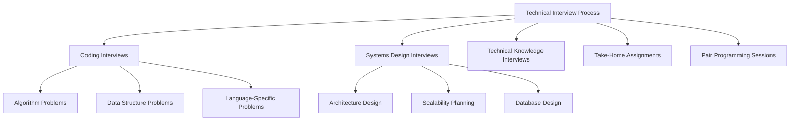
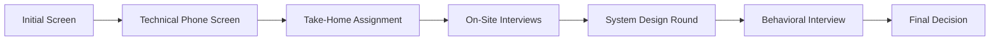

# What to Expect in Technical Interviews

## Introduction

Technical interviews are a standard part of the hiring process for software developers, engineers, and other technical roles. Unlike traditional interviews that focus on your background and soft skills, technical interviews specifically evaluate your coding abilities, problem-solving skills, and technical knowledge. For many beginners, these interviews can seem intimidating, but with proper preparation and understanding of what to expect, you can approach them with confidence.

This guide will walk you through the different types of technical interviews you might encounter, common question formats, strategies for success, and practical examples to help you prepare.

## Types of Technical Interviews

Technical interviews typically fall into several categories:

### 1. Coding Interviews

Coding interviews assess your ability to write clean, efficient code to solve specific problems. You might need to code on a whiteboard, in a shared document, or through a specialized coding platform like HackerRank or CoderPad.

### 2. Systems Design Interviews

These interviews evaluate your ability to design complex systems, focusing on architecture, scalability, and engineering trade-offs.

### 3. Technical Knowledge Interviews

These assess your understanding of specific technologies, languages, frameworks, or concepts relevant to the position.

### 4. Take-Home Assignments

Some companies provide take-home projects that you complete on your own time, demonstrating your coding abilities in a less pressured environment.

### 5. Pair Programming Sessions

In these interviews, you collaborate with an interviewer to solve a problem, demonstrating both your coding skills and how you work with others.



## Common Question Types in Coding Interviews

### Algorithm Problems

These questions test your ability to implement efficient algorithms to solve computational problems. Common categories include:

- **Sorting and searching algorithms**
- **Dynamic programming**
- **Greedy algorithms**
- **Graph algorithms**
- **Recursion**

**Example: Finding the Maximum Subarray Sum**

```javascript
function maxSubarraySum(arr) {
  let maxSoFar = arr[0];
  let maxEndingHere = arr[0];
  
  for (let i = 1; i < arr.length; i++) {
    // Either start a new subarray or extend the existing one
    maxEndingHere = Math.max(arr[i], maxEndingHere + arr[i]);
    // Update the global maximum
    maxSoFar = Math.max(maxSoFar, maxEndingHere);
  }
  
  return maxSoFar;
}

// Example usage
const array = [-2, 1, -3, 4, -1, 2, 1, -5, 4];
console.log(maxSubarraySum(array)); // Output: 6 (from subarray [4, -1, 2, 1])
```

### Data Structure Problems

These questions assess your knowledge of various data structures and your ability to select and implement the appropriate one for a given problem:

- **Arrays and strings**
- **Linked lists**
- **Stacks and queues**
- **Trees and graphs**
- **Hash tables**
- **Heaps**

**Example: Implementing a Queue using Two Stacks**

```javascript
class QueueUsingStacks {
  constructor() {
    this.stack1 = []; // for enqueue
    this.stack2 = []; // for dequeue
  }
  
  enqueue(item) {
    this.stack1.push(item);
  }
  
  dequeue() {
    // If stack2 is empty, transfer all elements from stack1
    if (this.stack2.length === 0) {
      while (this.stack1.length > 0) {
        this.stack2.push(this.stack1.pop());
      }
    }
    
    // If stack2 is still empty, queue is empty
    if (this.stack2.length === 0) {
      return null;
    }
    
    return this.stack2.pop();
  }
  
  peek() {
    // If stack2 is empty, transfer all elements from stack1
    if (this.stack2.length === 0) {
      while (this.stack1.length > 0) {
        this.stack2.push(this.stack1.pop());
      }
    }
    
    // If stack2 is still empty, queue is empty
    if (this.stack2.length === 0) {
      return null;
    }
    
    return this.stack2[this.stack2.length - 1];
  }
  
  isEmpty() {
    return this.stack1.length === 0 && this.stack2.length === 0;
  }
}

// Example usage
const queue = new QueueUsingStacks();
queue.enqueue(1);
queue.enqueue(2);
queue.enqueue(3);
console.log(queue.dequeue()); // Output: 1
console.log(queue.peek());    // Output: 2
```

### Problem-Solving Questions

These questions evaluate your approach to breaking down complex problems and your critical thinking skills.

**Example: Find All Anagrams in a String**

```javascript
function findAnagrams(s, p) {
  const result = [];
  if (s.length < p.length) return result;
  
  // Create frequency maps
  const pCount = new Array(26).fill(0);
  const sCount = new Array(26).fill(0);
  
  // Fill frequency map for pattern p
  for (let i = 0; i < p.length; i++) {
    pCount[p.charCodeAt(i) - 'a'.charCodeAt(0)]++;
  }
  
  // Sliding window approach
  for (let i = 0; i < s.length; i++) {
    // Add current character to window
    sCount[s.charCodeAt(i) - 'a'.charCodeAt(0)]++;
    
    // Remove character from beginning of window
    if (i >= p.length) {
      sCount[s.charCodeAt(i - p.length) - 'a'.charCodeAt(0)]--;
    }
    
    // Check if current window is an anagram
    if (i >= p.length - 1) {
      let isAnagram = true;
      for (let j = 0; j < 26; j++) {
        if (pCount[j] !== sCount[j]) {
          isAnagram = false;
          break;
        }
      }
      
      if (isAnagram) {
        result.push(i - (p.length - 1));
      }
    }
  }
  
  return result;
}

// Example usage
console.log(findAnagrams("cbaebabacd", "abc")); // Output: [0, 6]
```

## What to Expect in Systems Design Interviews

Systems design interviews are common for senior roles and evaluate your ability to design scalable, resilient software systems. You might be asked to:

1. **Design a URL shortener service (like bit.ly)**
2. **Design a social media feed**
3. **Design a distributed file storage system**
4. **Design a recommendation system**

These questions assess your knowledge of:
- Scalability principles
- Database design and choices
- Caching strategies
- Load balancing
- API design
- Fault tolerance and reliability

**Example Approach to a Systems Design Question:**

When asked to design a URL shortener service, you might outline:

1. **Requirements clarification**:
   - Functional requirements: URL shortening, redirection, customized short URLs
   - Non-functional requirements: high availability, low latency, scalability

2. **Capacity estimation**:
   - Traffic estimates (reads vs. writes)
   - Storage requirements
   - Memory requirements for caching

3. **System API design**:
   ```
   createShortURL(api_key, original_url, custom_alias=None)
   getOriginalURL(short_url)
   ```

4. **Database schema**:
   ```
   URL_Mapping {
     short_url: string [PK]
     original_url: string
     creation_date: datetime
     expiration_date: datetime
     user_id: string
   }
   ```

5. **Basic system design**:
   - URL encoding approach (MD5, Base62, etc.)
   - Hash collisions handling
   - Database choice (SQL vs. NoSQL)

6. **Scaling considerations**:
   - Database sharding
   - Caching strategies
   - Load balancing
   - Analytics

## Technical Knowledge Questions

These questions test your understanding of specific technologies and programming concepts. They vary widely based on the role but might include:

1. **Language-specific questions**:
   - "Explain how closures work in JavaScript"
   - "What's the difference between `==` and `===` in JavaScript?"
   - "Explain the concept of `await` in async/await in JavaScript"

2. **Framework questions**:
   - "How does React's virtual DOM work?"
   - "What are React hooks and why were they introduced?"

3. **Database questions**:
   - "Explain the difference between SQL and NoSQL databases"
   - "What is database normalization and when would you use it?"

4. **Computer science fundamentals**:
   - "Explain the concept of time complexity"
   - "What is the difference between a stack and a queue?"

## Interview Preparation Strategies

### 1. Practice Coding Problems

Regularly solve problems on platforms like:
- LeetCode
- HackerRank
- CodeSignal
- Interview Cake

Aim to understand the patterns behind problems rather than memorizing solutions.

### 2. Review Computer Science Fundamentals

- Data structures
- Algorithms
- Big O notation
- Operating systems concepts
- Database principles

### 3. Mock Interviews

- Practice with friends or mentors
- Use platforms like Pramp for peer mock interviews
- Record yourself explaining solutions out loud

### 4. Study the Company

- Research their tech stack
- Understand their products
- Read their engineering blog

### 5. Prepare Your Own Questions

Prepare thoughtful questions about:
- Development processes
- Team structure
- Tech challenges they're facing
- Growth opportunities

## What to Expect During the Interview

### The STAR Method for Behavioral Questions

Even in technical interviews, you might face behavioral questions. Use the STAR method to structure your answers:

- **Situation**: Set the context
- **Task**: Describe your responsibility
- **Action**: Explain what you did
- **Result**: Share the outcome

### Common Interview Timeline



### Tips for Whiteboard Coding

1. **Think out loud**: Explain your thought process
2. **Clarify the problem**: Ask questions before coding
3. **Start with a simple approach**: Then optimize
4. **Test your code**: Walk through with examples
5. **Handle edge cases**: Consider null inputs, empty collections, etc.

## Real-World Example: A Complete Interview Solution

Let's walk through a common interview problem and its solution:

**Problem: Find Longest Substring Without Repeating Characters**

```javascript
/**
 * @param {string} s
 * @return {number}
 */
function lengthOfLongestSubstring(s) {
  // Edge cases
  if (!s) return 0;
  if (s.length === 1) return 1;
  
  let maxLength = 0;
  let start = 0;
  const charMap = new Map();
  
  for (let end = 0; end < s.length; end++) {
    const currentChar = s[end];
    
    // If we've seen this character before and it's in our current window
    if (charMap.has(currentChar) && charMap.get(currentChar) >= start) {
      // Move the start pointer to position after the first occurrence of the duplicate
      start = charMap.get(currentChar) + 1;
    }
    
    // Update the last position of the current character
    charMap.set(currentChar, end);
    
    // Update max length if needed
    maxLength = Math.max(maxLength, end - start + 1);
  }
  
  return maxLength;
}

// Example usage
console.log(lengthOfLongestSubstring("abcabcbb")); // Output: 3 (from "abc")
console.log(lengthOfLongestSubstring("bbbb"));     // Output: 1 (from "b")
console.log(lengthOfLongestSubstring("pwwkew"));   // Output: 3 (from "wke")
```

**Walkthrough of the Solution**:

1. **Problem Understanding**:
   - We need to find the longest substring without repeating characters.
   - For "abcabcbb", the answer is "abc" with length 3.

2. **Approach Selection**:
   - We'll use a sliding window approach with a hash map.
   - The window expands when we see new characters and contracts when we encounter duplicates.

3. **Implementation**:
   - We maintain a `start` pointer for the window start
   - We use a Map to track the latest position of each character
   - When we find a duplicate within our current window, we move the start pointer

4. **Time Complexity**: O(n) where n is the length of the string
   - We only scan the string once

5. **Space Complexity**: O(min(m, n)) where m is the size of the character set
   - The Map will store at most m characters

## Handling Rejection and Learning from Interviews

Rejection is a normal part of the interview process, even for experienced developers:

1. **Request feedback** from your interviewers when possible
2. **Review and reflect** on what went well and what didn't
3. **Identify knowledge gaps** and create a study plan
4. **Don't take rejection personally** - it's often about fit, not just skills
5. **Keep practicing** and applying - interviewing is a skill that improves with practice

## Summary

Technical interviews can be challenging, but with proper preparation and practice, you can approach them with confidence. Remember these key points:

- Understand the different types of technical interviews you might face
- Practice coding problems regularly, focusing on understanding patterns
- Review computer science fundamentals
- Practice explaining your thought process out loud
- Research the company and prepare relevant questions
- Learn from each interview experience, regardless of the outcome

With consistent practice and a structured approach to preparation, you'll be well-equipped to handle technical interviews and showcase your skills effectively.

## Additional Resources

- **Books**:
  - "Cracking the Coding Interview" by Gayle Laakmann McDowell
  - "System Design Interview" by Alex Xu
  - "Introduction to Algorithms" by Cormen, Leiserson, Rivest, and Stein

- **Online Platforms**:
  - LeetCode
  - HackerRank
  - CodeSignal
  - AlgoExpert

- **Practice Interviews**:
  - Pramp
  - interviewing.io

- **YouTube Channels**:
  - CS Dojo
  - Back To Back SWE
  - Tech Dose