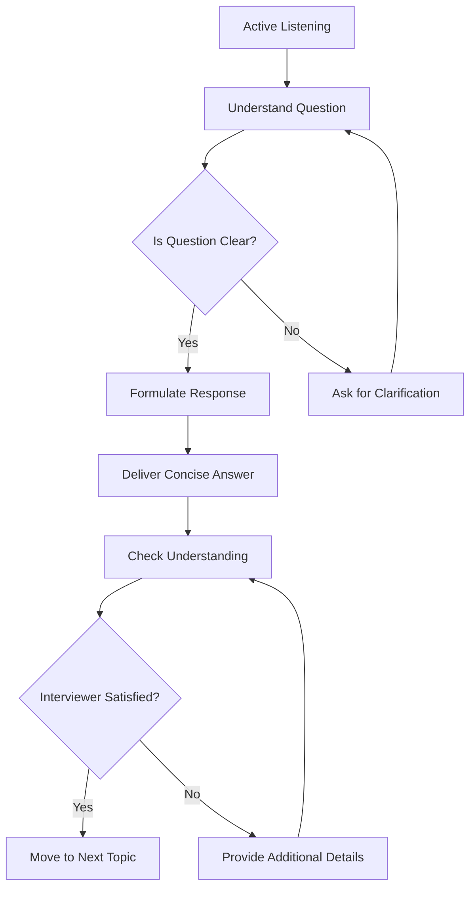

# Interview Etiquette

## Introduction

Interviewing for programming roles requires more than just technical knowledge. How you present yourself and interact with interviewers can significantly impact your success. This guide covers essential interview etiquette principles that will help you make a positive impression and navigate the interview process professionally.

Interview etiquette encompasses your behavior, communication style, and overall professionalism during the interviewing process. Mastering these soft skills complements your technical abilities and shows potential employers that you're not only capable but also pleasant to work with.

## Before the Interview

### Research and Preparation

Proper interview etiquette begins long before you join the meeting:

- **Company Research**: Understand the company's products, values, and culture.
- **Role Familiarization**: Review the job description thoroughly to align your responses.
- **Interviewer Background**: If names are provided, look up your interviewers on LinkedIn.

### Communication Prior to Interview

Your pre-interview communications establish initial impressions:

- Respond promptly to interview invitations (within 24 hours)
- Use professional language in all written communications
- Confirm interview details clearly

```javascript
// Example of a professional interview confirmation email
const confirmationEmail = `
Subject: Confirmation - Software Developer Interview on October 15

Dear Ms. Johnson,

Thank you for the opportunity to interview for the Junior Developer position at TechCorp. I'm writing to confirm my interview scheduled for:

Date: October 15, 2023
Time: 2:00 PM Eastern Time
Format: Video call via Zoom

I look forward to discussing how my skills align with your team's needs. Please let me know if you need any additional information from me before our meeting.

Best regards,
Alex Rodriguez
(555) 123-4567
`;
```

### Technical Preparation

For programming interviews specifically:

- Test your equipment the day before
- Ensure your development environment is ready for potential coding exercises
- Have a notepad and pen ready for notes
- Keep a glass of water nearby

## During the Interview

### Punctuality

Arrive early to demonstrate reliability:

- For in-person interviews: Arrive 10-15 minutes early
- For virtual interviews: Join 3-5 minutes early
- If delayed unavoidably, notify the interviewer or recruiter immediately

### First Impressions

How you present yourself matters:

- **Dress Code**: Business casual is typically appropriate for tech interviews (even remote ones)
- **Body Language**: Maintain good posture, make appropriate eye contact
- **Greeting**: A firm handshake (in-person) or friendly greeting (virtual) sets the tone

### Communication Skills

Effective communication is crucial:

- Listen actively without interrupting
- Speak clearly and at a moderate pace
- Use technical terminology appropriately
- Ask for clarification when needed



### Answering Technical Questions

When addressing technical questions:

- Take a moment to think before answering
- Structure your response with a clear approach
- Think aloud to demonstrate your problem-solving process
- Be honest if you don't know something

Example of handling a technical question:

```javascript
// Interviewer: "How would you implement a function to check if a string is a palindrome?"

// Poor response: Jumping straight to coding without explanation

// Good response:
// "I'd approach this by comparing characters from both ends of the string.
// Let me outline the steps:
//
// 1. First, I'll handle edge cases like empty strings or single characters
// 2. Then I'll use two pointers - one at the beginning and one at the end
// 3. I'll compare characters and move pointers inward
// 4. If any characters don't match, it's not a palindrome
//
// Here's how I'd implement it:

function isPalindrome(str) {
  // Remove non-alphanumeric characters and convert to lowercase
  const cleanStr = str.replace(/[^a-zA-Z0-9]/g, '').toLowerCase();
  
  // Edge cases
  if (cleanStr.length <= 1) return true;
  
  // Two-pointer approach
  let left = 0;
  let right = cleanStr.length - 1;
  
  while (left < right) {
    if (cleanStr[left] !== cleanStr[right]) {
      return false;
    }
    left++;
    right--;
  }
  
  return true;
}

// This handles cases like 'A man, a plan, a canal: Panama' correctly"
```

### Behavioral Questions

When answering behavioral questions:

- Use the STAR method (Situation, Task, Action, Result)
- Provide specific examples rather than generalizations
- Keep responses concise and focused on relevant details

### Questions to Ask

Prepare thoughtful questions for the interviewer:

- Ask about team dynamics and day-to-day responsibilities
- Inquire about growth opportunities and expectations
- Avoid asking only about compensation or benefits

## After the Interview

### Thank You Notes

Send a thank-you email within 24 hours:

- Express appreciation for the opportunity
- Reference specific points from the conversation
- Reiterate your interest in the position

```javascript
// Example of a post-interview thank you email
const thankYouEmail = `
Subject: Thank You - Software Developer Interview

Dear Mr. Chen,

Thank you for taking the time to discuss the Junior Developer position with me today. I especially appreciated learning about your team's work on the customer portal redesign.

Our conversation reinforced my enthusiasm for the role and confidence that my experience with React would allow me to contribute quickly to your projects. I was particularly excited about the mentorship opportunities you mentioned.

Please don't hesitate to contact me if you need any additional information. I look forward to hearing from you about the next steps.

Best regards,
Alex Rodriguez
(555) 123-4567
`;
```

### Follow-Up Etiquette

If you haven't heard back within the expected timeframe:

- Send a polite follow-up email
- Wait approximately one week after the expected decision date
- Keep the message brief and professional

## Special Considerations for Technical Interviews

### Code Review Etiquette

When reviewing code or participating in pair programming:

- Explain your thought process clearly
- Be open to feedback and alternative approaches
- Ask thoughtful questions about the codebase

### Technical Assessment Etiquette

During take-home or live coding exercises:

- Follow instructions precisely
- Comment your code to explain your reasoning
- Focus on correctness first, then optimization
- Manage your time effectively

## Remote Interview Etiquette

Virtual interviews have additional considerations:

- Test your camera, microphone, and internet connection in advance
- Choose a quiet, well-lit location with a neutral background
- Dress professionally (top to bottom, in case you need to stand)
- Look at the camera when speaking, not at your own image
- Close unnecessary applications to prevent notifications

```javascript
// Virtual interview preparation checklist
const remoteInterviewChecklist = [
  "Test camera and microphone",
  "Ensure stable internet connection (consider wired connection)",
  "Close email and messaging applications",
  "Set phone to silent mode",
  "Position camera at eye level",
  "Check lighting (light source in front, not behind)",
  "Prepare a glass of water",
  "Have a notepad and pen ready",
  "Test screen sharing functionality if needed",
  "Ensure development environment is ready"
];
```

## Common Etiquette Mistakes to Avoid

- **Arriving late** without notice
- **Interrupting** the interviewer
- **Speaking negatively** about previous employers
- **Checking your phone** during the interview
- **Providing overly lengthy** responses
- **Using inappropriate language** or slang
- **Lying** about skills or experience
- **Appearing disinterested** in the role or company

## Adapting to Different Company Cultures

Interview etiquette can vary slightly based on company culture:

- **Startups**: May be more casual but still expect professionalism
- **Enterprise Companies**: Typically more formal in attire and communication
- **Tech Giants**: Often focus on cultural fit alongside technical skills

## Summary

Interview etiquette is an essential component of the job search process. By following these guidelines, you'll present yourself as a professional who not only has technical skills but also the soft skills necessary to thrive in a workplace environment.

Remember that interviewers are evaluating not just what you know, but whether you would be someone they want to work with daily. Proper etiquette demonstrates respect for the process and increases your chances of making a positive impression.

## Additional Resources

- Practice mock interviews with peers to refine your communication skills
- Record yourself answering common questions to identify areas for improvement
- Review feedback from previous interviews to address specific concerns

## Practice Exercises

1. **Mock Introduction**: Practice your professional introduction in under 2 minutes.
2. **STAR Response**: Prepare three STAR-format responses for common behavioral questions.
3. **Question Formulation**: Develop five thoughtful questions to ask interviewers.
4. **Email Templates**: Create personalized templates for interview confirmation and thank-you emails.
5. **Virtual Setup Test**: Conduct a test call with a friend to verify your remote interview setup.