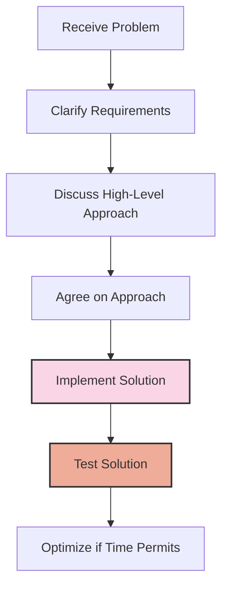

# Common Interview Mistakes

## Introduction

Technical interviews can be challenging, even for experienced developers. While your coding skills are important, there are numerous other factors that can impact your interview performance. This guide covers the most common mistakes candidates make during programming interviews and provides practical strategies to avoid them. By being aware of these pitfalls, you can present yourself more effectively and increase your chances of success.

## Not Clarifying the Problem

One of the most frequent mistakes candidates make is jumping into coding without fully understanding the problem.

### Why This Happens

- Nervousness and eagerness to start coding
- Assumption that the problem is simpler than it actually is
- Fear of appearing incompetent by asking questions

### The Better Approach

Always take time to clarify the problem statement before writing any code:

```jsx
// Example: Interviewer asks you to implement a function to find duplicates in an array

// DON'T immediately start coding:
function findDuplicates(arr) {
  // Coding without clarification...
}

// DO clarify first:
// "I'd like to understand the requirements better:
// - Should I return all duplicates or just the first one?
// - Do we need to preserve the original order?
// - Should I return the duplicate elements or their indices?
// - Are there any constraints on space or time complexity?"
```

### Real-world Impact

In actual development work, unclear requirements lead to wasted effort and incorrect implementations. Demonstrating your ability to ask clarifying questions shows that you understand the software development process.

## Poor Communication During Problem-Solving

Many candidates work silently, leaving the interviewer in the dark about their thought process.

### Why This Happens

- Concentration on solving the problem
- Thinking communication will slow you down
- Fear that verbalizing incomplete thoughts will make you seem less competent

### The Better Approach

Narrate your thought process as you work through the problem:

```jsx
// Silent approach (DON'T):
// *Thinks silently while writing code*

// Verbal approach (DO):
// "I'm thinking we could use a hash map to track elements we've seen.
// This would give us O(n) time complexity with O(n) space.
// Let me implement that approach..."

function findDuplicates(arr) {
  const seen = new Map();
  const duplicates = [];
  
  for (let i = 0; i < arr.length; i++) {
    // "Now I'm iterating through each element and checking if we've seen it before"
    if (seen.has(arr[i])) {
      duplicates.push(arr[i]);
    } else {
      seen.set(arr[i], true);
    }
  }
  
  return duplicates;
}
```

### Real-world Impact

In collaborative environments, clear communication about your approach and reasoning is crucial. Teams need to understand not just what you're doing, but why you're doing it.

## Ignoring Edge Cases

Failing to consider edge cases is a major red flag for interviewers.

### Why This Happens

- Focus on the "happy path" only
- Time pressure
- Lack of testing mindset

### Common Edge Cases to Consider

- Empty inputs
- Extremely large inputs
- Invalid inputs
- Boundary conditions

```jsx
// Example: Function to find the minimum value in an array

// Ignoring edge cases (DON'T):
function findMinimum(arr) {
  let min = arr[0];
  for (let i = 1; i < arr.length; i++) {
    if (arr[i] < min) {
      min = arr[i];
    }
  }
  return min;
}

// Handling edge cases (DO):
function findMinimum(arr) {
  // Check for empty array
  if (!arr || arr.length === 0) {
    throw new Error("Array cannot be empty");
  }
  
  let min = arr[0];
  for (let i = 1; i < arr.length; i++) {
    if (arr[i] < min) {
      min = arr[i];
    }
  }
  return min;
}

// Or even better, discuss multiple ways to handle edge cases:
// "We could throw an error, return null, or return Infinity depending on the requirements."
```

### Real-world Impact

Production code that fails to handle edge cases leads to bugs, crashes, and security vulnerabilities. Demonstrating attention to these details shows you write robust code.

## Not Testing Your Solution

Many candidates consider their job done after writing the code, without testing it.

### Why This Happens

- Time pressure
- Overconfidence in solution
- Assuming the interviewer will test it

### The Better Approach

Always test your code with:

1. A simple example (happy path)
2. Edge cases
3. Tracing through the code line by line

```jsx
// Example: Testing a function that checks if a string is a palindrome

function isPalindrome(str) {
  if (!str) return false;
  str = str.toLowerCase().replace(/[^a-z0-9]/g, '');
  
  for (let i = 0; i < Math.floor(str.length / 2); i++) {
    if (str[i] !== str[str.length - 1 - i]) {
      return false;
    }
  }
  return true;
}

// Testing approach:
// "Let me test this with some examples:
// - 'racecar' should return true
// - 'hello' should return false
// - '' should return false (empty string edge case)
// - 'A man, a plan, a canal: Panama' should return true (special characters)
// - '12321' should return true (numbers)

// Let me trace through 'A man, a plan, a canal: Panama':
// After removing special chars and converting to lowercase: 'amanaplanacanalpanama'
// Compare 'a' with 'a' (first and last) - match
// Compare 'm' with 'm' - match
// ... and so on"
```

### Real-world Impact

Testing is a critical part of the development process. Demonstrating your testing approach shows that you care about code quality and correctness.

## Poor Time Management

Spending too much time on one part of the problem while neglecting others.

### Why This Happens

- Getting stuck on implementation details
- Perfectionism
- Lack of practice with timed problem-solving

### The Better Approach



1. Spend ~5-10% of your time clarifying the problem
2. Spend ~15-20% discussing approaches
3. Spend ~50-60% implementing your solution
4. Reserve ~15-20% for testing and optimization

If you're stuck, communicate:

```jsx
// DON'T silently struggle for 10+ minutes

// DO communicate when stuck:
// "I'm considering two approaches here. The first uses a stack, which simplifies the
// traversal but might use more memory. The second uses two pointers, which is more
// memory efficient but requires more complex logic. Given the constraints, I'm leaning
// toward the stack approach. Does that sound reasonable?"
```

### Real-world Impact

Software development involves making trade-offs between perfectionism and practicality. Being able to manage your time effectively is a valuable skill that translates directly to workplace productivity.

## Not Knowing Standard Library Functions

Reinventing the wheel instead of using built-in functions.

### Why This Happens

- Lack of familiarity with language standard libraries
- Trying to demonstrate algorithmic knowledge
- Nervousness causing "blank-outs" on known functions

### The Better Approach

```jsx
// Reinventing the wheel (DON'T):
function reverseArray(arr) {
  const result = [];
  for (let i = arr.length - 1; i >= 0; i--) {
    result.push(arr[i]);
  }
  return result;
}

// Using standard library (DO):
function reverseArray(arr) {
  return [...arr].reverse();
}

// Even better - acknowledge both approaches:
// "I could implement this manually with a for loop, but JavaScript's built-in
// reverse() method would be more concise. Should I use the built-in method or
// would you prefer to see the manual implementation?"
```

Common functions worth knowing:

| Language | Useful Standard Library Functions |
|----------|----------------------------------|
| JavaScript | `map`, `filter`, `reduce`, `sort`, `includes`, `split`, `join` |
| Python | `sorted`, `map`, `filter`, `zip`, `enumerate`, `list comprehensions` |
| Java | `Collections.sort`, `Stream API`, `Arrays.asList`, `String.format` |

### Real-world Impact

In professional development, reinventing functionality that exists in standard libraries is considered poor practice. It creates unnecessary complexity, introduces potential bugs, and reduces maintainability.

## Not Considering Optimization

Some candidates stop at the first working solution without considering performance.

### Why This Happens

- Relief at finding any working solution
- Lack of knowledge about optimization techniques
- Not recognizing when optimization is needed

### The Better Approach

1. Get a working solution first
2. Analyze time and space complexity
3. Discuss potential optimizations

```jsx
// Initial solution with O(n²) time complexity:
function hasDuplicate(arr) {
  for (let i = 0; i < arr.length; i++) {
    for (let j = i + 1; j < arr.length; j++) {
      if (arr[i] === arr[j]) {
        return true;
      }
    }
  }
  return false;
}

// After optimization - O(n) time complexity:
function hasDuplicate(arr) {
  const seen = new Set();
  for (const item of arr) {
    if (seen.has(item)) {
      return true;
    }
    seen.add(item);
  }
  return false;
}

// Discuss the trade-off:
// "The optimized solution reduces time complexity from O(n²) to O(n),
// but increases space complexity from O(1) to O(n). Depending on the
// requirements, this trade-off might be worth it for larger inputs."
```

### Real-world Impact

Understanding performance implications is crucial for building scalable systems. Being able to analyze and optimize code demonstrates senior-level thinking.

## Overengineering Solutions

Going for complex solutions when simple ones would suffice.

### Why This Happens

- Trying to impress the interviewer
- Overthinking the problem
- Assuming the interviewer wants the most clever solution

### The Better Approach

Start with the simplest working solution, then enhance if needed:

```jsx
// Overengineered approach (DON'T):
function isPrime(n) {
  if (n <= 1) return false;
  if (n <= 3) return true;
  if (n % 2 === 0 || n % 3 === 0) return false;
  
  // Using 6k±1 optimization
  for (let i = 5; i * i <= n; i += 6) {
    if (n % i === 0 || n % (i + 2) === 0) {
      return false;
    }
  }
  return true;
}

// Simple, readable approach (DO first):
function isPrime(n) {
  if (n <= 1) return false;
  
  // Check from 2 to sqrt(n)
  for (let i = 2; i <= Math.sqrt(n); i++) {
    if (n % i === 0) {
      return false;
    }
  }
  return true;
}

// Then explain possible optimizations:
// "This solution works with O(sqrt(n)) time complexity. We could optimize further by
// checking only 2 separately, then odd numbers starting from 3, which would reduce
// the number of iterations by half. For very large numbers, there are even more
// advanced optimizations like the Sieve of Eratosthenes or the 6k±1 optimization."
```

### Real-world Impact

In real development, simpler solutions are often preferred because they're easier to maintain and have fewer bugs. Starting simple and iterating is a professional approach.

## Failing to Show Adaptability

Being unable to pivot when a solution isn't working.

### Why This Happens

- Getting fixated on one approach
- Reluctance to "throw away" code already written
- Cognitive biases like the sunk cost fallacy

### The Better Approach

Be willing to adjust your approach when needed:

```jsx
// Recognizing a dead end:
// "I've been trying to solve this using a recursive approach, but I'm running into
// issues with the base case. Let me take a step back and consider an iterative
// solution instead, which might handle the edge cases more cleanly."

// OR

// "I initially thought a depth-first search would work here, but I'm realizing that
// a breadth-first search would be more appropriate because we need to find the
// shortest path. Let me switch approaches."
```

### Real-world Impact

Requirements change, and technologies evolve. The ability to adapt, recognize when an approach isn't working, and pivot gracefully is critical in professional software development.

## Defensive or Argumentative Behavior

Reacting poorly to feedback or hints from the interviewer.

### Why This Happens

- Taking feedback personally
- Interview stress and anxiety
- Feeling judged or criticized

### The Better Approach

Treat interviewer feedback as collaborative help:

```jsx
// Defensive response (DON'T):
// Interviewer: "Have you considered using a different data structure here?"
// Candidate: "This approach works fine. I don't see why I need to change it."

// Collaborative response (DO):
// Interviewer: "Have you considered using a different data structure here?"
// Candidate: "That's a good point. I initially chose an array for simplicity,
// but a hash map would probably improve the lookup time from O(n) to O(1).
// Would you like me to implement that approach instead?"
```

### Real-world Impact

Software development is collaborative. Being receptive to feedback and building on others' ideas is essential for team success.

## Summary

The most common interview mistakes often have less to do with technical knowledge and more to do with communication, problem-solving approach, and professional behaviors. By focusing on:

- Clarifying requirements before coding
- Communicating your thought process
- Handling edge cases
- Testing your solution
- Managing your time effectively
- Using standard library functions appropriately
- Considering optimization when relevant
- Starting with simple solutions
- Showing adaptability
- Being receptive to feedback

You'll not only perform better in interviews but also demonstrate the skills that make successful software engineers in real-world environments.

## Additional Resources

- Practice mock interviews with peers to get used to verbalizing your thoughts
- Solve problems with time constraints to improve your time management
- Record yourself solving problems to identify areas for improvement
- Join coding interview preparation groups where you can receive feedback

## Practice Exercises

1. **Self-recording exercise**: Record yourself solving a problem while narrating your thought process. Review the recording to identify areas for improvement.

2. **Time-boxed problem solving**: Set a 30-minute timer and attempt to solve a medium-difficulty problem completely (clarification, coding, testing, optimization).

3. **Edge case identification**: For a given problem, challenge yourself to list at least 5 potential edge cases before writing any code.

4. **Solution optimization**: Implement a solution to a problem, then challenge yourself to optimize it in at least two different ways (time complexity, space complexity, readability).

5. **Feedback implementation**: Have a peer review your solution to a problem and practice incorporating their feedback without becoming defensive.