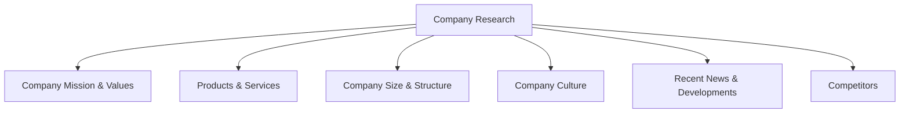
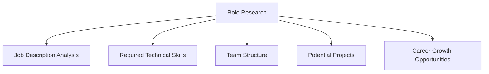
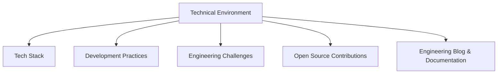

# Pre-Interview Research

## Introduction

One of the most overlooked yet crucial aspects of interview preparation is conducting thorough research before your interview. Pre-interview research not only demonstrates your genuine interest in the company and role but also helps you tailor your responses to align with the company's values, products, and technical environment. This knowledge gives you a significant advantage over other candidates who may not have done their homework.

In this guide, we'll explore why pre-interview research matters, what information you should look for, and how to leverage that knowledge during your technical interview.

## Why Research Matters

Conducting pre-interview research serves several important purposes:

1. **Demonstrates genuine interest** - When you can speak knowledgeably about a company's products or recent achievements, it shows you care enough to invest time in understanding them.

2. **Helps you evaluate fit** - Research helps you determine if the company's culture, values, and technical direction align with your own career goals.

3. **Informs your questions** - Knowledge about the company enables you to ask thoughtful, specific questions that impress interviewers.

4. **Reduces interview anxiety** - Familiarity with the company and role helps you feel more confident and prepared.

5. **Allows you to tailor your responses** - Understanding the company's tech stack and challenges helps you highlight relevant skills and experiences.

## What to Research

### Company Information

Start with the basics about the organization:



#### Company Mission and Values

Understanding a company's mission and values helps you align your answers with what the company prioritizes. Look for this information on:

- The company's "About Us" page
- Their careers or jobs section
- The CEO's messages in annual reports or press releases

**Example Application:**
If a company emphasizes innovation in their values, you might highlight your experience with experimental projects or how you've implemented novel solutions to difficult problems.

#### Products and Services

Familiarize yourself with the company's main products or services:

- What problems do they solve?
- Who are their target customers?
- How do their products work at a high level?
- What technologies do they use?

**Example Application:**
"I noticed your company recently launched a microservices architecture for your main product. In my previous role, I worked on breaking down a monolithic application into microservices, which improved our deployment frequency by 70%."

#### Company Size and Structure

Understanding the company's size and organizational structure helps you gauge what working there might be like:

- Is it a startup, mid-size, or enterprise company?
- How are engineering teams organized?
- Is it a flat organization or more hierarchical?

#### Company Culture

Research what it's like to work at the company:

- Check sites like Glassdoor and LinkedIn for employee reviews
- Look for company blog posts about work environment
- Review their social media for insights into daily life

#### Recent News and Developments

Stay updated on recent company news:

- New product launches
- Funding rounds
- Leadership changes
- Acquisitions or partnerships

**Example Application:**
"I read about your recent Series C funding. I'm interested to hear how this will affect the engineering team's growth plans over the next year."

#### Competitors

Understanding the competitive landscape shows business awareness:

- Who are the company's main competitors?
- What differentiates this company from competitors?

### Role-Specific Research

Next, focus on the specific role you're applying for:



#### Job Description Analysis

Analyze the job posting carefully:

- What technical skills are required vs. preferred?
- What soft skills are emphasized?
- What responsibilities are highlighted?

**Example Application:**
Create a table matching your skills and experiences to each requirement in the job description. Prepare concrete examples of how you've used those skills in past roles.

#### Required Technical Skills

Research the technical stack mentioned in the job description:

- Make sure you understand the basics of all technologies listed
- Refresh your knowledge on less familiar technologies
- Prepare examples of your experience with similar technologies

**Example Code Example:**

If the job requires experience with React hooks, refresh your knowledge:

```jsx
// Example of React hooks usage you might review
import React, { useState, useEffect } from 'react';

function UserProfile() {
  const [user, setUser] = useState(null);
  const [loading, setLoading] = useState(true);

  useEffect(() => {
    // Fetch user data when component mounts
    async function fetchUserData() {
      try {
        const response = await fetch('/api/user');
        const userData = await response.json();
        setUser(userData);
      } catch (error) {
        console.error('Error fetching user data:', error);
      } finally {
        setLoading(false);
      }
    }
    
    fetchUserData();
  }, []);

  if (loading) return <div>Loading...</div>;
  if (!user) return <div>No user found</div>;
  
  return (
    <div>
      <h1>{user.name}</h1>
      <p>Email: {user.email}</p>
    </div>
  );
}
```

#### Team Structure

Try to learn about the team you'll be joining:

- How large is the team?
- What roles make up the team?
- Who would you be reporting to?

#### Potential Projects

Research what projects you might work on:

- Check the company's engineering blog
- Look at open-source repositories if available
- Review recent product announcements

#### Career Growth Opportunities

Understand potential career paths:

- How do engineers typically progress at the company?
- What learning opportunities are available?
- Are there mentorship programs?

### Technical Environment

Research the company's technical environment:



#### Tech Stack

Identify the technologies the company uses:

- Programming languages
- Frameworks and libraries
- Databases
- Cloud platforms
- DevOps tools

**Example Application:**
If you discover the company uses AWS, review key AWS services and be prepared to discuss your experience with them:

```javascript
// Example AWS S3 interaction you might review
const AWS = require('aws-sdk');

// Configure AWS credentials
AWS.config.update({
  region: 'us-west-2',
  accessKeyId: process.env.AWS_ACCESS_KEY,
  secretAccessKey: process.env.AWS_SECRET_KEY
});

// Create S3 service object
const s3 = new AWS.S3();

// Upload a file to S3
async function uploadFile(fileContent, fileName, bucketName) {
  const params = {
    Bucket: bucketName,
    Key: fileName,
    Body: fileContent
  };
  
  try {
    const data = await s3.upload(params).promise();
    console.log(`File uploaded successfully at ${data.Location}`);
    return data.Location;
  } catch (err) {
    console.error("Error uploading file:", err);
    throw err;
  }
}
```

#### Development Practices

Research the company's development methodology:

- Do they use Agile, Scrum, Kanban, or another approach?
- How do they handle code reviews?
- What is their deployment process like?

#### Engineering Challenges

Try to understand the technical challenges the company faces:

- Scaling issues
- Legacy system migrations
- Integration challenges

**Example Application:**
"I understand from your engineering blog that you're working on migrating from a monolithic architecture to microservices. In my previous role, I led a similar migration and developed strategies to maintain service reliability during the transition."

#### Open Source Contributions

Check if the company has open-source projects:

- What technologies do they use in their open-source work?
- How active are their repositories?
- What is their contribution process?

#### Engineering Blog and Documentation

Many companies maintain engineering blogs:

- Read about their technical challenges and solutions
- Note the technologies they discuss
- Pay attention to their approach to problem-solving

## Where to Find Information

Here are key resources for your research:

1. **Company website** - Official information about products, services, and values
2. **Company blog** - Insights into culture, technical challenges, and recent projects
3. **Engineering blog** - Deep dives into technical stack and engineering approach
4. **GitHub repositories** - Open-source projects and contributions
5. **LinkedIn** - Employee profiles and company updates
6. **Glassdoor** - Employee reviews and interview experiences
7. **TechCrunch/news sources** - Recent funding, acquisitions, and product launches
8. **YouTube** - Product demos, tech talks by employees
9. **Podcast interviews** - Often feature founders or engineering leaders
10. **Job description** - Key skills and technologies valued by the company

## How to Organize Your Research

Create a structured document to organize your findings:

```javascript
// Example research object structure
const companyResearch = {
  companyInfo: {
    name: "TechCorp",
    founded: 2015,
    mission: "To simplify web development through innovative tools",
    size: "250 employees (50 in engineering)",
    funding: "Series B ($30M in 2023)",
    location: "Headquarters in Seattle, remote-friendly"
  },
  products: [
    {
      name: "DevFlow",
      description: "CI/CD platform for web applications",
      technologies: ["Node.js", "Docker", "Kubernetes", "GraphQL"]
    }
  ],
  techStack: {
    frontEnd: ["React", "TypeScript", "Redux"],
    backEnd: ["Node.js", "Express", "MongoDB"],
    infrastructure: ["AWS", "Docker", "Kubernetes"],
    tools: ["GitHub", "JIRA", "CircleCI"]
  },
  culture: {
    values: ["Innovation", "Collaboration", "Work-life balance"],
    workStyle: "Remote-first with quarterly in-person meetings",
    reviews: "4.2/5 on Glassdoor, praised for autonomy and growth opportunities"
  },
  role: {
    title: "Senior Frontend Developer",
    team: "User Experience Team (8 developers)",
    manager: "Sarah Chen, Director of Frontend Engineering",
    projects: ["Redesigning the main dashboard", "Implementing new analytics features"],
    requirements: ["React", "TypeScript", "Performance optimization", "Cross-browser testing"]
  },
  questions: [
    "How is the frontend team organized?",
    "What are the biggest challenges in the current codebase?",
    "How do you handle state management across the application?"
  ]
};
```

## Leveraging Your Research During the Interview

Once you've done your research, put it to good use:

### In Your Introduction

Reference your knowledge of the company early:

"I've been following your company since you launched your AI-powered code review tool last year. The approach you've taken to automating code quality checks while maintaining developer autonomy really resonates with my own philosophy about development."

### When Answering Technical Questions

Connect your technical answers to the company's context:

"Based on my understanding of your e-commerce platform's scale, I would approach this caching problem by implementing a distributed cache using Redis, similar to how I solved a performance bottleneck in my previous role."

### When Asking Questions

Ask informed questions that demonstrate your research:

"I read in your engineering blog about your migration to GraphQL. How has that affected your approach to state management on the frontend?"

### When Discussing Experience

Highlight relevant experiences:

"I noticed you use Kubernetes for orchestration. In my last role, I helped implement a Kubernetes-based deployment pipeline that reduced our deployment times by 60%. Here's how we approached it..."

## Common Pitfalls to Avoid

1. **Shallow research** - Going only as far as the homepage
2. **Outdated information** - Referencing old news or deprecated products
3. **Memorizing facts without understanding** - Focus on understanding the "why" behind what the company does
4. **Overlooking culture** - Technical fit is important, but cultural fit matters too
5. **Not preparing questions** - Missed opportunity to show engagement
6. **Being too general** - Make your research specific to the role and team

## Sample Research Checklist

Use this checklist to ensure you've covered the essentials:

- [ ] Company mission and values
- [ ] Main products/services and their target audience
- [ ] Recent news and developments
- [ ] Technical stack and architecture
- [ ] Development methodology
- [ ] Team structure and culture
- [ ] Key challenges the company/team is facing
- [ ] Competitors and market position
- [ ] Specific role requirements and responsibilities
- [ ] Prepared questions based on research

## Summary

Pre-interview research is a crucial step in preparing for technical interviews. By thoroughly understanding the company, its products, technical environment, and the specific role, you position yourself as a candidate who is genuinely interested and well-prepared. This knowledge allows you to tailor your responses to the company's needs and ask insightful questions that demonstrate your engagement.

Remember that the goal of research is not just to memorize facts but to understand the company's technical challenges and how your skills and experiences align with their needs. This deeper understanding will help you articulate why you're not just a good programmer, but the right programmer for this specific company and role.

## Additional Resources

Here are some resources to help deepen your pre-interview research:

1. **GitHub repositories** - For companies with open-source contributions
2. **Engineering blogs** - Many tech companies maintain blogs about their technical challenges and solutions
3. **Industry news sites** - TechCrunch, The Verge, and industry-specific publications
4. **Company review sites** - Glassdoor, Blind, and similar platforms
5. **Social media** - LinkedIn, Twitter, and other platforms where companies share updates

## Practice Exercise

Choose a tech company you're interested in and conduct thorough research following the framework outlined in this guide. Create a structured document with your findings and prepare 5-7 specific questions based on your research that you could ask during an interview.

After completing this exercise, review your research and identify areas where you could dig deeper or where you might leverage this information during different stages of the interview process.