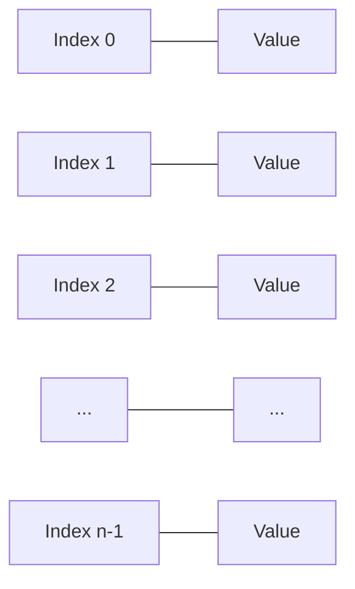

# Arrays and Strings

## Introduction

Arrays and strings are among the most fundamental data structures in programming. They serve as the building blocks for more complex data structures and are essential for nearly every programming task. This guide will introduce you to these core concepts, explain how they work, and show you how to use them effectively in your programs.

## Arrays

An array is a collection of elements stored at contiguous memory locations. It is the simplest data structure where each element can be accessed directly using its index.

### Key Characteristics of Arrays

- **Fixed Size**: In many languages, arrays have a fixed size that must be defined when created.
- **Homogeneous Elements**: Most array implementations require all elements to be of the same type.
- **Zero-Based Indexing**: In most programming languages, array indices start at 0.
- **Contiguous Memory**: Array elements are stored in adjacent memory locations.

### Array Representation



### Creating Arrays

Here's how to create arrays in different programming languages:

**JavaScript:**
```javascript
// Creating an array
let numbers = [1, 2, 3, 4, 5];
let fruits = ["Apple", "Banana", "Cherry"];

// Empty array
let emptyArray = [];

// Array with predefined size (less common in JavaScript)
let preDefinedArray = new Array(5);
```

**Python:**
```python
# Creating a list (Python's dynamic array)
numbers = [1, 2, 3, 4, 5]
fruits = ["Apple", "Banana", "Cherry"]

# Empty list
empty_list = []
```

**Java:**
```java
// Creating arrays
int[] numbers = {1, 2, 3, 4, 5};
String[] fruits = {"Apple", "Banana", "Cherry"};

// Empty array with size
int[] emptyArray = new int[5];
```

### Accessing Array Elements

Elements in an array can be accessed using their index:

```javascript
let fruits = ["Apple", "Banana", "Cherry", "Date", "Elderberry"];

console.log(fruits[0]); // Output: Apple
console.log(fruits[2]); // Output: Cherry

// Modifying an element
fruits[1] = "Blueberry";
console.log(fruits); // Output: ["Apple", "Blueberry", "Cherry", "Date", "Elderberry"]
```

### Common Array Operations

#### 1. Finding Array Length

```javascript
let fruits = ["Apple", "Banana", "Cherry"];
console.log(fruits.length); // Output: 3
```

#### 2. Iterating Through an Array

```javascript
let fruits = ["Apple", "Banana", "Cherry"];

// Using for loop
for (let i = 0; i < fruits.length; i++) {
    console.log(fruits[i]);
}

// Using for...of loop (modern JavaScript)
for (let fruit of fruits) {
    console.log(fruit);
}

// Using forEach method
fruits.forEach(function(fruit) {
    console.log(fruit);
});
```

#### 3. Adding and Removing Elements

In dynamic arrays/lists:

```javascript
let fruits = ["Apple", "Banana"];

// Adding elements
fruits.push("Cherry"); // Adds to the end
console.log(fruits); // Output: ["Apple", "Banana", "Cherry"]

fruits.unshift("Apricot"); // Adds to the beginning
console.log(fruits); // Output: ["Apricot", "Apple", "Banana", "Cherry"]

// Removing elements
let lastFruit = fruits.pop(); // Removes from the end
console.log(lastFruit); // Output: Cherry
console.log(fruits); // Output: ["Apricot", "Apple", "Banana"]

let firstFruit = fruits.shift(); // Removes from the beginning
console.log(firstFruit); // Output: Apricot
console.log(fruits); // Output: ["Apple", "Banana"]
```

### Time Complexity of Array Operations

| Operation | Time Complexity | Explanation |
|-----------|----------------|-------------|
| Access    | O(1)           | Direct access using index |
| Search    | O(n)           | May need to check every element |
| Insertion (at end) | O(1)* | For dynamic arrays/lists |
| Insertion (at position) | O(n) | Need to shift elements |
| Deletion (at end) | O(1)* | For dynamic arrays/lists |
| Deletion (at position) | O(n) | Need to shift elements |

*Note: In languages with fixed-size arrays, insertion might require creating a new array.

### Multi-dimensional Arrays

Arrays can have multiple dimensions, essentially creating arrays of arrays:

```javascript
// 2D array (matrix)
let matrix = [
    [1, 2, 3],
    [4, 5, 6],
    [7, 8, 9]
];

console.log(matrix[1][2]); // Output: 6 (row 1, column 2)
```

## Strings

A string is a sequence of characters. Although strings might seem different from arrays, they are closely related—strings can be thought of as arrays of characters.

### Key Characteristics of Strings

- **Immutable**: In many languages (like Java, Python, JavaScript), strings are immutable—once created, they cannot be changed.
- **Character Encoding**: Strings use character encodings like ASCII, UTF-8, or UTF-16.
- **Zero-Based Indexing**: Like arrays, string indices typically start at 0.

### Creating Strings

```javascript
// Simple string creation
let greeting = "Hello, World!";
let name = 'John Doe';

// String with escaped characters
let withQuotes = "He said, \"Good morning!\"";

// Multiline strings (modern JavaScript)
let multiline = `This is a 
multiline
string`;
```

### String Operations

#### 1. String Length

```javascript
let message = "Hello, World!";
console.log(message.length); // Output: 13
```

#### 2. Accessing Characters

```javascript
let greeting = "Hello";
console.log(greeting[0]); // Output: H
console.log(greeting[4]); // Output: o
```

#### 3. String Concatenation

```javascript
let firstName = "John";
let lastName = "Doe";

// Using the + operator
let fullName = firstName + " " + lastName;
console.log(fullName); // Output: John Doe

// Using template literals (modern JavaScript)
let greeting = `Hello, ${firstName} ${lastName}!`;
console.log(greeting); // Output: Hello, John Doe!
```

#### 4. String Methods

```javascript
let message = "Hello, World!";

// Converting case
console.log(message.toUpperCase()); // Output: HELLO, WORLD!
console.log(message.toLowerCase()); // Output: hello, world!

// Finding substrings
console.log(message.indexOf("World")); // Output: 7
console.log(message.includes("Hello")); // Output: true

// Extracting substrings
console.log(message.substring(0, 5)); // Output: Hello
console.log(message.slice(7, 12)); // Output: World

// Replacing content
console.log(message.replace("World", "Universe")); // Output: Hello, Universe!

// Splitting a string
console.log("apple,banana,cherry".split(",")); // Output: ["apple", "banana", "cherry"]
```

### String vs Character Array

While strings behave like arrays in many ways, there are important differences:

```javascript
// String - typically immutable
let greeting = "Hello";
// This doesn't change the original string - it creates a new one
let newGreeting = greeting.replace("H", "J");
console.log(greeting); // Output: Hello
console.log(newGreeting); // Output: Jello

// Character array - mutable
let chars = ['H', 'e', 'l', 'l', 'o'];
chars[0] = 'J'; // Directly modifies the array
console.log(chars.join('')); // Output: Jello
```

## Real-World Applications

### 1. Text Processing

```javascript
function countWords(text) {
    // Remove leading/trailing whitespace and split by spaces
    return text.trim().split(/\s+/).length;
}

let paragraph = "This is an example paragraph. It contains several words.";
console.log(`Word count: ${countWords(paragraph)}`); // Output: Word count: 9
```

### 2. Data Parsing

```javascript
// Parsing CSV data
function parseCSV(csvString) {
    let rows = csvString.split('
');
    let data = [];
    
    for (let row of rows) {
        data.push(row.split(','));
    }
    
    return data;
}

let csvData = "John,Doe,30
Jane,Smith,25
Bob,Johnson,45";
let parsedData = parseCSV(csvData);
console.log(parsedData);
// Output: [["John", "Doe", "30"], ["Jane", "Smith", "25"], ["Bob", "Johnson", "45"]]
```

### 3. Dynamic Content Generation

```javascript
function generateHTMLList(items) {
    let html = "<ul>
";
    
    for (let item of items) {
        html += `  <li>${item}</li>
`;
    }
    
    html += "</ul>";
    return html;
}

let fruits = ["Apple", "Banana", "Cherry", "Date"];
console.log(generateHTMLList(fruits));
/*
Output:
<ul>
  <li>Apple</li>
  <li>Banana</li>
  <li>Cherry</li>
  <li>Date</li>
</ul>
*/
```

### 4. Image Processing (Conceptual Example)

```javascript
// Simplified conceptual example of a grayscale image represented as a 2D array
function convertToGrayscale(pixelArray) {
    let height = pixelArray.length;
    let width = pixelArray[0].length;
    let grayscale = new Array(height);
    
    for (let y = 0; y < height; y++) {
        grayscale[y] = new Array(width);
        for (let x = 0; x < width; x++) {
            let [r, g, b] = pixelArray[y][x];
            // Standard grayscale conversion formula
            let gray = Math.round(0.299 * r + 0.587 * g + 0.114 * b);
            grayscale[y][x] = [gray, gray, gray];
        }
    }
    
    return grayscale;
}

// Example usage with a tiny 2x2 image
let colorImage = [
    [[255, 0, 0], [0, 255, 0]],  // Red, Green
    [[0, 0, 255], [255, 255, 0]]  // Blue, Yellow
];

let grayscaleImage = convertToGrayscale(colorImage);
console.log(grayscaleImage);
/*
Output approximation:
[
    [[76, 76, 76], [149, 149, 149]],
    [[29, 29, 29], [225, 225, 225]]
]
*/
```

## Common Challenges and Solutions

### 1. Array Bounds

One common issue is accessing array elements outside the valid range:

```javascript
let arr = [1, 2, 3];
console.log(arr[5]); // Output: undefined (in JavaScript)
// In many other languages, this would cause an "index out of bounds" error
```

**Solution**: Always check array bounds before accessing elements.

```javascript
function safeAccess(array, index) {
    if (index >= 0 && index < array.length) {
        return array[index];
    }
    return null; // or throw an error, return a default value, etc.
}
```

### 2. String Immutability

Attempting to modify strings directly can lead to unexpected behavior:

```javascript
let name = "John";
name[0] = "B"; // This does nothing in JavaScript
console.log(name); // Output: John (unchanged)
```

**Solution**: Create a new string with the desired changes:

```javascript
let name = "John";
let newName = "B" + name.substring(1);
console.log(newName); // Output: Bohn
```

### 3. Shallow vs. Deep Copying

When working with arrays of objects or multidimensional arrays:

```javascript
// Shallow copy example
let original = [{name: "Alice"}, {name: "Bob"}];
let shallowCopy = [...original]; // or original.slice()

shallowCopy[0].name = "Alicia";
console.log(original[0].name); // Output: "Alicia" - original is affected!
```

**Solution**: Use deep copying techniques for nested structures:

```javascript
// Deep copy using JSON (has limitations but works for simple objects)
let original = [{name: "Alice"}, {name: "Bob"}];
let deepCopy = JSON.parse(JSON.stringify(original));

deepCopy[0].name = "Alicia";
console.log(original[0].name); // Output: "Alice" - original is unaffected
```

## Summary

Arrays and strings are fundamental data structures that form the basis of many programming operations:

- **Arrays** provide indexed access to collections of items, allowing for efficient storage and retrieval.
- **Strings** are specialized sequences designed for text manipulation and processing.

Both data structures share similar access patterns but differ in mutability and specialized operations. Understanding these differences is crucial for writing efficient and correct code.

As you progress in your programming journey, you'll find that mastering arrays and strings is essential for tackling more complex data structures and algorithms.

## Practice Exercises

1. Write a function that reverses an array without using built-in reverse methods.
2. Create a function that checks if a string is a palindrome (reads the same forward and backward).
3. Implement a function that merges two sorted arrays into a single sorted array.
4. Write a program that counts the frequency of each character in a string.
5. Create a function that rotates an array by k positions (e.g., [1,2,3,4,5] rotated by 2 becomes [4,5,1,2,3]).

## Further Reading

- Explore dynamic arrays (like JavaScript's arrays or Python's lists) vs. static arrays
- Learn about more advanced string algorithms like pattern matching
- Study array sorting algorithms (bubble sort, merge sort, quick sort)
- Investigate specialized string data structures like Tries and Suffix Arrays