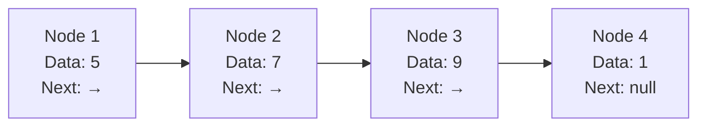
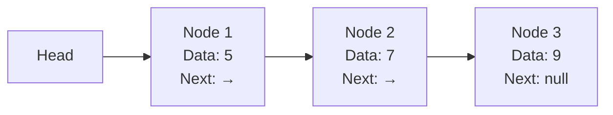
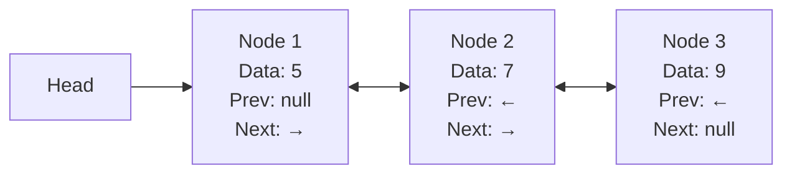
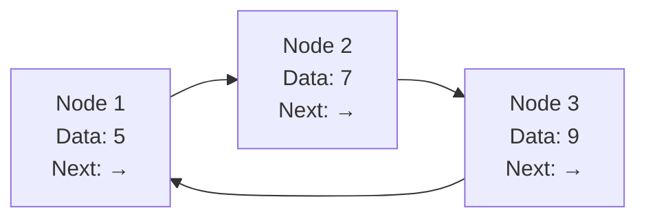

# Linked Lists

## Introduction

A linked list is a fundamental data structure that consists of a sequence of elements, where each element points to the next one in the sequence. Unlike arrays, linked lists don't store data in contiguous memory locations, which gives them certain advantages and disadvantages.

In this tutorial, we'll explore linked lists in depth, understand how they work, implement them in code, and see their real-world applications.

## What is a Linked List?

A linked list is a linear data structure where elements, called nodes, are connected using pointers. Each node contains two main components:
1. **Data**: The actual value being stored
2. **Next pointer**: A reference to the next node in the sequence



The first node in a linked list is called the **head**, and the last node typically points to `null`, indicating the end of the list.

## Types of Linked Lists

There are several types of linked lists, each with their specific use cases:

### 1. Singly Linked List

In a singly linked list, each node points only to the next node in the sequence.



### 2. Doubly Linked List

In a doubly linked list, each node has two pointers: one pointing to the next node and another pointing to the previous node.



### 3. Circular Linked List

In a circular linked list, the last node points back to the first node, creating a circle.



## Implementing a Singly Linked List

Let's implement a basic singly linked list in JavaScript:

```javascript
class Node {
  constructor(data) {
    this.data = data;
    this.next = null;
  }
}

class LinkedList {
  constructor() {
    this.head = null;
    this.size = 0;
  }
  
  // Add a node to the end of the list
  append(data) {
    const newNode = new Node(data);
    
    // If the list is empty
    if (!this.head) {
      this.head = newNode;
    } else {
      let current = this.head;
      
      // Traverse to the end of the list
      while (current.next) {
        current = current.next;
      }
      
      // Add the new node
      current.next = newNode;
    }
    
    this.size++;
  }
  
  // Insert at a specific position
  insertAt(data, index) {
    if (index < 0 || index > this.size) {
      return false; // Invalid position
    }
    
    const newNode = new Node(data);
    
    // Insert at the beginning
    if (index === 0) {
      newNode.next = this.head;
      this.head = newNode;
    } else {
      let current = this.head;
      let previous = null;
      let count = 0;
      
      // Traverse to the position
      while (count < index) {
        previous = current;
        current = current.next;
        count++;
      }
      
      // Insert the node
      newNode.next = current;
      previous.next = newNode;
    }
    
    this.size++;
    return true;
  }
  
  // Remove a node at a specific position
  removeAt(index) {
    if (index < 0 || index >= this.size) {
      return null; // Invalid position
    }
    
    let current = this.head;
    
    // Remove the first element
    if (index === 0) {
      this.head = current.next;
    } else {
      let previous = null;
      let count = 0;
      
      // Traverse to the position
      while (count < index) {
        previous = current;
        current = current.next;
        count++;
      }
      
      // Remove the node
      previous.next = current.next;
    }
    
    this.size--;
    return current.data;
  }
  
  // Get data at a specific position
  getAt(index) {
    if (index < 0 || index >= this.size) {
      return null; // Invalid position
    }
    
    let current = this.head;
    let count = 0;
    
    // Traverse to the position
    while (count < index) {
      current = current.next;
      count++;
    }
    
    return current.data;
  }
  
  // Print the linked list
  printList() {
    let current = this.head;
    let result = '';
    
    while (current) {
      result += current.data + ' -> ';
      current = current.next;
    }
    
    result += 'null';
    return result;
  }
  
  // Get the size of the linked list
  getSize() {
    return this.size;
  }
  
  // Check if the list is empty
  isEmpty() {
    return this.size === 0;
  }
}
```

## Example Usage

Let's see our linked list implementation in action:

```javascript
// Create a new linked list
const list = new LinkedList();

// Add elements
list.append(10);
list.append(20);
list.append(30);
console.log(list.printList()); // Output: 10 -> 20 -> 30 -> null

// Insert at position
list.insertAt(15, 1);
console.log(list.printList()); // Output: 10 -> 15 -> 20 -> 30 -> null

// Remove at position
list.removeAt(2);
console.log(list.printList()); // Output: 10 -> 15 -> 30 -> null

// Get element at position
console.log(list.getAt(1)); // Output: 15

// Get size
console.log(list.getSize()); // Output: 3

// Check if empty
console.log(list.isEmpty()); // Output: false
```

## Time Complexity Analysis

Understanding the time complexity of linked list operations is crucial:

| Operation | Time Complexity | Explanation |
|-----------|-----------------|-------------|
| Access    | O(n)            | Need to traverse from head |
| Search    | O(n)            | Need to traverse from head |
| Insertion | O(1)*           | O(1) if position is known, O(n) if we need to find the position |
| Deletion  | O(1)*           | O(1) if position is known, O(n) if we need to find the position |

*Note: Insertion and deletion at the beginning of the list are always O(1).

## Advantages of Linked Lists

1. **Dynamic Size**: Unlike arrays, linked lists can grow or shrink during execution.
2. **Efficient Insertions/Deletions**: Adding or removing elements doesn't require shifting elements.
3. **No Wasted Memory**: Linked lists use only the memory they need.
4. **Implementation Flexibility**: Can be tailored for specific use cases.

## Disadvantages of Linked Lists

1. **Random Access**: Accessing elements requires traversal from the head.
2. **Extra Memory**: Each node requires additional memory for the pointer(s).
3. **Not Cache-Friendly**: Elements are not stored in contiguous memory locations.
4. **Reverse Traversal**: In singly linked lists, backward traversal is not possible.

## Real-World Applications

Linked lists are used in many real-world applications:

1. **Implementation of other data structures**: Stacks, queues, and hash tables often use linked lists.

2. **Music Player Playlists**: Songs can be added, removed, or reordered easily.

```javascript
class Song {
  constructor(title, artist) {
    this.title = title;
    this.artist = artist;
    this.next = null;
    this.prev = null;
  }
}

class Playlist {
  constructor() {
    this.head = null;
    this.tail = null;
    this.currentSong = null;
    this.size = 0;
  }
  
  addSong(title, artist) {
    const newSong = new Song(title, artist);
    
    if (!this.head) {
      this.head = newSong;
      this.tail = newSong;
      this.currentSong = newSong;
    } else {
      this.tail.next = newSong;
      newSong.prev = this.tail;
      this.tail = newSong;
    }
    
    this.size++;
  }
  
  playNext() {
    if (this.currentSong && this.currentSong.next) {
      this.currentSong = this.currentSong.next;
      return `Now playing: ${this.currentSong.title} by ${this.currentSong.artist}`;
    }
    return "End of playlist";
  }
  
  playPrevious() {
    if (this.currentSong && this.currentSong.prev) {
      this.currentSong = this.currentSong.prev;
      return `Now playing: ${this.currentSong.title} by ${this.currentSong.artist}`;
    }
    return "Beginning of playlist";
  }
}

// Example usage
const myPlaylist = new Playlist();
myPlaylist.addSong("Bohemian Rhapsody", "Queen");
myPlaylist.addSong("Hotel California", "Eagles");
myPlaylist.addSong("Imagine", "John Lennon");

console.log(myPlaylist.playNext()); // Hotel California by Eagles
console.log(myPlaylist.playNext()); // Imagine by John Lennon
console.log(myPlaylist.playPrevious()); // Hotel California by Eagles
```

3. **Browser History**: Forward and backward navigation in web browsers often uses a doubly linked list.

4. **Undo Functionality**: Applications use linked lists to implement undo/redo functionality.

5. **Memory Management**: Operating systems use linked lists to track allocated and free memory blocks.

## Implementing a Doubly Linked List

Here's how you might implement a doubly linked list in Python:

```python
class Node:
    def __init__(self, data):
        self.data = data
        self.next = None
        self.prev = None

class DoublyLinkedList:
    def __init__(self):
        self.head = None
        self.tail = None
        self.size = 0
    
    def append(self, data):
        new_node = Node(data)
        
        if not self.head:
            self.head = new_node
            self.tail = new_node
        else:
            new_node.prev = self.tail
            self.tail.next = new_node
            self.tail = new_node
        
        self.size += 1
    
    def prepend(self, data):
        new_node = Node(data)
        
        if not self.head:
            self.head = new_node
            self.tail = new_node
        else:
            new_node.next = self.head
            self.head.prev = new_node
            self.head = new_node
        
        self.size += 1
    
    def delete(self, data):
        current = self.head
        
        # If list is empty
        if not current:
            return False
        
        # If head has the data
        if current.data == data:
            self.head = current.next
            
            # If there is a new head, set its prev to None
            if self.head:
                self.head.prev = None
            # If the deleted node was also the tail
            else:
                self.tail = None
            
            self.size -= 1
            return True
        
        # Search for the data in other nodes
        while current:
            if current.data == data:
                # If it's the tail
                if current == self.tail:
                    self.tail = current.prev
                    self.tail.next = None
                else:
                    current.prev.next = current.next
                    current.next.prev = current.prev
                
                self.size -= 1
                return True
            
            current = current.next
        
        return False
    
    def display_forward(self):
        elements = []
        current = self.head
        
        while current:
            elements.append(current.data)
            current = current.next
        
        return elements
    
    def display_backward(self):
        elements = []
        current = self.tail
        
        while current:
            elements.append(current.data)
            current = current.prev
        
        return elements
```

## Common Linked List Problems and Solutions

### 1. Detecting a Cycle

A cycle in a linked list occurs when a node points back to a previous node, creating a loop. Here's how to detect it using Floyd's Cycle-Finding Algorithm (also known as the "tortoise and hare" algorithm):

```javascript
function hasCycle(head) {
  if (!head || !head.next) {
    return false;
  }
  
  let slow = head;
  let fast = head;
  
  while (fast && fast.next) {
    slow = slow.next;        // Move one step
    fast = fast.next.next;   // Move two steps
    
    if (slow === fast) {
      return true;  // Cycle detected
    }
  }
  
  return false;  // No cycle
}
```

### 2. Finding the Middle Element

Finding the middle element of a linked list can be done efficiently using the two-pointer technique:

```javascript
function findMiddle(head) {
  if (!head) {
    return null;
  }
  
  let slow = head;
  let fast = head;
  
  while (fast && fast.next) {
    slow = slow.next;      // Move one step
    fast = fast.next.next; // Move two steps
  }
  
  return slow; // This will be the middle element
}
```

### 3. Reversing a Linked List

Reversing a linked list is a common interview question:

```javascript
function reverseList(head) {
  let prev = null;
  let current = head;
  let next = null;
  
  while (current) {
    // Save next
    next = current.next;
    
    // Reverse the pointer
    current.next = prev;
    
    // Move pointers ahead
    prev = current;
    current = next;
  }
  
  return prev; // New head of the reversed list
}
```

## Summary

Linked lists are versatile data structures that offer efficient insertions and deletions, making them suitable for various applications. While they have some disadvantages compared to arrays, their dynamic nature and flexibility make them an essential tool in a programmer's toolkit.

Key points to remember:
- Linked lists consist of nodes that contain data and pointers to other nodes
- There are three main types: singly linked, doubly linked, and circular linked lists
- Insertion and deletion operations can be very efficient (O(1)) if the position is known
- They are used in implementing other data structures and real-world applications like music players and browser history

## Practice Exercises

1. **Basic Operations Implementation**: Implement a singly linked list with the following operations:
   - Insert at beginning
   - Insert at end
   - Delete a node with specific value
   - Search for a value

2. **Merge Two Sorted Lists**: Write a function that merges two sorted linked lists into a single sorted linked list.

3. **Remove Duplicates**: Write a function to remove duplicate values from a linked list.

4. **Palindrome Check**: Write a function to check if a linked list is a palindrome (reads the same forward and backward).

5. **Intersection Point**: Find the node where two linked lists intersect.

## Additional Resources

- [Visualizing Linked Lists](https://visualgo.net/en/list)
- [GeeksforGeeks - Linked List Data Structure](https://www.geeksforgeeks.org/data-structures/linked-list/)
- [Linked Lists in JavaScript (MDN)](https://developer.mozilla.org/en-US/docs/Web/JavaScript/Guide/Keyed_Collections)
- [Linked List Problems on LeetCode](https://leetcode.com/tag/linked-list/)

By mastering linked lists, you'll have a solid foundation for understanding more complex data structures and algorithms. Happy coding!