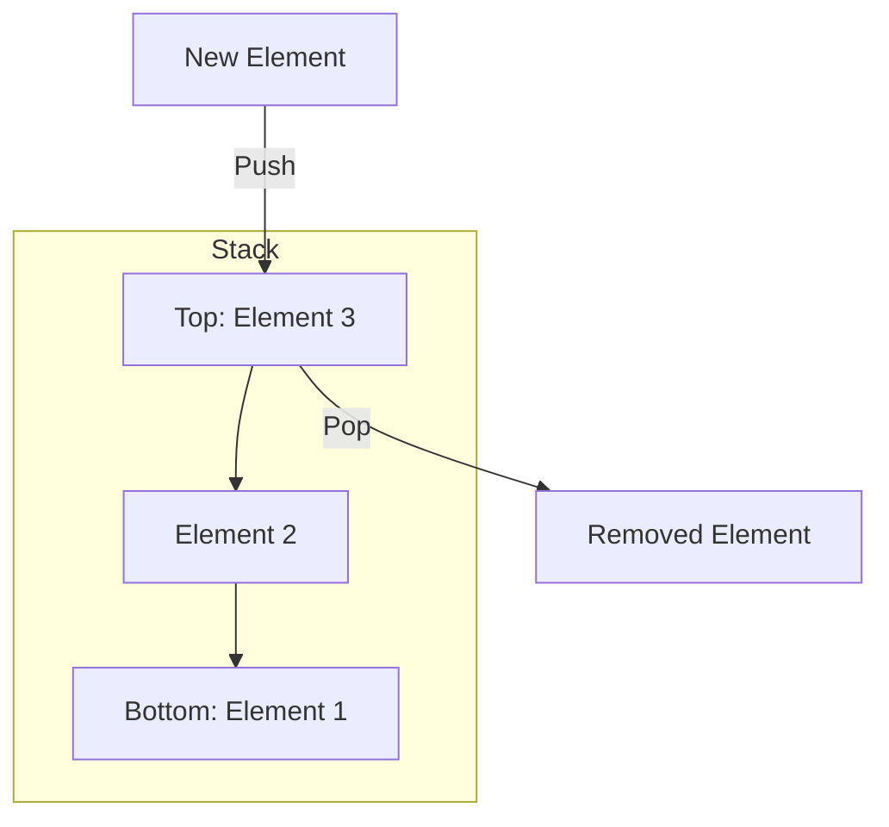
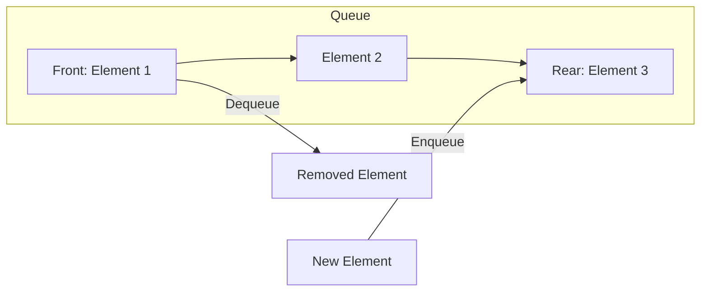

# Stacks and Queues

## Introduction

Stacks and queues are fundamental data structures that store collections of elements. While both hold multiple items, they differ significantly in how elements are added and removed, making each suitable for different programming scenarios.

These data structures are essential building blocks in computer science and appear in countless applications, from web browsers to operating systems. Understanding them is crucial for any programmer, as they provide elegant solutions to many common programming problems.

## Stacks: LIFO Data Structure

### What is a Stack?

A stack is a collection that follows the **Last In, First Out (LIFO)** principle. Think of a stack of plates - you can only take a plate from the top, and you can only add a new plate to the top.



### Stack Operations

The key operations of a stack are:

1. **Push** - Add an element to the top of the stack
2. **Pop** - Remove and return the top element
3. **Peek** (or Top) - View the top element without removing it
4. **isEmpty** - Check if the stack is empty

All these operations run in O(1) time (constant time), making stacks highly efficient.

### Implementing a Stack in JavaScript

Here's a simple implementation of a stack in JavaScript:

```javascript
class Stack {
  constructor() {
    this.items = [];
  }
  
  // Add element to the top of the stack
  push(element) {
    this.items.push(element);
  }
  
  // Remove element from the top of the stack
  pop() {
    if (this.isEmpty()) {
      return "Underflow - Stack is empty";
    }
    return this.items.pop();
  }
  
  // Return the top element without removing it
  peek() {
    if (this.isEmpty()) {
      return "Stack is empty";
    }
    return this.items[this.items.length - 1];
  }
  
  // Check if stack is empty
  isEmpty() {
    return this.items.length === 0;
  }
  
  // Return the size of the stack
  size() {
    return this.items.length;
  }
  
  // Clear the stack
  clear() {
    this.items = [];
  }
}
```

### Example: Using a Stack

```javascript
// Create a new stack
const browserHistory = new Stack();

// User visits some websites (push operations)
browserHistory.push("www.google.com");
browserHistory.push("www.github.com");
browserHistory.push("www.stackoverflow.com");

console.log("Current website:", browserHistory.peek());
// Output: Current website: www.stackoverflow.com

// User clicks back button (pop operation)
const previousSite = browserHistory.pop();
console.log("Navigated back from:", previousSite);
// Output: Navigated back from: www.stackoverflow.com

console.log("Now viewing:", browserHistory.peek());
// Output: Now viewing: www.github.com
```

### Real-world Applications of Stacks

1. **Browser history** - The back button functionality uses a stack
2. **Undo mechanism** in text editors and software applications
3. **Function call management** - The call stack keeps track of function calls
4. **Expression evaluation** and syntax parsing in compilers
5. **Backtracking algorithms** such as maze solving or game tree exploration

## Queues: FIFO Data Structure

### What is a Queue?

A queue is a collection that follows the **First In, First Out (FIFO)** principle. Think of people waiting in line - the first person to join the line is the first one to be served.



### Queue Operations

The key operations of a queue are:

1. **Enqueue** - Add an element to the rear of the queue
2. **Dequeue** - Remove and return the element at the front
3. **Front** - View the front element without removing it
4. **isEmpty** - Check if the queue is empty

Like stacks, these operations generally run in O(1) time.

### Implementing a Queue in JavaScript

Here's a simple implementation of a queue in JavaScript:

```javascript
class Queue {
  constructor() {
    this.items = [];
  }
  
  // Add element to the rear of the queue
  enqueue(element) {
    this.items.push(element);
  }
  
  // Remove element from the front of the queue
  dequeue() {
    if (this.isEmpty()) {
      return "Underflow - Queue is empty";
    }
    return this.items.shift();
  }
  
  // Return the front element without removing it
  front() {
    if (this.isEmpty()) {
      return "Queue is empty";
    }
    return this.items[0];
  }
  
  // Check if queue is empty
  isEmpty() {
    return this.items.length === 0;
  }
  
  // Return the size of the queue
  size() {
    return this.items.length;
  }
  
  // Clear the queue
  clear() {
    this.items = [];
  }
}
```

### Example: Using a Queue

```javascript
// Create a new queue
const printQueue = new Queue();

// Add documents to print queue (enqueue operations)
printQueue.enqueue("Document1.pdf");
printQueue.enqueue("Resume.docx");
printQueue.enqueue("Image.jpg");

console.log("Number of items in print queue:", printQueue.size());
// Output: Number of items in print queue: 3

console.log("Next document to print:", printQueue.front());
// Output: Next document to print: Document1.pdf

// Print the first document (dequeue operation)
const printed = printQueue.dequeue();
console.log("Printed:", printed);
// Output: Printed: Document1.pdf

console.log("Next up:", printQueue.front());
// Output: Next up: Resume.docx
```

### Real-world Applications of Queues

1. **Print spoolers** - Documents are printed in the order they are sent
2. **Process scheduling** in operating systems
3. **Message queues** in communication systems
4. **Breadth-first search** algorithm in graph traversal
5. **Handling of requests** on a single shared resource like a printer, disk, CPU
6. **Buffering** for data streams

## Variations of Stacks and Queues

### Priority Queue

A priority queue is a special type of queue where elements have associated priorities. Elements with higher priorities are served before elements with lower priorities, regardless of their order in the queue.

Priority queues are commonly implemented using heap data structures and are vital in:
- Task scheduling in operating systems
- Dijkstra's algorithm for finding shortest paths
- Huffman coding for data compression

### Deque (Double-Ended Queue)

A deque (pronounced "deck") allows insertion and removal of elements from both ends. It combines the features of both stacks and queues.

Operations include:
- addFront() / removeFront()
- addRear() / removeRear()

Deques are useful for:
- Implementing both stack and queue with a single data structure
- Certain algorithms like the sliding window technique
- Palindrome checking

### Circular Queue

A circular queue is a linear data structure in which operations are performed based on FIFO principle, and the last position is connected to the first position to make a circle. It is also called a 'Ring Buffer'.

Circular queues are particularly useful in:
- Memory management
- Traffic light controllers
- CPU scheduling

## Comparison: Stack vs. Queue

| Feature | Stack | Queue |
|---------|-------|-------|
| Access Pattern | Last In First Out (LIFO) | First In First Out (FIFO) |
| Insertion | At one end (top) | At one end (rear) |
| Deletion | From the same end as insertion (top) | From the opposite end of insertion (front) |
| Real-world Analogy | Stack of plates | People in a line |
| Main Operations | push(), pop() | enqueue(), dequeue() |
| Use Cases | Undo operations, parsing, backtracking | Order processing, scheduling |

## Time and Space Complexity

| Operation | Stack | Queue |
|-----------|-------|-------|
| Insertion | O(1) | O(1) |
| Deletion | O(1) | O(1) |
| Access | O(1) | O(1) |
| Search | O(n) | O(n) |
| Space Complexity | O(n) | O(n) |

## Implementation Considerations

### Array vs. Linked List Implementation

Both stacks and queues can be implemented using arrays or linked lists:

**Array Implementation:**
- Pros: Simple, memory locality
- Cons: Fixed size (for static arrays), expensive dequeue operation for queues (O(n) with shifting)

**Linked List Implementation:**
- Pros: Dynamic size, efficient operations
- Cons: Extra memory for pointers, no locality of reference

## Common Errors and How to Avoid Them

1. **Stack Overflow**: Occurs when a stack exceeds its memory allocation.
   - Solution: Implement size checks or use a dynamic structure.

2. **Stack Underflow**: Attempts to pop from an empty stack.
   - Solution: Always check `isEmpty()` before pop operations.

3. **Queue Inefficiency**: Using arrays for queues can lead to inefficient dequeue operations.
   - Solution: Use a circular queue or linked list implementation.

## Summary

Stacks and queues are fundamental data structures with distinct characteristics:

- **Stacks** follow the LIFO principle and are ideal for scenarios like function call tracking, expression evaluation, and backtracking algorithms.
- **Queues** follow the FIFO principle and excel in scenarios like scheduling, buffering, and breadth-first traversals.

Understanding when and how to use each structure is crucial for solving problems efficiently in programming.

## Exercises

1. Implement a function to reverse a string using a stack.
2. Create a queue using two stacks.
3. Check if a string of parentheses is balanced using a stack.
4. Implement a circular queue with an array.
5. Create a priority queue for a task scheduling system.

## Additional Resources

- Data Structures and Algorithms books by authors such as Robert Sedgewick or Thomas Cormen
- Online courses on platforms like Coursera and edX focusing on data structures
- Practice problems related to stacks and queues on coding platforms like LeetCode and HackerRank