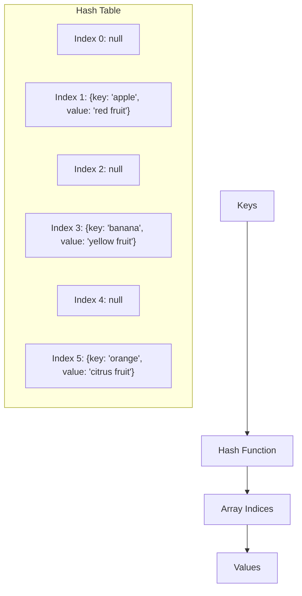
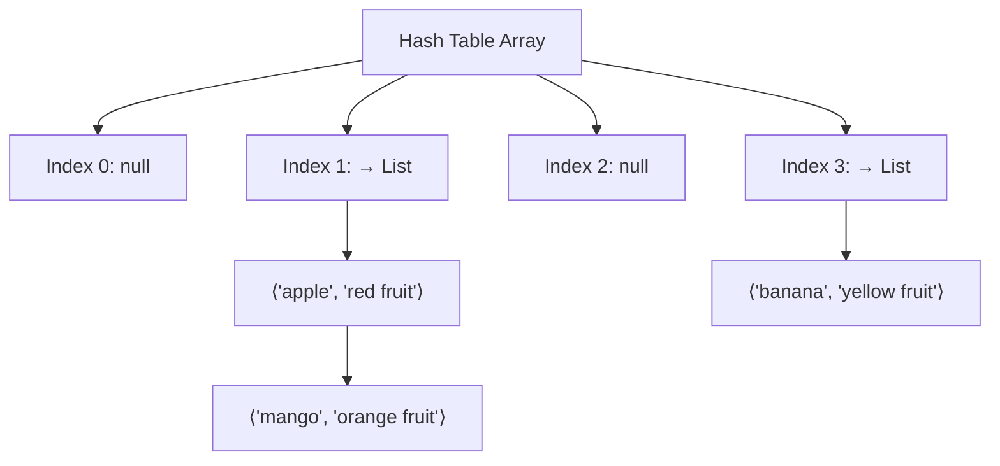

# Hash Tables

## Introduction

Hash tables are one of the most powerful and widely used data structures in computer science. At their core, hash tables provide a way to store key-value pairs for efficient retrieval. Unlike arrays where you access elements by their index position, hash tables allow you to access values using keys that have meaning to your application.

The magic of hash tables lies in their ability to retrieve data in O(1) constant time on average, regardless of how much data they store. This incredible efficiency makes them indispensable for countless applications.

In this tutorial, we'll explore how hash tables work, how to implement them, and when to use them in your projects.

## What is a Hash Table?

A hash table (also called a hash map) is a data structure that maps keys to values using a special function called a **hash function**. The hash function converts keys into array indices where the corresponding values are stored.

### Basic Structure

A hash table consists of:

1. An underlying array for storage
2. A hash function that transforms keys into array indices
3. A method for handling collisions (when two keys map to the same index)

Here's a visual representation of a hash table:



## How Hash Functions Work

The hash function is the heart of a hash table. It takes a key and converts it into an array index. A good hash function should:

1. Be fast to compute
2. Distribute keys uniformly across the array
3. Generate the same index for the same key consistently

Here's a simple example of a hash function for string keys:

```javascript
function simpleHash(key, arraySize) {
  let hashCode = 0;
  
  for (let i = 0; i < key.length; i++) {
    // Sum the character codes
    hashCode += key.charCodeAt(i);
  }
  
  // Ensure the hash is within the array bounds
  return hashCode % arraySize;
}

// Example usage
const index = simpleHash("apple", 10); // Might return something like 7
```

## Handling Collisions

A collision occurs when two different keys hash to the same array index. Since this is inevitable (especially as the hash table fills up), we need strategies to handle collisions. The two most common approaches are:

### 1. Chaining

In chaining, each array position stores a linked list of all key-value pairs that hash to that index.



### 2. Open Addressing (Linear Probing)

With open addressing, when a collision occurs, we look for the next available slot in the array.

```javascript
function findSlot(key, hashTable) {
  let index = simpleHash(key, hashTable.length);
  
  // If the slot is occupied and doesn't contain our key
  while (hashTable[index] !== null && hashTable[index].key !== key) {
    // Move to the next slot (linear probing)
    index = (index + 1) % hashTable.length;
  }
  
  return index;
}
```

## Implementing a Hash Table

Let's implement a simple hash table in JavaScript using the chaining approach:

```javascript
class HashTable {
  constructor(size = 53) {
    this.table = new Array(size).fill(null).map(() => []);
    this.size = size;
  }
  
  _hash(key) {
    let total = 0;
    const PRIME = 31;
    
    // Only hash the first 100 characters for longer strings
    for (let i = 0; i < Math.min(key.length, 100); i++) {
      const char = key[i];
      const value = char.charCodeAt(0) - 96; // 'a' is 1
      total = (total * PRIME + value) % this.size;
    }
    
    return total;
  }
  
  set(key, value) {
    const index = this._hash(key);
    const bucket = this.table[index];
    
    // Check if key already exists
    for (let i = 0; i < bucket.length; i++) {
      if (bucket[i][0] === key) {
        bucket[i][1] = value; // Update value
        return;
      }
    }
    
    // Key doesn't exist, add new key-value pair
    bucket.push([key, value]);
  }
  
  get(key) {
    const index = this._hash(key);
    const bucket = this.table[index];
    
    // Look for the key in the bucket
    for (let i = 0; i < bucket.length; i++) {
      if (bucket[i][0] === key) {
        return bucket[i][1]; // Return value
      }
    }
    
    return undefined; // Key not found
  }
  
  remove(key) {
    const index = this._hash(key);
    const bucket = this.table[index];
    
    // Find and remove the key-value pair
    for (let i = 0; i < bucket.length; i++) {
      if (bucket[i][0] === key) {
        bucket.splice(i, 1);
        return true;
      }
    }
    
    return false; // Key not found
  }
  
  keys() {
    const keysArray = [];
    
    // Collect all keys from the hash table
    for (let i = 0; i < this.table.length; i++) {
      if (this.table[i].length > 0) {
        for (let j = 0; j < this.table[i].length; j++) {
          keysArray.push(this.table[i][j][0]);
        }
      }
    }
    
    return keysArray;
  }
  
  values() {
    const valuesArray = [];
    
    // Collect all values from the hash table
    for (let i = 0; i < this.table.length; i++) {
      if (this.table[i].length > 0) {
        for (let j = 0; j < this.table[i].length; j++) {
          valuesArray.push(this.table[i][j][1]);
        }
      }
    }
    
    return valuesArray;
  }
}
```

Let's use our hash table implementation:

```javascript
// Create a new hash table
const fruitColors = new HashTable();

// Add some key-value pairs
fruitColors.set("apple", "red");
fruitColors.set("banana", "yellow");
fruitColors.set("grape", "purple");
fruitColors.set("orange", "orange");

// Retrieve values
console.log(fruitColors.get("apple"));  // Output: "red"
console.log(fruitColors.get("grape"));  // Output: "purple"
console.log(fruitColors.get("mango"));  // Output: undefined

// Get all keys and values
console.log(fruitColors.keys());    // Output: ["apple", "banana", "grape", "orange"]
console.log(fruitColors.values());  // Output: ["red", "yellow", "purple", "orange"]

// Remove a key-value pair
fruitColors.remove("banana");
console.log(fruitColors.get("banana"));  // Output: undefined
```

## Time Complexity

Let's analyze the time complexity of hash table operations:

| Operation | Average Case | Worst Case |
| --------- | ------------ | ---------- |
| Insert    | O(1)         | O(n)       |
| Lookup    | O(1)         | O(n)       |
| Delete    | O(1)         | O(n)       |

The worst-case scenario occurs when all keys hash to the same index, creating a long chain. However, with a good hash function and appropriate table size, the average case of O(1) is what makes hash tables so powerful.

## Real-World Applications

Hash tables are used in countless applications due to their efficiency:

### 1. Caching Systems

Web browsers use hash tables to store recently visited websites. The URL serves as the key, and the webpage content is the value.

```javascript
const cache = new HashTable();

function fetchPage(url) {
  if (cache.get(url)) {
    return cache.get(url); // Return cached page
  }
  
  // Fetch the page from the server
  const pageContent = fetchFromServer(url);
  
  // Store in cache for future requests
  cache.set(url, pageContent);
  
  return pageContent;
}
```

### 2. Database Indexing

Databases use hash indices to quickly locate records based on key values.

### 3. Language Dictionaries

Spell checkers and language dictionaries use hash tables to quickly look up words.

```javascript
const dictionary = new HashTable();

// Populate the dictionary
["apple", "banana", "computer", "programming", /* thousands more */].forEach(word => {
  dictionary.set(word, true);
});

function checkSpelling(word) {
  return dictionary.get(word.toLowerCase()) !== undefined;
}

console.log(checkSpelling("computer"));  // Output: true
console.log(checkSpelling("compooter")); // Output: false
```

### 4. Counting Frequencies

Hash tables are perfect for counting frequencies of items:

```javascript
function countWords(text) {
  const wordCounts = new HashTable();
  const words = text.toLowerCase().match(/\w+/g);
  
  words.forEach(word => {
    const count = wordCounts.get(word) || 0;
    wordCounts.set(word, count + 1);
  });
  
  return wordCounts;
}

const text = "The quick brown fox jumps over the lazy dog. The dog was not pleased.";
const counts = countWords(text);

console.log(counts.get("the"));  // Output: 2
console.log(counts.get("dog"));  // Output: 2
console.log(counts.get("fox"));  // Output: 1
```

## When to Use Hash Tables

Hash tables are ideal when:

1. You need fast lookups by key
2. You need to ensure uniqueness of keys
3. You need to count frequencies or track occurrences
4. You're implementing a cache or dictionary

## When Not to Use Hash Tables

Hash tables may not be the best choice when:

1. You need to maintain a specific order of elements
2. Memory space is extremely limited
3. You need to find the minimum or maximum value quickly
4. You need range queries (finding all values between X and Y)

## Common Interview Questions

Hash tables are a popular topic in coding interviews. Here are some common questions:

1. Implement a hash table from scratch
2. Design a hash function for a specific type of key
3. Solve the "Two Sum" problem using a hash table
4. Find the first non-repeating character in a string

Let's solve the "Two Sum" problem as an example:

```javascript
function twoSum(nums, target) {
  const numMap = {};
  
  for (let i = 0; i < nums.length; i++) {
    const complement = target - nums[i];
    
    if (numMap[complement] !== undefined) {
      return [numMap[complement], i];
    }
    
    numMap[nums[i]] = i;
  }
  
  return null;
}

console.log(twoSum([2, 7, 11, 15], 9));  // Output: [0, 1]
```

## Summary

Hash tables are incredibly powerful data structures that provide efficient key-value storage and retrieval. The key benefits include:

- **Fast operations**: O(1) average time complexity for insertions, lookups, and deletions
- **Flexible keys**: Various data types can be used as keys
- **Memory efficient**: Only stores what you need

We've covered how hash tables work, implementation strategies, handling collisions, and real-world applications. With this knowledge, you should be able to recognize when a hash table is the right tool for your programming challenges.

## Exercises

1. Implement a hash table using open addressing instead of chaining
2. Create a function that finds all duplicate values in an array using a hash table
3. Implement a simple spell checker using a hash table
4. Use a hash table to determine if two strings are anagrams of each other
5. Create a function that returns the first recurring character in a string

## Additional Resources

- **Books**: "Introduction to Algorithms" by Cormen, Leiserson, Rivest, and Stein
- **Online Courses**: Check out courses on algorithms and data structures on platforms like Coursera, edX, or Udemy
- **Practice**: Solve hash table problems on coding platforms like LeetCode, HackerRank, or CodeSignal