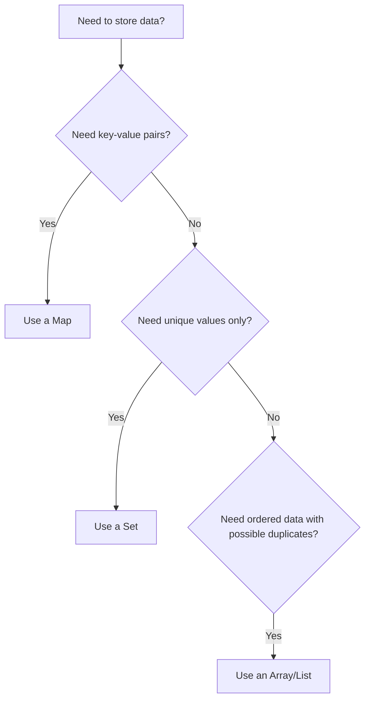
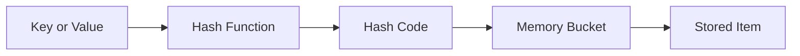

# Sets and Maps

## Introduction

When you're solving programming problems, you'll often need to store collections of data in a way that makes them easy to work with. While arrays (or lists) are the most common data structures, they aren't always the most efficient choice. This is where **Sets** and **Maps** come in—two fundamental data structures that can significantly improve your code's performance and readability.

In this tutorial, we'll explore:
- What Sets and Maps are and why they're useful
- How to create and use Sets and Maps in popular programming languages
- Performance characteristics and advantages
- Real-world applications where these data structures shine

## What are Sets?

A **Set** is a collection of **unique values** with no particular order. Think of a set as a container that only allows one instance of each value—duplicates are automatically removed or rejected.

### Key Characteristics of Sets

- **No duplicates:** Each value can appear only once in a set
- **No defined order:** Items aren't stored in a specific sequence (though some implementations may maintain insertion order)
- **Fast lookup:** Checking if an item exists in a set is typically very fast (O(1) on average)

### Creating and Using Sets

Let's look at how to work with sets in JavaScript and Python:

#### JavaScript Sets

```javascript
// Creating a new Set
const fruits = new Set();

// Adding elements
fruits.add('apple');
fruits.add('banana');
fruits.add('orange');
fruits.add('apple'); // Duplicate, will be ignored

// Checking if an element exists
console.log(fruits.has('banana')); // Output: true

// Getting the size
console.log(fruits.size); // Output: 3

// Removing an element
fruits.delete('orange');

// Iterating through a Set
for (const fruit of fruits) {
  console.log(fruit);
}
// Output:
// apple
// banana

// Creating a Set from an array (removes duplicates)
const numbers = new Set([1, 2, 3, 3, 4, 4, 5]);
console.log([...numbers]); // Output: [1, 2, 3, 4, 5]
```

#### Python Sets

```python
# Creating a new set
fruits = set()

# Adding elements
fruits.add('apple')
fruits.add('banana')
fruits.add('orange')
fruits.add('apple')  # Duplicate, will be ignored

# Checking if an element exists
print('banana' in fruits)  # Output: True

# Getting the size
print(len(fruits))  # Output: 3

# Removing an element
fruits.remove('orange')

# Iterating through a set
for fruit in fruits:
    print(fruit)
# Output:
# apple
# banana
# (Order may vary)

# Creating a set from a list (removes duplicates)
numbers = set([1, 2, 3, 3, 4, 4, 5])
print(list(numbers))  # Output: [1, 2, 3, 4, 5] (Order may vary)
```

### Set Operations

Sets are particularly useful when performing mathematical set operations:

#### JavaScript Set Operations

```javascript
const setA = new Set([1, 2, 3, 4]);
const setB = new Set([3, 4, 5, 6]);

// Union (A ∪ B): elements in either set
const union = new Set([...setA, ...setB]);
console.log([...union]);  // Output: [1, 2, 3, 4, 5, 6]

// Intersection (A ∩ B): elements in both sets
const intersection = new Set([...setA].filter(x => setB.has(x)));
console.log([...intersection]);  // Output: [3, 4]

// Difference (A - B): elements in A but not in B
const difference = new Set([...setA].filter(x => !setB.has(x)));
console.log([...difference]);  // Output: [1, 2]
```

#### Python Set Operations

```python
set_a = {1, 2, 3, 4}
set_b = {3, 4, 5, 6}

# Union (A ∪ B): elements in either set
union = set_a | set_b  # or set_a.union(set_b)
print(list(union))  # Output: [1, 2, 3, 4, 5, 6]

# Intersection (A ∩ B): elements in both sets
intersection = set_a & set_b  # or set_a.intersection(set_b)
print(list(intersection))  # Output: [3, 4]

# Difference (A - B): elements in A but not in B
difference = set_a - set_b  # or set_a.difference(set_b)
print(list(difference))  # Output: [1, 2]
```

## What are Maps?

A **Map** (also known as a dictionary, hash map, or associative array) is a collection of **key-value pairs** where each key is unique. Maps provide a way to store data values in which you can quickly retrieve values using their associated keys.

### Key Characteristics of Maps

- **Key-value pairs:** Each entry consists of a key and its corresponding value
- **Unique keys:** Each key can appear only once in a map
- **Fast lookup:** Retrieving a value by its key is typically very fast (O(1) on average)
- **Flexible key types:** Depending on the implementation, keys can be of various types

### Creating and Using Maps

Let's see how to work with maps in JavaScript and Python:

#### JavaScript Maps

```javascript
// Creating a new Map
const userProfiles = new Map();

// Adding key-value pairs
userProfiles.set('user123', { name: 'Alice', age: 28 });
userProfiles.set('user456', { name: 'Bob', age: 32 });
userProfiles.set('user789', { name: 'Charlie', age: 25 });

// Getting a value by key
console.log(userProfiles.get('user456'));
// Output: { name: 'Bob', age: 32 }

// Checking if a key exists
console.log(userProfiles.has('user123'));  // Output: true

// Getting the size
console.log(userProfiles.size);  // Output: 3

// Removing a key-value pair
userProfiles.delete('user789');

// Iterating through a Map
for (const [userId, profile] of userProfiles) {
  console.log(`${userId}: ${profile.name}, ${profile.age}`);
}
// Output:
// user123: Alice, 28
// user456: Bob, 32
```

#### Python Dictionaries (Maps)

```python
# Creating a new dictionary
user_profiles = {}

# Adding key-value pairs
user_profiles['user123'] = {'name': 'Alice', 'age': 28}
user_profiles['user456'] = {'name': 'Bob', 'age': 32}
user_profiles['user789'] = {'name': 'Charlie', 'age': 25}

# Getting a value by key
print(user_profiles['user456'])
# Output: {'name': 'Bob', 'age': 32}

# Getting a value with a default (safe way)
print(user_profiles.get('userXYZ', 'Not found'))
# Output: Not found

# Checking if a key exists
print('user123' in user_profiles)  # Output: True

# Getting the size
print(len(user_profiles))  # Output: 3

# Removing a key-value pair
del user_profiles['user789']

# Iterating through a dictionary
for user_id, profile in user_profiles.items():
    print(f"{user_id}: {profile['name']}, {profile['age']}")
# Output:
# user123: Alice, 28
# user456: Bob, 32
```

## When to Use Sets vs. Maps vs. Arrays



Here's a quick guide on when to choose each data structure:

| Use Case | Best Choice | Why? |
|----------|-------------|------|
| Need to store unique values | Set | Automatically handles duplicates |
| Need to associate values with keys | Map | Fast lookup by key |
| Need ordered collection with duplicates | Array/List | Maintains order and allows duplicates |
| Need to frequently check if an item exists | Set | Fast lookup operations |
| Need to count occurrences of items | Map | Can use items as keys and counts as values |

## Real-World Applications

### Sets in Action: Filtering Duplicate Records

Imagine you're building a system that processes log entries, and you want to extract unique IP addresses:

```javascript
function extractUniqueIPs(logEntries) {
  const uniqueIPs = new Set();
  
  for (const entry of logEntries) {
    uniqueIPs.add(entry.ipAddress);
  }
  
  return [...uniqueIPs];
}

// Example usage
const logs = [
  { timestamp: '2023-03-01T10:00:00', ipAddress: '192.168.1.1', action: 'login' },
  { timestamp: '2023-03-01T10:05:00', ipAddress: '192.168.1.2', action: 'search' },
  { timestamp: '2023-03-01T10:10:00', ipAddress: '192.168.1.1', action: 'logout' },
  { timestamp: '2023-03-01T10:15:00', ipAddress: '192.168.1.3', action: 'login' }
];

const uniqueIPs = extractUniqueIPs(logs);
console.log(uniqueIPs);
// Output: ['192.168.1.1', '192.168.1.2', '192.168.1.3']
```

### Maps in Action: Word Frequency Counter

Let's build a function that counts the frequency of each word in a text:

```javascript
function countWordFrequency(text) {
  // Clean the text and split into words
  const words = text.toLowerCase().replace(/[^\w\s]/g, '').split(/\s+/);
  
  const wordFrequency = new Map();
  
  for (const word of words) {
    if (word) {  // Skip empty strings
      // If word exists in map, increment count, otherwise set to 1
      wordFrequency.set(word, (wordFrequency.get(word) || 0) + 1);
    }
  }
  
  return wordFrequency;
}

// Example usage
const text = "To be or not to be, that is the question. Whether 'tis nobler in the mind to suffer the slings and arrows of outrageous fortune, or to take arms against a sea of troubles.";

const frequency = countWordFrequency(text);

// Sort by frequency (most frequent first)
const sortedEntries = [...frequency.entries()].sort((a, b) => b[1] - a[1]);

// Show top 5 most frequent words
console.log("Top 5 most frequent words:");
sortedEntries.slice(0, 5).forEach(([word, count]) => {
  console.log(`${word}: ${count} times`);
});

/* Output:
Top 5 most frequent words:
to: 5 times
the: 3 times
or: 3 times
of: 2 times
be: 2 times
*/
```

### Combining Sets and Maps: User Session Analysis

Here's an example that uses both Sets and Maps to analyze user sessions:

```javascript
function analyzeUserSessions(sessions) {
  // Map to track pages visited by each user
  const userPageVisits = new Map();
  
  // Process all sessions
  for (const session of sessions) {
    const { userId, pageVisited, timestamp } = session;
    
    // If this is a new user, create a new Set for them
    if (!userPageVisits.has(userId)) {
      userPageVisits.set(userId, new Set());
    }
    
    // Add this page to the user's Set of visited pages
    userPageVisits.get(userId).add(pageVisited);
  }
  
  // Create a report
  const report = [];
  for (const [userId, pagesVisited] of userPageVisits.entries()) {
    report.push({
      userId,
      uniquePagesVisited: pagesVisited.size,
      pages: [...pagesVisited]
    });
  }
  
  return report;
}

// Example usage
const sessions = [
  { userId: 'user1', pageVisited: '/home', timestamp: '2023-03-01T10:00:00' },
  { userId: 'user1', pageVisited: '/products', timestamp: '2023-03-01T10:05:00' },
  { userId: 'user2', pageVisited: '/home', timestamp: '2023-03-01T10:03:00' },
  { userId: 'user1', pageVisited: '/products', timestamp: '2023-03-01T10:10:00' }, // Duplicate
  { userId: 'user2', pageVisited: '/cart', timestamp: '2023-03-01T10:12:00' },
  { userId: 'user1', pageVisited: '/cart', timestamp: '2023-03-01T10:15:00' }
];

const analysisReport = analyzeUserSessions(sessions);
console.log(analysisReport);
/* Output:
[
  {
    userId: 'user1',
    uniquePagesVisited: 3,
    pages: ['/home', '/products', '/cart']
  },
  {
    userId: 'user2',
    uniquePagesVisited: 2,
    pages: ['/home', '/cart']
  }
]
*/
```

## Performance Considerations

Understanding the time complexity of operations is crucial when choosing the right data structure:

| Operation | Array/List | Set | Map |
|-----------|------------|-----|-----|
| Access by index | O(1) | N/A | N/A |
| Access by key | O(n) | N/A | O(1)* |
| Search | O(n) | O(1)* | O(1)* |
| Insert | O(1) or O(n)** | O(1)* | O(1)* |
| Delete | O(n) | O(1)* | O(1)* |

\* Average case for hash-based implementations. Worst case can be O(n).  
\** O(1) at the end, O(n) if inserting at a specific position.

## Internal Implementation: How They Work

Both Sets and Maps are typically implemented using hash tables internally. Here's a simplified explanation:

1. When you add an item to a Set or a key to a Map, a hash function converts that item into a numeric value (hash code).
2. This hash code determines where in memory the item or key-value pair will be stored.
3. When you search for an item, the hash function calculates the same hash code and knows exactly where to look, making retrieval very fast.

This is why lookup operations in Sets and Maps are typically O(1) - they don't need to scan through all elements like arrays do.



## Summary

Sets and Maps are powerful data structures that can significantly improve your code's performance and readability when used appropriately:

- **Sets** store unique values and are perfect for removing duplicates, checking membership, and performing mathematical set operations.
- **Maps** store key-value pairs and excel at quick lookups, counting occurrences, and organizing related data.

Both provide faster lookup times than arrays for many operations and have built-in functionality that would otherwise require custom implementation.

## Exercises

1. **Duplicate Remover**: Write a function that takes an array of numbers and returns a new array with duplicates removed (use a Set).
2. **Character Counter**: Write a function that takes a string and returns a Map counting how many times each character appears.
3. **Set Operations**: Create functions to perform union, intersection, and difference operations on two Sets.
4. **Phone Book**: Implement a simple phone book application that stores name-phone number pairs in a Map and supports adding, searching, and deleting contacts.
5. **Unique Visitors Tracker**: Create a system that tracks unique website visitors using Sets.

## Additional Resources

- [JavaScript Set Documentation](https://developer.mozilla.org/en-US/docs/Web/JavaScript/Reference/Global_Objects/Set)
- [JavaScript Map Documentation](https://developer.mozilla.org/en-US/docs/Web/JavaScript/Reference/Global_Objects/Map)
- [Python Set Documentation](https://docs.python.org/3/library/stdtypes.html#set-types-set-frozenset)
- [Python Dictionary Documentation](https://docs.python.org/3/tutorial/datastructures.html#dictionaries)