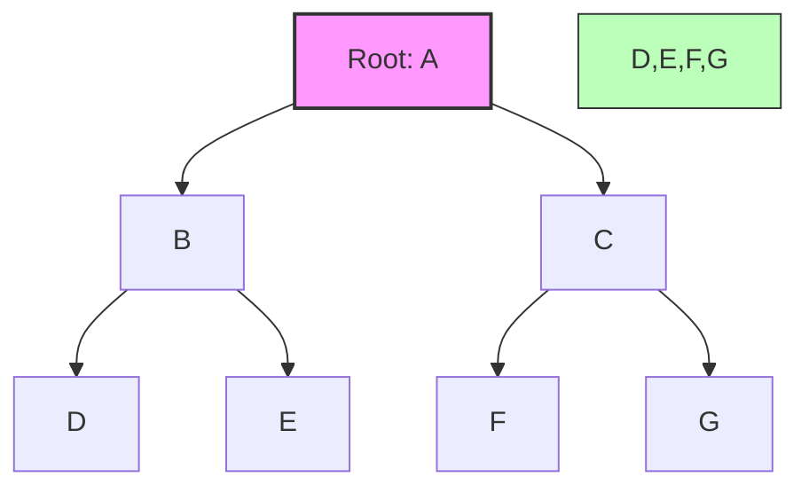

# Trees Fundamentals

## Introduction

Trees are one of the most important non-linear data structures in computer science. Unlike arrays or linked lists which store data in a linear fashion, trees organize data hierarchically. This hierarchical structure enables efficient search, insertion, and deletion operations, making trees invaluable for numerous applications.

A tree resembles an upside-down tree from nature: it starts with a single node at the top (called the "root") and branches out downward. This intuitive structure makes trees perfect for representing hierarchical relationships, such as file systems, organization charts, or family genealogies.

In this tutorial, we'll explore the fundamentals of tree data structures, their types, operations, and practical applications.

## Basic Tree Terminology

Before diving deeper, let's familiarize ourselves with essential tree terminology:

- **Node**: A basic unit of a tree, which contains data and references to its child nodes
- **Root**: The topmost node of a tree, which has no parent
- **Edge**: The connection between two nodes
- **Parent**: A node that has one or more child nodes
- **Child**: A node that has a parent node
- **Leaf**: A node that has no children
- **Siblings**: Nodes that share the same parent
- **Depth**: The level of a node in the tree (the root is at depth 0)
- **Height**: The length of the longest path from a node to a leaf (a leaf has height 0)

Let's visualize these concepts with a diagram:



In this example:
- A is the root
- B and C are children of A (and siblings to each other)
- D and E are children of B
- F and G are children of C
- D, E, F, and G are leaf nodes

## Types of Trees

Trees come in various forms, each designed for specific use cases:

### 1. Binary Trees

A binary tree is a tree where each node has at most two children, typically referred to as the "left child" and "right child".

```
    A
   / \
  B   C
 / \   \
D   E   F
```

### 2. Binary Search Trees (BST)

A binary search tree is a special type of binary tree where:
- The left subtree of a node contains only nodes with values less than the node's value
- The right subtree of a node contains only nodes with values greater than the node's value
- Both the left and right subtrees are also binary search trees

This property makes searching very efficient.

```
    8
   / \
  3   10
 / \    \
1   6    14
   / \   /
  4   7 13
```

### 3. AVL Trees

AVL trees are self-balancing binary search trees where the difference between heights of left and right subtrees cannot be more than one for all nodes.

### 4. Red-Black Trees

Another type of self-balancing binary search tree with additional properties that ensure the tree remains balanced after insertions and deletions.

### 5. B-Trees

B-trees are balanced search trees designed to work well on disk or other storage devices. They have variable numbers of child nodes.

### 6. Tries (Prefix Trees)

Specialized trees used for storing a dynamic set of strings where the keys are usually strings.

## Binary Tree Implementation

Let's implement a simple binary tree in JavaScript:

```javascript
class TreeNode {
  constructor(value) {
    this.value = value;
    this.left = null;
    this.right = null;
  }
}

class BinaryTree {
  constructor() {
    this.root = null;
  }
  
  insert(value) {
    const newNode = new TreeNode(value);
    
    if (this.root === null) {
      this.root = newNode;
      return;
    }
    
    // Helper function for insertion
    const insertNode = (node, newNode) => {
      // Randomly decide whether to insert left or right
      // (This is a simple insertion strategy, not a BST)
      if (Math.random() < 0.5) {
        if (node.left === null) {
          node.left = newNode;
        } else {
          insertNode(node.left, newNode);
        }
      } else {
        if (node.right === null) {
          node.right = newNode;
        } else {
          insertNode(node.right, newNode);
        }
      }
    };
    
    insertNode(this.root, newNode);
  }
}

// Create a new binary tree
const tree = new BinaryTree();
tree.insert(10);
tree.insert(5);
tree.insert(15);
tree.insert(3);
tree.insert(7);

console.log(tree);
```

## Binary Search Tree Implementation

Let's implement a Binary Search Tree (BST) in Python:

```python
class TreeNode:
    def __init__(self, value):
        self.value = value
        self.left = None
        self.right = None

class BinarySearchTree:
    def __init__(self):
        self.root = None
    
    def insert(self, value):
        if self.root is None:
            self.root = TreeNode(value)
            return
        
        self._insert_recursive(self.root, value)
    
    def _insert_recursive(self, node, value):
        # If value is less than the current node value, go left
        if value < node.value:
            if node.left is None:
                node.left = TreeNode(value)
            else:
                self._insert_recursive(node.left, value)
        # If value is greater than the current node value, go right
        else:
            if node.right is None:
                node.right = TreeNode(value)
            else:
                self._insert_recursive(node.right, value)
    
    def search(self, value):
        return self._search_recursive(self.root, value)
    
    def _search_recursive(self, node, value):
        # Base cases: root is null or value is present
        if node is None or node.value == value:
            return node
        
        # Value is less than node's value
        if value < node.value:
            return self._search_recursive(node.left, value)
        
        # Value is greater than node's value
        return self._search_recursive(node.right, value)
    
    def in_order_traversal(self):
        result = []
        self._in_order_recursive(self.root, result)
        return result
    
    def _in_order_recursive(self, node, result):
        if node:
            self._in_order_recursive(node.left, result)
            result.append(node.value)
            self._in_order_recursive(node.right, result)

# Example usage
bst = BinarySearchTree()
nodes = [8, 3, 10, 1, 6, 14, 4, 7, 13]

for node in nodes:
    bst.insert(node)

# Search for a value
print(f"Searching for 6: {'Found' if bst.search(6) else 'Not found'}")
print(f"Searching for 15: {'Found' if bst.search(15) else 'Not found'}")

# In-order traversal (should print sorted values)
print("In-order traversal:", bst.in_order_traversal())
```

**Expected Output:**
```
Searching for 6: Found
Searching for 15: Not found
In-order traversal: [1, 3, 4, 6, 7, 8, 10, 13, 14]
```

## Tree Traversal Algorithms

Trees can be traversed in various ways, depending on the order in which nodes are visited:

### 1. Depth-First Traversals

- **In-order Traversal**: Visit left subtree → Visit node → Visit right subtree
- **Pre-order Traversal**: Visit node → Visit left subtree → Visit right subtree
- **Post-order Traversal**: Visit left subtree → Visit right subtree → Visit node

### 2. Breadth-First Traversal (Level Order)

Visit all nodes at the same depth level before moving to the next level.

Let's implement these traversal methods in JavaScript:

```javascript
class TreeNode {
  constructor(value) {
    this.value = value;
    this.left = null;
    this.right = null;
  }
}

// Depth-First Traversals
function inOrderTraversal(node, result = []) {
  if (node !== null) {
    inOrderTraversal(node.left, result);
    result.push(node.value);
    inOrderTraversal(node.right, result);
  }
  return result;
}

function preOrderTraversal(node, result = []) {
  if (node !== null) {
    result.push(node.value);
    preOrderTraversal(node.left, result);
    preOrderTraversal(node.right, result);
  }
  return result;
}

function postOrderTraversal(node, result = []) {
  if (node !== null) {
    postOrderTraversal(node.left, result);
    postOrderTraversal(node.right, result);
    result.push(node.value);
  }
  return result;
}

// Breadth-First Traversal
function levelOrderTraversal(root) {
  if (root === null) return [];
  
  const result = [];
  const queue = [root];
  
  while (queue.length > 0) {
    const current = queue.shift();
    result.push(current.value);
    
    if (current.left !== null) {
      queue.push(current.left);
    }
    
    if (current.right !== null) {
      queue.push(current.right);
    }
  }
  
  return result;
}

// Example tree:
//     1
//    / \
//   2   3
//  / \   \
// 4   5   6

const root = new TreeNode(1);
root.left = new TreeNode(2);
root.right = new TreeNode(3);
root.left.left = new TreeNode(4);
root.left.right = new TreeNode(5);
root.right.right = new TreeNode(6);

console.log("In-order traversal:", inOrderTraversal(root));       // [4, 2, 5, 1, 3, 6]
console.log("Pre-order traversal:", preOrderTraversal(root));     // [1, 2, 4, 5, 3, 6]
console.log("Post-order traversal:", postOrderTraversal(root));   // [4, 5, 2, 6, 3, 1]
console.log("Level-order traversal:", levelOrderTraversal(root)); // [1, 2, 3, 4, 5, 6]
```

## Real-World Applications of Trees

Trees have numerous practical applications in computer science and beyond:

### 1. File Systems

Directory structures in file systems are represented as tree structures, with folders as internal nodes and files as leaf nodes.

### 2. Database Indexing

B-trees and their variants are widely used for database indexing to speed up data retrieval operations.

### 3. HTML DOM

The Document Object Model (DOM) for web pages is structured as a tree, with elements nested within other elements.

### 4. Decision Trees

Used in machine learning and artificial intelligence for classification and decision-making processes.

### 5. Routing Algorithms

Network routing tables are often organized as trees for efficient routing decisions.

### 6. Compression Algorithms

Huffman coding, used in data compression, uses a special tree called a Huffman tree.

### 7. Syntax Trees

Compilers use abstract syntax trees to represent the structure of program code.

## Practical Example: Folder Structure

Let's implement a simple file system tree structure in JavaScript:

```javascript
class FileSystemNode {
  constructor(name, isDirectory = false) {
    this.name = name;
    this.isDirectory = isDirectory;
    this.children = isDirectory ? [] : null;
  }
  
  addChild(child) {
    if (this.isDirectory) {
      this.children.push(child);
    } else {
      throw new Error("Cannot add child to a file");
    }
  }
  
  findChild(name) {
    if (!this.isDirectory) return null;
    return this.children.find(child => child.name === name);
  }
  
  printStructure(indent = 0) {
    console.log(" ".repeat(indent) + (this.isDirectory ? "📁 " : "📄 ") + this.name);
    
    if (this.isDirectory) {
      this.children.forEach(child => {
        child.printStructure(indent + 2);
      });
    }
  }
}

// Create a file system
const root = new FileSystemNode("root", true);

// Add directories
const documents = new FileSystemNode("Documents", true);
const pictures = new FileSystemNode("Pictures", true);
const downloads = new FileSystemNode("Downloads", true);

root.addChild(documents);
root.addChild(pictures);
root.addChild(downloads);

// Add files to Documents
documents.addChild(new FileSystemNode("resume.pdf"));
documents.addChild(new FileSystemNode("notes.txt"));

// Add files to Pictures
const vacation = new FileSystemNode("Vacation", true);
pictures.addChild(vacation);
pictures.addChild(new FileSystemNode("profile.jpg"));

// Add files to Vacation
vacation.addChild(new FileSystemNode("beach.jpg"));
vacation.addChild(new FileSystemNode("mountain.jpg"));

// Add files to Downloads
downloads.addChild(new FileSystemNode("app.exe"));
downloads.addChild(new FileSystemNode("movie.mp4"));

// Print the file structure
root.printStructure();
```

**Expected Output:**
```
📁 root
  📁 Documents
    📄 resume.pdf
    📄 notes.txt
  📁 Pictures
    📁 Vacation
      📄 beach.jpg
      📄 mountain.jpg
    📄 profile.jpg
  📁 Downloads
    📄 app.exe
    📄 movie.mp4
```

## Performance Analysis

Understanding the time complexity of tree operations is crucial:

### Binary Search Tree (BST)

| Operation | Average Case | Worst Case |
|-----------|--------------|------------|
| Search    | O(log n)     | O(n)       |
| Insert    | O(log n)     | O(n)       |
| Delete    | O(log n)     | O(n)       |

The worst-case scenarios occur when the tree becomes unbalanced (like a linked list). This is why balanced trees like AVL and Red-Black trees are important.

### AVL and Red-Black Trees

| Operation | Average Case | Worst Case |
|-----------|--------------|------------|
| Search    | O(log n)     | O(log n)   |
| Insert    | O(log n)     | O(log n)   |
| Delete    | O(log n)     | O(log n)   |

These balanced trees guarantee logarithmic time complexity for all operations.

## Common Tree-Related Problems

Here are some common problems involving trees that you might encounter in programming interviews:

1. **Tree Traversal**: Pre-order, in-order, post-order, and level-order traversals
2. **Tree Height**: Finding the height of a tree
3. **Lowest Common Ancestor**: Finding the lowest common ancestor of two nodes
4. **Path Sum**: Determining if a path exists with a given sum
5. **Balanced Tree**: Checking if a tree is balanced
6. **Symmetric Tree**: Checking if a tree is symmetric around its center
7. **Binary Search Tree Validation**: Verifying if a tree is a valid BST

## Summary

Trees are versatile data structures that excel at representing hierarchical relationships. They come in various forms, each with its own advantages and use cases. The most common types include binary trees, binary search trees, AVL trees, and B-trees.

Tree operations like insertion, deletion, and searching can be very efficient, especially in balanced trees. Tree traversal algorithms allow us to process tree nodes in different orders, depending on our needs.

Trees have countless real-world applications, from file systems and database indexing to HTML DOM and decision-making algorithms. Understanding tree data structures is essential for any programmer, as they form the backbone of many algorithms and applications.

## Exercises

1. Implement a function to find the height of a binary tree.
2. Write a function to check if a binary tree is balanced.
3. Implement a deletion operation for a binary search tree.
4. Write a function to find the lowest common ancestor of two nodes in a binary tree.
5. Implement a function to check if a binary tree is symmetric around its center.
6. Create a function that converts a sorted array to a balanced binary search tree.
7. Implement a trie (prefix tree) data structure for storing and searching strings.

## Additional Resources

- [Introduction to Algorithms](https://mitpress.mit.edu/books/introduction-algorithms-fourth-edition) by Thomas H. Cormen, Charles E. Leiserson, Ronald L. Rivest, and Clifford Stein
- [Data Structures and Algorithms in JavaScript](https://www.amazon.com/Data-Structures-Algorithms-JavaScript-approaches/dp/1449364934) by Michael McMillan
- [Visualgo](https://visualgo.net/en/bst) - Visualize binary search tree operations
- [GeeksforGeeks Tree Data Structure](https://www.geeksforgeeks.org/binary-tree-data-structure/)
- [HackerRank Tree Problems](https://www.hackerrank.com/domains/data-structures?filters%5Bsubdomains%5D%5B%5D=trees)

Happy coding!