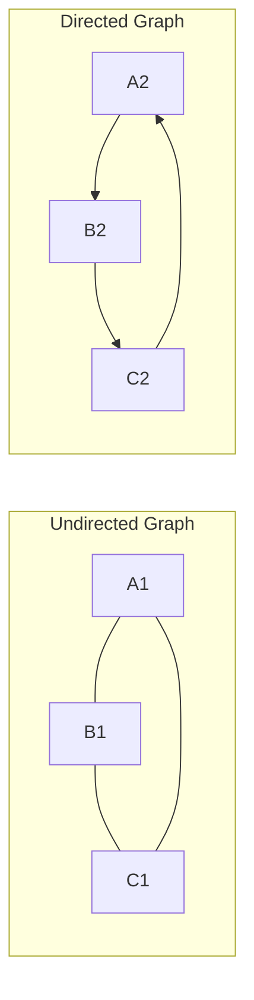
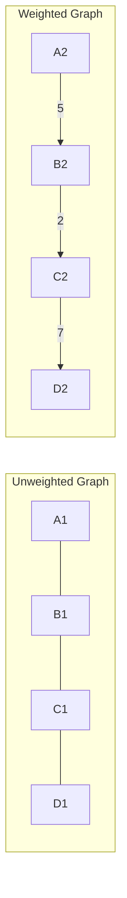
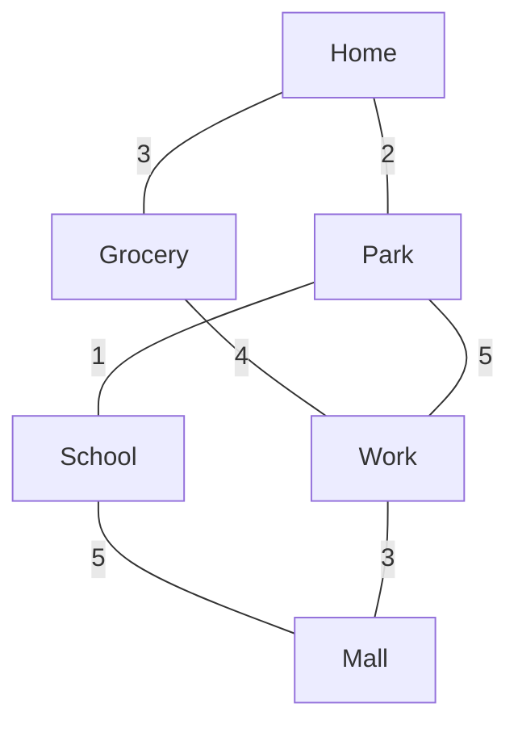

# Graphs Fundamentals

## Introduction

Graphs are one of the most versatile and powerful data structures in computer science. They allow us to represent relationships between objects in a flexible way that's applicable to countless real-world problems.

A graph consists of:
- **Vertices** (also called nodes): These are the objects or entities in our graph
- **Edges**: These represent the connections or relationships between vertices

Unlike trees (which are actually a special type of graph), graphs can have cycles, multiple paths between nodes, and complex connection patterns that make them ideal for modeling many real-world scenarios.

## Types of Graphs

Graphs come in several varieties, each with unique properties:

### Directed vs. Undirected Graphs

- **Undirected Graph**: Edges have no direction. If vertex A is connected to vertex B, then B is also connected to A.
- **Directed Graph (Digraph)**: Edges have direction. If vertex A points to vertex B, it doesn't necessarily mean B points back to A.



### Weighted vs. Unweighted Graphs

- **Unweighted Graph**: All edges have the same importance or "weight"
- **Weighted Graph**: Edges have a value (weight) assigned to them, representing distance, cost, etc.



### Other Types

- **Complete Graph**: Every vertex is connected to every other vertex
- **Sparse Graph**: Few connections between vertices
- **Dense Graph**: Many connections between vertices
- **Cyclic Graph**: Contains at least one cycle (a path that starts and ends at the same vertex)
- **Acyclic Graph**: Contains no cycles

## Graph Representations

There are two primary ways to represent a graph in code:

### Adjacency Matrix

An adjacency matrix is a 2D array where each cell `[i][j]` represents whether there's an edge from vertex `i` to vertex `j`.

```javascript
// Adjacency Matrix representation for an undirected graph
// 1 indicates an edge, 0 indicates no edge
const adjacencyMatrix = [
  // A  B  C  D
    [0, 1, 0, 1], // A's connections
    [1, 0, 1, 0], // B's connections
    [0, 1, 0, 1], // C's connections
    [1, 0, 1, 0]  // D's connections
];
```

**Pros:**
- Simple representation
- Edge lookup is O(1)
- Good for dense graphs

**Cons:**
- Space inefficient (O(V²)) regardless of how many edges exist
- Iterating over edges from a vertex is O(V) even if there are few edges

### Adjacency List

An adjacency list represents each vertex with a list of its adjacent vertices.

```javascript
// Adjacency List representation
const adjacencyList = {
  'A': ['B', 'D'],
  'B': ['A', 'C'],
  'C': ['B', 'D'],
  'D': ['A', 'C']
};
```

**Pros:**
- Space efficient for sparse graphs (O(V+E))
- Iterating over edges from a vertex is efficient

**Cons:**
- Edge lookup is O(degree(v)) which can be slower
- Less efficient for dense graphs

## Basic Graph Operations

Let's implement some fundamental operations on graphs:

### Creating a Graph

Here's a simple class representing a graph using an adjacency list:

```javascript
class Graph {
  constructor(directed = false) {
    this.directed = directed;
    this.adjacencyList = {};
  }
  
  addVertex(vertex) {
    if (!this.adjacencyList[vertex]) {
      this.adjacencyList[vertex] = [];
    }
  }
  
  addEdge(vertex1, vertex2, weight) {
    // Add edge from vertex1 to vertex2
    if (!this.adjacencyList[vertex1]) {
      this.addVertex(vertex1);
    }
    if (!this.adjacencyList[vertex2]) {
      this.addVertex(vertex2);
    }
    
    this.adjacencyList[vertex1].push({ node: vertex2, weight: weight || 1 });
    
    // If undirected, add the reverse edge
    if (!this.directed) {
      this.adjacencyList[vertex2].push({ node: vertex1, weight: weight || 1 });
    }
  }
  
  removeEdge(vertex1, vertex2) {
    this.adjacencyList[vertex1] = this.adjacencyList[vertex1].filter(
      edge => edge.node !== vertex2
    );
    
    if (!this.directed) {
      this.adjacencyList[vertex2] = this.adjacencyList[vertex2].filter(
        edge => edge.node !== vertex1
      );
    }
  }
  
  removeVertex(vertex) {
    // Remove all edges connected to this vertex
    while (this.adjacencyList[vertex].length) {
      const adjacentVertex = this.adjacencyList[vertex].pop().node;
      this.removeEdge(vertex, adjacentVertex);
    }
    // Delete the vertex
    delete this.adjacencyList[vertex];
  }
  
  // Display the adjacency list
  print() {
    for (let vertex in this.adjacencyList) {
      console.log(vertex + " -> " + this.adjacencyList[vertex].map(edge => `${edge.node}(${edge.weight})`).join(", "));
    }
  }
}
```

### Example Usage

```javascript
// Create a new undirected graph
const graph = new Graph();

// Add vertices
graph.addVertex("A");
graph.addVertex("B");
graph.addVertex("C");
graph.addVertex("D");

// Add edges
graph.addEdge("A", "B", 4);
graph.addEdge("A", "C", 2);
graph.addEdge("B", "C", 3);
graph.addEdge("C", "D", 1);

// Display the graph
graph.print();

/* Output:
A -> B(4), C(2)
B -> A(4), C(3)
C -> A(2), B(3), D(1)
D -> C(1)
*/

// Remove a vertex
graph.removeVertex("C");
graph.print();

/* Output:
A -> B(4)
B -> A(4)
D ->
*/
```

## Graph Traversal Algorithms

Traversal means visiting all vertices in a graph in a specific order. The two main approaches are:

### Depth-First Search (DFS)

DFS explores as far as possible along each branch before backtracking. It uses a stack (often implemented using recursion).

```javascript
class Graph {
  // ... previous methods
  
  depthFirstSearch(start) {
    const result = [];
    const visited = {};
    const adjacencyList = this.adjacencyList;
    
    (function dfs(vertex) {
      if (!vertex) return null;
      visited[vertex] = true;
      result.push(vertex);
      
      adjacencyList[vertex].forEach(neighbor => {
        if (!visited[neighbor.node]) {
          return dfs(neighbor.node);
        }
      });
    })(start);
    
    return result;
  }
}

// Example usage:
const graph = new Graph();
// ... add vertices and edges
console.log(graph.depthFirstSearch("A")); 
// Output: ["A", "B", "C", "D"] (exact order depends on your graph structure)
```

### Breadth-First Search (BFS)

BFS explores all neighbors at the present depth before moving to nodes at the next depth level. It uses a queue.

```javascript
class Graph {
  // ... previous methods
  
  breadthFirstSearch(start) {
    const queue = [start];
    const result = [];
    const visited = {};
    visited[start] = true;
    
    while (queue.length) {
      const currentVertex = queue.shift();
      result.push(currentVertex);
      
      this.adjacencyList[currentVertex].forEach(neighbor => {
        if (!visited[neighbor.node]) {
          visited[neighbor.node] = true;
          queue.push(neighbor.node);
        }
      });
    }
    
    return result;
  }
}

// Example usage:
const graph = new Graph();
// ... add vertices and edges
console.log(graph.breadthFirstSearch("A")); 
// Output: ["A", "B", "C", "D"] (exact order depends on your graph structure)
```

## Real-World Applications

Graphs are incredibly versatile and are used in numerous real-world scenarios:

1. **Social Networks**
   - Each person is a vertex
   - Friendships or connections are edges
   - Facebook's "People You May Know" uses graph algorithms

2. **Navigation and Maps**
   - Locations are vertices
   - Roads are edges
   - Weights represent distances or travel times
   - GPS navigation uses graph algorithms like Dijkstra's or A* for shortest paths

3. **Web Page Ranking**
   - Web pages are vertices
   - Hyperlinks are edges
   - Google's PageRank algorithm uses graph properties to rank pages

4. **Recommendation Systems**
   - Products/movies/songs are vertices
   - Similar items or user preferences form edges
   - Netflix, Spotify, and Amazon use graph algorithms for recommendations

5. **Network Routing**
   - Routers are vertices
   - Connections are edges
   - Routing algorithms find efficient paths for data packets

## Example: Finding Routes in a City

Imagine a simple city map represented as a graph:

```javascript
const cityMap = new Graph();

// Add locations
cityMap.addVertex("Home");
cityMap.addVertex("Grocery");
cityMap.addVertex("Park");
cityMap.addVertex("Work");
cityMap.addVertex("School");
cityMap.addVertex("Mall");

// Add roads with distances in kilometers
cityMap.addEdge("Home", "Grocery", 3);
cityMap.addEdge("Home", "Park", 2);
cityMap.addEdge("Grocery", "Work", 4);
cityMap.addEdge("Park", "School", 1);
cityMap.addEdge("School", "Mall", 5);
cityMap.addEdge("Work", "Mall", 3);
cityMap.addEdge("Park", "Work", 5);

// Find all reachable locations from Home using BFS
console.log(cityMap.breadthFirstSearch("Home"));
// Output: ["Home", "Grocery", "Park", "Work", "School", "Mall"]
```



## Advanced Graph Algorithms

While beyond the scope of this introduction, there are many important graph algorithms to explore as you advance:

- **Dijkstra's Algorithm**: Finding shortest paths in weighted graphs
- **Bellman-Ford Algorithm**: Finding shortest paths with negative weights
- **Floyd-Warshall Algorithm**: Finding all-pairs shortest paths
- **Kruskal's & Prim's Algorithms**: Finding minimum spanning trees
- **Topological Sort**: Ordering vertices in a directed acyclic graph

## Summary

Graphs are powerful data structures that model relationships between objects. Key points covered:

- Graphs consist of vertices (nodes) and edges (connections)
- Graphs can be directed/undirected and weighted/unweighted
- They can be represented using adjacency matrices or adjacency lists
- Basic operations include adding/removing vertices and edges
- Traversal algorithms include DFS (depth-first search) and BFS (breadth-first search)
- Graphs have countless real-world applications

## Practice Exercises

1. Implement a function to detect whether a graph contains a cycle
2. Create a function to find all possible paths between two vertices
3. Implement Dijkstra's algorithm to find the shortest path between two vertices
4. Create a social network graph and find "friends of friends" for a given user
5. Implement a function to check if a graph is bipartite (can be divided into two groups where no edges connect nodes in the same group)

## Additional Resources

- **Books**:
  - "Introduction to Algorithms" by Cormen, Leiserson, Rivest, and Stein
  - "Algorithms" by Robert Sedgewick and Kevin Wayne

- **Online Courses**:
  - "Algorithms, Part II" on Coursera by Princeton University
  - "Data Structures and Algorithms" specialization on Coursera

- **Websites**:
  - LeetCode's graph problems section
  - Visualgo.net for algorithm visualization

Graph algorithms are fundamental to computer science and essential for tackling complex problems efficiently. Keep practicing with different graph problems to build your intuition and understanding!