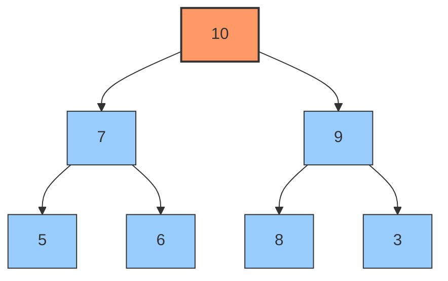
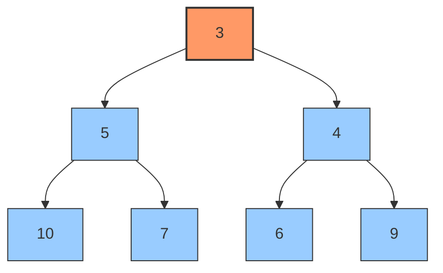

# Heaps

## Introduction

A heap is a specialized tree-based data structure that satisfies the **heap property**. Heaps are binary trees that maintain a specific order between parent and child nodes, making them extremely efficient for operations that require finding or removing the minimum or maximum element in a collection.

Heaps are fundamental in computer science and serve as the backbone for many algorithms and applications, including priority queues, heap sort, graph algorithms, and system processes management.

## What is a Heap?

A heap is a complete binary tree where each node follows a specific ordering property relative to its children. There are two main types of heaps:

1. **Max Heap**: Each parent node's value is greater than or equal to the values of its children.
2. **Min Heap**: Each parent node's value is less than or equal to the values of its children.

Let's visualize the structure of both types:



*Figure 1: A Max Heap - Each parent is greater than its children*



*Figure 2: A Min Heap - Each parent is smaller than its children*

## Key Properties of Heaps

1. **Complete Binary Tree**: All levels are completely filled except possibly the last level, which is filled from left to right.
2. **Heap Property**: Follows either the max-heap or min-heap property.
3. **Efficient Access**: The maximum (in max heap) or minimum (in min heap) element is always at the root node, making it accessible in O(1) time.
4. **Efficient Implementation**: Despite being tree structures, heaps are typically implemented using arrays, making them memory-efficient.

## Array Representation of Heaps

While heaps are conceptually tree structures, they are commonly implemented using arrays due to their complete binary tree nature.

For a node at index `i` in the array:
- Left child: `2*i + 1`
- Right child: `2*i + 2`
- Parent: `Math.floor((i-1)/2)`

Let's see the array representation of our max heap example:

```
[10, 7, 9, 5, 6, 8, 3]
```

And for the min heap:

```
[3, 5, 4, 10, 7, 6, 9]
```

## Basic Heap Operations

Let's explore key operations on heaps with code examples in JavaScript.

### 1. Creating a Heap

First, let's define a basic MinHeap class:

```javascript
class MinHeap {
  constructor() {
    this.heap = [];
  }
  
  // Helper methods to get parent and child indices
  getParentIndex(index) {
    return Math.floor((index - 1) / 2);
  }
  
  getLeftChildIndex(index) {
    return 2 * index + 1;
  }
  
  getRightChildIndex(index) {
    return 2 * index + 2;
  }
  
  // Helper methods to check if indices exist
  hasParent(index) {
    return this.getParentIndex(index) >= 0;
  }
  
  hasLeftChild(index) {
    return this.getLeftChildIndex(index) < this.heap.length;
  }
  
  hasRightChild(index) {
    return this.getRightChildIndex(index) < this.heap.length;
  }
  
  // Helper methods to get values
  parent(index) {
    return this.heap[this.getParentIndex(index)];
  }
  
  leftChild(index) {
    return this.heap[this.getLeftChildIndex(index)];
  }
  
  rightChild(index) {
    return this.heap[this.getRightChildIndex(index)];
  }
  
  // Swap elements
  swap(index1, index2) {
    [this.heap[index1], this.heap[index2]] = [this.heap[index2], this.heap[index1]];
  }
}
```

### 2. Insertion (Push)

Adding a new element to the heap requires placing it at the end of the array and then "bubbling it up" to maintain the heap property.

```javascript
class MinHeap {
  // ... previous code ...
  
  push(value) {
    // Add the element to the end of the array
    this.heap.push(value);
    // Fix the heap property going upward
    this.heapifyUp();
    return this;
  }
  
  heapifyUp() {
    let index = this.heap.length - 1;
    
    // While we have a parent and parent's value is greater than current
    while (this.hasParent(index) && this.parent(index) > this.heap[index]) {
      const parentIndex = this.getParentIndex(index);
      this.swap(parentIndex, index);
      index = parentIndex;
    }
  }
}
```

**Example**:

```javascript
const minHeap = new MinHeap();
minHeap.push(5);
minHeap.push(3);
minHeap.push(8);
minHeap.push(1);
console.log(minHeap.heap); // Output: [1, 3, 8, 5]
```

### 3. Removing the Top Element (Pop)

Removing the root (minimum or maximum element) involves replacing it with the last element and then "bubbling down" to restore the heap property.

```javascript
class MinHeap {
  // ... previous code ...
  
  peek() {
    if (this.heap.length === 0) {
      return null;
    }
    return this.heap[0];
  }
  
  pop() {
    if (this.heap.length === 0) {
      return null;
    }
    
    const min = this.heap[0];
    // Replace the root with the last element
    this.heap[0] = this.heap.pop();
    // Fix the heap property going downward
    this.heapifyDown();
    return min;
  }
  
  heapifyDown() {
    let index = 0;
    
    while (this.hasLeftChild(index)) {
      let smallerChildIndex = this.getLeftChildIndex(index);
      
      // If right child exists and is smaller than left child
      if (
        this.hasRightChild(index) && 
        this.rightChild(index) < this.leftChild(index)
      ) {
        smallerChildIndex = this.getRightChildIndex(index);
      }
      
      // If current element is smaller than its smallest child, heap property is satisfied
      if (this.heap[index] < this.heap[smallerChildIndex]) {
        break;
      } else {
        this.swap(index, smallerChildIndex);
      }
      
      index = smallerChildIndex;
    }
  }
}
```

**Example**:

```javascript
const minHeap = new MinHeap();
minHeap.push(5).push(3).push(8).push(1);
console.log(minHeap.pop()); // Output: 1
console.log(minHeap.heap); // Output: [3, 5, 8]
console.log(minHeap.pop()); // Output: 3
console.log(minHeap.heap); // Output: [5, 8]
```

### 4. Building a Heap from an Array

We can create a heap from an existing array by using the heapifyDown operation.

```javascript
class MinHeap {
  // ... previous code ...
  
  buildHeap(array) {
    this.heap = [...array];
    
    // Start from the last non-leaf node and heapify down
    for (let i = Math.floor(this.heap.length / 2) - 1; i >= 0; i--) {
      this.heapifyDownAt(i);
    }
    return this;
  }
  
  heapifyDownAt(index) {
    let smallestIndex = index;
    const leftIndex = this.getLeftChildIndex(index);
    const rightIndex = this.getRightChildIndex(index);
    
    // Check if left child is smaller
    if (leftIndex < this.heap.length && this.heap[leftIndex] < this.heap[smallestIndex]) {
      smallestIndex = leftIndex;
    }
    
    // Check if right child is the smallest
    if (rightIndex < this.heap.length && this.heap[rightIndex] < this.heap[smallestIndex]) {
      smallestIndex = rightIndex;
    }
    
    // If smallest is not the current index, swap and continue heapifying
    if (smallestIndex !== index) {
      this.swap(index, smallestIndex);
      this.heapifyDownAt(smallestIndex);
    }
  }
}
```

**Example**:

```javascript
const minHeap = new MinHeap();
minHeap.buildHeap([9, 4, 7, 1, 2, 6, 3]);
console.log(minHeap.heap); // Output: [1, 2, 3, 4, 9, 6, 7]
```

## Creating a MaxHeap

To create a MaxHeap, we can either:
1. Modify our MinHeap class by changing the comparison operators
2. Create a new class with the opposite comparison logic

Here's the key difference in the heapifyUp and heapifyDown methods:

```javascript
class MaxHeap {
  // ... same helper methods as MinHeap ...
  
  heapifyUp() {
    let index = this.heap.length - 1;
    
    // For MaxHeap, we check if parent is SMALLER than current
    while (this.hasParent(index) && this.parent(index) < this.heap[index]) {
      const parentIndex = this.getParentIndex(index);
      this.swap(parentIndex, index);
      index = parentIndex;
    }
  }
  
  heapifyDown() {
    let index = 0;
    
    while (this.hasLeftChild(index)) {
      let largerChildIndex = this.getLeftChildIndex(index);
      
      // Find the LARGER child instead of smaller
      if (
        this.hasRightChild(index) && 
        this.rightChild(index) > this.leftChild(index)
      ) {
        largerChildIndex = this.getRightChildIndex(index);
      }
      
      // Check if current is LARGER than largest child
      if (this.heap[index] > this.heap[largerChildIndex]) {
        break;
      } else {
        this.swap(index, largerChildIndex);
      }
      
      index = largerChildIndex;
    }
  }
}
```

## Time Complexity of Heap Operations

| Operation | Time Complexity |
|-----------|---------------|
| Find Min/Max | O(1) |
| Insert | O(log n) |
| Remove Min/Max | O(log n) |
| Build Heap | O(n) |

## Practical Applications of Heaps

### 1. Priority Queue Implementation

Heaps provide an efficient implementation for priority queues, where elements with higher priority (or lower value in a min heap) are served before elements with lower priority.

```javascript
class PriorityQueue {
  constructor() {
    this.minHeap = new MinHeap();
  }
  
  enqueue(value, priority) {
    this.minHeap.push({ value, priority });
    return this;
  }
  
  dequeue() {
    const min = this.minHeap.pop();
    return min ? min.value : null;
  }
  
  peek() {
    const min = this.minHeap.peek();
    return min ? min.value : null;
  }
  
  isEmpty() {
    return this.minHeap.heap.length === 0;
  }
  
  size() {
    return this.minHeap.heap.length;
  }
}
```

**Example usage:**

```javascript
const emergencyRoom = new PriorityQueue();
// Priority 1 is highest, 5 is lowest
emergencyRoom.enqueue("Broken Arm", 3);
emergencyRoom.enqueue("Heart Attack", 1);
emergencyRoom.enqueue("Fever", 5);
emergencyRoom.enqueue("Severe Bleeding", 2);

console.log(emergencyRoom.dequeue()); // Output: "Heart Attack"
console.log(emergencyRoom.dequeue()); // Output: "Severe Bleeding"
console.log(emergencyRoom.dequeue()); // Output: "Broken Arm"
```

### 2. Implementing Heap Sort

Heap Sort is an efficient, comparison-based sorting algorithm that uses a binary heap data structure.

```javascript
function heapSort(array) {
  // Create a max heap
  const maxHeap = new MaxHeap();
  maxHeap.buildHeap(array);
  
  const sorted = [];
  
  // Extract elements one by one
  while (maxHeap.heap.length > 0) {
    sorted.push(maxHeap.pop());
  }
  
  return sorted;
}

// Example usage
const unsortedArray = [9, 4, 7, 1, 2, 6, 3];
console.log(heapSort(unsortedArray)); // Output: [1, 2, 3, 4, 6, 7, 9]
```

### 3. Finding the K Largest Elements

Heaps can efficiently find the k largest elements in an array.

```javascript
function findKLargest(array, k) {
  const minHeap = new MinHeap();
  
  // Process first k elements
  for (let i = 0; i < k; i++) {
    minHeap.push(array[i]);
  }
  
  // For remaining elements, if larger than min of heap, replace min
  for (let i = k; i < array.length; i++) {
    if (array[i] > minHeap.peek()) {
      minHeap.pop();
      minHeap.push(array[i]);
    }
  }
  
  return minHeap.heap;
}

// Example
const numbers = [3, 1, 5, 12, 2, 11, 7];
console.log(findKLargest(numbers, 3)); // Output: [5, 11, 12] (not necessarily in order)
```

### 4. Median of Stream

A heap-based approach can efficiently find the median of a stream of numbers.

```javascript
class MedianFinder {
  constructor() {
    // Max heap for the lower half of numbers
    this.maxHeap = new MaxHeap();
    // Min heap for the upper half of numbers
    this.minHeap = new MinHeap();
  }
  
  addNum(num) {
    // Add to max heap first
    this.maxHeap.push(num);
    
    // Balance heaps
    // Move largest element from maxHeap to minHeap
    this.minHeap.push(this.maxHeap.pop());
    
    // If minHeap has more elements, move smallest back to maxHeap
    if (this.minHeap.heap.length > this.maxHeap.heap.length) {
      this.maxHeap.push(this.minHeap.pop());
    }
  }
  
  findMedian() {
    if (this.maxHeap.heap.length > this.minHeap.heap.length) {
      return this.maxHeap.peek();
    } else {
      return (this.maxHeap.peek() + this.minHeap.peek()) / 2;
    }
  }
}

// Example usage
const medianFinder = new MedianFinder();
medianFinder.addNum(5);
console.log(medianFinder.findMedian()); // Output: 5
medianFinder.addNum(2);
console.log(medianFinder.findMedian()); // Output: 3.5
medianFinder.addNum(7);
console.log(medianFinder.findMedian()); // Output: 5
```

## Summary

Heaps are powerful and versatile data structures with important properties that make them ideal for many applications:

1. **Efficient access to min/max**: O(1) time complexity for finding the minimum or maximum element.
2. **Insertion and deletion**: O(log n) time complexity for adding or removing elements.
3. **Complete binary tree**: Efficiently implemented using arrays.
4. **Versatile applications**: Priority queues, heap sort, and various algorithms.

Understanding heaps is essential for any programmer as they provide optimal solutions for many common programming problems and are fundamental in algorithm design.

## Further Exploration

**Practice Exercises:**

1. Implement a min heap in your preferred programming language.
2. Convert a min heap to a max heap and vice versa.
3. Implement heap sort and compare its performance with other sorting algorithms.
4. Build a priority queue using a heap and use it to simulate a task scheduler.
5. Solve the "kth largest element" problem using a heap.

**Advanced Topics:**

1. **Binomial Heaps**: A more complex heap structure with better merge operation.
2. **Fibonacci Heaps**: Advanced data structure with better amortized performance.
3. **D-ary Heaps**: Generalization of binary heaps where each node has d children.

Remember that mastering heaps opens the door to understanding more advanced algorithms like Dijkstra's algorithm, Prim's algorithm, and various optimization techniques used in computer science.