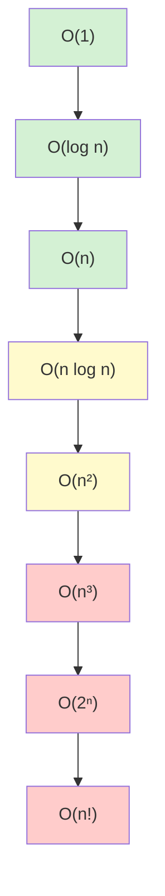

# Time and Space Complexity Analysis

## Introduction

When solving problems in programming, there are often multiple ways to achieve the same result. But how do we determine which solution is "better"? This is where **algorithm analysis** comes in, specifically through measuring **time complexity** and **space complexity**.

Time and space complexity analysis helps us:
- Compare algorithms objectively
- Predict how an algorithm will perform as input size grows
- Make informed decisions about which algorithm to use for specific problems
- Understand the fundamental tradeoffs in algorithm design

In this tutorial, we'll explore how to analyze algorithms based on how they use two critical resources: **time** (processing) and **space** (memory).

## Understanding Algorithm Efficiency

Before diving into formal notation, let's understand what makes an algorithm efficient:

### What is Algorithm Efficiency?

Efficiency refers to how well an algorithm uses computational resources:

1. **Time Efficiency**: How quickly an algorithm completes its task
2. **Space Efficiency**: How much memory an algorithm requires

As developers, we aim to optimize both, but often face tradeoffs where improving one means sacrificing the other.

## Big O Notation

To describe algorithm efficiency in a standardized way, we use **Big O Notation**. This mathematical notation describes the **upper bound** (worst-case scenario) of an algorithm's growth rate as input size increases.

### Why Big O?

- Provides a common language to discuss algorithm performance
- Focuses on growth rate, not implementation details
- Helps us understand performance at scale

### Common Big O Time Complexities

Here are the most common time complexities, from most efficient to least efficient:



Let's break down each complexity with examples:

### O(1) - Constant Time

An algorithm that always takes the same amount of time, regardless of input size.

```javascript
function getFirstElement(array) {
  return array[0]; // Always one operation, regardless of array size
}
```

### O(log n) - Logarithmic Time

The algorithm's time complexity grows logarithmically as input size increases. These are highly efficient for large inputs.

```javascript
function binarySearch(sortedArray, target) {
  let left = 0;
  let right = sortedArray.length - 1;
  
  while (left <= right) {
    const mid = Math.floor((left + right) / 2);
    
    if (sortedArray[mid] === target) {
      return mid; // Found target
    }
    
    if (sortedArray[mid] < target) {
      left = mid + 1; // Search right half
    } else {
      right = mid - 1; // Search left half
    }
  }
  
  return -1; // Target not found
}
```

In this binary search, we eliminate half of the remaining elements with each step, giving us O(log n) complexity.

### O(n) - Linear Time

The time complexity grows linearly with input size. If the input doubles, the time roughly doubles.

```javascript
function findMax(array) {
  let max = array[0];
  
  for (let i = 1; i < array.length; i++) {
    if (array[i] > max) {
      max = array[i];
    }
  }
  
  return max;
}
```

### O(n log n) - Linearithmic Time

Common in efficient sorting algorithms like merge sort and quicksort.

```javascript
function mergeSort(array) {
  // Base case
  if (array.length <= 1) {
    return array;
  }
  
  // Split array in half
  const middle = Math.floor(array.length / 2);
  const left = array.slice(0, middle);
  const right = array.slice(middle);
  
  // Recursively sort both halves and merge
  return merge(mergeSort(left), mergeSort(right));
}

function merge(left, right) {
  const result = [];
  let leftIndex = 0;
  let rightIndex = 0;
  
  // Compare elements and merge in sorted order
  while (leftIndex < left.length && rightIndex < right.length) {
    if (left[leftIndex] < right[rightIndex]) {
      result.push(left[leftIndex]);
      leftIndex++;
    } else {
      result.push(right[rightIndex]);
      rightIndex++;
    }
  }
  
  // Add remaining elements
  return result
    .concat(left.slice(leftIndex))
    .concat(right.slice(rightIndex));
}
```

### O(n²) - Quadratic Time

As input size grows, time increases quadratically. Common in nested loops.

```javascript
function bubbleSort(array) {
  const n = array.length;
  
  for (let i = 0; i < n; i++) {
    for (let j = 0; j < n - i - 1; j++) {
      if (array[j] > array[j + 1]) {
        // Swap elements
        [array[j], array[j + 1]] = [array[j + 1], array[j]];
      }
    }
  }
  
  return array;
}
```

### O(2ⁿ) - Exponential Time

Time doubles with each additional input element. Often seen in naive recursive algorithms.

```javascript
function fibonacci(n) {
  if (n <= 1) {
    return n;
  }
  return fibonacci(n - 1) + fibonacci(n - 2);
}
```

This naive fibonacci implementation recalculates the same values repeatedly, leading to exponential growth in calculations.

## Space Complexity

While time complexity measures how long an algorithm takes, **space complexity** measures how much memory it requires.

### Analyzing Space Complexity

We analyze space complexity by:
1. Counting variables created
2. Measuring data structures' growth
3. Tracking recursive call stack usage

### Common Space Complexities

- **O(1)** - Constant Space: Uses a fixed amount of memory regardless of input size
- **O(n)** - Linear Space: Memory usage grows linearly with input size
- **O(n²)** - Quadratic Space: Memory usage grows quadratically

### Examples of Space Complexity

#### O(1) Space Complexity

```javascript
function findSum(array) {
  let sum = 0; // One variable, regardless of array size
  
  for (let i = 0; i < array.length; i++) {
    sum += array[i];
  }
  
  return sum;
}
```

This function only uses a fixed number of variables, regardless of input size.

#### O(n) Space Complexity

```javascript
function createDoubledArray(array) {
  const doubled = []; // New array that will grow with input size
  
  for (let i = 0; i < array.length; i++) {
    doubled.push(array[i] * 2);
  }
  
  return doubled;
}
```

This function creates a new array proportional to the input size.

## Trade-offs Between Time and Space

Often, you can optimize for time at the expense of space, and vice versa. This is known as a **time-space tradeoff**.

### Example: Memoization

```javascript
function fibonacciMemoized(n, memo = {}) {
  // Check if we've already calculated this value
  if (n in memo) {
    return memo[n];
  }
  
  // Base cases
  if (n <= 1) {
    return n;
  }
  
  // Store result in memo object and return
  memo[n] = fibonacciMemoized(n - 1, memo) + fibonacciMemoized(n - 2, memo);
  return memo[n];
}
```

This improved fibonacci implementation uses extra space (the memo object) to dramatically reduce time complexity from O(2ⁿ) to O(n).

## Analyzing Your Own Code

Let's practice analyzing code:

```javascript
function containsDuplicate(array) {
  for (let i = 0; i < array.length; i++) {
    for (let j = i + 1; j < array.length; j++) {
      if (array[i] === array[j]) {
        return true;
      }
    }
  }
  return false;
}
```

**Analysis:**
- Time Complexity: O(n²) due to nested loops
- Space Complexity: O(1) as we only use a fixed number of variables

A more efficient solution:

```javascript
function containsDuplicateOptimized(array) {
  const seen = new Set();
  
  for (let item of array) {
    if (seen.has(item)) {
      return true;
    }
    seen.add(item);
  }
  
  return false;
}
```

**Analysis:**
- Time Complexity: O(n) as we loop through the array once
- Space Complexity: O(n) due to the Set potentially storing all elements

## Real-World Applications

Understanding complexity analysis helps in many real-world scenarios:

### 1. Database Query Optimization

When designing database queries, understanding complexity helps predict performance with large datasets. For example, using indexes to improve search operations from O(n) to O(log n).

### 2. Mobile App Performance

On resource-constrained devices, efficient algorithms preserve battery life and improve user experience. For example, limiting O(n²) operations in UI rendering code.

### 3. Scalable Web Services

As your user base grows, algorithmic efficiency becomes crucial. An algorithm that works fine with 100 users might crash your server with 10,000 users if it has poor scaling characteristics.

## Best Practices for Efficient Code

1. **Use appropriate data structures**
   - HashMaps/Objects for O(1) lookups
   - Sorted arrays for O(log n) binary search
   - Specialized data structures for specific operations

2. **Look for redundant work**
   - Caching/memoization to avoid recalculations
   - Precomputing values when possible

3. **Choose algorithms based on your constraints**
   - Time-critical applications may prioritize time complexity
   - Memory-constrained environments may prioritize space complexity

## Common Pitfalls in Complexity Analysis

1. **Ignoring constants**: While Big O notation drops constants, real-world performance can be affected by them
2. **Focusing only on worst case**: Sometimes average case matters more
3. **Not considering the input size range**: For small inputs, simpler algorithms might outperform asymptotically better ones

## Summary

Time and space complexity analysis provides a systematic way to evaluate algorithm efficiency. Key takeaways:

- **Big O notation** gives us a standardized language for discussing algorithm performance
- **Time complexity** measures how runtime grows with input size
- **Space complexity** measures how memory usage grows with input size
- Understanding complexity helps make informed decisions about algorithm selection
- There are often **tradeoffs between time and space** efficiency

By mastering complexity analysis, you'll write more efficient code and make better decisions when choosing between different algorithmic approaches.

## Practice Exercises

1. Analyze the time and space complexity of the following functions:
   - A function that checks if a string is a palindrome
   - A function that finds the intersection of two arrays
   - A function that generates all permutations of a string

2. Implement two different solutions for finding the kth largest element in an unsorted array, and compare their time and space complexities

3. Identify the time and space complexity bottlenecks in a piece of your own code, and try to optimize them

## Additional Resources

- Books:
  - "Introduction to Algorithms" by Cormen, Leiserson, Rivest, and Stein
  - "Grokking Algorithms" by Aditya Bhargava (beginner-friendly)

- Online Courses:
  - MIT's Introduction to Algorithms course
  - Princeton's Algorithms course on Coursera

- Practice Platforms:
  - LeetCode
  - HackerRank
  - CodeSignal