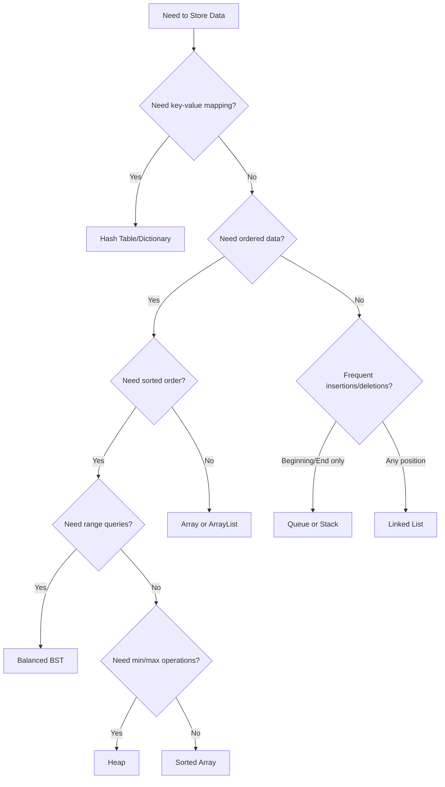

# Choosing the Right Data Structure

One of the most crucial decisions you'll make as a programmer is selecting the appropriate data structure for your specific problem. The right choice can dramatically improve your program's performance, readability, and maintainability.

## Introduction

Data structures are specialized formats for organizing, storing, and manipulating data. Each data structure has its own strengths and weaknesses, making them suitable for different scenarios. This guide will help you understand how to choose the most appropriate data structure for your programming tasks.

## Why Data Structure Selection Matters

Choosing the right data structure impacts:

- **Time complexity**: How your program's execution time scales with input size
- **Space complexity**: How much memory your program uses
- **Code readability**: How easy it is for others (and your future self) to understand your code
- **Maintainability**: How easily your code can be modified and extended

Let's explore the common data structures and when to use each one.

## Common Data Structures and Their Use Cases

### Arrays

Arrays store elements in contiguous memory locations, making them ideal when you need:

- Direct access to elements by index
- Simple, fixed-size collections
- Efficient iteration over all elements

```javascript
// Example: Using an array to store and calculate student grades
const grades = [85, 90, 78, 92, 88];

// Calculating average (efficient iteration)
let sum = 0;
for (let i = 0; i < grades.length; i++) {
    sum += grades[i];
}
const average = sum / grades.length;
console.log(`Average grade: ${average}`); // Output: Average grade: 86.6
```

**When to use arrays:**
- When you need random access to elements (O(1) time)
- When the size of the collection is known in advance
- When memory efficiency is important
- For implementing matrices and multi-dimensional data

**When to avoid arrays:**
- When you frequently need to add/remove elements (especially at the beginning)
- When you don't know the size in advance (in languages with fixed-size arrays)
- When you need to search for elements quickly without knowing their position

### Linked Lists

Linked lists consist of nodes where each node contains data and a reference to the next node, offering:

- Dynamic size adjustment
- Efficient insertions and deletions (especially at the beginning)

```python
# Example: Implementing a simple linked list
class Node:
    def __init__(self, data):
        self.data = data
        self.next = None

class LinkedList:
    def __init__(self):
        self.head = None
    
    def append(self, data):
        new_node = Node(data)
        if not self.head:
            self.head = new_node
            return
        
        current = self.head
        while current.next:
            current = current.next
        current.next = new_node
    
    def print_list(self):
        current = self.head
        while current:
            print(current.data, end=" -> ")
            current = current.next
        print("None")

# Usage
my_list = LinkedList()
my_list.append("Task 1")
my_list.append("Task 2")
my_list.append("Task 3")
my_list.print_list()  # Output: Task 1 -> Task 2 -> Task 3 -> None
```

**When to use linked lists:**
- When you need frequent insertions/deletions
- When you're implementing data structures like stacks, queues, or more complex structures
- When memory allocation needs to be dynamic
- When you don't need random access to elements

**When to avoid linked lists:**
- When you need frequent access to elements by position
- When memory overhead is a concern (nodes require extra space for pointers)
- When cache performance is critical (linked lists have poor locality)

### Stacks

Stacks follow the Last-In-First-Out (LIFO) principle, making them perfect for:

- Tracking state in recursive algorithms
- Implementing undo/redo functionality
- Expression evaluation and syntax parsing

```java
// Example: Using a stack to check balanced parentheses
import java.util.Stack;

public class ParenthesesChecker {
    public static boolean areParenthesesBalanced(String expr) {
        Stack<Character> stack = new Stack<>();
        
        for (int i = 0; i < expr.length(); i++) {
            char current = expr.charAt(i);
            
            if (current == '(' || current == '[' || current == '{') {
                stack.push(current);
                continue;
            }
            
            if (stack.isEmpty())
                return false;
                
            char check;
            switch (current) {
                case ')':
                    check = stack.pop();
                    if (check != '(')
                        return false;
                    break;
                    
                case '}':
                    check = stack.pop();
                    if (check != '{')
                        return false;
                    break;
                    
                case ']':
                    check = stack.pop();
                    if (check != '[')
                        return false;
                    break;
            }
        }
        
        return stack.isEmpty();
    }
    
    public static void main(String[] args) {
        String expr = "{[()]}";
        if (areParenthesesBalanced(expr))
            System.out.println("Balanced");
        else
            System.out.println("Not Balanced");
    }
}
// Output: Balanced
```

**When to use stacks:**
- For problems involving backtracking
- When you need to implement function calls (call stack)
- For algorithms that need to remember previous states
- For depth-first traversals of trees and graphs

### Queues

Queues follow the First-In-First-Out (FIFO) principle, ideal for:

- Task scheduling
- Resource allocation
- Print spooling
- BFS algorithms

```python
# Example: Implementing a simple queue for processing tasks
from collections import deque

class PrintQueue:
    def __init__(self):
        self.queue = deque()
    
    def add_document(self, doc_name):
        self.queue.append(doc_name)
        print(f"Added '{doc_name}' to print queue")
    
    def print_next(self):
        if not self.queue:
            return "No documents in queue"
        doc = self.queue.popleft()
        return f"Printing: {doc}"
    
    def queue_size(self):
        return len(self.queue)

# Usage
printer = PrintQueue()
printer.add_document("Resume.pdf")    # Output: Added 'Resume.pdf' to print queue
printer.add_document("Report.docx")   # Output: Added 'Report.docx' to print queue
printer.add_document("Image.jpg")     # Output: Added 'Image.jpg' to print queue

print(printer.print_next())           # Output: Printing: Resume.pdf
print(printer.print_next())           # Output: Printing: Report.docx
print(f"Remaining documents: {printer.queue_size()}")  # Output: Remaining documents: 1
```

**When to use queues:**
- When processing needs to happen in the order items were received
- For breadth-first search algorithms
- For implementing buffers (e.g., keyboard buffer, printer queue)
- For scheduling systems

### Hash Tables (Dictionaries/Maps)

Hash tables provide fast lookups, insertions, and deletions using key-value pairs:

```javascript
// Example: Using a hash map for a contact book
const contacts = new Map();

// Adding contacts (O(1) average case)
contacts.set('Alice', { phone: '555-1234', email: 'alice@example.com' });
contacts.set('Bob', { phone: '555-5678', email: 'bob@example.com' });
contacts.set('Charlie', { phone: '555-9012', email: 'charlie@example.com' });

// Looking up a contact (O(1) average case)
const lookupName = 'Bob';
if (contacts.has(lookupName)) {
    const contact = contacts.get(lookupName);
    console.log(`${lookupName}'s phone: ${contact.phone}, email: ${contact.email}`);
} else {
    console.log(`${lookupName} not found in contacts`);
}
// Output: Bob's phone: 555-5678, email: bob@example.com

// Updating a contact (O(1) average case)
contacts.set('Alice', { phone: '555-4321', email: 'alice.new@example.com' });
```

**When to use hash tables:**
- When you need fast lookups, insertions, and deletions
- For implementing caches
- For counting frequency of items
- For detecting duplicates
- For database indexing

**When to avoid hash tables:**
- When you need ordered data
- When you need to find the minimum or maximum value efficiently
- When memory usage is a critical constraint

### Trees

Trees represent hierarchical structures and come in many variants:

#### Binary Search Trees (BSTs)

```java
// Example: Binary Search Tree operations (pseudocode)
class Node {
    int key;
    Node left, right;
    
    Node(int item) {
        key = item;
        left = right = null;
    }
}

class BinarySearchTree {
    Node root;
    
    Node search(Node root, int key) {
        // Base case: root is null or key is present at root
        if (root == null || root.key == key)
            return root;
            
        // Key is greater than root's key
        if (root.key < key)
            return search(root.right, key);
            
        // Key is smaller than root's key
        return search(root.left, key);
    }
    
    // Other operations like insert, delete, traverse would be defined here
}
```

**When to use BSTs:**
- When you need to maintain sorted data
- When you need efficient insertions, deletions, and searches
- For implementing sets and maps with ordered traversal

#### Heaps

```python
# Example: Using a min-heap for finding the top 3 smallest elements
import heapq

numbers = [4, 10, 3, 5, 1, 8, 7]
heapq.heapify(numbers)  # Convert list to heap in-place

# Extract the three smallest elements
smallest = []
for i in range(3):
    smallest.append(heapq.heappop(numbers))

print(f"Three smallest elements: {smallest}")
# Output: Three smallest elements: [1, 3, 4]
```

**When to use heaps:**
- For priority queues
- For scheduling algorithms
- For finding the k largest/smallest elements
- For graph algorithms like Dijkstra's algorithm

### Graphs

Graphs represent networks and relationships:

```python
# Example: Representing a simple graph using adjacency list
class Graph:
    def __init__(self):
        self.adjacency_list = {}
    
    def add_vertex(self, vertex):
        if vertex not in self.adjacency_list:
            self.adjacency_list[vertex] = []
    
    def add_edge(self, vertex1, vertex2):
        self.adjacency_list[vertex1].append(vertex2)
        self.adjacency_list[vertex2].append(vertex1)  # For undirected graph
    
    def display(self):
        for vertex in self.adjacency_list:
            print(f"{vertex} -> {', '.join(map(str, self.adjacency_list[vertex]))}")

# Usage
g = Graph()
for city in ["New York", "Boston", "Chicago", "Los Angeles"]:
    g.add_vertex(city)

g.add_edge("New York", "Boston")
g.add_edge("New York", "Chicago")
g.add_edge("Boston", "Chicago")
g.add_edge("Los Angeles", "Chicago")

g.display()
# Output:
# New York -> Boston, Chicago
# Boston -> New York, Chicago
# Chicago -> New York, Boston, Los Angeles
# Los Angeles -> Chicago
```

**When to use graphs:**
- For representing networks (social, transport, computer)
- For path-finding algorithms
- For dependency analysis
- For recommendations systems

## Decision Flowchart for Choosing Data Structures

Here's a simple flowchart to help you decide which data structure to use:



## Performance Comparison

Let's compare the time complexity of common operations across different data structures:

| Data Structure | Access | Search | Insertion | Deletion |
|----------------|--------|--------|-----------|----------|
| Array          | O(1)   | O(n)   | O(n)      | O(n)     |
| Linked List    | O(n)   | O(n)   | O(1)      | O(1)     |
| Stack          | O(n)   | O(n)   | O(1)      | O(1)     |
| Queue          | O(n)   | O(n)   | O(1)      | O(1)     |
| Hash Table     | N/A    | O(1)*  | O(1)*     | O(1)*    |
| BST            | O(n)   | O(n)   | O(n)      | O(n)     |
| Balanced BST   | O(log n) | O(log n) | O(log n) | O(log n) |
| Heap           | O(1)** | O(n)   | O(log n)  | O(log n) |

\* Average case. Worst case is O(n).<br />
\** For minimum/maximum element only.

## Real-World Examples

### Example 1: Implementing an Undo Feature in a Text Editor

```javascript
// Using a stack to implement undo functionality
class TextEditor {
    constructor() {
        this.content = "";
        this.undoStack = [];
    }
    
    type(text) {
        // Save the current state before changing
        this.undoStack.push(this.content);
        this.content += text;
        return this.content;
    }
    
    delete(chars) {
        // Save the current state before changing
        this.undoStack.push(this.content);
        this.content = this.content.slice(0, -chars);
        return this.content;
    }
    
    undo() {
        if (this.undoStack.length > 0) {
            this.content = this.undoStack.pop();
        }
        return this.content;
    }
}

// Usage
const editor = new TextEditor();
console.log(editor.type("Hello"));     // Output: Hello
console.log(editor.type(" world!"));   // Output: Hello world!
console.log(editor.delete(1));         // Output: Hello world
console.log(editor.undo());            // Output: Hello world!
console.log(editor.undo());            // Output: Hello
```

### Example 2: Task Scheduling System

```python
# Using a priority queue (heap) for task scheduling
import heapq
from dataclasses import dataclass, field
from typing import Any

@dataclass(order=True)
class PrioritizedTask:
    priority: int
    task: Any = field(compare=False)

class TaskScheduler:
    def __init__(self):
        self.tasks = []  # This will be our priority queue
    
    def add_task(self, task, priority):
        heapq.heappush(self.tasks, PrioritizedTask(priority, task))
    
    def get_next_task(self):
        if self.tasks:
            return heapq.heappop(self.tasks).task
        return None
    
    def has_tasks(self):
        return len(self.tasks) > 0

# Usage
scheduler = TaskScheduler()
scheduler.add_task("Fix critical bug", 1)  # Lower number = higher priority
scheduler.add_task("Implement new feature", 3)
scheduler.add_task("Update documentation", 2)

while scheduler.has_tasks():
    next_task = scheduler.get_next_task()
    print(f"Working on: {next_task}")

# Output:
# Working on: Fix critical bug
# Working on: Update documentation
# Working on: Implement new feature
```

## Choosing Based on Data Access Patterns

When selecting a data structure, consider how you'll primarily interact with your data:

1. **Sequential Access**: If you need to process items in order, consider arrays, linked lists, or queues.
2. **Random Access**: If you need to jump directly to specific positions, arrays are typically best.
3. **Key-Based Access**: If you look up items by a key, hash tables are usually optimal.
4. **Min/Max Access**: If you frequently need the smallest or largest item, heaps excel.
5. **Ordered Access**: If you need items in sorted order, consider balanced BSTs or sorted arrays.

## Summary

Choosing the right data structure involves understanding:

1. The operations you'll perform most frequently
2. The time and space complexity requirements
3. The specific constraints of your problem

Remember that real-world applications often combine multiple data structures to leverage the strengths of each. Don't be afraid to use a combination of data structures when a single one doesn't meet all your needs.

## Practice Exercises

1. **Shopping Cart Implementation**: Design a data structure for an online shopping cart that needs to:
   - Add/remove items quickly
   - Calculate the total price
   - Find items by name
   - Display items in the order they were added

2. **Social Network Connections**: What data structure would you use to represent connections between users in a social network? Implement a simple version that can:
   - Add connections between users
   - Find all friends of a user
   - Determine if two users are connected
   - Find friends-of-friends

3. **Text Editor Buffer**: Design a data structure for a text editor buffer that supports:
   - Efficient insertion and deletion at any position
   - Undo/redo functionality
   - Efficient cursor movement

## Additional Resources

- "Introduction to Algorithms" by Cormen, Leiserson, Rivest, and Stein
- "Data Structures and Algorithms in Python" by Goodrich, Tamassia, and Goldwasser
- "Cracking the Coding Interview" by Gayle Laakmann McDowell
- Online practice platforms like LeetCode, HackerRank, and CodeSignal

Remember, the best way to master data structures is through practice. Start with simple implementations, then move on to more complex problems. Good luck on your programming journey!