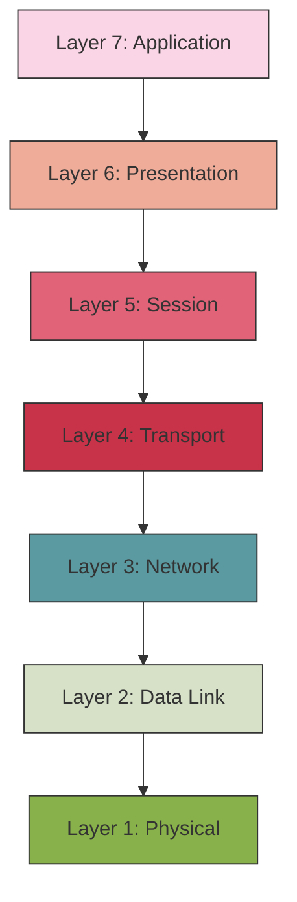
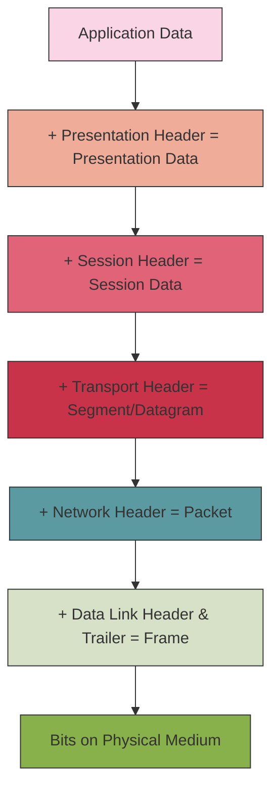

# The OSI Model

## Introduction

Have you ever wondered how data travels from your computer to another device across the internet? How does your web browser know how to communicate with a web server, or how do emails find their way to the correct inbox? The answer lies in understanding network communication models, and one of the most fundamental is the **OSI Model**.

The **OSI (Open Systems Interconnection)** Model is a conceptual framework that standardizes the functions of a telecommunication or computing system into seven distinct layers. Created by the International Organization for Standardization (ISO) in 1984, it helps us understand and troubleshoot network communications by breaking down the complex process into manageable components.

Think of the OSI Model as a universal language that allows different network systems to communicate regardless of their underlying architecture.

## The Seven Layers of the OSI Model

The OSI Model consists of seven layers, each with specific functions. Let's explore them from top to bottom:

<div className="osm-table">

| Layer | Name | Main Function |
|-------|------|--------------|
| 7 | Application | Direct user interaction, provides network services to applications |
| 6 | Presentation | Data translation, encryption, compression |
| 5 | Session | Managing sessions between applications |
| 4 | Transport | End-to-end connections, reliability, flow control |
| 3 | Network | Routing, logical addressing |
| 2 | Data Link | Physical addressing, access to media, error detection |
| 1 | Physical | Transmission of raw bit stream over physical medium |

</div>

Let's visualize the OSI Model as a stack:



Now, let's dive deep into each layer to understand their functions, protocols, and real-world applications.

## Layer 1: Physical Layer

### What It Does

The Physical layer is concerned with the transmission and reception of the unstructured raw bit stream over a physical medium. It defines:

- Electrical, mechanical, and functional specifications
- Transmission mode (simplex, half-duplex, full-duplex)
- Network topology (bus, star, ring, mesh)
- Bit synchronization and data rate

### Protocols and Hardware

- **Hardware**: Network Interface Cards (NICs), hubs, repeaters, cables (Ethernet, fiber optic, coaxial)
- **Standards**: RS-232, USB, Bluetooth physical specifications

### Real-World Example

When you connect an Ethernet cable from your computer to a router, the physical layer is responsible for transmitting the electrical signals through the cable. The specifications of the cable (Cat 5, Cat 6, etc.) determine the maximum data rate and distance for reliable transmission.

## Layer 2: Data Link Layer

### What It Does

The Data Link layer provides node-to-node data transfer—a link between two directly connected nodes. It:

- Detects and possibly corrects errors from the Physical layer
- Defines how devices gain access to the medium
- Controls flow and ensures data integrity
- Handles physical addressing (MAC addresses)

### Protocols and Hardware

- **Protocols**: Ethernet, PPP (Point-to-Point Protocol), HDLC
- **Hardware**: Switches, bridges, network interface cards
- **Addressing**: MAC (Media Access Control) addresses

### Real-World Example

When your computer sends data to another device on the same local network, it uses the MAC address of the destination device. The switch uses this MAC address to forward the data frame directly to the intended recipient rather than broadcasting it to all connected devices.

```javascript
// Simplified representation of an Ethernet frame
const ethernetFrame = {
  preamble: "10101010...", // For synchronization
  destinationMAC: "00:1A:2B:3C:4D:5E",
  sourceMAC: "5F:6E:7D:8C:9B:0A",
  etherType: 0x0800, // Indicates IPv4 payload
  payload: "Actual data being transmitted",
  FCS: "Cyclical redundancy check for error detection"
};
```

## Layer 3: Network Layer

### What It Does

The Network layer provides the functional and procedural means of transferring variable length data sequences from a source to a destination via one or more networks. It:

- Handles logical addressing (IP addresses)
- Routes packets from source to destination
- Performs traffic control, packet switching, and fragmentation

### Protocols and Hardware

- **Protocols**: IP (IPv4, IPv6), ICMP, OSPF, RIP
- **Hardware**: Routers
- **Addressing**: IP addresses

### Real-World Example

When you access a website, your device sends a packet with your IP address (source) and the website server's IP address (destination). Routers along the path use this information to forward the packet across different networks until it reaches the destination.

```javascript
// Simplified representation of an IPv4 packet
const ipv4Packet = {
  version: 4,
  headerLength: 20, // in bytes
  typeOfService: 0,
  totalLength: 1500,
  identification: 0x1234,
  flags: {
    dontFragment: true,
    moreFragments: false
  },
  fragmentOffset: 0,
  timeToLive: 64,
  protocol: 6, // TCP
  headerChecksum: 0xABCD,
  sourceIP: "192.168.1.10",
  destinationIP: "142.250.190.78", // Example Google IP
  options: [],
  payload: "TCP segment containing HTTP request"
};
```

## Layer 4: Transport Layer

### What It Does

The Transport layer provides the functional and procedural means of transferring variable-length data sequences from a source to a destination host via one or more networks, while maintaining the quality of service functions. It:

- Ensures complete data transfer
- Provides error recovery
- Flow control
- Segmentation and reassembly

### Protocols and Hardware

- **Protocols**: TCP (Transmission Control Protocol), UDP (User Datagram Protocol), SCTP
- **Software components**: Operating system transport drivers
- **Addressing**: Ports (0-65535)

### Real-World Example

When streaming a video, your computer might use UDP as it prioritizes speed over reliability for real-time applications. However, when downloading a file, TCP ensures no data is lost by requiring acknowledgment for each packet and retransmitting if necessary.

```javascript
// Simplified representation of a TCP segment
const tcpSegment = {
  sourcePort: 55123, // Random client port
  destinationPort: 80, // HTTP server port
  sequenceNumber: 123456789,
  acknowledgmentNumber: 987654321,
  headerLength: 20, // in bytes
  flags: {
    URG: false,
    ACK: true,
    PSH: false,
    RST: false,
    SYN: false,
    FIN: false
  },
  windowSize: 65535,
  checksum: 0xFEDC,
  urgentPointer: 0,
  options: [],
  payload: "HTTP request data"
};
```

## Layer 5: Session Layer

### What It Does

The Session layer controls the dialogues (connections) between computers. It:

- Establishes, maintains, and terminates connections
- Performs session checkpointing and recovery
- Controls dialog control and synchronization

### Protocols and Hardware

- **Protocols**: NetBIOS, RPC, SOCKS
- **APIs**: Session establishment in various application frameworks

### Real-World Example

When you log in to an online banking system, a session is established. The session layer helps maintain this connection and can recover the session if there's a brief network disconnection, allowing you to continue where you left off rather than having to log in again.

## Layer 6: Presentation Layer

### What It Does

The Presentation layer translates data between the application layer and the network format. It:

- Formats and encrypts data
- Compresses data
- Ensures data can be properly consumed by the application layer

### Protocols and Hardware

- **Protocols**: SSL/TLS, JPEG, MPEG, ASCII, Unicode
- **Services**: Data encryption, compression, and translation

### Real-World Example

When you view an image on a webpage, the image file was likely compressed using JPEG to reduce its size for transmission. The presentation layer at your end decompresses the image data so your browser can display it correctly.

## Layer 7: Application Layer

### What It Does

The Application layer is the OSI layer closest to the end user. It:

- Provides network services to the user's applications
- Acts as the interface for users to access network resources

### Protocols and Hardware

- **Protocols**: HTTP, HTTPS, FTP, SMTP, DNS, DHCP, Telnet, SSH
- **Software**: Web browsers, email clients, FTP clients

### Real-World Example

When you type a URL in your browser, the application layer uses HTTP or HTTPS to request the webpage from the server. The response is then processed through all the layers and finally displayed in your browser.

```javascript
// Simplified HTTP Request
const httpRequest = `GET /index.html HTTP/1.1
Host: www.example.com
User-Agent: Mozilla/5.0
Accept: text/html,application/xhtml+xml
Connection: keep-alive`;

// Simplified HTTP Response
const httpResponse = `HTTP/1.1 200 OK
Date: Mon, 23 May 2023 22:38:34 GMT
Content-Type: text/html; charset=UTF-8
Content-Length: 138
Connection: close

<!DOCTYPE html>
<html>
<head>
  <title>Example Domain</title>
</head>
<body>
  <h1>Example Domain</h1>
  <p>This is an example page.</p>
</body>
</html>`;
```

## Data Encapsulation and Decapsulation

One of the key concepts in the OSI Model is how data moves through the layers. As data moves from the application layer down to the physical layer (when sending), each layer adds its own header (and sometimes a trailer) to the data. This process is called **encapsulation**.

When the data is received, the opposite process occurs, called **decapsulation** or **de-encapsulation**, where each layer removes its header information and passes the remaining data up to the next layer.

Let's visualize this process:



## The OSI Model vs. TCP/IP Model

While the OSI Model is excellent for conceptualizing network communications, most modern internet communications actually use the **TCP/IP Model**, which has fewer layers. Here's a quick comparison:

<div className="model-comparison">

| OSI Model | TCP/IP Model |
|-----------|--------------|
| Application<br />Presentation<br />Session | Application |
| Transport | Transport |
| Network | Internet |
| Data Link<br />Physical | Network Interface |

</div>

The TCP/IP model is more practical and widely implemented, but understanding the OSI Model gives you a more detailed view of network communications.

## Troubleshooting with the OSI Model

One of the most practical applications of the OSI Model is in network troubleshooting. By understanding which layer a problem is occurring at, technicians can isolate issues more efficiently.

Here's a troubleshooting approach based on the OSI Model:

1. **Physical Layer**: Check cables, power, hardware connections
2. **Data Link Layer**: Verify MAC addresses, switch functionality
3. **Network Layer**: Check IP addresses, routing tables, firewalls
4. **Transport Layer**: Verify port availability, check TCP/UDP connectivity
5. **Session Layer**: Look for session establishment issues
6. **Presentation Layer**: Check for encryption/decryption issues, data format problems
7. **Application Layer**: Investigate application-specific issues, software configurations

## Summary

The OSI Model provides a conceptual framework that standardizes computer network communications into seven logical layers. Each layer serves a specific function and interacts with the layers directly above and below it. Although modern networks primarily use the TCP/IP model in practice, understanding the OSI Model helps in:

- Network design and implementation
- Troubleshooting network issues
- Learning networking concepts
- Standardizing network components and protocols

By breaking down the complex process of network communication into discrete layers, the OSI Model makes it easier to understand, implement, and troubleshoot network systems.

## Practice Exercises

1. **Layer Identification**:
   - When you type a URL in your browser, which OSI layer does this action start at?
   - If a network cable is unplugged, which OSI layer is affected first?

2. **Protocol Classification**:
   - Classify these protocols according to their OSI layers: HTTP, TCP, IP, Ethernet, SMTP, TLS

3. **Troubleshooting Scenario**:
   - Your computer can't access a website. Describe how you would troubleshoot this issue using the OSI Model, starting from the lowest layer.

## Additional Resources

- **Books**:
  - "Computer Networks" by Andrew S. Tanenbaum
  - "TCP/IP Illustrated" by W. Richard Stevens

- **Online Courses**:
  - Cisco Networking Academy
  - CompTIA Network+ certification materials

- **Interactive Tools**:
  - Wireshark for packet analysis
  - Network simulators like Cisco Packet Tracer or GNS3

Remember that while the OSI Model is a theoretical framework, understanding it thoroughly will give you a solid foundation for learning practical networking concepts and technologies.