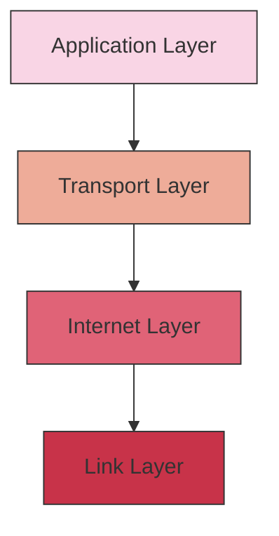
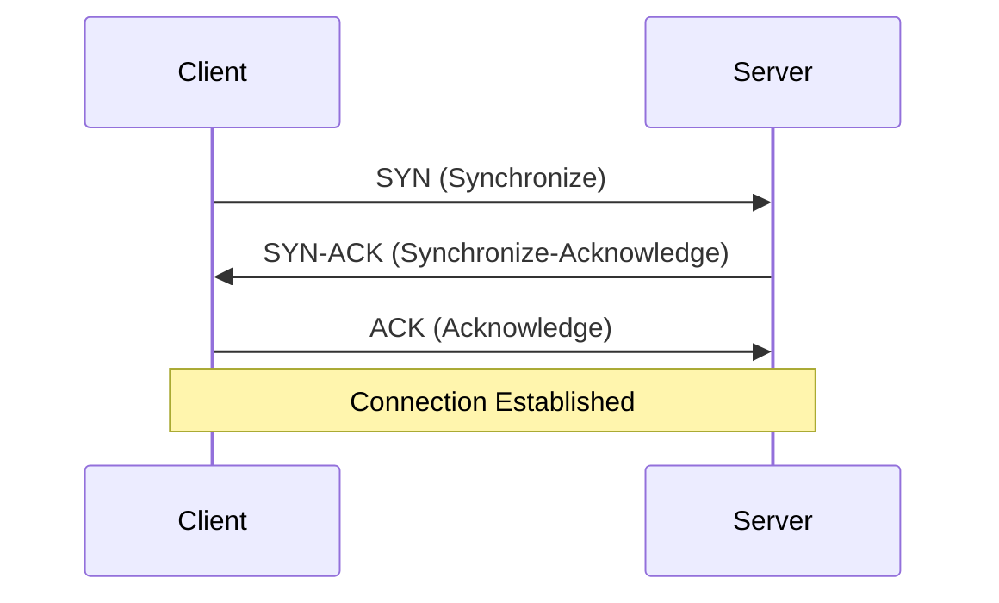

# TCP/IP: The Foundation of Internet Communication

## Introduction

Have you ever wondered how data travels across the internet? How your browser request reaches a server on the other side of the world and returns with the exact information you need? The answer lies in TCP/IP - the fundamental communication protocols that power the internet.

TCP/IP stands for **Transmission Control Protocol/Internet Protocol**. It's not a single protocol but a suite of communication protocols used to interconnect network devices on the internet and similar computer networks. Think of TCP/IP as the common language that allows different devices, running different operating systems, to communicate with each other seamlessly.

In this guide, we'll explore how TCP/IP works, its importance, and how it forms the backbone of nearly all online communication today.

## The Four-Layer TCP/IP Model

TCP/IP follows a layered architecture, typically described as a four-layer model:



Let's explore each layer and its function:

### 1. Link Layer (Network Interface Layer)

The Link Layer is the lowest layer in the TCP/IP model, concerned with the physical connection between devices.

**Key functions:**
- Physical addressing (MAC addresses)
- Network topology and hardware
- Media access control
- Signal transmission
- Error detection at the hardware level

**Protocols include:** Ethernet, Wi-Fi (802.11), PPP

**Example:** When you connect your laptop to Wi-Fi, the Link Layer handles the physical connection to the wireless network.

### 2. Internet Layer (Network Layer)

The Internet Layer handles the movement of packets around the network.

**Key functions:**
- Logical addressing (IP addresses)
- Routing - determining the best path for data
- Packet forwarding
- Fragmentation and reassembly of data

**Main protocol:** Internet Protocol (IP)

**Example of IP addressing:**

```
IPv4 address: 192.168.1.1
IPv6 address: 2001:0db8:85a3:0000:0000:8a2e:0370:7334
```

### 3. Transport Layer

The Transport Layer ensures complete data transfer, managing the reliability and flow control.

**Key functions:**
- End-to-end communication
- Reliability (or unreliability) of data transfer
- Flow control
- Error recovery
- Connection-oriented or connectionless communication

**Main protocols:**
- **TCP (Transmission Control Protocol)** - Connection-oriented, reliable
- **UDP (User Datagram Protocol)** - Connectionless, unreliable but faster

#### TCP vs. UDP: A Comparison

| Feature | TCP | UDP |
|---------|-----|-----|
| Connection | Connection-oriented | Connectionless |
| Reliability | Guaranteed delivery | "Best effort" delivery |
| Ordering | Maintains order of data | No guaranteed order |
| Error checking | Extensive | Basic |
| Speed | Slower due to overhead | Faster |
| Use cases | Web browsing, email, file transfers | Video streaming, online gaming, DNS lookups |

### 4. Application Layer

The Application Layer is where network applications operate and provide services to the end-user.

**Key functions:**
- Network services to applications
- User interfaces to the network
- Application-specific protocols

**Common protocols:**
- HTTP/HTTPS (web browsing)
- SMTP, POP3, IMAP (email)
- FTP (file transfer)
- DNS (domain name resolution)
- SSH (secure remote login)

## How TCP/IP Works: A Practical Example

Let's trace what happens when you type a URL (like `www.example.com`) into your browser:

1. **Application Layer**: Your browser initiates an HTTP request to access the website.

2. **Transport Layer**: The request is packaged into TCP segments. TCP establishes a connection through a "three-way handshake":



3. **Internet Layer**: The TCP segments are encapsulated into IP packets with source and destination IP addresses. The IP protocol handles routing through the internet.

4. **Link Layer**: The IP packets are converted to frames suitable for transmission over the physical network (Ethernet, Wi-Fi, etc.).

5. **Data travels through multiple routers and switches**, with each router examining the destination IP address and forwarding the packet to the next hop.

6. **The process reverses** at the receiving end: frames are converted back to IP packets, then to TCP segments, and finally, the web server interprets the HTTP request.

7. **The server responds** using the same process in reverse, sending the webpage back to your browser.

## Understanding IP Addresses

Every device on a TCP/IP network requires an IP address. There are two versions in use today:

### IPv4
- 32-bit addresses (4 bytes)
- Written as four numbers separated by periods (e.g., `192.168.1.1`)
- Limited to about 4.3 billion addresses (which is running out)

### IPv6
- 128-bit addresses (16 bytes)
- Written as eight groups of four hexadecimal digits (e.g., `2001:0db8:85a3:0000:0000:8a2e:0370:7334`)
- Provides an almost unlimited number of addresses

## Practical Example: Using Socket Programming

Let's look at a simple example of a TCP server and client in Python to understand how applications use TCP/IP:

### TCP Server Example

```python
import socket

# Create a TCP/IP socket
server_socket = socket.socket(socket.AF_INET, socket.SOCK_STREAM)

# Bind the socket to a specific address and port
server_address = ('localhost', 9999)
server_socket.bind(server_address)

# Listen for incoming connections
server_socket.listen(1)
print(f"Server is listening on {server_address}")

while True:
    # Wait for a connection
    print("Waiting for a connection...")
    client_socket, client_address = server_socket.accept()
    
    try:
        print(f"Connection from {client_address}")
        
        # Receive data in small chunks and retransmit it
        while True:
            data = client_socket.recv(1024)
            if data:
                print(f"Received: {data.decode('utf-8')}")
                # Echo back the same data
                client_socket.sendall(data)
            else:
                print(f"No more data from {client_address}")
                break
            
    finally:
        # Clean up the connection
        client_socket.close()
```

### TCP Client Example

```python
import socket

# Create a TCP/IP socket
client_socket = socket.socket(socket.AF_INET, socket.SOCK_STREAM)

# Connect the socket to the server's address and port
server_address = ('localhost', 9999)
print(f"Connecting to {server_address}")
client_socket.connect(server_address)

try:
    # Send data
    message = "Hello, server! This is a TCP client."
    print(f"Sending: {message}")
    client_socket.sendall(message.encode('utf-8'))
    
    # Look for the response
    amount_received = 0
    amount_expected = len(message)
    
    while amount_received < amount_expected:
        data = client_socket.recv(1024)
        amount_received += len(data)
        print(f"Received: {data.decode('utf-8')}")
        
finally:
    # Clean up the connection
    print("Closing socket")
    client_socket.close()
```

### Output Example:

Server side:
```
Server is listening on ('localhost', 9999)
Waiting for a connection...
Connection from ('127.0.0.1', 54321)
Received: Hello, server! This is a TCP client.
No more data from ('127.0.0.1', 54321)
Waiting for a connection...
```

Client side:
```
Connecting to ('localhost', 9999)
Sending: Hello, server! This is a TCP client.
Received: Hello, server! This is a TCP client.
Closing socket
```

This example demonstrates the client-server model using TCP sockets, showing how data is transmitted reliably between applications using TCP/IP.

## Common TCP/IP Utilities

Several command-line utilities can help you understand and troubleshoot TCP/IP networks:

### 1. `ping`

Checks if a host is reachable:

```bash
$ ping google.com
PING google.com (142.250.190.78): 56 data bytes
64 bytes from 142.250.190.78: icmp_seq=0 ttl=118 time=14.347 ms
64 bytes from 142.250.190.78: icmp_seq=1 ttl=118 time=13.679 ms
```

### 2. `traceroute` (or `tracert` on Windows)

Shows the route packets take to reach a destination:

```bash
$ traceroute google.com
traceroute to google.com (142.250.190.78), 30 hops max, 60 byte packets
 1  router.local (192.168.1.1)  3.171 ms  2.919 ms  2.756 ms
 2  96.120.106.254 (96.120.106.254)  13.655 ms  14.040 ms  14.120 ms
 3  68.85.208.225 (68.85.208.225)  14.601 ms  14.520 ms  14.384 ms
 ...
```

### 3. `netstat`

Displays network connections, routing tables, and interface statistics:

```bash
$ netstat -an
Active Internet connections (servers and established)
Proto Recv-Q Send-Q Local Address           Foreign Address         State
tcp        0      0 0.0.0.0:22              0.0.0.0:*               LISTEN
tcp        0      0 127.0.0.1:631           0.0.0.0:*               LISTEN
```

## TCP/IP in the Real World

TCP/IP is foundational to numerous technologies and services we use daily:

1. **World Wide Web**: HTTP/HTTPS runs on top of TCP/IP
2. **Email**: SMTP, POP3, and IMAP use TCP/IP for transmission
3. **File transfers**: FTP and SFTP rely on TCP/IP
4. **Streaming services**: Netflix, YouTube, Spotify all use TCP/IP (often with UDP for the actual media streaming)
5. **IoT devices**: Smart home devices communicate using TCP/IP
6. **Cloud computing**: All cloud services run on TCP/IP networks

## Common TCP/IP Issues and Troubleshooting

Understanding some common TCP/IP issues can help with network troubleshooting:

1. **IP Address Conflicts**: Two devices assigned the same IP address
2. **DNS Resolution Problems**: Unable to convert domain names to IP addresses
3. **Packet Loss**: Data packets failing to reach their destination
4. **Latency**: High delay in data transmission
5. **Port Blocking**: Firewalls preventing access to specific services

## Summary

TCP/IP is the fundamental protocol suite that enables communication across the internet and other networks. Its four-layer model provides a structured approach to network communication, with each layer handling specific aspects of data transmission.

Understanding TCP/IP is essential for anyone working with computer networks, web development, or any internet-connected technology. It forms the foundation upon which our connected world is built.

## Additional Resources and Exercises

### Resources for Further Learning

- Books:
  - "TCP/IP Illustrated" by W. Richard Stevens
  - "Computer Networking: A Top-Down Approach" by Kurose and Ross

- Online Courses:
  - Cisco Networking Academy courses
  - Network+ certification materials

### Practical Exercises

1. **Network Analysis**: Install Wireshark and capture TCP/IP traffic while browsing the web. Identify the different protocols in action.

2. **Socket Programming**: Extend the provided Python examples to create a chat application between two computers on the same network.

3. **Network Mapping**: Use tools like `nmap` to discover devices on your local network and identify open ports.

4. **Build a Mini Network**: If you have access to multiple computers or virtual machines, configure them with static IP addresses and set up a small network.

5. **Web Server Setup**: Install a simple web server (like Apache or Nginx) and configure it to serve content over HTTP, then access it from another device.

By working through these exercises, you'll gain practical experience with TCP/IP and deepen your understanding of how networks operate.