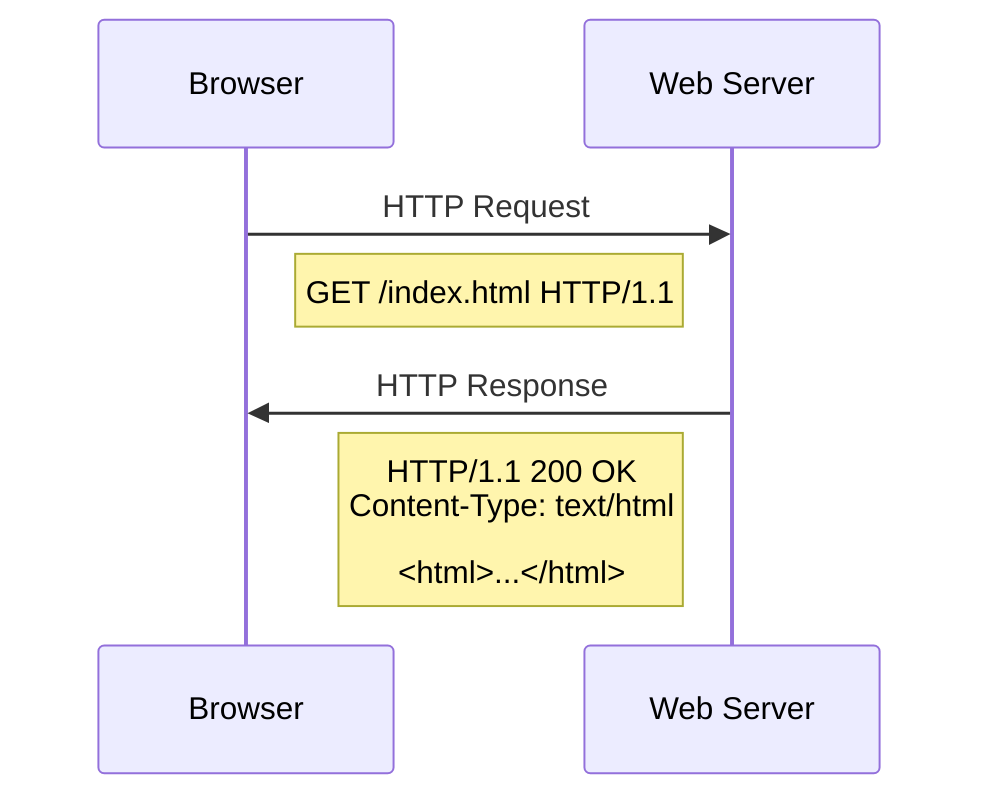

# HTTP/HTTPS: The Backbone of Web Communication

## Introduction

Have you ever wondered what happens when you type a URL into your browser and press Enter? Behind every webpage you visit lies a fundamental protocol that makes the entire World Wide Web possible: HTTP, or its secure version, HTTPS.

HTTP (Hypertext Transfer Protocol) and HTTPS (HTTP Secure) are the foundation of data communication on the web. These protocols define how messages are formatted and transmitted between clients (like your web browser) and servers (where websites are hosted).

In this guide, we'll explore how these protocols work, their differences, and why they matter for every website you build or visit.

## What is HTTP?

HTTP is a client-server protocol that operates at the application layer of the internet protocol suite. It was designed by Tim Berners-Lee in 1989 as part of his work on the World Wide Web.

### How HTTP Works

At its core, HTTP follows a simple request-response model:

1. The client (browser) sends an HTTP request to a server
2. The server processes the request
3. The server returns an HTTP response back to the client

Let's visualize this process with a diagram:



### HTTP Request Structure

An HTTP request consists of:

1. A request line (HTTP method, URL, and version)
2. Headers (metadata about the request)
3. An optional message body (for methods like POST)

Here's a basic example of an HTTP GET request:

```
GET /index.html HTTP/1.1
Host: www.example.com
User-Agent: Mozilla/5.0
Accept: text/html
```

### HTTP Methods

HTTP defines several methods (also called "verbs") that indicate the desired action to be performed:

| Method | Purpose | Example Use Case |
|--------|---------|-----------------|
| GET | Retrieve data | Loading a webpage |
| POST | Submit data | Sending form data |
| PUT | Update existing resource | Updating user profile |
| DELETE | Remove a resource | Deleting an account |
| HEAD | Same as GET but without body | Checking if resource exists |
| OPTIONS | Determine supported methods | CORS pre-flight check |
| PATCH | Partially update a resource | Updating specific fields |

### HTTP Response Structure

An HTTP response includes:

1. A status line (HTTP version, status code, and reason phrase)
2. Headers (metadata about the response)
3. The message body (often HTML, JSON, etc.)

Example of an HTTP response:

```
HTTP/1.1 200 OK
Date: Mon, 17 Mar 2025 12:28:53 GMT
Server: Apache/2.4.41 (Ubuntu)
Content-Type: text/html; charset=UTF-8
Content-Length: 138

<!DOCTYPE html>
<html>
<head>
    <title>Example Page</title>
</head>
<body>
    <h1>Hello, World!</h1>
</body>
</html>
```

### HTTP Status Codes

HTTP responses include status codes that indicate the outcome of the request:

- **1xx (Informational)**: Request received, continuing process
- **2xx (Success)**: Request successfully received, understood, and accepted
- **3xx (Redirection)**: Further action needed to complete the request
- **4xx (Client Error)**: Request contains bad syntax or cannot be fulfilled
- **5xx (Server Error)**: Server failed to fulfill a valid request

Common status codes include:

- **200 OK**: The request was successful
- **301 Moved Permanently**: The resource has been moved permanently
- **400 Bad Request**: The server couldn't understand the request
- **404 Not Found**: The requested resource doesn't exist
- **500 Internal Server Error**: Something went wrong on the server

## The Problem with HTTP: Security Concerns

While HTTP works well for basic web browsing, it has a significant drawback: all data is transmitted in plain text. This means:

1. Anyone monitoring the network can read the data
2. Data can be intercepted and modified in transit
3. There's no way to verify you're communicating with the actual server you intended

This is where HTTPS comes in.

## What is HTTPS?

HTTPS is the secure version of HTTP. It encrypts the data exchanged between the client and server using either:

- TLS (Transport Layer Security)
- SSL (Secure Sockets Layer) - though SSL is now deprecated

### How HTTPS Works

HTTPS works by adding a security layer through TLS/SSL, which provides:

1. **Encryption**: Data is encrypted so only the intended recipient can read it
2. **Data integrity**: Ensures data isn't modified during transmission
3. **Authentication**: Verifies you're communicating with the actual website you intended

The HTTPS process involves:


### TLS Handshake Explained

Before any data is exchanged, the client and server perform a TLS handshake:

1. **Client Hello**: The client sends supported cryptographic algorithms
2. **Server Hello**: The server chooses algorithms and sends its SSL certificate
3. **Authentication**: The client verifies the certificate with a Certificate Authority
4. **Key Exchange**: A secure symmetric key is established
5. **Secure Communication**: All further data is encrypted using the symmetric key

### Code Example: Making HTTP/HTTPS Requests

Let's look at how to make both HTTP and HTTPS requests in JavaScript:

```javascript
// Making an HTTP request
fetch('http://example.com/api/data')
  .then(response => response.json())
  .then(data => console.log(data))
  .catch(error => console.error('Error:', error));

// Making an HTTPS request
fetch('https://example.com/api/data')
  .then(response => response.json())
  .then(data => console.log(data))
  .catch(error => console.error('Error:', error));
```

As you can see, the only difference is the protocol in the URL (`http://` vs `https://`).

Let's also look at how to make requests in Node.js:

```javascript
const https = require('https');

https.get('https://example.com/api/data', (res) => {
  let data = '';

  res.on('data', (chunk) => {
    data += chunk;
  });

  res.on('end', () => {
    console.log(JSON.parse(data));
  });

}).on('error', (error) => {
  console.error('Error:', error);
});
```

## Practical Example: Setting Up HTTPS on a Web Server

Let's see how you might configure a basic Express.js server to use HTTPS:

```javascript
const express = require('express');
const https = require('https');
const fs = require('fs');

const app = express();

// Basic route
app.get('/', (req, res) => {
  res.send('Hello secure world!');
});

// SSL certificate options
const options = {
  key: fs.readFileSync('path/to/private-key.pem'),
  cert: fs.readFileSync('path/to/certificate.pem')
};

// Create HTTPS server
https.createServer(options, app).listen(443, () => {
  console.log('HTTPS server running on port 443');
});
```

## HTTP Headers and Security

HTTP headers play a crucial role in web security. Here are some important security-related headers:

```javascript
// Example of setting security headers in Express.js
app.use((req, res, next) => {
  // Helps prevent clickjacking
  res.setHeader('X-Frame-Options', 'DENY');
  
  // Enables strict XSS protection
  res.setHeader('X-XSS-Protection', '1; mode=block');
  
  // Prevents MIME type sniffing
  res.setHeader('X-Content-Type-Options', 'nosniff');
  
  // Enforces HTTPS
  res.setHeader('Strict-Transport-Security', 'max-age=31536000; includeSubDomains');
  
  next();
});
```

## HTTP/2 and HTTP/3: The Evolution Continues

HTTP continues to evolve:

- **HTTP/2** introduced multiplexing, server push, and header compression
- **HTTP/3** uses QUIC instead of TCP, improving performance further

These newer versions maintain compatibility with HTTP methods and status codes while improving performance.

## When to Use HTTP vs. HTTPS

| HTTP | HTTPS |
|------|-------|
| ❌ Login forms | ✅ Login forms |
| ❌ Credit card info | ✅ Credit card info |
| ❌ Personal data | ✅ Personal data |
| ❌ E-commerce | ✅ E-commerce |
| ✅ Public, non-sensitive information* | ✅ All websites (recommended) |

*Note: Most modern websites use HTTPS for all content, regardless of sensitivity.

## Common Pitfalls and How to Avoid Them

1. **Mixed Content**: Loading resources via HTTP on an HTTPS page
   ```javascript
   // Incorrect (mixed content)
   const img = document.createElement('img');
   img.src = 'http://example.com/image.jpg'; // HTTP resource on HTTPS page
   
   // Correct
   img.src = 'https://example.com/image.jpg'; // HTTPS resource
   // OR use protocol-relative URLs
   img.src = '//example.com/image.jpg'; // Inherits the current protocol
   ```

2. **Missing Security Headers**
3. **Certificate Issues**: Using expired or self-signed certificates
4. **Not Redirecting HTTP to HTTPS**

## Summary

HTTP and HTTPS are fundamental protocols that power the web:

- **HTTP** provides a standardized way for clients and servers to communicate
- **HTTPS** adds encryption, data integrity, and authentication through TLS/SSL
- Modern websites should default to HTTPS for all communications
- Understanding these protocols is essential for web developers

## Practice Exercises

1. Use browser developer tools to examine HTTP headers on a popular website
2. Write a simple server that redirects all HTTP traffic to HTTPS
3. Test your website for security headers using online tools
4. Try to implement a basic fetch request to a public API using both HTTP and HTTPS

## Additional Resources

- [MDN Web Docs: HTTP](https://developer.mozilla.org/en-US/docs/Web/HTTP)
- [Let's Encrypt](https://letsencrypt.org/) - Free SSL certificates
- [SSL Labs](https://www.ssllabs.com/ssltest/) - Test your HTTPS implementation
- [Security Headers](https://securityheaders.com/) - Check your website's security headers