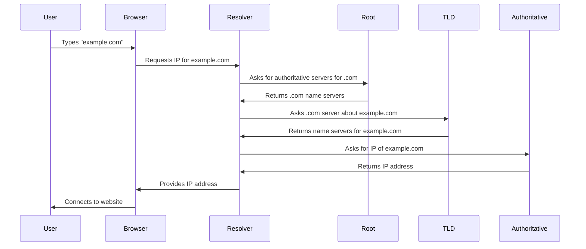
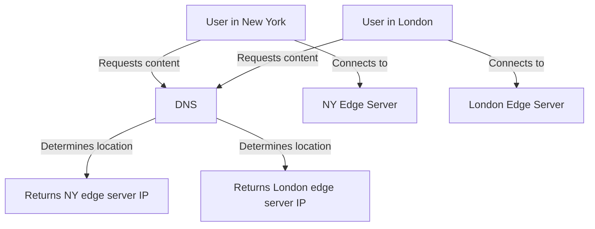

# DNS (Domain Name System)

## Introduction

The Domain Name System (DNS) is one of the fundamental technologies that makes the internet usable for humans. Think of it as the internet's phone book - it translates human-friendly domain names like `google.com` into machine-friendly IP addresses like `142.250.190.78` that computers use to identify each other on a network.

Without DNS, you would need to memorize numerical IP addresses for every website you want to visit. Instead, DNS allows you to type memorable domain names while it handles the conversion to IP addresses behind the scenes.

## How DNS Works

### The Basic Concept

At its core, DNS is a distributed, hierarchical database that maps domain names to IP addresses. Let's break down what happens when you type a URL in your browser:



### The DNS Hierarchy

DNS uses a hierarchical structure consisting of different levels:

1. **Root Domain** - Represented by a dot (`.`)
2. **Top-Level Domains (TLDs)** - Such as `.com`, `.org`, `.net`, etc.
3. **Second-Level Domains** - Like `example` in `example.com`
4. **Subdomains** - Such as `blog` in `blog.example.com`

### Types of DNS Servers

Several types of DNS servers work together in this system:

- **DNS Resolver**: Your ISP's server that receives your queries
- **Root Servers**: Direct queries to the appropriate TLD servers
- **TLD Servers**: Manage information for domains under specific TLDs
- **Authoritative Servers**: Have definitive information about specific domains

## DNS Records

DNS doesn't just store IP addresses. It contains various types of records:

| Record Type | Description | Example Use |
|-------------|-------------|-------------|
| A | Maps a domain to an IPv4 address | Website hosting |
| AAAA | Maps a domain to an IPv6 address | Modern website hosting |
| CNAME | Creates an alias from one domain to another | Redirecting subdomains |
| MX | Specifies mail servers for the domain | Email routing |
| TXT | Stores text information | SPF, DKIM for email security |
| NS | Delegates a domain to specific name servers | DNS management |
| SOA | Contains administrative information | Zone transfers |
| PTR | Reverse mapping (IP to domain) | Reverse DNS lookups |

## Working with DNS Programmatically

### Using DNS in Python

Python's `socket` library allows for basic DNS lookups:

```python
import socket

# Get IP address from domain name
domain = "google.com"
ip_address = socket.gethostbyname(domain)
print(f"The IP address of {domain} is {ip_address}")

# Output: The IP address of google.com is 142.250.190.78
```

For more advanced DNS operations, you can use the `dnspython` library:

```python
import dns.resolver

# Look up MX records
result = dns.resolver.resolve('gmail.com', 'MX')
for exchange in result:
    print(f"Priority: {exchange.preference}, Mail server: {exchange.exchange}")

# Output:
# Priority: 10, Mail server: alt1.gmail-smtp-in.l.google.com.
# Priority: 20, Mail server: alt2.gmail-smtp-in.l.google.com.
# (and possibly more records)
```

### Using DNS in JavaScript (Node.js)

Node.js provides DNS functionality through its built-in `dns` module:

```javascript
const dns = require('dns');

// Lookup IP address
dns.lookup('github.com', (err, address, family) => {
  if (err) throw err;
  console.log(`IP address: ${address}`);
  console.log(`IP version: IPv${family}`);
});

// Resolve all A records
dns.resolve('github.com', 'A', (err, addresses) => {
  if (err) throw err;
  console.log('IP addresses:');
  addresses.forEach(addr => console.log(addr));
});
```

## Common DNS Issues and Troubleshooting

### DNS Propagation

When you update DNS records, changes don't take effect immediately everywhere. This delay is called DNS propagation and can take from a few minutes to 48 hours, depending on the TTL (Time To Live) settings.

### DNS Cache Poisoning

DNS cache poisoning occurs when false information is introduced into a DNS resolver's cache, causing it to return incorrect IP addresses and potentially redirecting users to malicious websites.

### Troubleshooting DNS Issues

Here are some common commands for troubleshooting DNS:

```bash
# Check if a domain resolves to an IP
ping example.com

# Query DNS records
nslookup example.com

# Detailed DNS information
dig example.com

# Check DNS propagation
dig +trace example.com
```

## Real-World Applications

### Content Delivery Networks (CDNs)

CDNs use DNS to route users to the nearest server. When you request content from a CDN-enabled website, DNS directs you to the edge server closest to you geographically:



### DNS-Based Load Balancing

DNS can distribute traffic across multiple servers by rotating different IP addresses in response to DNS queries:

```python
# Simplified example of DNS load balancing logic
def dns_respond(domain):
    if domain == "api.example.com":
        # Round-robin between three servers
        servers = ["192.168.1.10", "192.168.1.11", "192.168.1.12"]
        return servers[request_count % len(servers)]
```

### Domain Verification

Many services use DNS for domain ownership verification:

1. The service asks you to add a specific TXT record to your domain
2. You add the record through your DNS provider
3. The service checks for the record to verify you control the domain

## Advanced DNS Concepts

### DNSSEC (DNS Security Extensions)

DNSSEC adds security to the DNS protocol by providing:
- Authentication to verify DNS data wasn't modified
- Data integrity checking
- Authenticated denial of existence

### DNS over HTTPS (DoH) and DNS over TLS (DoT)

These protocols encrypt DNS queries to protect privacy and prevent eavesdropping or manipulation.

```javascript
// Example of using DoH in modern browsers
const dnsPromises = require('dns').promises;

async function secureResolve(domain) {
  try {
    // Set the DoH resolver
    const resolver = new dnsPromises.Resolver();
    resolver.setServers(['https://cloudflare-dns.com/dns-query']);
    
    const addresses = await resolver.resolve4(domain);
    return addresses;
  } catch (err) {
    console.error('Error:', err);
  }
}
```

## Summary

DNS is a crucial part of the internet infrastructure that:
- Translates human-readable domain names to machine-readable IP addresses
- Uses a hierarchical, distributed database structure for resilience
- Contains multiple record types for different purposes
- Plays a vital role in services like CDNs, load balancing, and email

Understanding DNS is fundamental to working with computer networks and web applications. As a developer, you'll frequently interact with DNS when deploying applications, configuring servers, or troubleshooting network issues.

## Practice Exercises

1. Use the `dig` or `nslookup` commands to find the MX records for your favorite email provider.
2. Write a script that resolves multiple domain names to IP addresses and measures the response time.
3. Set up a simple local DNS server using dnsmasq (Linux/Mac) or DNS Server role (Windows).
4. Create a program that checks if a domain's DNS settings are correctly configured for email delivery (by checking SPF, DKIM, and DMARC records).
5. Research how to implement DNS-based geolocation in a web application.

## Additional Resources

- [RFC 1034](https://tools.ietf.org/html/rfc1034) - Domain Names - Concepts and Facilities
- [RFC 1035](https://tools.ietf.org/html/rfc1035) - Domain Names - Implementation and Specification
- [DNS and BIND](https://www.oreilly.com/library/view/dns-and-bind/0596100574/) - The definitive guide to DNS
- [DNSdumpster](https://dnsdumpster.com/) - DNS reconnaissance tool
- [DNSpython Documentation](https://dnspython.readthedocs.io/) - For Python DNS programming