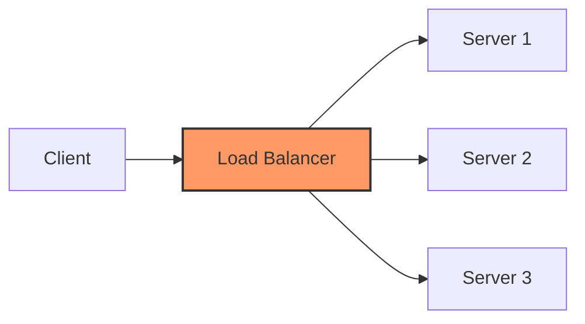
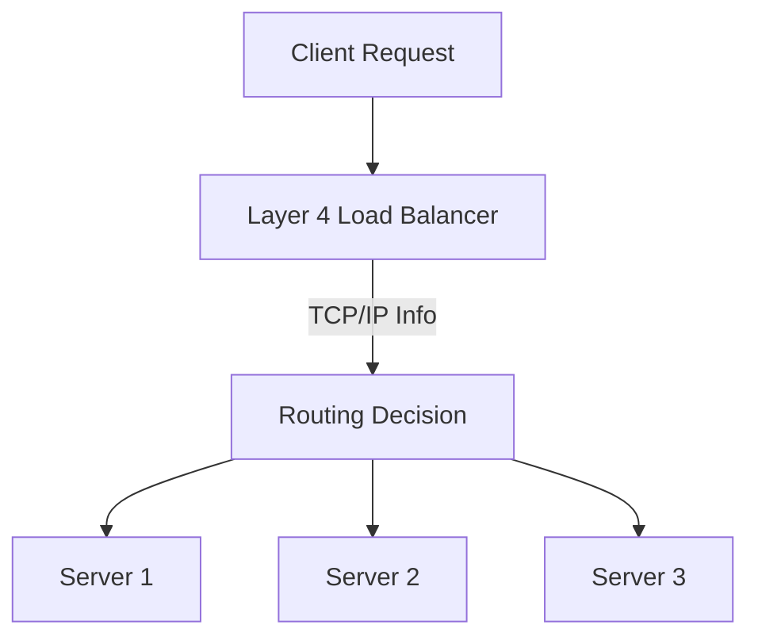
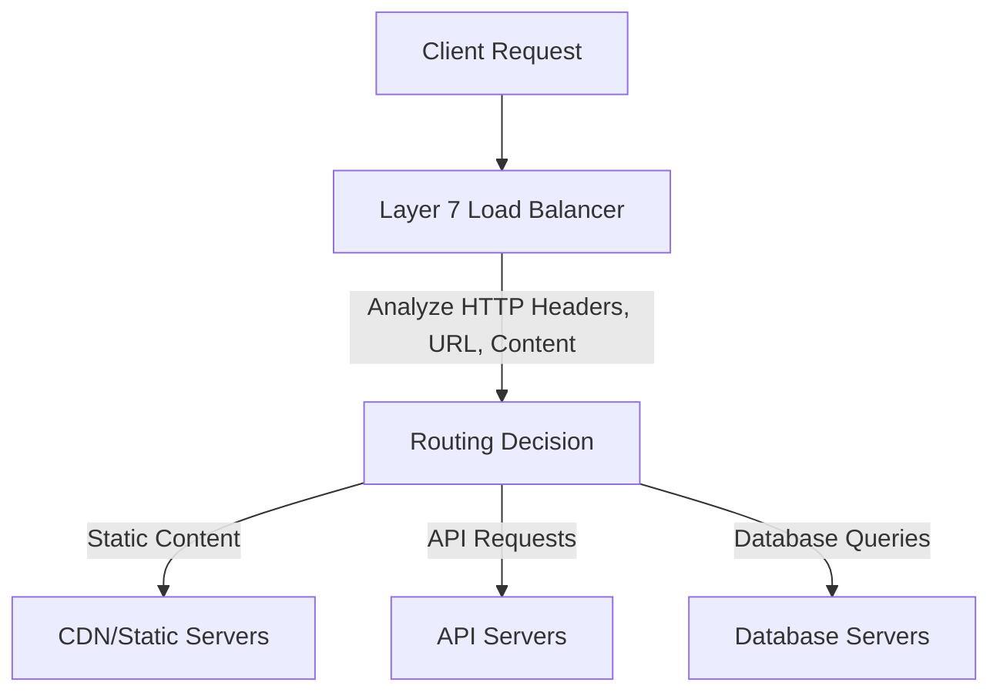
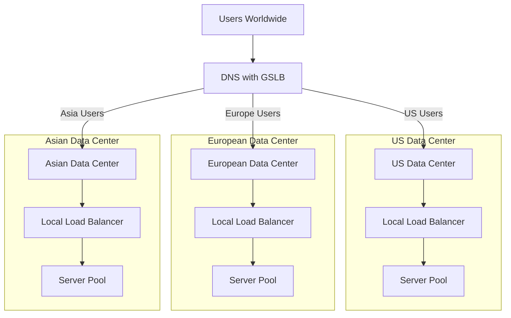

# Load Balancing

## Introduction

Load balancing is a critical concept in computer networks that distributes incoming network traffic across multiple servers or resources. Think of it as the traffic controller at a busy intersection, directing vehicles to ensure no single road becomes congested. In computing, load balancers help maintain application availability, reliability, and scalability by preventing any single server from becoming a bottleneck.

As websites and applications grow in popularity, a single server often can't handle all the traffic. Load balancing solves this problem by intelligently distributing requests across a group of backend servers, also known as a server pool or server farm.

## Why Load Balancing Matters

Load balancing provides several key benefits:

- **High Availability**: If one server fails, the load balancer redirects traffic to the remaining online servers
- **Scalability**: You can easily add or remove servers as demand changes
- **Efficiency**: Optimizes resource use, maximizes throughput, and minimizes response time
- **Security**: Some load balancers provide security features like DDoS protection

## How Load Balancing Works

At a fundamental level, load balancers sit between client devices and backend servers, receiving and then distributing incoming requests to any available server capable of fulfilling them.



When a load balancer receives a request, it must decide which server should handle it. This decision is made using various algorithms, which we'll explore next.

## Load Balancing Algorithms

The method used to distribute traffic across servers is determined by load balancing algorithms. Here are the most common ones:

### Round Robin

The simplest method, rotating requests across the server group in sequential order.

```javascript
class RoundRobinLoadBalancer {
    constructor(servers) {
        this.servers = servers;
        this.currentIndex = 0;
    }
    
    getNextServer() {
        // Select the next server
        const server = this.servers[this.currentIndex];
        
        // Increment the index
        this.currentIndex = (this.currentIndex + 1) % this.servers.length;
        
        return server;
    }
}

// Example usage
const servers = ['server1', 'server2', 'server3'];
const loadBalancer = new RoundRobinLoadBalancer(servers);

console.log(loadBalancer.getNextServer()); // Output: server1
console.log(loadBalancer.getNextServer()); // Output: server2
console.log(loadBalancer.getNextServer()); // Output: server3
console.log(loadBalancer.getNextServer()); // Output: server1 (starts over)
```

### Least Connections

Directs traffic to the server with the fewest active connections, useful when requests may require varying processing time.

```javascript
class LeastConnectionsLoadBalancer {
    constructor(servers) {
        // Initialize each server with 0 connections
        this.serverConnections = {};
        servers.forEach(server => {
            this.serverConnections[server] = 0;
        });
    }
    
    getNextServer() {
        // Find server with least connections
        let minConnections = Infinity;
        let selectedServer = null;
        
        for (const [server, connections] of Object.entries(this.serverConnections)) {
            if (connections < minConnections) {
                minConnections = connections;
                selectedServer = server;
            }
        }
        
        // Increment connection count for selected server
        this.serverConnections[selectedServer]++;
        
        return selectedServer;
    }
    
    closeConnection(server) {
        // Decrement connection count when a connection completes
        if (this.serverConnections[server] > 0) {
            this.serverConnections[server]--;
        }
    }
}
```

### IP Hash

Uses the client's IP address to determine which server receives the request, ensuring that a client is consistently directed to the same server.

```javascript
class IpHashLoadBalancer {
    constructor(servers) {
        this.servers = servers;
    }
    
    getServerForIp(ipAddress) {
        // Simple hash function for the IP address
        const hash = this.hashIp(ipAddress);
        
        // Use the hash to determine server index
        const serverIndex = hash % this.servers.length;
        
        return this.servers[serverIndex];
    }
    
    hashIp(ipAddress) {
        // Simple hash function (in real implementations, more robust algorithms are used)
        let hash = 0;
        for (let i = 0; i < ipAddress.length; i++) {
            hash = (hash * 31 + ipAddress.charCodeAt(i)) & 0xFFFFFFFF;
        }
        return Math.abs(hash);
    }
}

// Example usage
const servers = ['server1', 'server2', 'server3'];
const loadBalancer = new IpHashLoadBalancer(servers);

console.log(loadBalancer.getServerForIp('192.168.1.1')); // Output: server2 (example)
console.log(loadBalancer.getServerForIp('192.168.1.2')); // Output: server1 (example)
console.log(loadBalancer.getServerForIp('192.168.1.1')); // Output: server2 (same as first call)
```

### Weighted Round Robin

Similar to Round Robin but assigns different weights to servers based on their capacity or performance.

```javascript
class WeightedRoundRobinLoadBalancer {
    constructor(serverWeights) {
        this.serverWeights = serverWeights; // { serverName: weight }
        this.currentIndex = 0;
        this.servers = [];
        
        // Create array with servers repeated according to their weights
        for (const [server, weight] of Object.entries(serverWeights)) {
            for (let i = 0; i < weight; i++) {
                this.servers.push(server);
            }
        }
    }
    
    getNextServer() {
        const server = this.servers[this.currentIndex];
        this.currentIndex = (this.currentIndex + 1) % this.servers.length;
        return server;
    }
}

// Example usage
const serverWeights = {
    'server1': 5,  // Higher weight, gets more traffic
    'server2': 3,
    'server3': 1   // Lower weight, gets less traffic
};

const loadBalancer = new WeightedRoundRobinLoadBalancer(serverWeights);
```

### Least Response Time

Directs traffic to the server with the lowest response time, which indicates the fastest server.

## Types of Load Balancers

Load balancers operate at different layers of the OSI network model:

### Layer 4 Load Balancing (Transport Layer)

- Makes routing decisions based on IP address and TCP/UDP ports
- Simple and efficient but lacks application awareness
- Lower overhead since it doesn't inspect packet content



### Layer 7 Load Balancing (Application Layer)

- Makes decisions based on content of the request (HTTP headers, URLs, cookies)
- More intelligent routing but higher overhead
- Can perform SSL termination, handle HTTP requests directly



## Load Balancer Implementation Examples

Let's look at how to implement a simple load balancer in Node.js:

```javascript
const http = require('http');
const httpProxy = require('http-proxy');

// Create a proxy server
const proxy = httpProxy.createProxyServer({});

// List of backend servers
const backends = [
  { host: 'localhost', port: 3001 },
  { host: 'localhost', port: 3002 },
  { host: 'localhost', port: 3003 }
];

let currentBackendIndex = 0;

// Create the load balancer server
const server = http.createServer((req, res) => {
  // Get the next backend using Round Robin
  const backend = backends[currentBackendIndex];
  
  // Update the index for the next request
  currentBackendIndex = (currentBackendIndex + 1) % backends.length;
  
  // Proxy the request to the selected backend
  proxy.web(req, res, { 
    target: `http://${backend.host}:${backend.port}`
  });
});

// Handle proxy errors
proxy.on('error', (err, req, res) => {
  console.error('Proxy error:', err);
  res.writeHead(500, { 'Content-Type': 'text/plain' });
  res.end('Proxy error');
});

// Start the server on port 80
server.listen(80, () => {
  console.log('Load balancer running on port 80');
});
```

## Real-World Load Balancing Solutions

### Hardware Load Balancers

Physical devices dedicated to load balancing, often used in enterprise environments:
- F5 BIG-IP
- Citrix ADC (formerly NetScaler)
- A10 Networks

### Software Load Balancers

Software implementations that can run on standard hardware:
- NGINX
- HAProxy
- Apache Traffic Server

### Cloud Load Balancing Services

Managed services provided by cloud providers:
- AWS Elastic Load Balancing (ELB)
- Google Cloud Load Balancing
- Azure Load Balancer

Let's look at how to configure a simple NGINX load balancer:

```nginx
http {
    upstream backend {
        # Round Robin is the default algorithm
        server backend1.example.com;
        server backend2.example.com;
        server backend3.example.com;
        
        # For Least Connections, uncomment:
        # least_conn;
        
        # For IP Hash, uncomment:
        # ip_hash;
    }
    
    server {
        listen 80;
        server_name example.com;
        
        location / {
            proxy_pass http://backend;
            proxy_set_header Host $host;
            proxy_set_header X-Real-IP $remote_addr;
        }
    }
}
```

## Session Persistence and Sticky Sessions

Sometimes it's important for a client to consistently connect to the same backend server, particularly for applications that maintain session state. This is accomplished through:

### Sticky Sessions

The load balancer uses cookies or other mechanisms to route a client to the same server for subsequent requests.

```nginx
upstream backend {
    server backend1.example.com;
    server backend2.example.com;
    
    # Enable sticky sessions based on IP
    ip_hash;
    
    # Alternative: cookie-based stickiness
    # sticky cookie srv_id expires=1h domain=.example.com path=/;
}
```

### Session Replication

Session data is replicated across all servers, so any server can handle any request regardless of which server handled previous requests.

## Load Balancer Health Checks

To maintain high availability, load balancers regularly check the health of backend servers:

```javascript
class LoadBalancerWithHealthChecks {
    constructor(servers, checkInterval = 5000) {
        this.servers = servers;
        this.healthyServers = [...servers];
        this.currentIndex = 0;
        
        // Start health checks
        setInterval(() => this.performHealthChecks(), checkInterval);
    }
    
    async performHealthChecks() {
        this.healthyServers = [];
        
        for (const server of this.servers) {
            try {
                const healthy = await this.checkServerHealth(server);
                if (healthy) {
                    this.healthyServers.push(server);
                }
            } catch (error) {
                console.error(`Health check failed for ${server}:`, error);
            }
        }
        
        console.log(`Healthy servers: ${this.healthyServers.length}/${this.servers.length}`);
    }
    
    async checkServerHealth(server) {
        // In a real implementation, this would make an HTTP request to a health endpoint
        // Simplified example:
        return new Promise((resolve) => {
            // Simulate a health check with 90% success rate
            const healthy = Math.random() < 0.9;
            setTimeout(() => resolve(healthy), 100);
        });
    }
    
    getNextServer() {
        if (this.healthyServers.length === 0) {
            throw new Error("No healthy servers available");
        }
        
        const server = this.healthyServers[this.currentIndex];
        this.currentIndex = (this.currentIndex + 1) % this.healthyServers.length;
        return server;
    }
}
```

## Global Server Load Balancing (GSLB)

GSLB extends load balancing across multiple data centers, providing:
- Geographic distribution of traffic
- Disaster recovery capabilities
- Reduced latency by directing users to the nearest data center



## Summary

Load balancing is a fundamental technique for building scalable, reliable network applications. It distributes traffic across multiple servers, preventing any single point of failure and ensuring optimal resource utilization. The key components of a load balancing system include:

1. The load balancer itself (hardware, software, or cloud service)
2. A pool of backend servers
3. Load balancing algorithms to distribute traffic
4. Health checks to ensure server availability
5. Optional features like session persistence and SSL termination

As your applications grow, implementing proper load balancing becomes increasingly important for maintaining performance and reliability.

## Exercises

1. **Basic Implementation**: Create a simple round-robin load balancer in your preferred programming language.

2. **Algorithm Comparison**: Write a simulation that compares the efficiency of different load balancing algorithms under various traffic patterns.

3. **Health Check Design**: Design a robust health checking system that can detect various types of server failures.

4. **Research Project**: Compare the features and performance of three popular load balancing solutions (e.g., NGINX, HAProxy, and AWS ELB).

5. **Advanced Challenge**: Implement a load balancer that dynamically adjusts server weights based on response times.

## Additional Resources

- **Books**: 
  - "Load Balancing in the Cloud" by Richard Seroter
  - "NGINX Cookbook" by Derek DeJonghe

- **Online Documentation**:
  - NGINX Load Balancing Guide
  - HAProxy Configuration Manual
  - AWS Elastic Load Balancing Documentation

- **Courses**:
  - Cloud Architecture courses on major learning platforms
  - Network Engineering certifications that cover load balancing concepts

Happy load balancing!