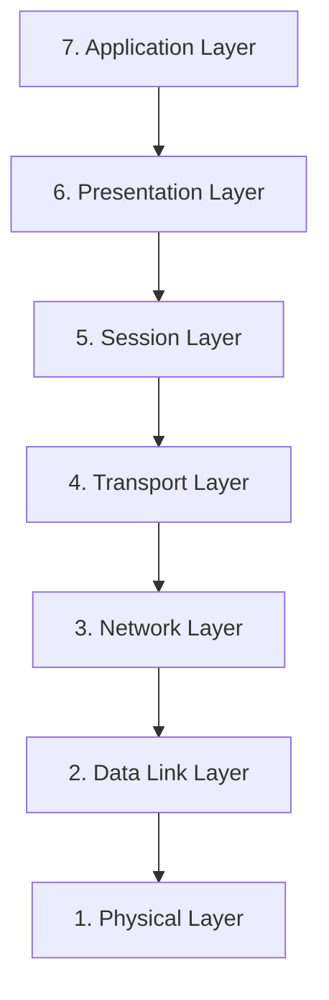
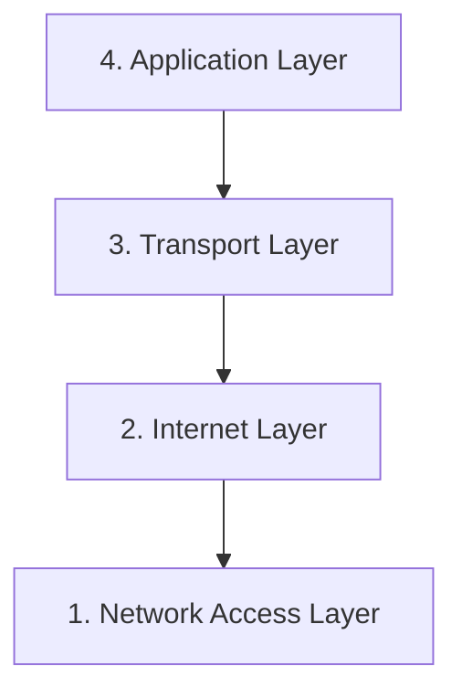
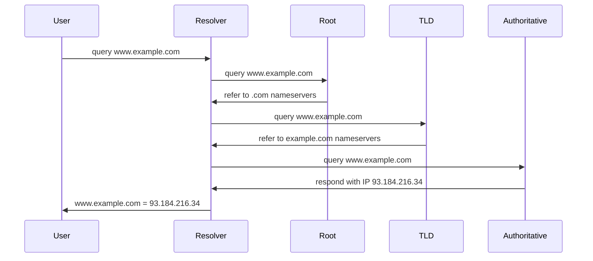
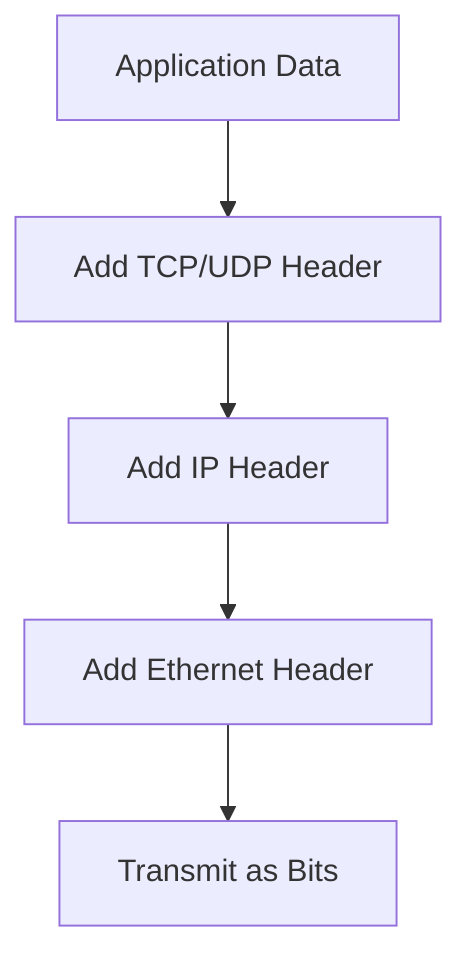

# Networking Protocols

## Introduction

Networking protocols are the digital language that computers use to communicate with each other across networks. Think of them as the rules and procedures that govern how data is transmitted, received, and processed between devices. Just as humans need common languages and communication rules to understand each other, computers need standardized protocols to exchange information effectively.

In this guide, we'll explore the fundamental networking protocols that form the backbone of the internet and modern computer networks. Whether you're browsing websites, sending emails, or streaming videos, these protocols are working behind the scenes to make it all possible.

## What Are Networking Protocols?

A networking protocol is a set of rules that determines how data is transmitted between devices on a network. These protocols define various aspects of communication, including:

- **Data Format**: How information is structured for transmission
- **Addressing**: How devices are identified on the network
- **Routing**: How data finds its path from source to destination
- **Error Handling**: How to detect and recover from transmission errors
- **Flow Control**: How to manage the rate of data transmission
- **Authentication**: How to verify the identity of communicating parties

## The OSI Model and TCP/IP Model

To understand networking protocols, it's helpful to first grasp the conceptual frameworks that organize them. Two important models are the OSI (Open Systems Interconnection) model and the TCP/IP model.

### The OSI Model

The OSI model divides network communication into seven layers, each with specific functions:



### The TCP/IP Model

The TCP/IP model simplifies the OSI model into four layers:



## Key Networking Protocols

Let's explore some of the most important networking protocols:

### 1. Internet Protocol (IP)

IP is the fundamental protocol for routing packets across networks. It provides addressing and routing capabilities.

There are two versions currently in use:
- **IPv4**: Uses 32-bit addresses (e.g., `192.168.1.1`)
- **IPv6**: Uses 128-bit addresses (e.g., `2001:0db8:85a3:0000:0000:8a2e:0370:7334`)

**Code example (Node.js):**

```javascript
const os = require('os');

// Get network interfaces
const networkInterfaces = os.networkInterfaces();

console.log('Your IP addresses:');
for (const interfaceName in networkInterfaces) {
  const interfaces = networkInterfaces[interfaceName];
  for (const iface of interfaces) {
    // Skip internal interfaces
    if (iface.internal) continue;
    
    console.log(`Interface: ${interfaceName}`);
    console.log(`  Address: ${iface.address}`);
    console.log(`  Family: IPv${iface.family === 'IPv4' ? '4' : '6'}`);
    console.log(`  Netmask: ${iface.netmask}`);
  }
}
```

**Sample output:**
```
Your IP addresses:
Interface: eth0
  Address: 192.168.1.15
  Family: IPv4
  Netmask: 255.255.255.0
Interface: eth0
  Address: 2001:0db8:85a3:0000:0000:8a2e:0370:7334
  Family: IPv6
  Netmask: ffff:ffff:ffff:ffff:0000:0000:0000:0000
```

### 2. Transmission Control Protocol (TCP)

TCP provides reliable, ordered, and error-checked delivery of data between applications. It establishes a connection before transmitting data and ensures all packets arrive correctly.

**Key features:**
- Connection-oriented
- Reliable data transfer
- Flow control
- Congestion control

**Code example (Python):**

```python
import socket

# Create a TCP socket
server = socket.socket(socket.AF_INET, socket.SOCK_STREAM)

# Bind to an address and port
server.bind(('127.0.0.1', 8080))

# Listen for incoming connections
server.listen(5)
print("Server listening on port 8080...")

# Accept a connection
client, address = server.accept()
print(f"Connection established with {address}")

# Receive data
data = client.recv(1024)
print(f"Received: {data.decode('utf-8')}")

# Send a response
client.send("Hello from server!".encode('utf-8'))

# Close the connection
client.close()
server.close()
```

### 3. User Datagram Protocol (UDP)

UDP is a connectionless protocol that prioritizes speed over reliability. It's commonly used for real-time applications like video streaming and online gaming.

**Key features:**
- Connectionless
- No guarantee of delivery
- No congestion control
- Lower latency than TCP

**Code example (Python):**

```python
import socket

# Create a UDP socket
server = socket.socket(socket.AF_INET, socket.SOCK_DGRAM)

# Bind to an address and port
server.bind(('127.0.0.1', 8080))
print("UDP server listening on port 8080...")

# Receive data
data, address = server.recvfrom(1024)
print(f"Received from {address}: {data.decode('utf-8')}")

# Send a response
server.sendto("Hello from UDP server!".encode('utf-8'), address)

# Close the socket
server.close()
```

### 4. Hypertext Transfer Protocol (HTTP)

HTTP is the foundation of data communication on the World Wide Web. It defines how messages are formatted and transmitted between web clients and servers.

**Example HTTP Request:**

```
GET /index.html HTTP/1.1
Host: www.example.com
User-Agent: Mozilla/5.0
Accept: text/html
```

**Example HTTP Response:**

```
HTTP/1.1 200 OK
Content-Type: text/html
Content-Length: 1234

<!DOCTYPE html>
<html>
<head>
    <title>Example Page</title>
</head>
<body>
    <h1>Hello, World!</h1>
</body>
</html>
```

**Code example (JavaScript):**

```javascript
// Using the Fetch API to make an HTTP request
fetch('https://api.example.com/data')
  .then(response => {
    if (!response.ok) {
      throw new Error('Network response was not ok');
    }
    return response.json();
  })
  .then(data => {
    console.log('Retrieved data:', data);
  })
  .catch(error => {
    console.error('Error fetching data:', error);
  });
```

### 5. Domain Name System (DNS)

DNS translates human-readable domain names (like www.example.com) into IP addresses that computers use to identify each other.



**Code example (Python):**

```python
import socket

# Perform DNS lookup
def dns_lookup(domain):
    try:
        ip_address = socket.gethostbyname(domain)
        return ip_address
    except socket.gaierror:
        return "DNS resolution failed"

# Test with some domains
domains = ["google.com", "github.com", "example.com"]

for domain in domains:
    ip = dns_lookup(domain)
    print(f"Domain: {domain} → IP: {ip}")
```

**Sample output:**
```
Domain: google.com → IP: 142.250.190.78
Domain: github.com → IP: 20.207.73.82
Domain: example.com → IP: 93.184.216.34
```

## Application-Layer Protocols

These protocols operate at the highest level of the network stack and directly interact with applications:

### 1. Simple Mail Transfer Protocol (SMTP)

SMTP is used for sending email messages between servers.

**Basic SMTP communication:**

```
CLIENT: HELO client.example.com
SERVER: 250 Hello client.example.com
CLIENT: MAIL FROM:<sender@example.com>
SERVER: 250 OK
CLIENT: RCPT TO:<recipient@example.com>
SERVER: 250 OK
CLIENT: DATA
SERVER: 354 Start mail input; end with <CRLF>.<CRLF>
CLIENT: From: Sender <sender@example.com>
CLIENT: To: Recipient <recipient@example.com>
CLIENT: Subject: Test Email
CLIENT: 
CLIENT: This is a test email.
CLIENT: .
SERVER: 250 OK
CLIENT: QUIT
SERVER: 221 Bye
```

### 2. File Transfer Protocol (FTP)

FTP is used to transfer files between a client and server.

**Code example (Python):**

```python
from ftplib import FTP

# Connect to an FTP server
ftp = FTP('ftp.example.com')
ftp.login(user='username', passwd='password')

# List files in the current directory
files = ftp.nlst()
print("Files in directory:", files)

# Download a file
with open('downloaded_file.txt', 'wb') as file:
    ftp.retrbinary('RETR example.txt', file.write)

# Upload a file
with open('local_file.txt', 'rb') as file:
    ftp.storbinary('STOR remote_file.txt', file)

# Close the connection
ftp.quit()
```

### 3. Secure Shell (SSH)

SSH provides a secure channel over an unsecured network, commonly used for remote login and command execution.

**Code example (Python using Paramiko):**

```python
import paramiko

# Create an SSH client
ssh = paramiko.SSHClient()
ssh.set_missing_host_key_policy(paramiko.AutoAddPolicy())

# Connect to the server
ssh.connect('ssh.example.com', username='user', password='password')

# Execute a command
stdin, stdout, stderr = ssh.exec_command('ls -la')

# Print the output
print(stdout.read().decode())

# Close the connection
ssh.close()
```

## Protocol Encapsulation

When data travels through the network stack, each layer adds its own header information. This process is called encapsulation.



At the receiving end, the headers are processed and removed in reverse order (decapsulation).

## Real-World Applications

### Example 1: What Happens When You Visit a Website

Let's trace the protocols involved when you visit `www.example.com`:

1. **DNS (Domain Name System)**:
   - Your browser needs to find the IP address for `www.example.com`
   - It sends a DNS query to your configured DNS server
   - The DNS server returns the IP address (e.g., `93.184.216.34`)

2. **TCP (Transmission Control Protocol)**:
   - Your browser establishes a TCP connection to port 80 (or port 443 for HTTPS) on the server at `93.184.216.34`
   - The three-way handshake occurs: SYN → SYN-ACK → ACK

3. **HTTP/HTTPS (Hypertext Transfer Protocol)**:
   - Your browser sends an HTTP GET request for the webpage
   - The web server processes the request and returns an HTTP response containing the HTML content
   - Your browser renders the HTML content

4. **Additional Protocols**:
   - If the page contains images, scripts, or other resources, your browser makes additional HTTP requests for those resources
   - These connections may use parallel TCP connections for efficiency

### Example 2: Network Diagnostic Tools

Understanding networking protocols helps when troubleshooting network issues. Let's look at some common tools:

**Using `ping` to test connectivity (ICMP protocol):**

```bash
$ ping google.com
PING google.com (142.250.190.78): 56 data bytes
64 bytes from 142.250.190.78: icmp_seq=0 ttl=115 time=15.347 ms
64 bytes from 142.250.190.78: icmp_seq=1 ttl=115 time=14.982 ms
64 bytes from 142.250.190.78: icmp_seq=2 ttl=115 time=14.579 ms
```

**Using `traceroute` to track the path of packets (ICMP, UDP, or TCP):**

```bash
$ traceroute google.com
traceroute to google.com (142.250.190.78), 30 hops max, 60 byte packets
 1  router.home (192.168.1.1)  3.171 ms  3.154 ms  3.136 ms
 2  192.0.2.1 (192.0.2.1)  15.807 ms  15.789 ms  15.772 ms
 3  10.0.0.1 (10.0.0.1)  15.754 ms  15.737 ms  15.719 ms
 # ... more hops ...
 8  142.250.190.78 (142.250.190.78)  15.609 ms  15.591 ms  15.573 ms
```

**Using `nslookup` to query DNS records:**

```bash
$ nslookup google.com
Server:		192.168.1.1
Address:	192.168.1.1#53

Non-authoritative answer:
Name:	google.com
Address: 142.250.190.78
```

## Common Networking Ports

Specific ports are associated with certain protocols:

| Protocol | Port | Description |
|----------|------|-------------|
| HTTP     | 80   | Web browsing |
| HTTPS    | 443  | Secure web browsing |
| FTP      | 21   | File transfer control |
| SMTP     | 25   | Email sending |
| POP3     | 110  | Email retrieval |
| IMAP     | 143  | Email retrieval (with synchronization) |
| SSH      | 22   | Secure shell |
| DNS      | 53   | Domain name resolution |
| DHCP     | 67/68| Dynamic host configuration |

## Security Considerations

When implementing or using networking protocols, consider these security best practices:

1. **Use Encrypted Protocols**: 
   - Choose HTTPS over HTTP
   - Use SFTP or FTPS instead of FTP
   - Prefer SSH over Telnet
   
2. **Implement Authentication**:
   - Use strong passwords or certificate-based authentication
   - Consider multi-factor authentication for sensitive systems
   
3. **Keep Software Updated**:
   - Apply security patches promptly
   - Update protocol implementations to address vulnerabilities
   
4. **Use Firewalls and Access Controls**:
   - Restrict access to specific ports and services
   - Implement principle of least privilege

## Summary

Networking protocols are the essential building blocks that enable communication between devices on a network. In this guide, we've explored:

- **What protocols are** and how they organize into the OSI and TCP/IP models
- **Key networking protocols** like IP, TCP, UDP, HTTP, and DNS
- **Application-level protocols** such as SMTP, FTP, and SSH
- **How protocols work together** in real-world scenarios
- **Security considerations** when implementing protocols

Understanding these protocols provides the foundation for deeper learning in networking, cybersecurity, and web development. As you continue your journey, you'll encounter many more specialized protocols that build upon these fundamentals.

## Exercises

1. **Basic Protocol Identification**:
   - Identify which protocol would be most appropriate for each scenario:
     - Streaming a live video
     - Securely transferring a sensitive file
     - Looking up a website's IP address
     - Ensuring all data in a bank transaction arrives correctly

2. **Protocol Implementation**:
   - Create a simple client-server application using sockets in your preferred programming language
   - Implement both TCP and UDP versions and compare their performance and reliability

3. **Network Analysis**:
   - Install a packet analyzer tool like Wireshark
   - Capture and analyze the protocols used when visiting a website
   - Identify the different protocols in action and their sequence

4. **Protocol Research**:
   - Choose a specialized protocol not covered in this guide (e.g., MQTT, WebRTC, or gRPC)
   - Research its purpose, key features, and common use cases
   - Write a brief summary of how it relates to the protocols covered here

## Additional Resources

- **Books**:
  - "Computer Networking: A Top-Down Approach" by James Kurose and Keith Ross
  - "TCP/IP Illustrated" by Richard Stevens
  
- **Online Courses**:
  - Stanford's "Introduction to Computer Networking"
  - Coursera's "Computer Communications" specialization
  
- **Tools**:
  - Wireshark for packet analysis
  - Postman for API testing
  - Netcat for simple TCP/UDP testing
  
- **RFCs (Request for Comments)**:
  - These are the official documents that define internet protocols
  - Available at the IETF website (ietf.org)