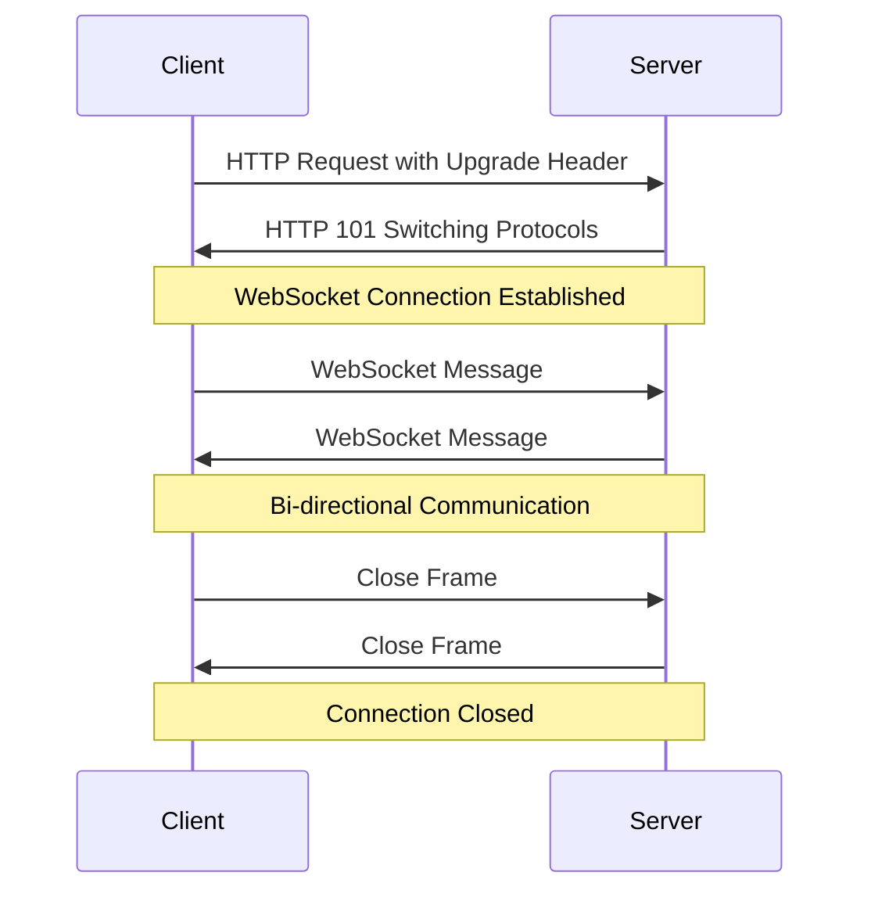

# Understanding WebSockets

## Introduction

WebSockets represent a critical advancement in web communication technology, enabling real-time, two-way interactions between clients and servers. Unlike traditional HTTP connections that follow a request-response pattern, WebSockets establish a persistent connection that allows data to flow in both directions simultaneously.

As web applications become increasingly interactive, requiring instant updates and real-time features, WebSockets have emerged as an essential technology for modern web development.

## What Are WebSockets?

WebSockets are a communication protocol that provides full-duplex communication channels over a single TCP connection. Established in 2011 as part of the HTML5 initiative, WebSockets addressed the limitations of HTTP connections for real-time applications.

### Key Characteristics

- **Persistent Connection**: Unlike HTTP's stateless nature, WebSockets maintain an open connection until explicitly closed.
- **Bi-directional Communication**: Data can flow from client to server and server to client at any time.
- **Low Latency**: Minimal overhead after the initial handshake, making communication faster.
- **Protocol Support**: Uses `ws://` and `wss://` (secure) protocols.

## How WebSockets Work

Understanding the WebSocket lifecycle is essential for implementing them effectively:



### The WebSocket Handshake

A WebSocket connection begins with a standard HTTP request that includes special headers:

```
GET /chat HTTP/1.1
Host: server.example.com
Upgrade: websocket
Connection: Upgrade
Sec-WebSocket-Key: dGhlIHNhbXBsZSBub25jZQ==
Sec-WebSocket-Version: 13
```

If the server supports WebSockets, it responds with:

```
HTTP/1.1 101 Switching Protocols
Upgrade: websocket
Connection: Upgrade
Sec-WebSocket-Accept: s3pPLMBiTxaQ9kYGzzhZRbK+xOo=
```

After this handshake, the HTTP connection is replaced by a WebSocket connection using the same underlying TCP/IP connection.

## WebSockets vs. HTTP

To understand the value of WebSockets, let's compare them with traditional HTTP:

| Feature | HTTP | WebSockets |
|---------|------|------------|
| Connection | New connection for each request/response | Persistent connection |
| Communication | Unidirectional | Bidirectional |
| Overhead | Headers sent with each request | Headers only during handshake |
| Server Push | Not natively supported | Built-in |
| Use Case | Standard web browsing | Real-time applications |

## Implementing WebSockets in JavaScript

Let's look at how to implement WebSockets in a client-side application:

### Basic Client Implementation

```javascript
// Creating a new WebSocket connection
const socket = new WebSocket('ws://example.com/socketserver');

// Connection opened
socket.addEventListener('open', (event) => {
    console.log('Connection established');
    socket.send('Hello Server!');
});

// Listen for messages
socket.addEventListener('message', (event) => {
    console.log('Message from server:', event.data);
});

// Listen for errors
socket.addEventListener('error', (event) => {
    console.error('WebSocket error:', event);
});

// Listen for close
socket.addEventListener('close', (event) => {
    console.log('Connection closed. Code:', event.code, 'Reason:', event.reason);
});

// To send a message to the server
function sendMessage(message) {
    if (socket.readyState === WebSocket.OPEN) {
        socket.send(message);
    } else {
        console.error('Connection not open');
    }
}

// To close the connection
function closeConnection() {
    socket.close(1000, 'Closing normally');
}
```

### WebSocket States

WebSockets have different states represented by the `readyState` property:

- `WebSocket.CONNECTING` (0): The connection is being established.
- `WebSocket.OPEN` (1): The connection is established and communication is possible.
- `WebSocket.CLOSING` (2): The connection is in the process of closing.
- `WebSocket.CLOSED` (3): The connection is closed or couldn't be opened.

## Creating a WebSocket Server

While clients can connect using the browser's WebSocket API, servers require specialized libraries. Here's an example using Node.js with the popular `ws` library:

```javascript
const WebSocket = require('ws');

// Create a WebSocket server
const wss = new WebSocket.Server({ port: 8080 });

// Handle connections
wss.on('connection', (ws) => {
    console.log('Client connected');
    
    // Send a welcome message
    ws.send('Welcome to the WebSocket server!');
    
    // Handle incoming messages
    ws.on('message', (message) => {
        console.log('Received:', message.toString());
        
        // Echo the message back
        ws.send(`Echo: ${message}`);
    });
    
    // Handle disconnection
    ws.on('close', () => {
        console.log('Client disconnected');
    });
});

console.log('WebSocket server started on port 8080');
```

To install the required library:

```bash
npm install ws
```

## Real-World Applications

WebSockets are ideal for applications requiring real-time updates. Here are some common use cases:

### 1. Chat Applications

WebSockets enable instant message delivery without refreshing or polling:

```javascript
// Client-side code for a simple chat app
const chatSocket = new WebSocket('ws://example.com/chat');
const messageInput = document.getElementById('messageInput');
const sendButton = document.getElementById('sendButton');
const chatMessages = document.getElementById('chatMessages');

sendButton.addEventListener('click', () => {
    const message = messageInput.value;
    if (message) {
        chatSocket.send(JSON.stringify({
            type: 'chat',
            content: message,
            sender: 'User'
        }));
        messageInput.value = '';
    }
});

chatSocket.addEventListener('message', (event) => {
    const message = JSON.parse(event.data);
    const messageElement = document.createElement('div');
    messageElement.className = `message ${message.sender === 'User' ? 'sent' : 'received'}`;
    messageElement.innerHTML = `<strong>${message.sender}:</strong> ${message.content}`;
    chatMessages.appendChild(messageElement);
    chatMessages.scrollTop = chatMessages.scrollHeight;
});
```

### 2. Live Dashboard

Create dashboards with real-time data updates:

```javascript
// Client-side code for a dashboard
const dashboardSocket = new WebSocket('ws://example.com/dashboard');
const cpuChart = document.getElementById('cpuChart').getContext('2d');
const memoryChart = document.getElementById('memoryChart').getContext('2d');

// Initialize charts using a library like Chart.js
const cpuUsageChart = new Chart(cpuChart, {
    type: 'line',
    data: {
        labels: [],
        datasets: [{
            label: 'CPU Usage %',
            data: [],
            borderColor: 'rgb(75, 192, 192)',
            tension: 0.1
        }]
    }
});

// Handle incoming server metrics
dashboardSocket.addEventListener('message', (event) => {
    const metrics = JSON.parse(event.data);
    
    // Update CPU chart
    cpuUsageChart.data.labels.push(new Date().toLocaleTimeString());
    cpuUsageChart.data.datasets[0].data.push(metrics.cpu);
    
    // Keep only the last 10 data points
    if (cpuUsageChart.data.labels.length > 10) {
        cpuUsageChart.data.labels.shift();
        cpuUsageChart.data.datasets[0].data.shift();
    }
    
    cpuUsageChart.update();
});
```

### 3. Collaborative Editors

WebSockets enable real-time collaboration on documents:

```javascript
// Client-side code for a collaborative editor
const editorSocket = new WebSocket('ws://example.com/editor');
const editor = document.getElementById('editor');

// Track local changes
editor.addEventListener('input', () => {
    const content = editor.value;
    const cursorPosition = editor.selectionStart;
    
    editorSocket.send(JSON.stringify({
        type: 'update',
        content: content,
        cursor: cursorPosition
    }));
});

// Handle remote changes
editorSocket.addEventListener('message', (event) => {
    const data = JSON.parse(event.data);
    
    if (data.type === 'update') {
        // Save current cursor position
        const currentPosition = editor.selectionStart;
        
        // Update content
        editor.value = data.content;
        
        // Restore cursor position if it was a local change
        if (data.source === 'self') {
            editor.setSelectionRange(currentPosition, currentPosition);
        }
    }
});
```

## WebSockets Security Considerations

When implementing WebSockets, consider these security practices:

1. **Use Secure WebSockets (WSS)**: Always use the secure `wss://` protocol in production, which encrypts data over TLS/SSL.

2. **Validate Input**: Always validate and sanitize incoming messages to prevent injection attacks.

3. **Implement Authentication**: Authenticate users before establishing WebSocket connections.

4. **Rate Limiting**: Implement rate limiting to prevent abuse and DoS attacks.

5. **Handle Reconnection Carefully**: Implement exponential backoff when reconnecting to avoid overwhelming servers.

```javascript
// Secure WebSocket connection with authentication
const secureSocket = new WebSocket('wss://example.com/socket');

// Add authentication token to the connection
secureSocket.addEventListener('open', () => {
    secureSocket.send(JSON.stringify({
        type: 'auth',
        token: 'user-auth-token'
    }));
});
```

## Advanced WebSocket Topics

### Binary Data

WebSockets can transmit binary data, useful for images, audio, or custom binary protocols:

```javascript
// Sending binary data
const binaryData = new Uint8Array([1, 2, 3, 4, 5]);
socket.send(binaryData.buffer);

// Receiving binary data
socket.binaryType = 'arraybuffer';
socket.addEventListener('message', (event) => {
    if (event.data instanceof ArrayBuffer) {
        const view = new Uint8Array(event.data);
        console.log('Received binary data:', view);
    }
});
```

### Heartbeats and Connection Management

To maintain WebSocket connections and detect disconnections promptly:

```javascript
// Client-side heartbeat
function heartbeat() {
    clearTimeout(this.pingTimeout);
    
    this.pingTimeout = setTimeout(() => {
        console.log('Connection lost, reconnecting...');
        socket.close();
        connectWebSocket(); // Function to reconnect
    }, 30000 + 1000); // Wait slightly longer than the ping interval
}

function connectWebSocket() {
    const socket = new WebSocket('ws://example.com/socket');
    
    socket.addEventListener('open', heartbeat);
    socket.addEventListener('ping', heartbeat);
    socket.addEventListener('message', heartbeat);
    
    socket.addEventListener('close', () => {
        clearTimeout(this.pingTimeout);
        setTimeout(connectWebSocket, 3000); // Reconnect after 3 seconds
    });
    
    return socket;
}

const socket = connectWebSocket();
```

### WebSocket Subprotocols

WebSockets support subprotocols for specialized communication patterns:

```javascript
// Specifying a subprotocol
const socket = new WebSocket('ws://example.com/socket', ['json', 'soap']);

// Check which subprotocol was selected
socket.addEventListener('open', () => {
    console.log('Server selected protocol:', socket.protocol);
});
```

## WebSocket Libraries and Frameworks

While the native WebSocket API is powerful, several libraries enhance functionality:

- **Socket.IO**: Provides fallback mechanisms and additional features.
- **SockJS**: Offers WebSocket emulation for browsers without WebSocket support.
- **ws**: A popular Node.js WebSocket library for servers.
- **Pusher/Ably**: Managed WebSocket services.

Here's an example using Socket.IO:

```html
<!-- Client-side Socket.IO -->
<script src="https://cdn.socket.io/4.5.0/socket.io.min.js"></script>
<script>
    const socket = io('http://example.com');
    
    socket.on('connect', () => {
        console.log('Connected to Socket.IO server!');
        socket.emit('hello', { user: 'Client' });
    });
    
    socket.on('welcome', (data) => {
        console.log('Received:', data);
    });
</script>
```

Server-side Socket.IO with Node.js:

```javascript
const express = require('express');
const { createServer } = require('http');
const { Server } = require('socket.io');

const app = express();
const httpServer = createServer(app);
const io = new Server(httpServer);

io.on('connection', (socket) => {
    console.log('Client connected');
    
    socket.emit('welcome', { message: 'Welcome to the server!' });
    
    socket.on('hello', (data) => {
        console.log('Received hello from:', data.user);
    });
});

httpServer.listen(3000, () => {
    console.log('Server listening on port 3000');
});
```

## Summary

WebSockets have transformed web applications by enabling real-time, bidirectional communication between clients and servers. Their persistent connections eliminate the overhead of establishing new connections for each interaction, making them ideal for applications requiring immediate data exchange.

Key takeaways:

1. WebSockets establish persistent connections, unlike traditional HTTP requests.
2. They enable bidirectional communication with minimal latency.
3. The WebSocket lifecycle includes a handshake process, message exchange, and connection termination.
4. They're ideal for chat applications, live dashboards, collaborative editors, and other real-time features.
5. Security considerations include using secure connections (WSS) and proper authentication.

## Exercises

1. Create a simple chat application using WebSockets that allows users to join different rooms.
2. Implement a real-time drawing board where multiple users can draw simultaneously.
3. Build a stock ticker application that updates prices in real-time from a WebSocket server.
4. Create a multiplayer game using WebSockets for position updates and game state.
5. Implement a system monitoring dashboard that displays server metrics in real-time.

## Additional Resources

- [MDN WebSocket API Documentation](https://developer.mozilla.org/en-US/docs/Web/API/WebSockets_API)
- [WebSocket Protocol RFC 6455](https://datatracker.ietf.org/doc/html/rfc6455)
- [Socket.IO Documentation](https://socket.io/docs/v4/)
- [ws: Node.js WebSocket Library](https://github.com/websockets/ws)

By mastering WebSockets, you'll be able to create responsive, real-time web applications that provide users with dynamic and interactive experiences that were previously impossible with traditional HTTP communication.