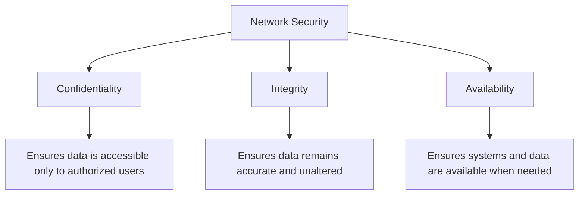
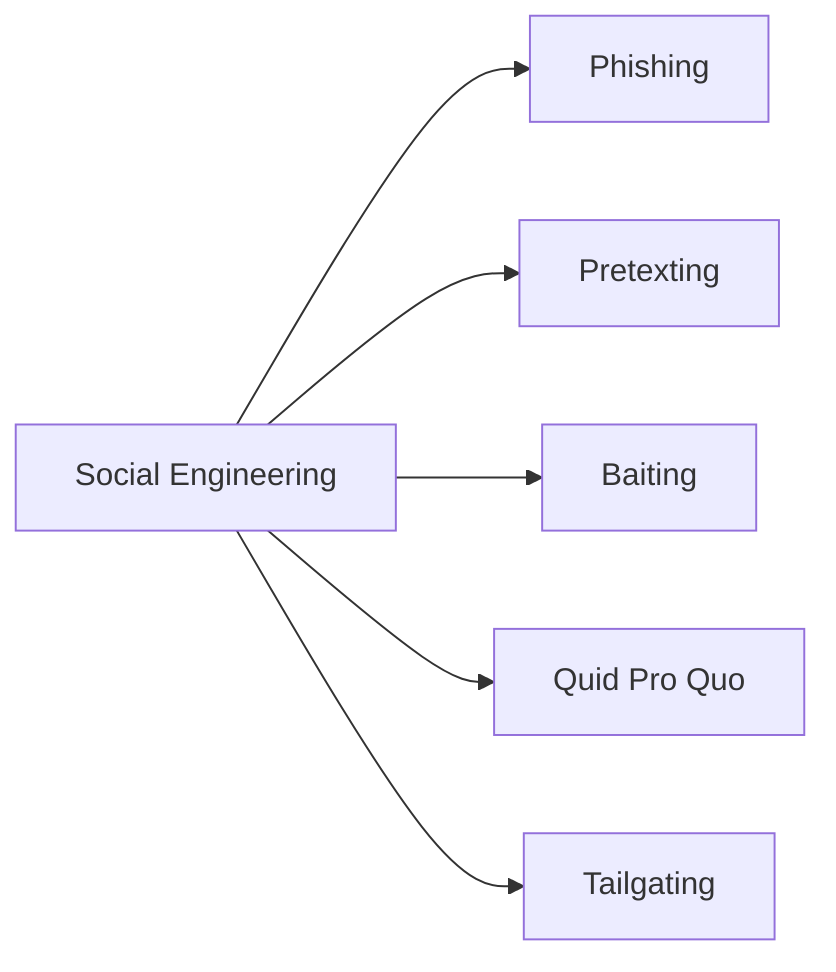
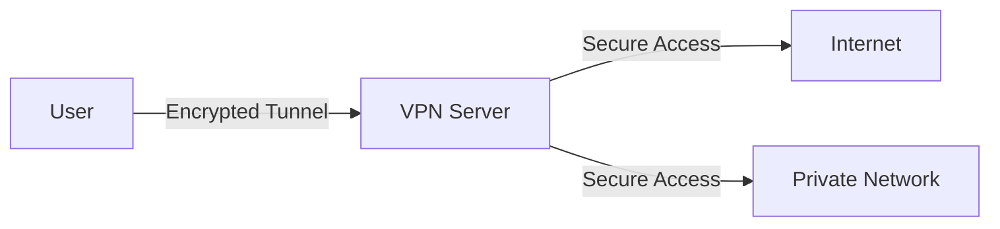

# Network Security

## Introduction

Network security is a critical aspect of modern computing that focuses on protecting the integrity, confidentiality, and accessibility of computer networks and data. As our world becomes increasingly interconnected, the importance of securing networks against unauthorized access and attacks grows exponentially.

In this guide, we'll explore the fundamental concepts of network security, common threats, protective measures, and practical applications that help safeguard networks against malicious actors. Whether you're managing a home network or beginning your journey toward becoming a cybersecurity professional, understanding these principles is essential.

## Why Network Security Matters

Network security isn't just for large corporations or government agencies. Consider these statistics:

- The average cost of a data breach in 2024 exceeded $4.5 million
- Small businesses are targeted in 43% of cyber attacks
- Over 80% of successful breaches leverage compromised passwords
- A new malware is created approximately every 4 seconds

As our reliance on networked systems increases for everything from banking to healthcare to everyday communication, securing these networks becomes critical for everyone.

## Core Network Security Concepts

### 1. Confidentiality, Integrity, and Availability (CIA Triad)

The CIA triad forms the cornerstone of network security:



- **Confidentiality**: Ensuring that information is accessible only to those authorized to have access
- **Integrity**: Maintaining and assuring the accuracy and consistency of data
- **Availability**: Ensuring that authorized users have access to information and resources when needed

### 2. Authentication, Authorization, and Accounting (AAA)

AAA is a framework for intelligently controlling access to computer resources:

- **Authentication**: Verifies the identity of a user or system (who you are)
- **Authorization**: Determines what resources a user can access (what you can do)
- **Accounting**: Tracks the resources a user consumes during access (what you did)

## Common Network Security Threats

### 1. Malware

Malicious software comes in many forms:

- **Viruses**: Self-replicating code that attaches to legitimate programs
- **Worms**: Self-replicating malware that spreads across networks
- **Trojans**: Malware disguised as legitimate software
- **Ransomware**: Encrypts data and demands payment for decryption
- **Spyware**: Secretly monitors user activity

### 2. Social Engineering Attacks



- **Phishing**: Deceptive attempts to steal user data by masquerading as a trustworthy entity
- **Pretexting**: Creating a fabricated scenario to obtain information
- **Baiting**: Using a false promise to pique a victim's curiosity
- **Quid Pro Quo**: Promising a benefit in exchange for information
- **Tailgating**: Following someone into a restricted area

### 3. Network-Based Attacks

- **Man-in-the-Middle (MitM)**: Intercepting communication between two parties
- **Denial-of-Service (DoS)**: Flooding systems to prevent legitimate access
- **Distributed Denial-of-Service (DDoS)**: Using multiple systems to conduct a DoS attack
- **Packet Sniffing**: Capturing and analyzing network traffic
- **IP Spoofing**: Creating IP packets with a false source address

## Essential Network Security Measures

### 1. Firewalls

A firewall acts as a barrier between a trusted network and untrusted networks:

```javascript
// Simple firewall rule in pseudo-code
if (packet.source_ip === "198.51.100.0/24" && packet.destination_port === 22) {
  allowPacket();
} else {
  dropPacket();
}
```

Types of firewalls include:
- **Packet filtering**: Examines packets and permits/denies based on rules
- **Stateful inspection**: Tracks the state of active connections
- **Application layer**: Operates at the application level, inspecting specific content
- **Next-generation**: Combines traditional firewall capabilities with additional features

### 2. Encryption

Encryption transforms readable data (plaintext) into an unreadable format (ciphertext):

```javascript
// Simplified encryption example
function encrypt(plaintext, key) {
  let ciphertext = "";
  for (let i = 0; i < plaintext.length; i++) {
    // XOR each character with the key (very simplified)
    let char = plaintext.charCodeAt(i) ^ key;
    ciphertext += String.fromCharCode(char);
  }
  return ciphertext;
}

const message = "Secret data";
const encryptedMessage = encrypt(message, 42);
console.log("Encrypted:", encryptedMessage);
// Output: Encrypted: [unreadable characters]
```

Key encryption concepts:
- **Symmetric encryption**: Uses the same key for encryption and decryption
- **Asymmetric encryption**: Uses public and private key pairs
- **End-to-end encryption**: Data remains encrypted from sender to recipient
- **Transport Layer Security (TLS)**: Secures data in transit

### 3. Virtual Private Networks (VPNs)

VPNs create secure connections over public networks:



Benefits include:
- Encrypted communications
- IP address masking
- Geographic restriction bypass
- Protection on public Wi-Fi

### 4. Intrusion Detection and Prevention Systems (IDS/IPS)

- **IDS**: Monitors network traffic for suspicious activity
- **IPS**: Actively prevents or blocks detected intrusions

```javascript
// Simplified IDS/IPS rule in pseudo-code
function analyzePacket(packet) {
  if (packet.payload.includes("DROP TABLE") || 
      packet.payload.includes("script>alert(")) {
    logSuspiciousActivity(packet);
    blockSource(packet.source_ip);
    return false; // Block the packet
  }
  return true; // Allow the packet
}
```

### 5. Multi-Factor Authentication (MFA)

MFA requires multiple verification methods:
- Something you know (password)
- Something you have (phone or token)
- Something you are (biometrics)

## Practical Implementation Examples

### Setting Up a Basic Firewall

Here's how to configure a simple firewall using the Linux `iptables` command:

```bash
# Allow established connections
iptables -A INPUT -m conntrack --ctstate ESTABLISHED,RELATED -j ACCEPT

# Allow SSH connections
iptables -A INPUT -p tcp --dport 22 -j ACCEPT

# Allow HTTP and HTTPS
iptables -A INPUT -p tcp --dport 80 -j ACCEPT
iptables -A INPUT -p tcp --dport 443 -j ACCEPT

# Block all other incoming traffic
iptables -A INPUT -j DROP
```

### Implementing Password Policies

Strong password policies include:

```javascript
// Example password validator
function validatePassword(password) {
  // At least 12 characters
  if (password.length < 12) return false;
  
  // Contains uppercase, lowercase, number, and special character
  const hasUppercase = /[A-Z]/.test(password);
  const hasLowercase = /[a-z]/.test(password);
  const hasNumber = /[0-9]/.test(password);
  const hasSpecial = /[!@#$%^&*()_+\-=\[\]{};':"\\|,.<>\/?]/.test(password);
  
  return hasUppercase && hasLowercase && hasNumber && hasSpecial;
}

console.log(validatePassword("Weak")); // Output: false
console.log(validatePassword("StrongP@ssw0rd")); // Output: true
```

### Scanning for Network Vulnerabilities

Using tools like Nmap to identify open ports and potential vulnerabilities:

```bash
# Basic Nmap scan
nmap -sV 192.168.1.0/24

# Output example:
# Starting Nmap 7.80 ( https://nmap.org )
# Nmap scan report for 192.168.1.1
# Host is up (0.0050s latency).
# Not shown: 995 closed ports
# PORT     STATE SERVICE     VERSION
# 22/tcp   open  ssh         OpenSSH 8.2p1
# 80/tcp   open  http        Apache httpd 2.4.41
# 443/tcp  open  https       Apache httpd 2.4.41
# 3306/tcp open  mysql       MySQL 8.0.27
# 8080/tcp open  http-proxy  Squid http proxy 4.10
```

### Securing Wi-Fi Networks

Best practices for securing wireless networks:

1. Use WPA3 encryption when available
2. Create strong, unique passwords
3. Hide your SSID (network name)
4. Enable MAC address filtering
5. Update router firmware regularly

```javascript
// Pseudocode for MAC address filtering
const allowedMACs = [
  "00:1A:2B:3C:4D:5E", 
  "A1:B2:C3:D4:E5:F6",
  "11:22:33:44:55:66"
];

function allowConnection(deviceMAC) {
  return allowedMACs.includes(deviceMAC);
}

// Check if device can connect
console.log(allowConnection("00:1A:2B:3C:4D:5E")); // Output: true
console.log(allowConnection("AA:BB:CC:DD:EE:FF")); // Output: false
```

## Network Security Best Practices

1. **Keep systems updated**: Apply security patches promptly
2. **Principle of least privilege**: Grant minimal access required for functions
3. **Defense in depth**: Layer security controls throughout your network
4. **Regular backups**: Maintain and test backups of critical data
5. **Security awareness training**: Educate users about security practices
6. **Network segmentation**: Divide networks into secured segments
7. **Regular security audits**: Continuously test and evaluate security measures

## Real-World Case Study: Small Business Security Implementation

Consider a small marketing agency with 15 employees:

1. **Threat assessment**: The company handles client financial data and proprietary marketing strategies
2. **Implementation plan**:
   - Installed UTM (Unified Threat Management) firewall
   - Configured VPN for remote workers
   - Implemented MFA for all cloud services
   - Established regular security awareness training
   - Created data classification policy
3. **Results**: After implementation, the company successfully prevented 3 ransomware attempts and detected an insider threat attempting to exfiltrate client data

## Summary

Network security is an essential discipline that combines technology, processes, and user awareness to protect valuable data and systems. We've covered:

- Fundamental security concepts (CIA triad, AAA)
- Common network threats and attack vectors
- Critical protection measures (firewalls, encryption, VPNs, etc.)
- Practical implementation strategies
- Best practices for maintaining security

The field of network security is constantly evolving as threats become more sophisticated. A security mindset that anticipates problems and implements layered defenses provides the best protection against current and future threats.

## Additional Resources and Exercises

### Further Learning

- [NIST Cybersecurity Framework](https://www.nist.gov/cyberframework)
- [OWASP Top Ten](https://owasp.org/www-project-top-ten/)
- [Cybersecurity & Infrastructure Security Agency](https://www.cisa.gov/)

### Practice Exercises

1. **Network Mapping Exercise**: Map your home network to identify all connected devices.
2. **Firewall Configuration**: Set up a basic firewall using a free tool like UFW (Uncomplicated Firewall).
3. **Vulnerability Assessment**: Conduct a basic vulnerability scan of your personal devices.
4. **Password Audit**: Review and strengthen passwords across your accounts.
5. **Encryption Practice**: Encrypt a file using open-source encryption tools like VeraCrypt.

### Challenge Problems

1. Create a network security incident response plan.
2. Design a segmented network architecture for a small business.
3. Develop a script that monitors log files for suspicious activities.

Remember, the best security professionals are always learning and adapting to new threats. Stay curious and keep exploring!