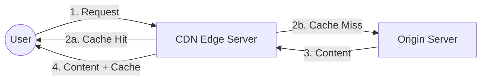
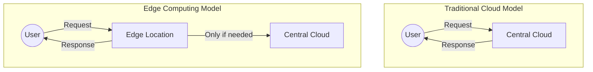

# CDN and Edge Computing

## Introduction

In today's digital landscape, users expect websites and applications to load quickly and work efficiently, regardless of their geographic location. Two technologies play crucial roles in meeting these expectations: Content Delivery Networks (CDNs) and Edge Computing. These technologies bring data and computation closer to end users, reducing latency and improving overall performance.

This guide will explore what CDNs and Edge Computing are, how they work, their benefits, and real-world applications. By the end, you'll understand how these technologies form the backbone of modern web infrastructure.

## What is a Content Delivery Network (CDN)?

A Content Delivery Network, or CDN, is a distributed network of servers strategically positioned in multiple geographic locations. These servers store cached copies of static content (images, CSS files, JavaScript, videos, etc.) from your origin server. When a user requests content from your website, the CDN delivers it from the server nearest to them rather than from the distant origin server.

### How CDNs Work



1. A user requests content from your website
2. The request is routed to the nearest CDN edge server
3. If the edge server has a cached copy of the requested content (cache hit), it delivers it directly to the user
4. If the content isn't cached (cache miss), the edge server requests it from the origin server, caches it, and then delivers it to the user
5. Subsequent requests for the same content will be served directly from the CDN cache

### Key Components of a CDN

- **Edge Servers:** Distributed servers that cache and deliver content
- **Origin Server:** Your main web server where original content resides
- **Cache:** Temporary storage for content copies
- **TTL (Time To Live):** Defines how long content remains cached before it expires
- **Purging:** Process of removing content from the cache

### Benefits of Using a CDN

- **Reduced Latency:** Content loads faster since it's served from a location closer to the user
- **Decreased Server Load:** Origin servers handle fewer requests
- **Higher Availability:** Distributed nature provides redundancy
- **DDoS Protection:** Many CDNs offer security features to mitigate attacks
- **Bandwidth Savings:** Reduced data transfer from origin servers

## Edge Computing: Taking CDNs to the Next Level

Edge Computing extends the CDN concept beyond content caching to allow computation at the network edge. Instead of just storing and delivering static content, edge computing enables running code and processing data closer to end users.

### How Edge Computing Works

Edge computing platforms allow developers to deploy and execute code at edge locations. This code can:

- Process data locally before sending it to central servers
- Customize content based on user location or device
- Run serverless functions to handle specific tasks
- Analyze and respond to data without round trips to distant data centers

### Edge Computing vs. Traditional Cloud Computing



With traditional cloud computing, all requests must travel to centralized data centers. Edge computing processes requests at network edge locations, only involving central servers when necessary.

## Implementing CDNs in Your Projects

Let's look at how to implement a CDN using popular providers.

### Example: Using Cloudflare as a CDN

To set up Cloudflare as a CDN:

1. Sign up for a Cloudflare account
2. Add your website to Cloudflare
3. Update your domain nameservers to point to Cloudflare
4. Configure caching settings

Once set up, you can control caching behavior using HTTP headers:

```http
Cache-Control: max-age=86400, public
```

This header tells the CDN to cache the content for 24 hours.

### Example: Using Amazon CloudFront

Here's a basic example of setting up CloudFront distribution using AWS CLI:

```bash
aws cloudfront create-distribution \
    --origin-domain-name example-bucket.s3.amazonaws.com \
    --default-root-object index.html
```

## Edge Computing Implementation Examples

### Example 1: Cloudflare Workers

Cloudflare Workers let you run JavaScript at edge locations. Here's a simple example of a Cloudflare Worker that modifies responses:

```javascript
addEventListener('fetch', event => {
  event.respondWith(handleRequest(event.request))
})

async function handleRequest(request) {
  // Get the original response
  const response = await fetch(request)
  
  // Create a modified response
  const newResponse = new Response(response.body, response)
  
  // Add a custom header
  newResponse.headers.set('X-Served-By', 'Edge Worker')
  
  // Return the modified response
  return newResponse
}
```

### Example 2: AWS Lambda@Edge

Lambda@Edge lets you run Node.js functions in response to CloudFront events. Here's an example that redirects users based on country:

```javascript
exports.handler = async (event) => {
  const request = event.Records[0].cf.request;
  const headers = request.headers;
  
  // Get country from CloudFront header
  const countryCode = headers['cloudfront-viewer-country'] 
    ? headers['cloudfront-viewer-country'][0].value 
    : 'US';
  
  // Redirect users from UK to a specific page
  if (countryCode === 'GB') {
    return {
      status: '302',
      statusDescription: 'Found',
      headers: {
        'location': [{
          key: 'Location',
          value: '/uk-version' + request.uri,
        }],
        'cache-control': [{
          key: 'Cache-Control',
          value: 'max-age=3600'
        }],
      },
    };
  }
  
  // Continue with the request for other countries
  return request;
};
```

## Real-World Applications

### E-commerce Website Optimization

An e-commerce platform can use CDNs and Edge Computing to:

1. Serve product images and static assets from CDN edge locations
2. Process user location at the edge to show local currency and shipping options
3. Implement A/B testing logic at the edge without latency
4. Apply personalization rules without round-trips to central servers

### Global Video Streaming Platform

A video streaming service can use these technologies to:

1. Cache video segments at edge locations near viewers
2. Process video format transcoding at the edge based on device capabilities
3. Implement access control and authentication at edge locations
4. Collect analytics data locally before aggregating centrally

### IoT Data Processing

Internet of Things applications can leverage edge computing to:

1. Process sensor data near collection points
2. Filter and aggregate data before sending to cloud storage
3. Implement real-time response logic without cloud latency
4. Reduce bandwidth consumption by processing data locally

## Performance Comparison

The impact of CDNs and Edge Computing on performance can be dramatic:

| Scenario | Traditional Setup | With CDN | With Edge Computing |
| -------- | ----------------- | -------- | ------------------ |
| Image Loading (US to Europe) | 300-500ms | 50-100ms | 50-100ms |
| Dynamic Content with Personalization | 500-800ms | 400-600ms | 100-200ms |
| API Response Time (Cross-Continental) | 300-500ms | 200-300ms | 50-150ms |
| IoT Data Processing | 500-1000ms | N/A | 10-50ms |

## Challenges and Considerations

While CDNs and Edge Computing offer many benefits, they also come with challenges:

- **Complexity:** Distributed systems are inherently more complex to manage
- **Cache Invalidation:** Ensuring users see the most updated content 
- **Debugging:** Harder to troubleshoot issues across distributed locations
- **Cost Management:** Can be expensive if not optimized properly
- **State Management:** Handling user state across edge locations

## Summary

Content Delivery Networks and Edge Computing are fundamental technologies for building high-performance web applications. CDNs accelerate content delivery by caching static assets close to users, while Edge Computing extends this concept to allow computation near end users.

By implementing these technologies, you can:

- Significantly reduce latency and improve user experience
- Decrease load on your origin servers
- Enhance availability and reliability
- Enable new use cases that weren't possible with centralized architectures

As the internet continues to evolve, the edge will play an increasingly important role in how applications are built and delivered.

## Exercises

1. Set up a free-tier CDN (like Cloudflare) for a personal website and measure the performance improvement.
2. Write a simple edge function that customizes content based on the user's time of day.
3. Design an architecture for a global application that leverages both CDN and Edge Computing capabilities.
4. Compare the latency of an API request with and without edge computing using different geographic locations.

## Additional Resources

- MDN Web Docs on HTTP caching
- AWS CloudFront and Lambda@Edge documentation
- Cloudflare Workers documentation
- Fastly Compute@Edge guides
- Akamai EdgeWorkers documentation