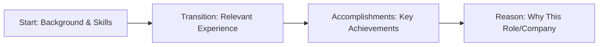

# Self-Introduction Strategies

## Introduction

The self-introduction is often your first opportunity to make an impression during a programming interview. This crucial 1-2 minute pitch sets the tone for the entire conversation and can significantly influence how interviewers perceive your candidacy. A well-crafted self-introduction highlights your relevant skills, experiences, and motivations while establishing your communication abilities.

In this guide, we'll explore effective strategies for creating and delivering a compelling self-introduction specifically tailored for programming interviews. Whether you're a coding bootcamp graduate or a computer science student, these techniques will help you start your interview with confidence.

## Understanding the Purpose

Before crafting your self-introduction, it's important to understand what interviewers are looking for:

1. **Technical background**: Your relevant education, skills, and experience
2. **Communication skills**: How clearly you can express complex ideas
3. **Personality fit**: Whether you align with the company culture
4. **Motivation**: Why you're interested in this specific role and company

## The S.T.A.R. Framework for Self-Introductions

A modified version of the popular STAR (Situation, Task, Action, Result) method works well for structuring your self-introduction:



### 1. Start (Background & Skills)

Begin with a concise overview of your technical background and key skills relevant to the position.

**Example:**
```
"Hi, I'm Alex. I recently completed my Computer Science degree at State University, where I focused on full-stack web development and data structures. I'm proficient in JavaScript, React, and Node.js, and I've been coding for about four years."
```

### 2. Transition (Relevant Experience)

Connect your background to relevant professional or project experience.

**Example:**
```
"For the past year, I've been working on a team project building a resource management application using React and Firebase. Before that, I interned at TechStart where I helped develop API integrations for their customer service platform."
```

### 3. Accomplishments (Key Achievements)

Highlight 1-2 specific achievements that demonstrate your technical abilities and soft skills.

**Example:**
```
"I'm particularly proud of implementing a caching system that improved our application's load time by 40%, and I led a small team of three developers to complete our final sprint ahead of schedule."
```

### 4. Reason (Why This Role/Company)

Conclude by explaining why you're interested in this specific position and company.

**Example:**
```
"I'm excited about this role at DevCorp because I'm passionate about creating accessible web applications, and I admire how your company has pioneered user-centered design in the healthcare space. I'm eager to bring my technical skills and collaborative approach to your team."
```

## Common Mistakes to Avoid

### ❌ Being Too Generic

**Weak Example:**
```
"I'm a hard-working programmer who enjoys solving problems and learning new technologies."
```

### ✅ Being Specific and Memorable

**Strong Example:**
```
"I'm a full-stack developer who specializes in optimizing database queries. Last quarter, I reduced query times by 65% for our most resource-intensive operations, which directly improved user satisfaction scores."
```

### ❌ Going Into Excessive Detail

**Weak Example:**
```
"I started programming when I was 12 with HTML and CSS. Then I learned JavaScript at 14, followed by Python at 16. In college, I took 18 programming courses including Data Structures, Algorithms, Operating Systems..."
```

### ✅ Being Concise and Relevant

**Strong Example:**
```
"With 5 years of programming experience across web and mobile platforms, I've developed strong skills in React Native and TypeScript, which align perfectly with your mobile development needs."
```

## Tailoring Your Introduction for Different Roles

### For Front-End Positions

Emphasize:
- UI/UX sensibilities
- JavaScript framework experience
- Performance optimization
- Responsive design skills

### For Back-End Positions

Emphasize:
- Database design and optimization
- API architecture
- Scalability considerations
- System design knowledge

### For Full-Stack Positions

Emphasize:
- End-to-end implementation experience
- Cross-functional collaboration
- Understanding of how front and back end interact
- Deployment and DevOps knowledge

## Practice Exercise: Self-Introduction Template

Fill in the blanks to create your personalized self-introduction:

1. **Start:** "Hi, I'm ______. I have a background in ______ with __ years of experience in ______."

2. **Transition:** "I've worked on ______ at ______, where I used technologies like ______."

3. **Accomplishments:** "I'm particularly proud of ______, which resulted in ______."

4. **Reason:** "I'm interested in this position at ______ because ______, and I believe my skills in ______ would be valuable for your team."

## Delivery Tips

A great self-introduction isn't just about content—delivery matters too:

- **Practice aloud** several times before your interview
- **Time yourself** to ensure you stay within 1-2 minutes
- **Maintain eye contact** with interviewers
- **Speak at a measured pace** to ensure clarity
- **Use confident body language** (good posture, appropriate hand gestures)
- **Adjust your tone** to be professional but conversational
- **Prepare for follow-up questions** your introduction might prompt

## Adapting to Virtual Interviews

For remote interviews, additional considerations include:

- **Test your technology** beforehand
- **Ensure good lighting and a professional background**
- **Position your camera at eye level**
- **Eliminate potential distractions**
- **Have notes nearby** (but don't read directly from them)
- **Practice with the specific video platform** if possible

## Summary

An effective self-introduction for programming interviews follows the S.T.A.R. framework:

1. **Start** with your relevant background and skills
2. **Transition** to your applicable experience
3. Highlight key **Accomplishments**
4. Explain your **Reason** for interest in the role

Remember that your self-introduction should be customized for each interview, highlighting the experiences and skills most relevant to the specific position. With preparation and practice, you'll make a strong first impression that sets a positive tone for the rest of your interview.

## Additional Resources

- Practice recording your self-introduction and review it critically
- Ask peers in the industry to provide feedback on your introduction
- Research the company thoroughly to better tailor your "Reason" section
- Prepare 2-3 variations of your introduction for different interview scenarios (technical vs. behavioral)

## Practice Exercises

1. **Record and Time**: Record your self-introduction and ensure it's between 60-90 seconds.

2. **Peer Review**: Exchange self-introductions with a classmate or colleague and provide feedback to each other.

3. **Company Research**: Select three companies you'd like to work for and customize the "Reason" section of your introduction for each one.

4. **Technical Adaptation**: Create two versions of your introduction - one for a front-end position and one for a back-end position, emphasizing different skills and experiences.