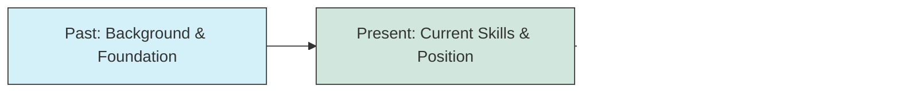

# Answering "Tell Me About Yourself"

## Introduction

"Tell me about yourself" is often the first question in a programming interview. Despite seeming casual, it's a strategic opportunity to make a strong first impression and set the tone for the entire interview. This deceptively simple question allows interviewers to:

- Assess your communication skills
- Understand how you present your professional narrative
- Evaluate how well you can highlight relevant experience
- Gauge your self-awareness and confidence

In this guide, we'll explore how to craft an impactful response that showcases your strengths as a programmer while maintaining authenticity.

## The Structure: Past, Present, Future

An effective "Tell me about yourself" response follows a clear structure:



### 1. Past: Your Foundation (30%)

Begin with a brief overview of your educational and professional journey that led you to programming:

- Educational background
- How you discovered programming
- Key career milestones

**Example:**
"I graduated with a CS degree from State University where I discovered my passion for web development. After college, I worked at TechStart Inc., where I built responsive web applications using React."

### 2. Present: Your Current Skills (40%)

This is the core of your answer. Highlight:

- Current technical skills
- Recent projects or achievements
- Problem-solving approaches
- Team collaboration experience

**Example:**
"Currently, I'm a front-end developer specializing in React and TypeScript. I've recently led the redesign of our company's customer portal, improving load times by 40% through code optimization. I enjoy working in agile environments and collaborating closely with UX designers and back-end developers."

### 3. Future: Your Goals (30%)

Connect your aspirations with the position you're applying for:

- What you're looking to learn or accomplish
- Why you're interested in this specific role/company
- How your skills align with the company's needs

**Example:**
"I'm now looking to deepen my expertise in full-stack development, particularly with Node.js backends, which is why I'm excited about this role at your company. Your focus on creating scalable applications aligns perfectly with my career goals."

## Customization Is Key

Tailor your response to the specific company and role. Research beforehand:

- Company values and culture
- The team you'll be working with
- Current projects or products
- Technical stack they use

**Before the interview:**

```javascript
// Pseudo-code for interview preparation
function prepareIntroduction(jobDescription, companyInfo) {
  const myRelevantSkills = mySkills.filter(skill => 
    jobDescription.requiredSkills.includes(skill)
  );
  
  const relevantExperiences = myExperiences.filter(exp => 
    exp.technologies.some(tech => 
      jobDescription.technologies.includes(tech)
    )
  );
  
  const companyValues = companyInfo.values;
  const alignedValues = myValues.filter(value => 
    companyValues.includes(value)
  );
  
  return {
    pastHighlights: selectRelevant(myBackground, jobDescription),
    presentSkills: myRelevantSkills,
    keyExperiences: relevantExperiences.sort((a, b) => b.relevance - a.relevance).slice(0, 2),
    futureGoals: alignWithCompanyMission(myGoals, companyInfo.mission),
    valueAlignment: alignedValues
  };
}
```

## Time Management

Keep your answer concise:

- Aim for 1-2 minutes (about 200-300 words)
- Practice with a timer until you consistently hit your target duration
- Focus on quality over quantity

## Common Mistakes to Avoid

### ❌ Starting from childhood
```
"I was born in Seattle and have always been interested in computers since I was 5 years old..."
```

### ❌ Reciting your resume chronologically
```
"First, I worked at Company A from 2018-2019 as a junior developer, then I moved to Company B where I was promoted to..."
```

### ❌ Focusing on personal details
```
"I'm a dog lover with three golden retrievers, and I enjoy hiking on weekends..."
```

### ❌ Being too technical too quickly
```
"I've implemented RESTful APIs using Express.js with MongoDB, optimized React rendering using memoization techniques, and refactored legacy code..."
```

## Effective Examples

### For a Junior Developer:

"I recently graduated with a Computer Science degree from State University, where I focused on web development and algorithms. During my studies, I built several projects including a task management application using React and Firebase, which helped me develop skills in front-end development and working with APIs. I also participated in a three-month internship at TechSolutions, where I contributed to their e-commerce platform by implementing new features and fixing bugs in their JavaScript codebase. Currently, I'm expanding my knowledge of backend technologies, particularly Node.js and Express, through personal projects and online courses. I'm excited about this junior developer position because it offers an opportunity to apply my front-end skills while growing my backend expertise in a collaborative environment."

### For a Mid-Level Developer:

"I'm a full-stack developer with 4 years of experience, primarily working with JavaScript ecosystems. I started my career at StartupX where I built interactive web applications using React. After two years, I moved to EnterpriseY to work on larger-scale systems, where I led a team of three developers in redesigning their customer portal, which improved user engagement by 35%. I'm proficient in React, Node.js, and TypeScript, and have experience with CI/CD pipelines and cloud deployment on AWS. Recently, I've been focusing on performance optimization and architectural design patterns. I'm interested in this position because your company's focus on creating scalable financial applications presents interesting technical challenges that align with my expertise and growth areas."

### For a Senior Developer:

"I've spent the last 8 years developing enterprise software solutions, with the past 4 years focusing on distributed systems. I began my career at TechCorp developing front-end applications, then moved to DataSystems where I grew into a senior role leading a team of 7 developers. There, I architected a microservices solution that reduced our deployment times by 60% and improved system reliability. My technical expertise includes Java, Spring Boot, and Kubernetes, with a strong focus on designing scalable, maintainable systems. I'm also passionate about mentoring junior developers and have implemented coding standards and review processes that improved our code quality metrics. I'm looking for a role where I can continue to solve complex architectural challenges while helping to grow and mentor a technical team, which is why your Principal Engineer position caught my attention."

## Template for Structuring Your Answer

```
[PAST]
I started my journey in tech with [relevant education/first job] where I [key learning/achievement].

[PRESENT]
Currently, I'm a [current role] specializing in [key technologies/skills]. I recently [recent achievement or project] which [positive outcome or learning].

[FUTURE]
I'm now looking to [career goal relevant to the position] which is why I'm particularly excited about this opportunity at [company name]. I believe my experience with [relevant skill] aligns well with your focus on [company priority or project].
```

## Practice Exercise

1. Draft your "Tell me about yourself" response using the Past-Present-Future structure
2. Record yourself and time the response (aim for 1-2 minutes)
3. Review and refine:
   - Have you highlighted skills relevant to the job?
   - Is your narrative cohesive and easy to follow?
   - Have you demonstrated passion and enthusiasm?
   - Is there a clear connection between your experience and the role?

## Additional Tips

- **Prepare, don't memorize**: Have key points ready, but stay conversational
- **Show enthusiasm**: Your tone matters as much as your content
- **End with a question**: Consider transitioning to the next topic by asking about the role or team

## Summary

The "Tell me about yourself" question is your opportunity to frame the interview narrative. A well-crafted response:

- Follows a clear Past-Present-Future structure
- Highlights relevant skills and achievements
- Demonstrates your fit for the specific role
- Stays concise and engaging (1-2 minutes)

By preparing thoughtfully for this question, you set a positive tone for the rest of the interview and position yourself as a focused, self-aware candidate who communicates effectively.

## Additional Resources

- Practice with mock interviews 
- Record yourself and review your delivery
- Ask for feedback from peers or mentors
- Revise your answer as you gain new experiences or apply to different roles