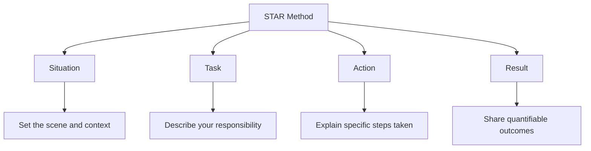

# The STAR Method

## Introduction

When preparing for programming job interviews, technical skills are only half the equation. Modern tech companies, from startups to FAANG organizations, place significant emphasis on behavioral interviews to assess how you handle real-world situations, collaborate with teams, and overcome challenges.

The STAR method is a structured framework that helps you respond to behavioral interview questions with clear, compelling stories from your experience. Rather than giving vague or disorganized answers, this approach allows you to showcase your skills through concrete examples.

## What is the STAR Method?

STAR is an acronym that stands for:

- **S**ituation: Set the scene and provide context
- **T**ask: Explain your responsibility or challenge
- **A**ction: Describe the specific steps you took
- **R**esult: Share the outcomes of your actions

Let's visualize this structure:



## When to Use the STAR Method

The STAR method is particularly effective for answering questions that begin with phrases like:

- "Tell me about a time when..."
- "Describe a situation where..."
- "Give me an example of..."
- "How have you handled..."

These are called behavioral questions because they aim to understand your past behavior as an indicator of future performance.

## Breaking Down the STAR Components

### Situation

This sets the stage for your story. Provide enough context so the interviewer understands the scenario, but keep it concise.

**Good example:**
"In my previous role at XYZ Tech, our team was developing a new user authentication system with a tight two-week deadline. Three days before launch, we discovered a critical security vulnerability."

**Poor example:**
"We had a problem with our code once."

### Task

Explain your specific responsibility or challenge in this situation. What were you tasked with doing? What goal needed to be achieved?

**Good example:**
"As the lead backend developer, I was responsible for identifying the root cause of the vulnerability, implementing a fix, and ensuring it wouldn't compromise our launch timeline."

**Poor example:**
"I had to fix the problem."

### Action

Detail the specific steps you took to address the challenge. This is the most important part of your answer, so be thorough about your approach, thought process, and specific contributions.

**Good example:**
"First, I organized an emergency meeting with our security team to scope the issue. Then, I created a three-tier prioritization system for the vulnerabilities we found. I delegated less critical fixes to team members while personally tackling the highest-risk components. I implemented a defense-in-depth approach using input validation, parameterized queries, and additional encryption layers. Throughout this process, I maintained a detailed log of all changes and conducted pair programming sessions to share knowledge with junior team members."

**Poor example:**
"I worked hard and fixed the code."

### Result

Conclude with the outcomes of your actions. When possible, quantify your results and highlight the positive impact of your contribution.

**Good example:**
"We successfully patched all critical vulnerabilities within 48 hours, allowing us to launch on schedule. Our solution not only fixed the immediate issue but strengthened overall system security, resulting in zero breaches during the first six months after deployment. The logging system I implemented became a team standard, reducing debugging time by approximately 30% for subsequent projects."

**Poor example:**
"Everything worked out fine in the end."

## Real-World Example: The Complete STAR Response

Here's how a complete STAR response might look for a common behavioral question in programming interviews:

**Question:** "Tell me about a time when you had to debug a complex issue under tight time constraints."

**Answer:**

**Situation:** "While working at DataStream Inc., our e-commerce platform experienced intermittent performance issues during peak holiday traffic. The system would slow down significantly for about 15-20 minutes, then return to normal. This was happening just two weeks before Black Friday, our highest traffic period of the year."

**Task:** "As a backend developer specializing in database optimization, I was tasked with identifying the root cause and implementing a solution that wouldn't require extensive system downtime."

**Action:** "I approached this methodically in several steps:
1. First, I set up additional logging and monitoring to capture more detailed metrics during the slowdowns.
2. After analyzing the logs, I noticed a pattern of database connection pool exhaustion coinciding with our marketing team's automated email campaigns.
3. I created a replica of our production environment and wrote a script to simulate the traffic patterns.
4. Through this testing, I identified that our ORM was not properly releasing database connections when certain exception paths were triggered.
5. I refactored the connection handling code to use a `try-finally` pattern to ensure connections were released even during exceptions:

```javascript
let connection = null;
try {
  connection = await pool.getConnection();
  // Database operations here
  return result;
} catch (error) {
  logger.error('Database operation failed:', error);
  throw error;
} finally {
  if (connection) {
    connection.release(); // Ensure connection is always released
  }
}
```

6. I also implemented a circuit breaker pattern around our email notification system to prevent cascade failures during high load."

**Result:** "The changes reduced our database connection usage by 40% and completely eliminated the slowdowns, even when we simulated traffic at 150% of our previous peak. The system performed flawlessly during Black Friday, handling a record 1.2 million transactions, which was 30% higher than our previous year. Additionally, the circuit breaker pattern I implemented became a standard architectural component across our microservices, improving overall system resilience."

## Common Behavioral Questions for Programmers

Here are some typical behavioral questions you might encounter, which are perfect for the STAR method:

1. "Describe a time when you had to make a difficult technical decision with limited information."
2. "Tell me about a situation where you disagreed with a team member about an implementation approach."
3. "Give an example of a project that didn't go as planned and how you handled it."
4. "Share an experience where you had to quickly learn a new technology to complete a project."
5. "Describe how you've handled receiving critical feedback about your code."

## Tips for Crafting Effective STAR Responses

### Preparation is Key

- Before your interview, list 5-10 significant projects, challenges, or achievements from your experience
- For each, outline the key components (Situation, Task, Action, Result)
- Practice delivering these stories aloud, timing yourself to keep responses between 2-3 minutes

### Be Specific, Not General

- Use real projects and concrete details
- Mention specific technologies, methodologies, or tools used
- Include numbers where possible (time saved, performance improved, etc.)

### Focus on YOUR Contribution

- Use "I" statements to clarify your personal role and actions
- Even when discussing team efforts, be clear about your specific contributions
- Avoid vague references to what "we" or "the team" did without explaining your part

### Adapt to Technical and Non-Technical Interviewers

- With technical interviewers: Include relevant technical details and decisions
- With non-technical interviewers: Focus more on the process, collaboration, and business impact

### Keep It Relevant

- Choose examples that highlight skills relevant to the position you're applying for
- For a frontend role, emphasize UI/UX problem-solving
- For a backend role, focus on system design, performance, or database challenges

## Exercise: Practice Your STAR Responses

1. Choose three behavioral questions from the list above
2. For each question, write a complete STAR response based on your experience
3. Practice delivering each response in under 3 minutes
4. Record yourself or practice with a friend to get feedback
5. Refine your responses based on feedback

## Example STAR Template

Use this template to structure your responses:

**Situation:**
- When and where did this take place?
- What was the context or background?
- Keep this part brief (2-3 sentences)

**Task:**
- What was your specific responsibility?
- What challenge or objective were you facing?
- Make your role clear (1-2 sentences)

**Action:**
- What specific steps did you take?
- Why did you choose that approach?
- How did you implement your solution?
- This should be the longest part (5-8 sentences)

**Result:**
- What was the outcome of your actions?
- Include specific metrics or improvements when possible
- What did you learn from this experience?
- End on a positive note (2-3 sentences)

## Summary

The STAR method is a powerful framework for structuring your behavioral interview responses in a clear, compelling way. By preparing thoughtful STAR stories that highlight your technical and soft skills, you'll be able to:

- Demonstrate your problem-solving approach
- Showcase your technical expertise in real-world contexts
- Highlight your ability to collaborate and communicate
- Provide evidence of your impact and results

Remember that behavioral interviews are just as important as technical assessments in the hiring process. Companies want to hire programmers who can not only code well but also work effectively in teams, handle challenges gracefully, and communicate clearly.

## Additional Resources

- **Practice**: Join mock interview groups online or with friends
- **Reflection**: After each real interview, note which stories you used and how you might improve them
- **Development**: Actively seek challenging situations in your current role to build new STAR stories

By mastering the STAR method, you'll transform your interview preparation from memorizing technical facts to crafting compelling narratives about your professional journey—making you a more confident, impressive candidate.