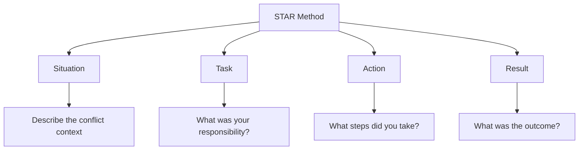

# Conflict Resolution Stories

## Introduction

Conflict is an inevitable part of professional life, especially in the collaborative environment of software development. How you handle disagreements and tensions can showcase your interpersonal skills, emotional intelligence, and problem-solving abilities—qualities that employers highly value.

In technical interviews, particularly during the behavioral portion, you're likely to encounter questions like:

- "Tell me about a time when you faced a conflict with a team member."
- "Describe a situation where you disagreed with your manager's approach."
- "How have you handled conflicting priorities in previous projects?"

This guide will help you craft compelling conflict resolution stories that demonstrate your ability to navigate challenging interpersonal situations professionally and productively.

## Why Conflict Resolution Stories Matter

Hiring managers use behavioral questions about conflict to assess several key qualities:

1. **Communication skills**: Can you express disagreements respectfully?
2. **Emotional intelligence**: How do you manage your emotions during tense situations?
3. **Problem-solving approach**: Do you seek constructive solutions rather than placing blame?
4. **Adaptability**: Can you adjust your perspective when presented with new information?
5. **Leadership potential**: Do you take initiative in resolving issues?

A well-structured conflict resolution story can showcase all these qualities and set you apart from other candidates.

## The STAR Method for Conflict Stories

The STAR method provides an excellent framework for structuring your conflict resolution stories:

<div className="star-method-diagram">

</div>

Let's break down each component:

### Situation
Set the scene by briefly explaining the context of the conflict. This should include:
- The project or work setting
- Who was involved (roles, not names)
- What the disagreement was about

### Task
Explain your role or responsibility in addressing the conflict:
- Were you directly involved in the disagreement?
- Were you a team lead mediating between others?
- What was at stake if the conflict remained unresolved?

### Action
This is the heart of your story—detail the specific steps you took to resolve the conflict:
- How you approached the conversation
- Techniques you used to understand different perspectives
- Compromises or solutions you proposed

### Result
Finally, share the outcome:
- How the conflict was resolved
- The impact on the project, team relationships, or processes
- What you learned from the experience

## Example Conflict Resolution Stories

### Example 1: Technical Disagreement with a Colleague

#### Situation
```
"While working on a web application project, I had a disagreement with a fellow developer about the best approach for state management. I believed using Redux would provide better scalability and maintainability, while my colleague advocated for using Context API exclusively, arguing it would be simpler and sufficient for our needs."
```

#### Task
```
"As the front-end lead, I needed to ensure we made the right architectural decision that would support the project's long-term goals without unnecessarily complicating the codebase or causing friction within the team."
```

#### Action
```
"I suggested we schedule a dedicated 30-minute meeting to discuss the pros and cons of each approach. Before the meeting, I prepared a small code demonstration showing how both approaches would handle our specific use cases. During our discussion, I made sure to acknowledge the valid points in my colleague's perspective—Context API would indeed be simpler for smaller components.

Instead of framing it as an either/or decision, I proposed a hybrid approach: using Context API for localized state that didn't need to be shared widely, and implementing Redux for global application state that multiple components needed to access. I also suggested documenting our decision-making process for future reference."
```

#### Result
```
"My colleague appreciated that I had taken time to consider their perspective and liked the demonstration comparing both approaches. We agreed on the hybrid solution, which gave us the best of both worlds—simplicity where possible and robustness where needed. This approach actually improved our architecture beyond what either of us had initially proposed.

The documentation we created became a reference for similar architectural decisions in future projects. Most importantly, by focusing on the problem rather than our positions, we strengthened our working relationship and established a pattern for resolving technical disagreements constructively."
```

### Example 2: Handling Conflicting Priorities

#### Situation
```
"In my role as a junior developer at a startup, I was simultaneously assigned to fix critical bugs for an upcoming release and to help onboard a new team member by pair programming. Both responsibilities were presented as top priorities, but there weren't enough hours in the day to adequately fulfill both."
```

#### Task
```
"I needed to find a way to meet these competing demands without compromising the quality of either responsibility, while also maintaining good relationships with both my manager who assigned the bug fixes and the tech lead who requested the onboarding assistance."
```

#### Action
```
"First, I documented exactly how much time both tasks would require based on my estimates. Then, I requested a brief meeting with both my manager and tech lead together rather than discussing the conflict with them separately. During the meeting, I presented the situation factually without complaint, acknowledged the importance of both tasks, and asked for their guidance on prioritization.

I came prepared with a proposed solution: I could pair with the new developer specifically on some of the less complex bug fixes, thereby fulfilling both responsibilities simultaneously, though at a potentially slower pace than if they were addressed separately."
```

#### Result
```
"My approach was well-received by both leaders. They appreciated that I had identified the conflict proactively rather than failing to meet one of the commitments. My manager clarified which bug fixes were absolutely critical for the immediate release versus which could wait, while the tech lead agreed that the new team member could benefit from exposure to the bug-fixing process.

The experience taught me the importance of transparent communication when facing conflicting priorities. Rather than suffering in silence or making arbitrary decisions about which request to prioritize, bringing stakeholders together allowed for a better solution than I could have devised alone. This approach has now become my standard practice when facing similar situations."
```

## Crafting Your Own Conflict Resolution Stories

### Step 1: Identify Relevant Conflicts

Reflect on your past experiences to identify 3-4 different types of conflicts you've encountered:
- Technical disagreements
- Interpersonal friction
- Priority conflicts
- Communication breakdowns
- Resource allocation disagreements

Choose conflicts that were successfully resolved and that demonstrate different aspects of your conflict resolution skills.

### Step 2: Structure Using STAR

For each conflict, draft a STAR-structured narrative:
- Keep your **Situation** concise (2-3 sentences).
- Ensure your **Task** clearly states your responsibility.
- Make your **Action** section detailed and specific—this is where you showcase your skills.
- In the **Result**, include both tangible outcomes and lessons learned.

### Step 3: Emphasize Key Soft Skills

Throughout your stories, highlight these valuable skills:
- Active listening
- Empathy
- Effective communication
- Compromise
- Problem-solving
- Emotional regulation
- Relationship building

### Step 4: Practice Delivery

Your delivery matters as much as the content:
- Practice telling your stories aloud to ensure they flow naturally.
- Time yourself—aim for 2-3 minutes per story.
- Be prepared to adapt the level of technical detail based on your interviewer's background.

## Common Pitfalls to Avoid

When sharing conflict resolution stories in interviews, avoid these common mistakes:

<div className="pitfalls-table">

| Pitfall | Why It's Problematic | Better Approach |
|---------|----------------------|-----------------|
| Avoiding mentioning conflicts altogether | Suggests lack of experience or self-awareness | Be honest about challenges you've faced |
| Choosing conflicts that weren't resolved | Doesn't demonstrate resolution skills | Select stories with positive outcomes |
| Portraying others negatively | Raises concerns about professionalism | Focus on the situation, not personality flaws |
| Being vague about your actions | Misses opportunity to showcase skills | Provide specific details about your approach |
| Claiming you never experience conflict | Appears dishonest or lacking self-awareness | Acknowledge that conflict is normal and focus on constructive handling |

</div>

## Sample Interview Questions and Approaches

### "Tell me about a time when you had a conflict with a coworker."

**Approach**: Choose a story that showcases your communication skills and willingness to understand different perspectives. Emphasize how you maintained a professional relationship afterward.

### "How do you handle disagreements with supervisors?"

**Approach**: Select an example that demonstrates respectful communication, willingness to understand the bigger picture, and your ability to present alternative viewpoints constructively.

### "Describe a situation where you had to work with someone difficult."

**Approach**: Focus on how you adapted your communication style and found common ground rather than dwelling on the other person's difficult behaviors.

## Reflection Exercises

To develop stronger conflict resolution stories, try these reflection exercises:

1. **Conflict Inventory**: List all workplace conflicts you've experienced in the past 2-3 years.
2. **Resolution Analysis**: For each conflict, identify what worked well and what you would do differently now.
3. **Skill Mapping**: Connect specific conflict resolution techniques you've used to the professional skills they demonstrate.
4. **Peer Feedback**: If appropriate, ask trusted colleagues how they perceived your approach to conflict resolution.

## Summary

Conflict resolution stories are a powerful tool for demonstrating your interpersonal skills and emotional intelligence in behavioral interviews. By using the STAR method to structure narratives about how you've successfully navigated workplace disagreements, you can showcase qualities that technical assessments alone cannot reveal.

Remember that interviewers aren't expecting you to be conflict-free—they're interested in how you handle inevitable tensions productively. The best conflict resolution stories show your growth mindset, communication skills, and commitment to finding solutions that benefit the team and project.

## Additional Resources

- Books:
  - "Crucial Conversations: Tools for Talking When Stakes Are High" by Kerry Patterson et al.
  - "Getting to Yes: Negotiating Agreement Without Giving In" by Roger Fisher and William Ury

- Practice Techniques:
  - Role-play conflict scenarios with a friend or mentor
  - Record yourself telling your conflict stories and review for clarity
  - Prepare different versions of your stories at varying levels of technical detail
  
- Skills Development:
  - Active listening exercises
  - Emotion regulation techniques
  - Negotiation and mediation workshops

By thoughtfully preparing your conflict resolution stories, you'll be well-equipped to answer one of the most common and revealing categories of behavioral interview questions.