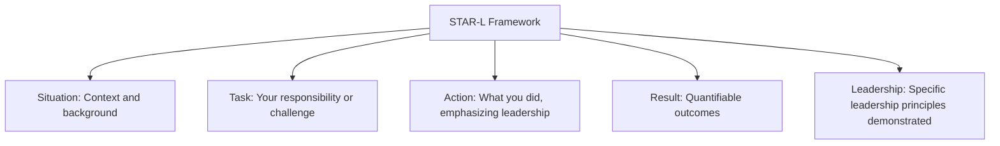

# Leadership Experience

## Introduction

Leadership experience is one of the most commonly assessed qualities in technical interviews, particularly for mid to senior-level positions. Regardless of your formal title, demonstrating your ability to lead, influence, and drive results is crucial for career advancement in the tech industry.

This guide will help you understand why companies value leadership, how to identify your own leadership experiences, and how to structure compelling stories that showcase these skills during behavioral interviews.

## Why Companies Value Leadership

Companies seek candidates with leadership qualities for several reasons:

- **Scalable Impact**: Leaders multiply their effectiveness by enabling others to succeed
- **Future Growth**: Technical leaders can mentor junior developers and build stronger teams
- **Project Success**: Leadership skills help navigate challenges and keep projects on track
- **Cross-functional Collaboration**: Leaders effectively work across teams and departments

Even if you're applying for an individual contributor role, your ability to demonstrate leadership potential can set you apart from other candidates.

## Identifying Your Leadership Experiences

Many candidates make the mistake of thinking they need formal management titles to demonstrate leadership. In reality, leadership manifests in many forms:

- **Project Leadership**: Leading a technical initiative, even without formal authority
- **Technical Mentorship**: Helping colleagues learn new technologies or concepts
- **Process Improvement**: Implementing better ways of working
- **Crisis Management**: Taking charge during challenging situations
- **Community Involvement**: Leading open-source contributions or tech meetups

### Exercise: Leadership Inventory

Take a few minutes to reflect on your experiences across these categories:

1. **Projects you led or significantly influenced**
2. **Times you helped others grow technically**
3. **Situations where you advocated for change or improvement**
4. **Challenging circumstances where you stepped up**
5. **Community or volunteer leadership roles**

## The STAR-L Framework for Leadership Stories

To effectively communicate your leadership experiences, we'll extend the standard STAR (Situation, Task, Action, Result) framework by adding an "L" component focused specifically on leadership elements:



### Component Breakdown

#### Situation
- Set the scene with relevant context
- Keep it concise (1-2 sentences)
- Include enough detail for the interviewer to understand the complexity

#### Task
- Clearly articulate your specific responsibility
- Highlight constraints or challenges
- Establish why leadership was necessary

#### Action
- Detail your approach, emphasizing leadership behaviors
- Discuss how you influenced, motivated, or coordinated others
- Describe decision-making processes you implemented

#### Result
- Share concrete, measurable outcomes
- Include both technical and human impact
- Acknowledge team contributions while highlighting your leadership

#### Leadership (The "L" Component)
- Explicitly connect your actions to leadership principles
- Reflect on what you learned about leadership
- Demonstrate growth in your leadership approach

## Example: STAR-L Leadership Story

Here's how a junior developer might structure a leadership story without having a formal leadership title:

#### Situation
"Our team was struggling with inconsistent code quality across our React application, leading to frequent bugs in production and increasing technical debt."

#### Task
"As someone passionate about code quality, I took the initiative to propose implementing a comprehensive testing strategy, even though I wasn't the most senior developer on the team."

#### Action
"I researched best practices for React testing and created a proposal document outlining a three-tiered approach using Jest, React Testing Library, and Cypress for different testing needs. I organized a lunch-and-learn session to share these ideas with the team, addressing concerns and incorporating feedback. After gaining consensus, I volunteered to create the initial testing infrastructure and documentation. I then paired with team members individually to help them write their first tests, providing code reviews and encouragement."

#### Result
"Within three months, we increased our test coverage from 15% to 78%. Production bugs decreased by 47%, and our PR review process became much smoother. The approach was so successful that two other teams in the organization adopted our testing framework and documentation."

#### Leadership
"This experience taught me that leadership isn't about having authority, but about identifying opportunities for improvement, building consensus through clear communication, and empowering others to succeed. I learned the importance of leading by example and providing the right level of support to different team members based on their individual needs."

## Common Leadership Interview Questions

Prepare for these frequently asked leadership questions:

1. "Tell me about a time you led a project or initiative."
2. "Describe a situation where you influenced others without formal authority."
3. "How have you handled conflict within a team?"
4. "Give an example of how you've mentored or helped develop someone else."
5. "Tell me about a time you had to make an unpopular decision."
6. "How have you handled receiving pushback on your ideas?"

## Leadership Qualities to Highlight

When discussing your experiences, emphasize these highly valued leadership traits:

- **Vision**: Ability to see possibilities and inspire others
- **Communication**: Clear articulation of ideas and expectations
- **Empathy**: Understanding team members' perspectives and needs
- **Decision-making**: Making sound judgments with available information
- **Accountability**: Taking responsibility for outcomes
- **Adaptability**: Pivoting strategies when faced with challenges
- **Mentorship**: Developing skills and capabilities in others

## Example: Technical Leadership Code Pattern

Even coding patterns can demonstrate leadership thinking. Consider this React component that implements a design pattern:

```jsx
import React from 'react';

// This higher-order component demonstrates the leadership principle of reusability
const withErrorHandling = (WrappedComponent) => {
  return class ErrorHandler extends React.Component {
    constructor(props) {
      super(props);
      this.state = {
        hasError: false,
        errorMessage: ''
      };
    }
    
    static getDerivedStateFromError(error) {
      // Update state so the next render will show the fallback UI
      return {
        hasError: true,
        errorMessage: error.message
      };
    }
    
    componentDidCatch(error, info) {
      // Log error to monitoring service
      console.log('Error details:', error);
      console.log('Component stack:', info.componentStack);
    }
    
    render() {
      if (this.state.hasError) {
        return (
          <div className="error-container">
            <h2>Something went wrong!</h2>
            <p>{this.state.errorMessage}</p>
            <button onClick={() => this.setState({ hasError: false })}>
              Try Again
            </button>
          </div>
        );
      }
      
      return <WrappedComponent {...this.props} />;
    }
  };
};

// Usage
const MyComponent = () => {
  return <div>Normal component functionality</div>;
};

const SafeComponent = withErrorHandling(MyComponent);

export default SafeComponent;
```

This code demonstrates leadership thinking by:
- Creating reusable patterns others can follow
- Anticipating problems before they affect users
- Implementing standards that improve overall code quality
- Thinking about the experience of both users and fellow developers

## Remote and Distributed Leadership

With the rise of remote work, also be prepared to discuss:

- How you've led teams across different time zones
- Tools and practices you've implemented for asynchronous collaboration
- Approaches to building team culture in distributed environments
- Methods for ensuring accountability without micromanagement

## Avoiding Common Pitfalls

When discussing leadership experiences, avoid these common mistakes:

1. **Taking too much credit**: Acknowledge team contributions
2. **Focusing only on technical details**: Highlight people aspects too
3. **Choosing insignificant examples**: Pick impactful, meaningful stories
4. **Being vague about results**: Use specific metrics and outcomes
5. **Neglecting failures**: Include what you learned from leadership challenges

## Practice Exercise: Leadership Story Development

1. Choose a professional experience where you demonstrated leadership
2. Draft your STAR-L framework story (300-500 words)
3. Identify 3 specific leadership qualities you demonstrated
4. Practice telling your story in under 3 minutes
5. Ask a peer to review and provide feedback

## Summary

Effectively communicating your leadership experience can significantly impact your success in technical interviews. Remember:

- Leadership is about influence, not authority or titles
- The STAR-L framework helps structure compelling leadership stories
- Focus on both technical achievements and people-oriented outcomes
- Prepare diverse examples covering different leadership scenarios
- Continually reflect on and develop your leadership capabilities

By thoughtfully preparing your leadership stories and practicing their delivery, you'll be well-equipped to demonstrate your potential value beyond just technical skills.

## Additional Resources

For further development of your leadership communication skills:

- Practice behavioral interview questions with peers
- Record yourself answering leadership questions and review for clarity
- Create a leadership journal documenting your ongoing experiences
- Seek feedback from colleagues on your leadership impact
- Look for opportunities to expand your leadership experience through community involvement or open-source contribution