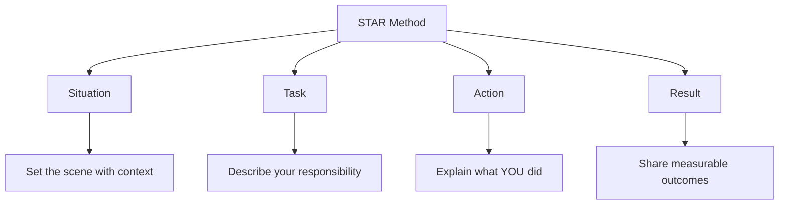

# Teamwork Examples

## Introduction

Teamwork is consistently ranked as one of the most valuable soft skills in the tech industry. During behavioral interviews, employers are particularly interested in your ability to collaborate effectively with others. Technical skills may get you in the door, but your ability to work well with a team often determines your success and advancement opportunities.

This guide will help you prepare compelling teamwork examples for your programming interviews, providing frameworks and real-world scenarios that you can adapt to your own experiences.

## Why Interviewers Ask About Teamwork

Before diving into examples, it's important to understand why interviewers care about teamwork:

- **Complex projects require collaboration**: Most significant software projects require multiple people working together
- **Diverse perspectives improve solutions**: Teams with varied skills and viewpoints create better products
- **Communication affects productivity**: Effective teams reduce misunderstandings and work more efficiently
- **Conflict resolution is inevitable**: Your ability to navigate disagreements professionally is crucial

## The STAR Method for Teamwork Examples

When answering teamwork questions in interviews, the STAR method provides an excellent framework:

- **Situation**: Describe the context and background
- **Task**: Explain your specific responsibilities 
- **Action**: Detail the specific steps you took
- **Result**: Share the positive outcomes



## Common Teamwork Interview Questions

These are typical questions that interviewers might ask to gauge your teamwork abilities:

1. Tell me about a time you worked effectively in a team.
2. Describe a situation where you had to resolve a conflict within your team.
3. How do you handle disagreements with team members?
4. Give an example of when you had to work with someone difficult.
5. Tell me about a time you led a team through a challenge.
6. How do you ensure everyone's voice is heard in a team setting?

## Example 1: Collaborative Problem-Solving

### STAR Framework Example

**Situation**:
"During my internship at TechStart, our team was developing a customer portal that needed to integrate with three different legacy systems. We were falling behind schedule due to unexpected integration issues."

**Task**:
"As the frontend developer, I needed to work closely with the backend team to resolve these integration challenges while maintaining our UI/UX requirements."

**Action**:
"I proposed daily 15-minute stand-ups specifically focused on integration issues, created a shared documentation space where we tracked problems and solutions, and paired with different backend developers to better understand their constraints. I also refactored my frontend code to be more adaptable to API changes."

**Result**:
"We not only resolved all integration issues within two weeks, but the collaborative process we established became a template for future cross-team projects. Our customer portal launched on time with a 95% user satisfaction rating in initial testing."

## Example 2: Handling Team Conflict

### STAR Framework Example

**Situation**:
"While working on a mobile app project, there was significant disagreement between the UX designer and the lead developer about implementation feasibility for certain features."

**Task**:
"As a mid-level developer who had good relationships with both teammates, I found myself in a position to help mediate the situation."

**Action**:
"I organized a focused workshop where we clearly separated user needs from implementation approaches. I encouraged the designer to articulate the core user problems rather than specific solutions, and asked the developer to explore multiple implementation options before dismissing ideas. I documented areas of agreement and created a prioritized list of features with alternative approaches."

**Result**:
"We reached a compromise that preserved the core user experience while staying within technical constraints. More importantly, we established a new protocol for feature discussions that prevented similar conflicts in future sprints. Both team members later thanked me for helping bridge their communication gap."

## Example 3: Supporting Team Members

### STAR Framework Example

**Situation**:
"Our development team welcomed a junior developer who was struggling with our testing framework and becoming increasingly frustrated."

**Task**:
"While not officially assigned as their mentor, I recognized an opportunity to help a team member while strengthening our overall code quality."

**Action**:
"I offered to pair program with them for an hour each day specifically focused on testing. I created a simplified example suite that demonstrated key testing patterns relevant to our codebase. Additionally, I reviewed and provided detailed comments on their pull requests, highlighting both strengths and areas for improvement."

**Result**:
"Within three weeks, their test coverage metrics improved from 60% to 90%, and they began independently creating robust test suites. They later became our team's testing advocate, and our overall bug escape rate decreased by 30% in the following quarter."

## Key Elements of Strong Teamwork Examples

The most compelling teamwork examples tend to include these elements:

1. **Specific context**: Provide relevant details about the project and team
2. **Clear challenge**: Identify the specific teamwork challenge you faced
3. **Your contribution**: Emphasize your personal actions while acknowledging the team
4. **Measured results**: Quantify outcomes whenever possible
5. **Learning**: Demonstrate growth and what you learned about effective collaboration

## Code Example: Simulating Team Coordination

This simplified example illustrates the concept of team coordination through code:

```javascript
// A simple simulation of team coordination
class TeamMember {
  constructor(name, role, skills) {
    this.name = name;
    this.role = role;
    this.skills = skills;
    this.tasks = [];
    this.availability = 100; // percentage
  }

  assignTask(task) {
    if (this.canHandle(task) && this.availability >= task.effortRequired) {
      this.tasks.push(task);
      this.availability -= task.effortRequired;
      console.log(`${this.name} accepted task: ${task.name}`);
      return true;
    }
    return false;
  }

  canHandle(task) {
    return task.requiredSkills.every(skill => this.skills.includes(skill));
  }
}

class Task {
  constructor(name, requiredSkills, effortRequired) {
    this.name = name;
    this.requiredSkills = requiredSkills;
    this.effortRequired = effortRequired;
    this.completed = false;
  }
}

class Team {
  constructor(members) {
    this.members = members;
  }

  assignTasks(tasks) {
    const results = {
      assigned: [],
      unassigned: []
    };

    tasks.forEach(task => {
      let assigned = false;
      
      // First pass: try to find ideal skill match
      for (const member of this.members) {
        if (member.canHandle(task) && member.availability >= task.effortRequired) {
          member.assignTask(task);
          results.assigned.push({task, member});
          assigned = true;
          break;
        }
      }
      
      // Second pass: find partial skill match if needed
      if (!assigned) {
        const partialMatches = this.members
          .filter(m => m.availability >= task.effortRequired)
          .map(m => ({
            member: m,
            matchScore: m.skills.filter(s => task.requiredSkills.includes(s)).length
          }))
          .sort((a, b) => b.matchScore - a.matchScore);
          
        if (partialMatches.length > 0 && partialMatches[0].matchScore > 0) {
          partialMatches[0].member.assignTask(task);
          results.assigned.push({task, member: partialMatches[0].member});
          console.log(`Task ${task.name} assigned with partial skill match`);
        } else {
          results.unassigned.push(task);
          console.log(`No team member available for task: ${task.name}`);
        }
      }
    });
    
    return results;
  }
}

// Example usage
const alex = new TeamMember('Alex', 'Frontend', ['JavaScript', 'React', 'CSS']);
const bailey = new TeamMember('Bailey', 'Backend', ['Python', 'Django', 'SQL']);
const casey = new TeamMember('Casey', 'Full Stack', ['JavaScript', 'Python', 'AWS']);

const team = new Team([alex, bailey, casey]);

const tasks = [
  new Task('Build login UI', ['JavaScript', 'React'], 30),
  new Task('Set up database schema', ['SQL', 'Django'], 40),
  new Task('Create API endpoints', ['Python', 'Django'], 50),
  new Task('Deploy application', ['AWS'], 20)
];

const assignmentResults = team.assignTasks(tasks);
console.log('Task Assignment Results:', assignmentResults);
```

**Output:**
```
Alex accepted task: Build login UI
Bailey accepted task: Set up database schema
Bailey accepted task: Create API endpoints
Casey accepted task: Deploy application
Task Assignment Results: {
  assigned: [
    { task: Task { name: 'Build login UI', requiredSkills: [Array], effortRequired: 30, completed: false }, member: TeamMember { name: 'Alex', ... } },
    { task: Task { name: 'Set up database schema', ... }, member: TeamMember { name: 'Bailey', ... } },
    { task: Task { name: 'Create API endpoints', ... }, member: TeamMember { name: 'Bailey', ... } },
    { task: Task { name: 'Deploy application', ... }, member: TeamMember { name: 'Casey', ... } }
  ],
  unassigned: []
}
```

This code demonstrates how a team coordinates to assign tasks based on skills and availability - a simplified version of real-world team coordination.

## Red Flags to Avoid in Teamwork Examples

When sharing teamwork examples, avoid these common pitfalls:

1. **Taking all the credit**: Focusing solely on your contributions without acknowledging teammates
2. **Blaming others**: Highlighting team failures without accepting any responsibility
3. **Vague generalities**: Using generic statements without specific situations or actions
4. **Avoiding conflict**: Only discussing easy collaborations without addressing challenges
5. **Lacking results**: Describing situations without clear outcomes or learnings

## Preparing Your Own Teamwork Examples

Follow these steps to develop your personal teamwork examples:

1. **Inventory your experiences**: List 3-5 significant team projects from work, school, or open-source contributions
2. **Identify challenges**: For each project, note specific teamwork challenges you faced
3. **Apply the STAR method**: Structure each example using Situation, Task, Action, Result
4. **Practice articulation**: Rehearse explaining your examples clearly and concisely
5. **Prepare variations**: Adapt your core examples to address different types of teamwork questions

## Summary

Effective teamwork examples demonstrate your ability to collaborate, communicate, and contribute to collective success. By preparing thoughtful examples using the STAR method, you can showcase your teamwork skills during behavioral interviews.

Remember that interviewers are looking for evidence of:
- Clear communication
- Conflict resolution abilities
- Adaptability and flexibility
- Respect for diverse perspectives
- Problem-solving in group settings
- Leadership and initiative

The examples you share should highlight these qualities while being authentic to your experiences.

## Practice Exercises

1. **Self-Assessment**: Rate yourself on each of the key teamwork skills listed above. Identify your strongest and weakest areas.

2. **Example Development**: Create three distinct teamwork examples from your experience using the STAR method.

3. **Peer Feedback**: Practice sharing your teamwork examples with a friend and ask for feedback on clarity and impact.

4. **Reflection**: After each interview, note which teamwork examples resonated most with interviewers and refine accordingly.

Good luck with your interviews! Remember that authentic examples showcasing both challenges and growth will make the strongest impression.