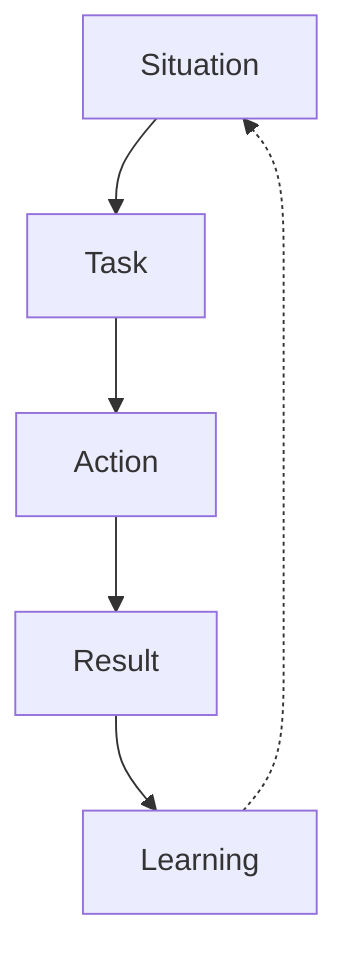

# Failure and Learning Stories

## Introduction

One of the most challenging yet important types of behavioral interview questions revolves around failure and learning experiences. Questions like "Tell me about a time you failed" or "Describe a project that didn't go as planned" aren't designed to trip you up—they help interviewers understand:

- How you handle setbacks
- Your capacity for self-reflection
- Your ability to grow and learn from mistakes
- Your resilience and problem-solving approach

In this guide, we'll explore how to craft compelling failure and learning stories that demonstrate your growth mindset and turn potential negatives into positives during your programming interviews.

## Why Interviewers Ask About Failures

Before diving into how to structure your responses, let's understand why these questions are so valuable to interviewers:

1. **Assessing self-awareness**: Candidates who can honestly assess their own mistakes demonstrate maturity
2. **Evaluating humility**: The ability to admit mistakes shows you're not defensive about your work
3. **Understanding your learning process**: How you transform failures into knowledge reveals your growth potential
4. **Gauging resilience**: Your response to setbacks indicates how you'll handle future challenges

## The STAR-L Framework

When discussing failures, the standard STAR method (Situation, Task, Action, Result) benefits from an additional element: the Learning component. This creates the STAR-L framework:



Let's break down each component:

- **Situation**: Set the context with specific details about the project or challenge
- **Task**: Explain your responsibilities and objectives 
- **Action**: Describe what you did (including the missteps)
- **Result**: Honestly share what went wrong
- **Learning**: Most important—articulate what you learned and how you've applied this knowledge

## Example Story Structure

Here's a template for structuring an effective failure story:

```javascript
// Situation
const situation = {
  project: "User Authentication System",
  team: "Backend Development",
  timeline: "3-week sprint",
  context: "First major feature I owned independently"
};

// Task
const task = {
  responsibility: "Design and implement secure login system",
  requirements: ["Password hashing", "Account recovery", "Session management"],
  deadline: "End of sprint"
};

// Action
const action = {
  approach: "Used new authentication library",
  mistake: "Didn't thoroughly test edge cases",
  oversight: "Skipped code review to meet deadline"
};

// Result
const result = {
  outcome: "Production bug affecting 15% of users",
  impact: "Required emergency fix, delayed next sprint"
};

// Learning
const learning = {
  technical: "Always validate libraries with thorough testing",
  process: "Never skip code reviews, even under time pressure",
  personal: "Better to communicate delays early than deliver broken features",
  application: "Created automated test suite for authentication flows"
};
```

## Real-World Example: Database Migration Failure

Let me walk through a complete example of how a programmer might respond to a "Tell me about a failure" question:

### Situation
"Last year, I was tasked with migrating our user database from MongoDB to PostgreSQL for better relational data handling. We had approximately 500,000 user records and needed to complete the migration with minimal downtime during a weekend maintenance window."

### Task
"I was responsible for designing the migration script, creating the new database schema, and ensuring data integrity throughout the process. The migration needed to preserve all user relationships and maintain backward compatibility with existing services."

### Action
"I wrote a multi-threaded Python script to handle the migration efficiently and ran several successful tests on our staging environment with a subset of data. Feeling confident, I scheduled the production migration. However, I didn't account for some subtle differences between our staging and production environments—specifically around character encoding and unique constraints."

### Result
"When we ran the migration in production, about 30% through the process, the script encountered encoding errors that corrupted some user records. We had to roll back to the previous database state, which extended our downtime from the planned 2 hours to nearly 8 hours, affecting our weekend user traffic and causing frustration for both customers and the on-call team."

### Learning
"This experience taught me several crucial lessons. First, I learned to thoroughly test migrations with production-identical environments and complete production data snapshots, not just subsets. Second, I implemented a more rigorous checklist for database migrations that includes character encoding verification and constraint validation. 

Most importantly, I learned to build incremental migration approaches with better rollback mechanisms. In our next migration project six months later, I used a dual-write architecture that maintained both databases simultaneously until verification was complete, reducing our risk significantly. That migration went flawlessly, and the approach has since become our team's standard practice for major data transitions."

## Common Mistakes When Discussing Failures

Avoid these pitfalls when sharing your failure stories:

1. **Choosing trivial failures**: "I once missed a semicolon that caused a bug" doesn't demonstrate meaningful reflection
2. **Blaming others**: Focus on your actions and learnings, not team members' mistakes
3. **Selecting catastrophic failures**: Choose stories that show mistakes, not fundamental competence issues
4. **Not articulating concrete learnings**: The learning component should be specific and actionable
5. **Humble-bragging**: "I worked too hard and burned out" isn't an authentic failure reflection

## Preparing Your Personal Failure Stories

Take time to reflect on your experiences and prepare 2-3 strong failure stories following these steps:

1. **Inventory your experiences**: List projects where things didn't go as planned
2. **Apply the STAR-L framework**: Structure each story with all five components
3. **Focus on the learning**: Ensure your takeaways are specific and demonstrate growth
4. **Practice articulating**: Rehearse telling these stories clearly and concisely
5. **Keep it authentic**: Choose real experiences where you genuinely learned something

## Turning Failures into Strengths

The most powerful failure stories reveal how you've transformed setbacks into strengths. For each story, explicitly connect:

```javascript
const failureToStrength = (failure) => {
  const weakness = identifyRootCause(failure);
  const learning = extractLesson(failure);
  const improvement = implementChange(learning);
  
  return weakness + learning + improvement;
};
```

For example:

- **Weakness**: "I underestimated the complexity of the task"
- **Learning**: "I learned to break down requirements more carefully"
- **Improvement**: "Now I create detailed task breakdowns that have improved my estimation accuracy by 40%"

## Interview Practice Exercises

### Exercise 1: Story Development
Take 15 minutes to draft a complete STAR-L response for a past programming failure. Include specific details about what went wrong and concrete lessons learned.

### Exercise 2: Peer Review
Exchange your failure story with a peer and provide feedback on:
- How authentic the story feels
- Whether the learning component is compelling
- Areas where the story could be strengthened

### Exercise 3: Reframing Practice
For the following scenarios, practice reframing them as learning opportunities:
- A feature you delivered that contained a major bug
- A time when you missed a project deadline
- An instance where your technical solution didn't scale as expected

## Summary

Effectively discussing failures in interviews transforms potential red flags into demonstrations of your growth mindset and learning capacity. By using the STAR-L framework, focusing on specific learnings, and practicing authentic delivery, you can turn these challenging questions into opportunities to showcase your maturity and continuous improvement as a developer.

Remember—interviewers aren't looking for perfect candidates; they're looking for programmers who can acknowledge mistakes, learn from them, and continuously improve. Your failure stories should ultimately reveal not what went wrong, but how you grew right.

## Additional Resources

- **Mindset: The New Psychology of Success** by Carol Dweck—explores the growth mindset concept in depth
- **Extreme Ownership** by Jocko Willink—examines taking responsibility for failures and outcomes
- **The Obstacle Is the Way** by Ryan Holiday—discusses turning challenges into opportunities

## Next Steps

As you prepare for interviews, build a personal failure journal where you document challenges, mistakes, and lessons learned. Regularly reviewing and reflecting on these experiences will not only prepare you for interviews but also accelerate your growth as a developer.