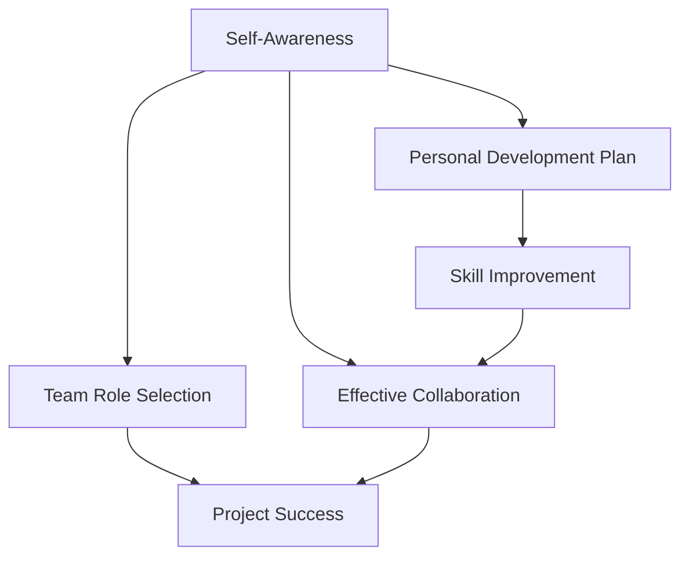
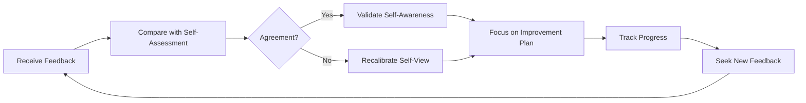

# Strengths and Weaknesses

## Introduction

One of the most common yet challenging questions in technical interviews is "What are your strengths and weaknesses?" This seemingly simple question requires careful introspection and strategic framing. While it might feel uncomfortable to discuss your weaknesses or like you're bragging when highlighting strengths, mastering this question demonstrates self-awareness, honesty, and a growth mindset—qualities highly valued in the tech industry.

This guide will help you approach the strengths and weaknesses question confidently, with practical examples specifically tailored for programmers and developers.

## Understanding the Purpose

Before we dive into strategies, let's understand why interviewers ask this question:

- **To assess self-awareness**: Do you understand your own capabilities and limitations?
- **To evaluate honesty**: Can you speak candidly about yourself?
- **To gauge growth mindset**: Are you committed to learning and improvement?
- **To determine job fit**: Do your strengths align with the role's requirements?

## Discussing Your Strengths

### Identifying Your Strengths

When preparing to discuss your strengths, consider these categories:

1. **Technical skills** (languages, frameworks, tools)
2. **Soft skills** (communication, teamwork, problem-solving)
3. **Character traits** (persistence, attention to detail, creativity)
4. **Domain knowledge** (industry-specific insights)

#### Exercise: Strength Identification

Create three columns:

```
Technical Skills | Soft Skills | Character Traits
-----------------|-------------|----------------
JavaScript       | Clear communication | Persistent
React            | Team collaboration | Detail-oriented
Data structures  | Fast learner       | Analytical
```

### Framing Your Strengths Effectively

Follow this three-part structure for discussing each strength:

1. **Name the strength**
2. **Provide evidence** (specific examples)
3. **Connect to value** (how it benefits the team/company)

#### Example Responses

Here are examples of well-structured strength responses:

**Example 1: Technical Strength**


"One of my core strengths is my proficiency with JavaScript and its ecosystem.
For example, in my last project, I identified a performance bottleneck in our
React application that was causing slow render times. I implemented a custom
memoization strategy that reduced page load time by 40%. This experience
demonstrates not just my technical knowledge, but my ability to apply it to
solve real business problems that impact user experience."


**Example 2: Soft Skill Strength**


"I excel at translating technical concepts for non-technical stakeholders.
When our team built a machine learning recommendation system, I created visual
diagrams and simplified explanations that helped our marketing team understand
how the algorithm worked. This resulted in better collaboration between departments
and more effective feature implementation based on business needs."


### Code Example: Demonstrating Strengths in Practice

Here's how a problem-solving strength might be demonstrated in code:

```javascript
// Problem: Finding performance bottlenecks in an application

// Weak approach: Using console.log for debugging
function processUserData(users) {
  console.log("Starting processing");
  for (let i = 0; i < users.length; i++) {
    console.log(`Processing user ${i}`);
    // Process user data
  }
  console.log("Finished processing");
}

// Strength-demonstrating approach: Using performance metrics and optimization
function processUserData(users) {
  console.time('processUserData');
  
  // Batch processing for efficiency
  const batchSize = 100;
  for (let i = 0; i < users.length; i += batchSize) {
    const batch = users.slice(i, i + batchSize);
    processBatch(batch);
  }
  
  console.timeEnd('processUserData');
  return processedUsers;
}

function processBatch(userBatch) {
  // Optimized batch processing logic
  return userBatch.map(user => {
    // Transform user data efficiently
    return transformedUser;
  });
}
```

## Addressing Your Weaknesses

### Identifying Genuine Weaknesses

When selecting weaknesses to discuss, be honest but strategic:

1. Choose **real** weaknesses (interviewers can detect insincerity)
2. Avoid critical job requirements
3. Select weaknesses you're actively improving
4. Consider skills that you're developing but aren't yet strengths

### The STAR-I Framework for Weaknesses

Use this modified STAR framework with an added "I" for improvement:

- **Situation**: Identify the weakness
- **Task**: Explain when it has been challenging
- **Action**: Share what you're doing to improve
- **Result**: Discuss progress made so far
- **Improvement**: Outline your ongoing development plan

#### Example Responses

**Example 1: Technical Weakness**


"I've found that my database optimization skills aren't as strong as my frontend 
development abilities. On a recent project, I noticed our queries were running 
slowly as our user base grew. Instead of ignoring it, I enrolled in an advanced 
SQL course and worked with our senior database administrator to understand indexing 
strategies. I've already implemented several optimizations that improved query 
performance by 30%, and I'm continuing to deepen my knowledge by reading 'High 
Performance MySQL' and building test databases to practice different optimization 
techniques."


**Example 2: Soft Skill Weakness**


"I've recognized that I sometimes struggle with delegating tasks effectively. As a 
team lead on our last project, I initially tried to handle too many critical path 
items myself, which created a bottleneck. I've addressed this by implementing a 
structured task allocation system where I assess each task against team members' 
skills and development goals. This has not only distributed the workload more 
effectively but has also created growth opportunities for my team members. I'm 
still working on this by checking in with myself regularly during project planning 
to identify delegation opportunities."


### Code Example: Addressing Weaknesses

Here's how addressing a weakness might look in practice:

```javascript
// Weakness: Difficulty writing maintainable code

// Before: Tightly coupled, hard-to-maintain code
function handleUserSubmission() {
  // Get form data
  const username = document.getElementById('username').value;
  const email = document.getElementById('email').value;
  
  // Validate
  if (username.length < 3) {
    alert('Username too short');
    return;
  }
  if (!email.includes('@')) {
    alert('Invalid email');
    return;
  }
  
  // Save to database
  const url = 'https://api.example.com/users';
  fetch(url, {
    method: 'POST',
    body: JSON.stringify({ username, email }),
    headers: { 'Content-Type': 'application/json' }
  })
    .then(response => response.json())
    .then(data => {
      document.getElementById('result').innerHTML = 'Success!';
    })
    .catch(error => {
      document.getElementById('result').innerHTML = 'Error!';
    });
}

// After: Improved code organization showing how I addressed the weakness
// Separation of concerns and improved maintainability
function validateUsername(username) {
  return username.length >= 3;
}

function validateEmail(email) {
  const emailRegex = /^[^\s@]+@[^\s@]+\.[^\s@]+$/;
  return emailRegex.test(email);
}

function getUserFormData() {
  return {
    username: document.getElementById('username').value,
    email: document.getElementById('email').value
  };
}

function displayResult(message, isError = false) {
  const resultElement = document.getElementById('result');
  resultElement.innerHTML = message;
  resultElement.className = isError ? 'error' : 'success';
}

async function saveUserToDatabase(userData) {
  const url = 'https://api.example.com/users';
  try {
    const response = await fetch(url, {
      method: 'POST',
      body: JSON.stringify(userData),
      headers: { 'Content-Type': 'application/json' }
    });
    return await response.json();
  } catch (error) {
    throw new Error('Failed to save user data');
  }
}

async function handleUserSubmission() {
  const userData = getUserFormData();
  
  // Validate
  if (!validateUsername(userData.username)) {
    displayResult('Username too short', true);
    return;
  }
  
  if (!validateEmail(userData.email)) {
    displayResult('Invalid email address', true);
    return;
  }
  
  try {
    const result = await saveUserToDatabase(userData);
    displayResult('User successfully created!');
  } catch (error) {
    displayResult(error.message, true);
  }
}
```

## Common Pitfalls to Avoid

### When Discussing Strengths

1. **Excessive modesty**: Underselling your abilities
2. **Generic statements**: Claiming strengths without evidence
3. **Irrelevant strengths**: Highlighting skills unrelated to the position
4. **Overconfidence**: Coming across as arrogant

### When Discussing Weaknesses

1. **Disguised strengths**: "I work too hard" or "I'm a perfectionist"
2. **Critical weaknesses**: Mentioning deficiencies in must-have skills
3. **Too personal**: Sharing inappropriately personal information
4. **No improvement plan**: Stating weaknesses without remediation strategies

## Real-World Applications

### Strengths and Weaknesses in Team Dynamics

Understanding your strengths and weaknesses is crucial for effective team collaboration:



### Feedback Integration Process

Continuously improving your self-awareness through feedback:



## Preparation Strategies

### Strength and Weakness Inventory Worksheet

Create a personal inventory with these columns:

1. **Strength/Weakness**: Specific skill or trait
2. **Evidence**: Examples from your experience
3. **Impact**: How it affects your work
4. **Improvement Plan**: Steps to leverage or develop
5. **Relevance**: How it relates to the target role

### Tailoring to the Job Description

Review the job description and:

1. Highlight strengths that align with key requirements
2. Identify non-critical areas where you can mention weaknesses
3. Prepare examples that demonstrate your strengths in context

## Summary

Effectively discussing your strengths and weaknesses demonstrates self-awareness, honesty, and a commitment to growth. By following these guidelines, you can transform this challenging interview question into an opportunity to showcase your qualifications and development mindset:

- **For strengths**: Identify relevant capabilities, provide specific evidence, and connect to value
- **For weaknesses**: Choose genuine but non-critical areas, explain your improvement actions, and show progress
- **Always**: Be honest, specific, and growth-oriented in your responses

Remember that the goal isn't to present yourself as perfect, but as a thoughtful professional who understands your own capabilities and continuously works to improve them.

## Additional Resources

### Practice Exercises

1. **Self-Assessment**: Complete the strengths and weaknesses inventory worksheet
2. **Mock Interviews**: Practice your responses with a peer and request feedback
3. **Reflection Journal**: Document instances where your strengths created value and where weaknesses presented challenges

### Books for Further Reading

- "Strength Finder 2.0" by Tom Rath
- "Mindset: The New Psychology of Success" by Carol Dweck
- "Emotional Intelligence 2.0" by Travis Bradberry and Jean Greaves

### Online Resources

- Technical skills assessments to objectively identify strengths
- Industry forums for understanding valued skills in your target role
- Mentorship programs for personalized feedback and development planning