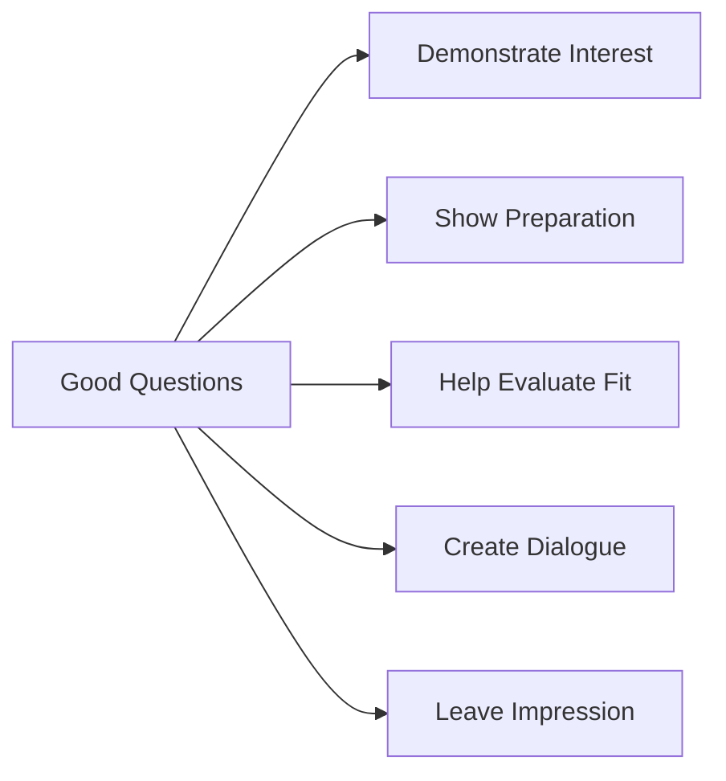

# Questions to Ask Interviewers

## Introduction

The interview process isn't just about answering questions—it's also about asking them. When an interviewer says, "Do you have any questions for me?" this isn't merely a courtesy; it's a critical part of your evaluation. Thoughtful questions demonstrate your genuine interest in the role, show that you've done your research, and highlight your critical thinking skills. This guide will help you prepare effective questions that will leave a lasting positive impression on your interviewer.

## Why Asking Questions Matters

Asking good questions serves multiple purposes:

1. **Demonstrates genuine interest** in the company and position
2. **Shows preparation** and that you've researched the organization
3. **Helps you evaluate** whether the role is a good fit for you
4. **Creates dialogue** rather than a one-sided interrogation
5. **Leaves a memorable impression** as the final part of most interviews



## Categories of Questions to Prepare

### 1. Role-Specific Questions

These questions focus on the day-to-day responsibilities and expectations for the position.

**Examples:**
- "Could you describe a typical day for someone in this role?"
- "What are the most important skills for success in this position?"
- "How is performance measured for this role?"
- "What challenges might I face in the first 90 days?"
- "How does this role contribute to the company's larger goals?"

### 2. Team and Management Questions

Understanding team dynamics and management style helps assess cultural fit.

**Examples:**
- "How is the team structured?"
- "What's your management style?"
- "How does the team collaborate and communicate?"
- "Can you tell me about the team members I'd be working with directly?"
- "How are decisions typically made on the team?"

### 3. Technical Environment Questions

For programming roles, understanding the technical landscape is crucial.

**Examples:**
- "What programming languages and frameworks does your team use?"
- "How do you handle version control and code reviews?"
- "What's your approach to testing and quality assurance?"
- "Can you describe your development and deployment processes?"
- "How do you handle technical debt?"

**Sample dialogue:**

```
You: "I'm curious about your development process. Could you walk me through how a feature typically goes from idea to production?"

Interviewer: "We follow a modified agile approach. Features are first discussed in planning, then broken down into tickets. Developers create PRs that go through code review, automated testing, QA, and finally deployment through our CI/CD pipeline."

You: "That's helpful. How long does a typical deployment cycle take?"
```

### 4. Company Culture Questions

These questions help assess whether the company's values align with yours.

**Examples:**
- "How would you describe the company culture?"
- "What do people enjoy most about working here?"
- "How does the company support professional development and learning?"
- "What kind of social or team-building activities do you organize?"
- "How does the company approach work-life balance?"

### 5. Growth and Development Questions

Show that you're thinking long-term about your career path.

**Examples:**
- "What opportunities for advancement exist for someone in this role?"
- "How does the company support continuing education or skill development?"
- "Could you share examples of career paths of people who previously held this position?"
- "What skills would I need to develop to grow within the organization?"
- "Do you offer mentorship or coaching programs?"

### 6. Company Direction Questions

These demonstrate that you've researched the company and care about its future.

**Examples:**
- "I noticed the company recently [launched product/announced initiative]. How does this fit into the overall strategy?"
- "What are the biggest challenges and opportunities the company is facing?"
- "Where do you see the company in 3-5 years?"
- "How does this team fit into the company's long-term vision?"
- "What excites you most about the company's future?"

## Questions to Avoid

Not all questions are good questions. Here are some types to avoid:

1. **Questions easily answered by basic research**
   - "What does your company do?"
   - "When was the company founded?"

2. **Premature questions about benefits and compensation**
   - While important, save detailed compensation discussions for later stages or when the interviewer brings them up

3. **Overly personal questions** about the interviewer

4. **Negative questions** that might imply criticism
   - "Why is employee turnover so high?"
   - "Why have your company's stock prices been dropping?"

5. **Yes/no questions** that don't foster conversation

## Strategic Questioning Techniques

### Prioritize Your Questions

You typically only have time for 3-5 questions, so prioritize the most important ones.

### Listen Actively

Many of your prepared questions might be answered during the interview. Listen actively and adapt accordingly.

### Ask Follow-up Questions

When appropriate, ask follow-up questions to show you're engaged and thinking critically about their answers.

### Take Notes

Jotting down key points from their answers shows you're taking the conversation seriously.

### Frame Questions Positively

Instead of "Do you provide feedback to employees?" ask "How do you approach giving feedback to team members?"

## Tailoring Questions by Interview Stage

### First-Round/Screening Interviews

Focus on role clarity and essential information:
- "What are the core responsibilities of this position?"
- "What are you looking for in an ideal candidate?"

### Technical Interviews

Include questions about technical processes and environments:
- "What's your approach to code reviews?"
- "How do you handle technical disagreements within the team?"

### Final-Round Interviews

Focus on long-term fit and decision-making:
- "What would success look like for me in the first year?"
- "What are the next steps in the interview process?"

## Sample Question Script

Here's how to structure your questions at the end of an interview:

```
Interviewer: "Do you have any questions for us?"

You: "Yes, thank you for asking. I've prepared a few questions.

First, I'm curious about how the engineering team approaches problem-solving. Could you walk me through a recent challenge the team faced and how you overcame it?

[Listen to their answer and possibly ask a follow-up]

I also noticed your company recently announced [specific initiative]. How does this role contribute to that project?

[Listen to their answer]

Finally, what does success look like for someone in this position during their first six months?"
```

## Evaluating Answers

Remember that an interview is a two-way street. Pay attention to:

1. **Transparency** - Are they giving clear, direct answers or being evasive?
2. **Enthusiasm** - Do they seem excited about the company and role?
3. **Alignment** - Do their answers align with your values and career goals?
4. **Red flags** - Watch for signs of poor management, toxic culture, or unrealistic expectations

## Practice Exercise

Prepare three questions for each of the following categories:
1. Role-specific questions
2. Team and management questions
3. Technical environment questions
4. Company culture questions
5. Growth and development questions

Then, practice asking these questions with a friend or mentor in a mock interview setting.

## Summary

Asking thoughtful questions is a powerful way to demonstrate your interest, preparation, and critical thinking skills during an interview. By preparing questions across multiple categories and tailoring them to the specific role and company, you'll not only impress your interviewers but also gather valuable information to help you decide if the position is right for you.

The best questions create meaningful dialogue, show that you've done your research, and help you evaluate whether the role aligns with your skills, values, and career goals. Remember to prioritize your questions, listen actively, and ask thoughtful follow-ups.

## Additional Resources

- **Books:**
  - "Cracking the Coding Interview" (includes a section on questions to ask)
  - "Power Questions: Build Relationships, Win New Business, and Influence Others"

- **Practice:**
  - Join mock interview groups
  - Conduct informational interviews with professionals in your field

Remember that asking good questions is a skill that improves with practice. The more interviews you participate in, the more comfortable you'll become with this crucial part of the process.