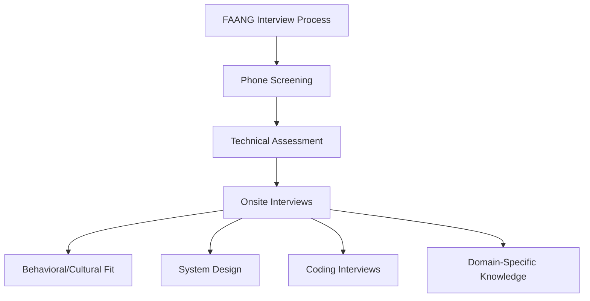
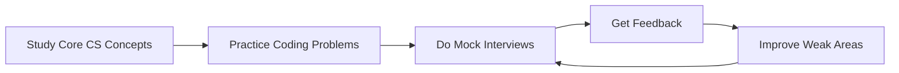

# FAANG Interview Specifics

## Introduction

When preparing for technical interviews at top-tier technology companies—often referred to as FAANG (Facebook/Meta, Apple, Amazon, Netflix, and Google)—understanding the specific interview styles and expectations of each company can significantly improve your chances of success. While these companies share similarities in their hiring processes, each has unique emphases and interview structures that require targeted preparation.

This guide will walk you through the specific interview formats, question types, and cultural elements that are characteristic of each FAANG company, helping you tailor your preparation effectively.

## Common FAANG Interview Elements

Before diving into company-specific details, let's understand the shared elements across most FAANG interviews:



All FAANG companies typically include:
- Initial resume screening
- Phone/video technical interviews
- Coding assessments
- Onsite interviews (multiple rounds)
- System design questions (for mid to senior roles)
- Behavioral and cultural fit assessments

## Company-Specific Interview Formats

### Meta (Formerly Facebook)

Meta's interview process typically follows this structure:

1. **Initial Technical Screen**: 45-minute coding interview focusing on data structures and algorithms.
2. **Onsite Interviews**: Usually 4-5 interviews including:
   - 2 Coding interviews (45 minutes each)
   - 1 System design interview (for experienced candidates)
   - 1 Behavioral/"Ninja" interview focusing on Meta's values
   - 1 Architecture interview (for senior roles)

**What Makes Meta Different:**
- Strong emphasis on coding efficiency and optimal solutions
- "Ninja" interview that assesses culture fit with Meta's move-fast mentality
- Preference for candidates who can demonstrate impact and ownership

**Example Meta Coding Question:**

```javascript
/**
 * Given a string containing only three types of characters: '(', ')' and '*',
 * where '*' can be treated as a single right parenthesis ')' or a single left parenthesis '(' or an empty string,
 * determine if the input string is valid.
 * 
 * Input: s = "(*))"
 * Output: true
 * Explanation: '*' can be treated as '(' to match the second ')'.
 */

function checkValidString(s) {
    let minOpen = 0;
    let maxOpen = 0;
    
    for (let char of s) {
        if (char === '(') {
            minOpen++;
            maxOpen++;
        } else if (char === ')') {
            minOpen = Math.max(0, minOpen - 1);
            maxOpen--;
        } else if (char === '*') {
            minOpen = Math.max(0, minOpen - 1); // * as )
            maxOpen++; // * as (
        }
        
        if (maxOpen < 0) return false;
    }
    
    return minOpen === 0;
}

// Example usage
console.log(checkValidString("(*))"));  // Output: true
console.log(checkValidString("(("));    // Output: false
```

### Apple

Apple's interview process typically follows this structure:

1. **Initial Phone Screen**: Technical questions and discussion about your background.
2. **Technical Phone Interview**: Coding problems focused on practical implementation.
3. **Onsite Interviews**: Usually 4-6 interviews including:
   - Multiple coding rounds
   - System design
   - Team fit interviews

**What Makes Apple Different:**
- Greater emphasis on practical coding over theoretical algorithm optimization
- Strong focus on quality, attention to detail, and user experience
- Questions often relate to Apple products or systems
- Team fit is highly valued—expect questions about collaboration

**Example Apple Coding Question:**

```swift
/**
 * Design a simplified version of a music playlist system.
 * Implement functionality to add songs, remove songs, and skip to the next song.
 * 
 * Input: Operations on the playlist
 * Output: Current state of the playlist after operations
 */

class Song {
    let id: String
    let title: String
    let artist: String
    
    init(id: String, title: String, artist: String) {
        self.id = id
        self.title = title
        self.artist = artist
    }
}

class Playlist {
    private var songs: [Song] = []
    private var currentIndex: Int = -1
    
    // Add a song to the playlist
    func addSong(_ song: Song) {
        songs.append(song)
        // If this is the first song, set current index to 0
        if currentIndex == -1 {
            currentIndex = 0
        }
    }
    
    // Remove a song by ID
    func removeSong(id: String) -> Bool {
        guard let index = songs.firstIndex(where: { $0.id == id }) else {
            return false
        }
        
        songs.remove(at: index)
        
        // Adjust currentIndex if necessary
        if songs.isEmpty {
            currentIndex = -1
        } else if index <= currentIndex {
            currentIndex = max(0, currentIndex - 1)
        }
        
        return true
    }
    
    // Skip to the next song
    func nextSong() -> Song? {
        guard !songs.isEmpty else {
            return nil
        }
        
        currentIndex = (currentIndex + 1) % songs.count
        return currentSong()
    }
    
    // Get the current song
    func currentSong() -> Song? {
        guard !songs.isEmpty, currentIndex >= 0 else {
            return nil
        }
        return songs[currentIndex]
    }
    
    // Get all songs in the playlist
    func getAllSongs() -> [Song] {
        return songs
    }
}

// Example usage
let playlist = Playlist()
playlist.addSong(Song(id: "1", title: "Hello", artist: "Adele"))
playlist.addSong(Song(id: "2", title: "Shape of You", artist: "Ed Sheeran"))
print(playlist.currentSong()?.title ?? "No song") // Output: "Hello"
print(playlist.nextSong()?.title ?? "No song")    // Output: "Shape of You"
```

### Amazon

Amazon's interview process typically follows this structure:

1. **Online Assessment**: Coding problems and work simulation assessment.
2. **Phone Screen**: Technical and behavioral questions.
3. **Onsite Interviews**: Usually 4-5 interviews including:
   - Coding interviews
   - System design
   - "Bar raiser" interview (conducted by someone outside the hiring team)
   - Leadership Principles assessments embedded in all interviews

**What Makes Amazon Different:**
- Heavy emphasis on Amazon's 16 Leadership Principles in every interview
- "Bar raiser" interview to ensure company-wide hiring standards
- Strong focus on scalability and efficiency in both coding and system design
- Behavioral questions using the STAR method (Situation, Task, Action, Result)

**Example Amazon Coding Question:**

```java
/**
 * Design an LRU (Least Recently Used) cache with a given capacity.
 * Implement the following operations:
 * - get(key): Get the value of the key if it exists in the cache, otherwise return -1
 * - put(key, value): Set or insert the value if the key is not already present
 *   When the cache reaches its capacity, invalidate the least recently used item
 * 
 * Input: Operations on the LRU cache
 * Output: Results of the operations
 */

import java.util.HashMap;
import java.util.Map;

class LRUCache {
    class Node {
        int key;
        int value;
        Node prev;
        Node next;
        
        Node(int key, int value) {
            this.key = key;
            this.value = value;
        }
    }
    
    private Map<Integer, Node> map;
    private Node head, tail;
    private int capacity;
    
    public LRUCache(int capacity) {
        this.capacity = capacity;
        map = new HashMap<>();
        head = new Node(0, 0);
        tail = new Node(0, 0);
        head.next = tail;
        tail.prev = head;
    }
    
    public int get(int key) {
        if (map.containsKey(key)) {
            Node node = map.get(key);
            removeNode(node);
            addNode(node);
            return node.value;
        }
        return -1;
    }
    
    public void put(int key, int value) {
        if (map.containsKey(key)) {
            removeNode(map.get(key));
        }
        
        if (map.size() == capacity) {
            removeNode(tail.prev);
        }
        
        addNode(new Node(key, value));
    }
    
    private void addNode(Node node) {
        Node nextNode = head.next;
        head.next = node;
        node.prev = head;
        node.next = nextNode;
        nextNode.prev = node;
        map.put(node.key, node);
    }
    
    private void removeNode(Node node) {
        Node prevNode = node.prev;
        Node nextNode = node.next;
        prevNode.next = nextNode;
        nextNode.prev = prevNode;
        map.remove(node.key);
    }
}

// Example usage
LRUCache cache = new LRUCache(2);
cache.put(1, 1);
cache.put(2, 2);
System.out.println(cache.get(1));    // Output: 1
cache.put(3, 3);                     // evicts key 2
System.out.println(cache.get(2));    // Output: -1 (not found)
```

### Netflix

Netflix's interview process typically follows this structure:

1. **Recruiter Screen**: Discussion about experience and culture fit.
2. **Technical Phone Interview**: Coding problems and architecture discussions.
3. **Onsite Interviews**: Usually 4-5 interviews including:
   - Multiple coding rounds
   - System design
   - Culture fit interviews

**What Makes Netflix Different:**
- Extremely high bar for senior engineering talent
- Strong emphasis on culture fit with Netflix's values (especially "Freedom and Responsibility")
- System design questions often involve streaming technology, recommendation systems, or high-scale problems
- Less structured interview process compared to other FAANG companies

**Example Netflix Coding Question:**

```python
"""
Design a rate limiter for an API that allows a maximum of n requests per minute per user.
If a user exceeds their limit, their requests should be rejected.

Input: A sequence of requests with user IDs and timestamps
Output: Whether each request is accepted or rejected
"""

import time
from collections import defaultdict, deque

class RateLimiter:
    def __init__(self, requests_per_minute):
        self.requests_per_minute = requests_per_minute
        self.user_requests = defaultdict(deque)
    
    def is_allowed(self, user_id, timestamp):
        # Clean up expired requests (older than 1 minute)
        window_start = timestamp - 60
        
        while (self.user_requests[user_id] and 
               self.user_requests[user_id][0] <= window_start):
            self.user_requests[user_id].popleft()
        
        # Check if user has capacity
        if len(self.user_requests[user_id]) < self.requests_per_minute:
            self.user_requests[user_id].append(timestamp)
            return True
        else:
            return False

# Example usage
limiter = RateLimiter(3)  # 3 requests per minute

# Simulate requests
requests = [
    (1, 0),      # user 1, time 0
    (1, 20),     # user 1, time 20
    (1, 40),     # user 1, time 40
    (1, 50),     # user 1, time 50 (exceeds limit)
    (2, 50),     # user 2, time 50
    (1, 100)     # user 1, time 100 (first request expired)
]

for user_id, timestamp in requests:
    result = limiter.is_allowed(user_id, timestamp)
    print(f"User {user_id} request at time {timestamp}: {'Accepted' if result else 'Rejected'}")

# Output:
# User 1 request at time 0: Accepted
# User 1 request at time 20: Accepted
# User 1 request at time 40: Accepted
# User 1 request at time 50: Rejected
# User 2 request at time 50: Accepted
# User 1 request at time 100: Accepted
```

### Google

Google's interview process typically follows this structure:

1. **Phone Screen**: Technical questions covering data structures and algorithms.
2. **Onsite Interviews**: Usually 4-5 interviews including:
   - Multiple coding rounds (45 minutes each)
   - System design (for experienced candidates)
   - Googleyness and leadership assessment

**What Makes Google Different:**
- Strong focus on algorithm optimization and computational complexity
- Questions often require creative problem-solving approaches
- Clear emphasis on testing and edge cases
- "Googleyness" assessment that measures culture fit

**Example Google Coding Question:**

```python
"""
Given a list of points on a 2D plane, find the k closest points to the origin (0, 0).
The distance between two points is the Euclidean distance.

Input: points = [[1,3],[-2,2]], k = 1
Output: [[-2,2]]
Explanation: The distance between (1, 3) and the origin is sqrt(10).
The distance between (-2, 2) and the origin is sqrt(8).
Since sqrt(8) < sqrt(10), (-2, 2) is closer to the origin.
"""

import heapq
import math

def k_closest(points, k):
    # Calculate distance and use a max heap to keep track of k closest points
    max_heap = []
    
    for point in points:
        # Calculate squared distance (no need for sqrt for comparison)
        distance = point[0] ** 2 + point[1] ** 2
        
        # Add to heap
        if len(max_heap) < k:
            # Negative distance because Python has min heap by default
            heapq.heappush(max_heap, (-distance, point))
        elif -max_heap[0][0] > distance:
            # If this point is closer than the farthest in our heap
            heapq.heappop(max_heap)
            heapq.heappush(max_heap, (-distance, point))
    
    # Extract the points from the heap
    return [point for (_, point) in max_heap]

# Example usage
points1 = [[1, 3], [-2, 2]]
k1 = 1
print(k_closest(points1, k1))  # Output: [[-2, 2]]

points2 = [[3, 3], [5, -1], [-2, 4]]
k2 = 2
print(k_closest(points2, k2))  # Output: [[3, 3], [-2, 4]]
```

## Preparing for FAANG Interviews

### Study Plan Recommendations

Based on the specific requirements of each company, here's a recommended study plan:

1. **Core Data Structures & Algorithms** (All Companies)
   - Arrays, Strings, Linked Lists
   - Trees, Graphs
   - Hash Tables, Stacks, Queues
   - Sorting and Searching
   - Dynamic Programming
   - Recursion

2. **Company-Specific Focus Areas**
   - **Meta**: Graph algorithms, efficiency optimization
   - **Apple**: OOP design, practical coding challenges
   - **Amazon**: Leadership principles preparation, scalable systems
   - **Netflix**: Distributed systems, streaming architecture
   - **Google**: Algorithm optimization, computational complexity

3. **System Design** (Senior+ Roles)
   - Scalability principles
   - Microservices architecture
   - Database design
   - Caching strategies
   - Load balancing

### Mock Interview Preparation

One of the most effective ways to prepare is through mock interviews:



Consider:
- Using platforms like LeetCode, HackerRank, or Pramp
- Finding study partners for mock interviews
- Recording yourself solving problems to review your communication
- Timing your solutions to improve efficiency

## Company-Specific Behavioral Preparation

### Meta Values to Emphasize
- Building social value
- Moving fast and taking risks
- Being bold and focusing on impact
- Being open and transparent

### Apple Values to Emphasize
- Attention to detail
- User-centric thinking
- Innovation and quality
- Collaboration and teamwork

### Amazon Leadership Principles to Emphasize
- Customer Obsession
- Ownership
- Invent and Simplify
- Learn and Be Curious
- Insist on the Highest Standards
- Think Big
- Bias for Action

### Netflix Values to Emphasize
- Freedom and Responsibility
- High Performance
- Context, not Control
- Highly Aligned, Loosely Coupled
- Continuous Improvement

### Google Values to Emphasize
- Technical excellence
- User focus
- Collaboration
- Innovation
- Intellectual humility

## Common Mistakes to Avoid

1. **Not asking clarifying questions**
   - Always confirm requirements and constraints before diving into solutions

2. **Jumping to code too quickly**
   - Explain your approach before coding

3. **Not communicating during problem-solving**
   - Think aloud and explain your reasoning throughout

4. **Ignoring edge cases**
   - Consider empty inputs, large numbers, boundary conditions

5. **Not testing your code**
   - Walk through your solution with examples after implementing

## Summary

FAANG interviews share many common elements but differ in significant ways that reflect each company's culture and priorities. Understanding these differences can help you tailor your preparation and increase your chances of success.

Remember that interview preparation is a marathon, not a sprint. Give yourself enough time to:
- Master core computer science fundamentals
- Practice company-specific question types
- Prepare for behavioral questions
- Develop your system design skills (for senior roles)

With targeted preparation and consistent practice, you can successfully navigate the challenging FAANG interview process.

## Additional Resources

- LeetCode's company-specific question collections
- "Cracking the Coding Interview" by Gayle Laakmann McDowell
- "System Design Interview" by Alex Xu
- Online coding practice platforms (HackerRank, CodeSignal)
- Mock interview services (interviewing.io, Pramp)
- Company engineering blogs for insight into their technical challenges and priorities