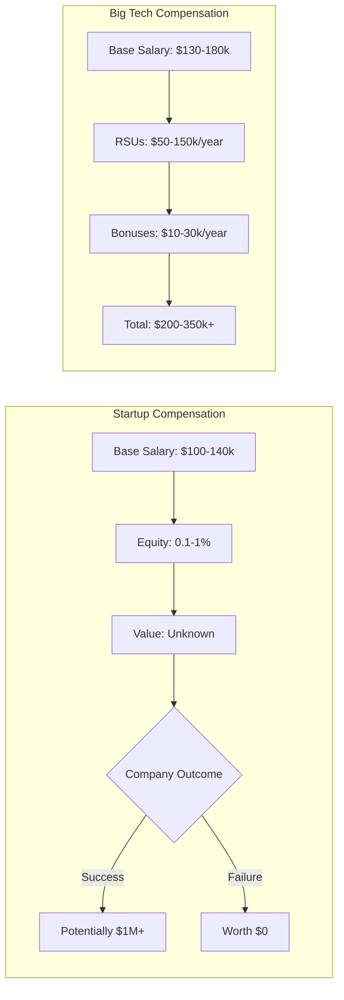
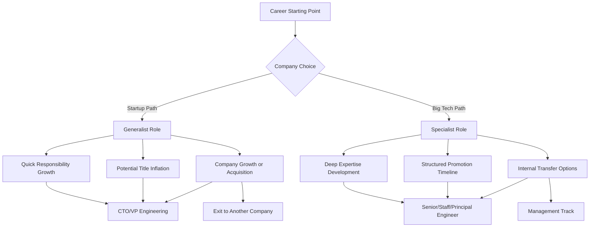

# Startups vs. Big Tech Companies

## Introduction

When planning your programming career, one of the most significant decisions you'll face is choosing between working at a startup or a big tech company. Each environment offers distinct advantages, challenges, and growth opportunities. This guide will help you understand the key differences between these two paths and how to prepare for each.

## What Are Startups and Big Tech Companies?

### Startups

Startups are young companies in their early stages of operation, typically focused on developing an innovative product or service. They're often characterized by:

- Small team sizes (usually fewer than 100 employees)
- Limited resources and funding
- Rapid growth goals
- High-risk, high-reward potential
- Flexible and evolving work structures

Examples include early-stage companies working on new technologies, apps, or platforms that have received initial funding but haven't yet reached maturity.

### Big Tech Companies

Big Tech (sometimes called FAANG+ or MAANG+) typically refers to large, established technology companies with:

- Thousands of employees across multiple teams
- Significant market capitalization
- Established products and revenue streams
- Structured hierarchies and processes
- Global presence

Examples include Google, Apple, Amazon, Microsoft, Meta, Netflix, and other large technology corporations.

## Work Environment and Culture

<div className="comparison-table">

| Aspect | Startups | Big Tech |
|--------|---------|----------|
| **Work pace** | Fast, sometimes chaotic | Methodical, process-driven |
| **Decision making** | Quick, often flat hierarchy | Structured, multiple approval layers |
| **Roles** | Generalist, wearing multiple hats | Specialist, focused responsibilities |
| **Impact visibility** | High individual impact on product | Contributing to a larger system |
| **Work hours** | Often irregular/long (40-60+ hours) | Usually more predictable (40-45 hours) |
| **Culture** | Mission-driven, personal connections | Professional, team-oriented |

</div>

### Startup Culture Deep Dive

Working at a startup often means being part of a close-knit team where everyone shares a passionate belief in the company's mission. You'll likely:

- Have direct access to founders and leadership
- Participate in company-wide decisions
- See your contributions implemented quickly
- Experience rapid change in priorities and direction
- Need to be comfortable with ambiguity and uncertainty

```jsx
// Startup work often involves handling multiple responsibilities
const startupDeveloperDay = () => {
  const tasks = [
    "Write new feature code",
    "Debug production issue",
    "Join customer call",
    "Help with marketing website",
    "Interview potential teammate",
    "Discuss product roadmap"
  ];
  
  return tasks.map(task => <Task description={task} timeBudgeted="As needed" />);
};
```

### Big Tech Culture Deep Dive

At established tech companies, you'll typically experience:

- Well-defined processes and expectations
- Specialized roles with clear boundaries
- Multiple layers of management
- Extensive resources and support systems
- Stability and established products

```jsx
// Big Tech work often involves specialized focus
const bigTechDeveloperDay = () => {
  const tasks = [
    "Design microservice architecture",
    "Code review team members' PRs",
    "Implement assigned feature",
    "Document API changes",
    "Attend team planning meeting"
  ];
  
  return tasks.map(task => <Task description={task} estimatedHours={2} />);
};
```

## Compensation and Benefits

<div className="comparison-container">

### Startup Compensation

- **Base salary**: Often 10-30% lower than big tech
- **Equity**: Significant equity grants (0.1%-1%+ for early employees)
- **Benefits**: Sometimes limited, improving as company grows
- **Risk/reward**: High potential upside if company succeeds, but equity may become worthless

### Big Tech Compensation

- **Base salary**: Higher than industry average
- **Equity**: Predictable RSUs or stock options with known value
- **Benefits**: Comprehensive (health, retirement, perks)
- **Stability**: Reliable compensation with predictable increases

</div>

Let's look at a simplified compensation comparison:



## Technical Skills and Growth

### Skill Development at Startups

At startups, you'll likely gain:

- **Breadth of knowledge** across the full stack
- Experience with **rapid iteration and deployment**
- **Business and product skills** beyond pure engineering
- Ability to **solve problems with limited resources**

```jsx
// Example of the technical breadth needed at startups
const startupTechStack = {
  frontend: ["React", "CSS", "Responsive Design"],
  backend: ["Node.js", "Express", "API Design"],
  infrastructure: ["AWS/Cloud", "CI/CD", "Cost Optimization"],
  data: ["Database Design", "Analytics", "Metrics"],
  business: ["User Acquisition", "Product Market Fit", "Pitch Support"]
};
```

### Skill Development at Big Tech

At larger companies, expect to develop:

- **Deep expertise** in specific technologies or domains
- Experience with **large-scale systems** and performance
- Knowledge of **enterprise-level architecture**
- **Collaborative skills** working on complex, multi-team projects

```jsx
// Example of the technical depth at big tech
const bigTechSpecialization = {
  role: "Backend Engineer",
  primaryFocus: ["Java", "Distributed Systems", "High Availability"],
  secondarySkills: ["Performance Optimization", "Scalability"],
  tools: ["Proprietary Frameworks", "Advanced Monitoring"],
  processes: ["Design Documents", "Code Reviews", "A/B Testing"]
};
```

## Career Advancement

<div className="comparison-container">

### Career Path at Startups

- **Trajectory**: Often rapid title advancement
- **Path**: Less structured, opportunity-based promotion
- **Growth**: Frequent role changes as company evolves
- **Leadership**: Opportunities to build teams from scratch

### Career Path at Big Tech

- **Trajectory**: Well-defined career ladders
- **Path**: Clear promotion criteria and expectations
- **Growth**: Structured performance reviews and feedback
- **Leadership**: Established management training and paths

</div>



## The Interview Process

### Startup Interviews

Startup interviews tend to focus on:

- Cultural fit and alignment with mission
- Practical coding skills relevant to their specific needs
- Problem-solving abilities with limited resources
- Adaptability and learning speed

```jsx
// Typical startup interview process
const startupInterviewProcess = [
  {
    stage: "Initial screen",
    focus: "Basic technical skills and culture fit",
    format: "Call with founder or engineering lead",
    duration: "30 minutes"
  },
  {
    stage: "Technical assessment",
    focus: "Practical coding skills relevant to role",
    format: "Take-home project or pair programming",
    duration: "2-4 hours"
  },
  {
    stage: "Onsite/remote final interview",
    focus: "Team dynamics and deeper technical evaluation",
    format: "Multiple 1:1 interviews with team members",
    duration: "2-3 hours"
  },
  {
    stage: "Decision",
    timeframe: "Usually within days"
  }
];
```

### Big Tech Interviews

Big tech companies typically have more structured processes:

- Standardized algorithm and data structure questions
- System design for senior roles
- Behavioral questions based on company values
- Multiple rounds with different team members

```jsx
// Typical big tech interview process
const bigTechInterviewProcess = [
  {
    stage: "Recruiter screen",
    focus: "Resume verification and role fit",
    format: "Phone call",
    duration: "30 minutes"
  },
  {
    stage: "Technical phone screen",
    focus: "Basic algorithms and coding ability",
    format: "Coding in shared document or platform",
    duration: "45-60 minutes"
  },
  {
    stage: "Online assessment (some companies)",
    focus: "Coding challenges",
    format: "Timed coding problems",
    duration: "1-2 hours"
  },
  {
    stage: "Onsite/virtual onsite",
    focus: "Multiple aspects of technical and cultural fit",
    rounds: [
      "2-3 coding interviews (algorithms & data structures)",
      "1 system design interview (for experienced roles)",
      "1-2 behavioral interviews"
    ],
    duration: "4-6 hours"
  },
  {
    stage: "Team matching (some companies)",
    focus: "Finding the right team fit",
    format: "Additional calls with potential teams",
    duration: "Varies"
  },
  {
    stage: "Decision",
    timeframe: "1-3 weeks typically"
  }
];
```

## Interview Preparation Strategy

### For Startups

1. **Research the company thoroughly**
   - Understand their product, market, and challenges
   - Be prepared to discuss why their mission resonates with you

2. **Highlight adaptability and initiative**
   - Prepare examples of wearing multiple hats
   - Show how you can work with limited resources

3. **Prepare for practical coding challenges**
   - Focus on building real features rather than abstract algorithms
   - Be ready to explain trade-offs in your approach

### For Big Tech

1. **Master core algorithms and data structures**
   - Study common interview topics (trees, graphs, dynamic programming)
   - Practice with platforms like LeetCode, HackerRank, or AlgoExpert

2. **Develop system design knowledge**
   - Understand scalability, reliability, and performance concepts
   - Practice designing large-scale distributed systems

3. **Prepare structured behavioral responses**
   - Use the STAR method (Situation, Task, Action, Result)
   - Align examples with the company's stated values

```jsx
// Example study plan for big tech interviews
const bigTechStudyPlan = {
  algorithmsAndDataStructures: [
    { topic: "Arrays & Strings", timeAllocation: "1 week" },
    { topic: "Linked Lists", timeAllocation: "3 days" },
    { topic: "Trees & Graphs", timeAllocation: "1 week" },
    { topic: "Dynamic Programming", timeAllocation: "2 weeks" },
    { topic: "System Design", timeAllocation: "2 weeks" }
  ],
  practiceStrategy: "50 LeetCode problems (mix of easy/medium/hard)",
  mockInterviews: "2-3 with peers or interview practice services"
};
```

## Making Your Decision

When deciding between startups and big tech, consider:

### Personal Factors

- **Risk tolerance**: Can you handle the uncertainty of a startup?
- **Work style**: Do you prefer structure or flexibility?
- **Learning preferences**: Depth vs. breadth of knowledge
- **Career goals**: Leadership, technical depth, or entrepreneurship?

### Practical Considerations

- **Financial needs**: Current compensation vs. potential upside
- **Life stage**: Family obligations, stability requirements
- **Location preferences**: Remote options vs. office requirements
- **Industry interests**: Specific domains or technologies

## Hybrid Approaches

Many successful careers include both startup and big tech experiences:

1. **Big Tech First**: Gain training, credentials, and savings at a large company before moving to startups
2. **Startup First**: Develop broad skills and rapid growth at startups before specializing at big tech
3. **Alternating Pattern**: Move between both environments throughout your career

## Summary

Both startups and big tech companies offer valuable career opportunities for programmers, with different advantages:

**Startups provide:**
- Broader skill development
- Greater individual impact
- Potential for significant equity upside
- Faster responsibility growth
- Less structured environments

**Big Tech offers:**
- Higher base compensation
- Better work-life balance
- Deeper technical specialization
- More structured career progression
- Access to large-scale problems and resources

The best choice depends on your personal preferences, career goals, and current life situation. Many successful engineers experience both environments throughout their careers.

## Additional Resources

### Books
- "The Alliance" by Reid Hoffman
- "Working in Public" by Nadia Eghbal
- "The Year Without Pants" by Scott Berkun

### Online Resources
- Tech career subreddits (/r/cscareerquestions)
- Levels.fyi for compensation data
- Company-specific preparation guides

## Exercises

1. Create a personal decision matrix with your top 5 priorities for a job and score both startup and big tech options.

2. Research 3 startups and 3 big tech companies you might be interested in. Note their:
   - Interview processes
   - Technology stacks
   - Company cultures
   - Growth trajectories

3. Connect with at least one person working at a startup and one at a big tech company for an informational interview.

4. Practice answering these reflection questions:
   - What kind of impact do you want to have in your role?
   - How important is work-life balance to you currently?
   - What skills do you most want to develop in your next role?
   - How does compensation factor into your decision-making?