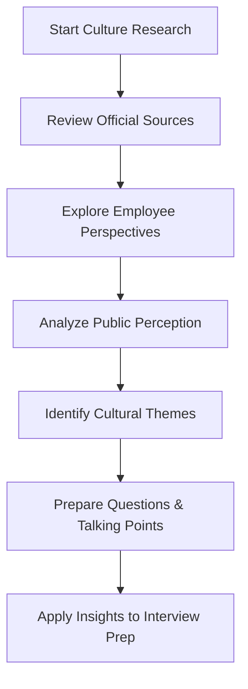

# Company Culture Research

## Introduction

When preparing for programming interviews, technical skills often take center stage. However, understanding a company's culture is equally important for finding the right fit and succeeding in your interviews. Company culture research involves investigating the values, work environment, communication styles, and organizational practices that define how a company operates.

This guide will help you develop a systematic approach to researching company culture, giving you valuable insights that can help you tailor your interview responses, ask informed questions, and ultimately determine if a company aligns with your personal and professional goals.

## Why Research Company Culture?

Understanding company culture benefits you in multiple ways:

1. **Interview performance**: Demonstrating knowledge of the company's values shows your genuine interest and preparation
2. **Informed decision-making**: Helps you evaluate if the company is a good fit for your working style and career goals
3. **Smoother onboarding**: Knowing the culture in advance reduces adaptation time if you join the company
4. **Question preparation**: Enables you to ask targeted questions during interviews
5. **Application customization**: Allows you to tailor your resume and cover letter to highlight relevant experiences

## Company Culture Research Process

Let's break down the research process into manageable steps:



### Step 1: Review Official Sources

Start by examining the company's own materials to understand how they present themselves:

- **Company website**: Pay special attention to their "About Us," "Careers," or "Our Values" pages
- **Job descriptions**: Look for recurring themes in how they describe their ideal candidates
- **Company blog**: Review recent posts to understand current priorities and voice
- **Mission and vision statements**: Identify the core principles guiding the organization
- **Annual reports**: For public companies, these provide insights into priorities and challenges

**Example Analysis**:

```javascript
// Simple object to collect cultural insights from official sources
const officialSourcesInsights = {
  companyName: "TechInnovate",
  statedValues: ["Innovation", "Collaboration", "Customer-focus", "Diversity"],
  languagePatterns: {
    recurring: ["disruptive", "fast-paced", "ownership", "impact"],
    tone: "ambitious but casual"
  },
  emphasisAreas: ["product excellence", "work-life balance", "learning culture"]
};

// Function to identify potential cultural fit points
function identifyCulturalFitPoints(myValues, companyValues) {
  return myValues.filter(value => companyValues.statedValues.includes(value));
}

const myValues = ["Collaboration", "Work-life balance", "Learning"];
const fitPoints = identifyCulturalFitPoints(myValues, officialSourcesInsights);
console.log("Potential cultural fit points:", fitPoints);
// Output: Potential cultural fit points: ["Collaboration"]
```

### Step 2: Explore Employee Perspectives

After reviewing official sources, seek out employee perspectives for a more authentic view:

- **Glassdoor/Indeed reviews**: Look for patterns in positive and negative feedback
- **LinkedIn**: Find current and former employees, noting their career progression and language
- **Team member interviews or blogs**: Search for interviews where employees discuss their experiences
- **Company podcasts or videos**: These often showcase the actual work environment
- **Social media accounts**: Both official and employee accounts can provide cultural insights

**Practical Example**:

```javascript
// Simple function to analyze employee reviews
function analyzeEmployeeReviews(reviews) {
  // Count positive and negative mentions of common cultural aspects
  const culturalMentions = {
    "work-life balance": { positive: 0, negative: 0 },
    "management style": { positive: 0, negative: 0 },
    "career growth": { positive: 0, negative: 0 },
    "collaboration": { positive: 0, negative: 0 },
    "communication": { positive: 0, negative: 0 }
  };
  
  // Analyze each review (simplified example)
  reviews.forEach(review => {
    Object.keys(culturalMentions).forEach(aspect => {
      if (review.text.toLowerCase().includes(aspect)) {
        if (review.sentiment > 0) {
          culturalMentions[aspect].positive++;
        } else {
          culturalMentions[aspect].negative++;
        }
      }
    });
  });
  
  return culturalMentions;
}

// Example output:
// {
//   "work-life balance": { positive: 12, negative: 8 },
//   "management style": { positive: 7, negative: 15 },
//   "career growth": { positive: 18, negative: 3 },
//   "collaboration": { positive: 14, negative: 5 },
//   "communication": { positive: 6, negative: 11 }
// }
```

### Step 3: Analyze Public Perception

Understand how the company is perceived in the broader community:

- **News articles**: Recent news can reveal challenges or achievements
- **Industry reports**: How the company is positioned in its market
- **Social media sentiment**: What customers and the public say about the company
- **Community involvement**: How the company engages with its community
- **Product reviews**: What users think of the company's products or services

### Step 4: Identify Cultural Themes

Synthesize your research to identify consistent cultural themes:

- **Decision-making processes**: Hierarchical vs. flat, consensus-driven vs. top-down
- **Communication styles**: Formal vs. casual, transparent vs. need-to-know
- **Work environment**: Collaborative vs. independent, office-based vs. remote-friendly
- **Pace and pressure**: Fast-paced vs. methodical, high-pressure vs. balanced
- **Innovation approach**: Disruptive vs. incremental, risk-taking vs. conservative

**Example Analysis Tool**:

```javascript
// Function to create a cultural profile
function createCompanyCultureProfile(companyName, researchData) {
  const profile = {
    companyName,
    decisionMaking: {
      style: "", // e.g., "consensus-driven", "hierarchical"
      evidence: []
    },
    communication: {
      style: "", // e.g., "transparent", "formal"
      evidence: []
    },
    workEnvironment: {
      style: "", // e.g., "collaborative", "independent"
      evidence: []
    },
    paceAndPressure: {
      level: "", // e.g., "fast-paced", "balanced"
      evidence: []
    },
    innovationApproach: {
      style: "", // e.g., "disruptive", "incremental"
      evidence: []
    }
  };
  
  // This would be populated based on your research
  return profile;
}

// Example usage
const cultureProfile = createCompanyCultureProfile("TechInnovate", researchData);
console.log(`${cultureProfile.companyName} has a ${cultureProfile.workEnvironment.style} work environment`);
```

### Step 5: Prepare Questions & Talking Points

Use your cultural insights to prepare interview materials:

- **Questions to ask interviewers** that demonstrate your research and genuine interest
- **Stories and experiences** that highlight your fit with their culture
- **Conversation starters** related to company initiatives or values
- **Personal value alignments** to emphasize during interviews

**Example Questions Based on Research**:

```javascript
// Function to generate culture-related interview questions
function generateCultureQuestions(cultureProfile) {
  const questions = [];
  
  if (cultureProfile.decisionMaking.style === "consensus-driven") {
    questions.push("Could you share an example of how teams reach consensus on important technical decisions?");
  }
  
  if (cultureProfile.workEnvironment.style === "collaborative") {
    questions.push("I noticed your company emphasizes collaboration. How do engineering teams typically work together on projects?");
  }
  
  if (cultureProfile.innovationApproach.style === "disruptive") {
    questions.push("Your company is known for innovative approaches. How do you balance innovation with meeting established product requirements?");
  }
  
  return questions;
}

// Example output would be contextual interview questions
```

## Practical Research Methods

Let's explore specific methods for researching company culture:

### Method 1: Build a Company Culture Dashboard

Create a simple dashboard to organize your findings:

```javascript
// Example structure for a company culture dashboard
class CompanyCultureDashboard {
  constructor(companyName) {
    this.company = companyName;
    this.officialValues = [];
    this.employeeInsights = [];
    this.publicPerception = [];
    this.culturalThemes = {};
    this.potentialFitAreas = [];
    this.potentialChallenges = [];
    this.questionsToAsk = [];
  }
  
  addOfficialValue(value, source) {
    this.officialValues.push({ value, source });
  }
  
  addEmployeeInsight(insight, sentiment, source) {
    this.employeeInsights.push({ insight, sentiment, source });
  }
  
  // More methods for adding and analyzing data
  
  generateReport() {
    // Method to create a summary report of findings
    return {
      company: this.company,
      dominantThemes: this.getDominantThemes(),
      fitSummary: this.analyzeFit(),
      preparationPoints: this.generatePreparationPoints()
    };
  }
}

// Example usage
const dashboard = new CompanyCultureDashboard("TechInnovate");
dashboard.addOfficialValue("Innovation", "Company website");
dashboard.addEmployeeInsight("Open communication between teams", "positive", "Glassdoor review");
```

### Method 2: Conduct a Systematic Review of Online Resources

Follow this process to ensure comprehensive research:

1. **Create a spreadsheet** with columns for Source, Insight, Sentiment, and Relevance
2. **Set a research time limit** (e.g., 2 hours) to avoid going down rabbit holes
3. **Prioritize sources** from most official to most speculative
4. **Look for consensus** and recurring themes across multiple sources
5. **Note contradictions** between official messaging and employee experiences

### Method 3: Informational Interviews

Connect with current or former employees:

```javascript
// Template for informational interview requests
const informationalInterviewTemplate = `
Hello [Name],

I hope this message finds you well. I'm [Your Name], a [Your Position] interested in learning more about [Company]'s culture and environment. I noticed you've been with the company for [Time Period] as a [Their Position].

Would you be open to a brief 15-20 minute conversation to share your insights about the company culture? I'm particularly interested in [Specific Aspects].

Thank you for considering, and I understand if your schedule doesn't permit.

Best regards,
[Your Name]
`;

// Function to personalize the template
function createPersonalizedOutreach(contact, yourInfo, specificInterests) {
  return informationalInterviewTemplate
    .replace('[Name]', contact.name)
    .replace('[Your Name]', yourInfo.name)
    .replace('[Your Position]', yourInfo.position)
    .replace('[Company]', contact.company)
    .replace('[Time Period]', contact.tenurePeriod)
    .replace('[Their Position]', contact.position)
    .replace('[Specific Aspects]', specificInterests.join(', '))
    .replace('[Your Name]', yourInfo.name);
}
```

## Applying Your Research in Interviews

Once you've gathered cultural insights, put them to work:

### 1. Customizing Your Responses

Align your interview answers with the company's values:

```javascript
// Function to help tailor responses to cultural fit
function tailorResponse(questionType, personalExperience, companyValues) {
  let tailoredResponse = "";
  
  switch(questionType) {
    case "teamwork":
      if (companyValues.includes("collaboration")) {
        tailoredResponse = `In my experience at ${personalExperience.company}, I prioritized collaboration by ${personalExperience.collaborationExample}. This aligns with your company's emphasis on teamwork.`;
      }
      break;
    case "challenge":
      if (companyValues.includes("innovation")) {
        tailoredResponse = `When facing the challenge of ${personalExperience.challengeExample}, I took an innovative approach by ${personalExperience.innovativeSolution}. I understand innovation is core to your company.`;
      }
      break;
    // Additional cases for other question types
  }
  
  return tailoredResponse;
}
```

### 2. Asking Insightful Questions

Use your research to formulate questions that demonstrate genuine interest:

- "I noticed your company blog emphasized cross-functional collaboration. Could you share how engineering teams typically interact with product and design?"
- "Your CEO mentioned a focus on 'customer-obsessed innovation' in her recent interview. How does this value manifest in day-to-day engineering decisions?"
- "I read that your company implemented a flexible work policy last year. How has this affected team dynamics and collaboration?"

### 3. Assessing Your Own Fit

Be honest with yourself about cultural compatibility:

```javascript
// Self-assessment tool for cultural fit
function assessPersonalFit(personalPreferences, companyCulture) {
  const fitAssessment = {
    alignmentAreas: [],
    potentialChallenges: [],
    overallFitScore: 0
  };
  
  // Compare work style preferences
  if (personalPreferences.workStyle === companyCulture.workEnvironment.style) {
    fitAssessment.alignmentAreas.push("Work style");
    fitAssessment.overallFitScore += 1;
  } else {
    fitAssessment.potentialChallenges.push(`Your preference for ${personalPreferences.workStyle} work may contrast with their ${companyCulture.workEnvironment.style} environment`);
  }
  
  // Compare communication preferences
  // Compare pace preferences
  // Compare other important dimensions
  
  return fitAssessment;
}
```

## Common Cultural Dimensions in Tech Companies

Different tech companies may emphasize various cultural aspects:

1. **Innovation culture**: How companies approach new ideas and change
   - Disruptive vs. incremental
   - Bottom-up vs. top-down
   - Experimental vs. proven approaches

2. **Work-life balance**: How companies view the relationship between work and personal life
   - Results-focused vs. hours-focused
   - Flexible vs. structured hours
   - Remote-friendly vs. office-centric

3. **Decision-making**: How decisions are made within the organization
   - Data-driven vs. intuition-led
   - Consensus-seeking vs. hierarchical
   - Quick decisions vs. thorough analysis

4. **Engineering values**: Technical priorities that shape development approaches
   - Speed vs. quality
   - Reusability vs. customization
   - Cutting-edge vs. stable technology

5. **Feedback culture**: How feedback is given and received
   - Direct vs. diplomatic
   - Frequent vs. periodic
   - Peer-based vs. manager-led

## Real-World Example: Researching a Tech Company

Let's walk through a simplified example of researching a fictional tech company:

```javascript
// Example company culture research for "CodeCraft"
const codeCraftResearch = {
  officialSources: {
    website: "Emphasizes 'craftsmanship', 'sustainable code', and 'work-life harmony'",
    blog: "Regular posts about technical excellence and thoughtful design",
    careers: "Highlights mentorship, growth opportunities, and collaborative environment"
  },
  
  employeePerspectives: {
    glassdoor: {
      overall: 4.2,
      pros: ["Strong engineering culture", "Good work-life balance", "Technical excellence"],
      cons: ["Sometimes slow decision making", "Extensive code review process"]
    },
    linkedin: "Employees average 4.5 years tenure, many mention 'learning' and 'growth'"
  },
  
  publicPerception: {
    news: "Known for stable, high-quality products rather than bleeding-edge innovation",
    customers: "Praise for reliability and customer support, some mention slower release cycles"
  }
};

// Analysis of cultural themes
const codeCraftThemes = {
  decisionMaking: "Consensus-driven, thoughtful approach favoring quality over speed",
  workEnvironment: "Collaborative with strong emphasis on mentorship and knowledge sharing",
  paceAndPressure: "Moderate pace with focus on sustainability over constant shipping",
  innovationApproach: "Incremental improvement rather than disruptive innovation",
  engineeringValues: "Code quality, maintainability, and craftsmanship prioritized"
};

// Preparing for an interview
const interviewPrep = {
  alignmentPoints: [
    "Share examples of maintaining code quality while meeting deadlines",
    "Discuss experience with thorough code review processes",
    "Highlight collaborative problem-solving experiences"
  ],
  questionsToAsk: [
    "How do you balance code quality with delivery timelines?",
    "Could you describe how mentorship works within engineering teams?",
    "What does 'craftsmanship' mean in your day-to-day engineering practices?"
  ]
};
```

## Summary and Key Takeaways

Researching company culture is a critical part of interview preparation that goes beyond technical skills:

1. **Comprehensive research** involves examining official sources, employee perspectives, and public perception
2. **Cultural insights** help you tailor your interview responses and determine your fit
3. **Systematic approach** using tools like culture dashboards ensures thorough preparation
4. **Authentic alignment** matters more than simply mimicking company values
5. **Two-way assessment** allows you to evaluate if the company is right for you

Remember that company culture research is not just about impressing interviewers—it's about finding a workplace where you can thrive professionally and personally.

## Additional Resources

To deepen your understanding of company culture research:

- **Books**:
  - "The Culture Code" by Daniel Coyle
  - "Work Rules!" by Laszlo Bock
  - "Powerful" by Patty McCord

- **Practice Exercises**:
  1. Create a culture dashboard for three companies you're interested in
  2. Conduct an informational interview with someone at your target company
  3. Analyze the cultural differences between companies in the same industry

- **Online Resources**:
  - Company review sites (Glassdoor, Blind, Indeed)
  - Corporate blogs and social media accounts
  - Industry analysis reports

By thoroughly researching company culture, you position yourself not just for interview success, but for finding a workplace where you can thrive and grow throughout your career.