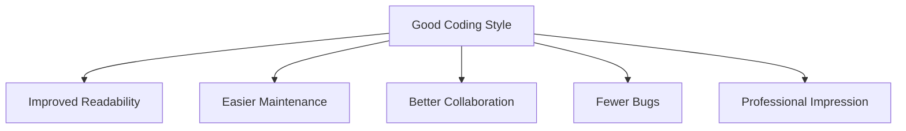

# Coding Style Guidelines

## Introduction

Coding style guidelines are a set of rules and conventions that dictate how your code should be formatted and structured. Think of them as the grammar and punctuation rules of programming. While they don't affect how your code functions, they dramatically impact readability, maintainability, and collaboration.

When you join a company, you'll likely need to follow their specific coding standards. This guide will help you understand common coding style guidelines and why they matter in professional environments.

## Why Coding Style Matters



### Benefits of Consistent Coding Style:

1. **Readability**: Code is read far more often than it's written. Clean, well-formatted code is easier to understand.
2. **Maintainability**: When you (or others) return to code months later, good style makes it easier to modify.
3. **Collaboration**: Teams can work together more efficiently when everyone follows the same conventions.
4. **Error Reduction**: Consistent formatting helps spot logical errors and bugs more quickly.
5. **Onboarding**: New team members can get up to speed faster with standardized code.

## Common Coding Style Elements

### 1. Naming Conventions

Different programming languages have different conventional naming styles:

```javascript
// JavaScript Example
// camelCase for variables and functions
const userName = "JohnDoe";
function calculateTotal(items) {
  // function body
}

// PascalCase for classes
class UserAccount {
  // class body
}

// UPPER_SNAKE_CASE for constants
const MAX_LOGIN_ATTEMPTS = 5;
```

```python
# Python Example
# snake_case for variables and functions
user_name = "JohnDoe"
def calculate_total(items):
    # function body
    pass

# PascalCase for classes
class UserAccount:
    # class body
    pass

# UPPER_SNAKE_CASE for constants
MAX_LOGIN_ATTEMPTS = 5
```

### 2. Indentation and Spacing

Consistent indentation is crucial for readability:

```java
// Good indentation (Java)
public class Example {
    public static void main(String[] args) {
        if (condition) {
            doSomething();
        } else {
            doSomethingElse();
        }
    }
}

// Poor indentation - hard to follow
public class Example {
public static void main(String[] args) {
if (condition) {
doSomething();
} else {
doSomethingElse();
}
}
}
```

### 3. Comments and Documentation

Good code includes helpful comments:

```python
# Python example with good comments

def calculate_age(birth_year, current_year):
    """
    Calculate a person's age based on birth year.
    
    Args:
        birth_year (int): The year the person was born
        current_year (int): The current year
        
    Returns:
        int: The calculated age
    """
    # Ensure birth_year isn't in the future
    if birth_year > current_year:
        return 0
    
    return current_year - birth_year
```

### 4. Line Length and Wrapping

Most style guides recommend keeping lines under a certain length (often 80-120 characters):

```javascript
// Bad: Very long line
const result = performComplicatedCalculation(firstParameter, secondParameter, thirdParameter, fourthParameter, fifthParameter);

// Better: Wrapped for readability
const result = performComplicatedCalculation(
    firstParameter,
    secondParameter, 
    thirdParameter,
    fourthParameter,
    fifthParameter
);
```

### 5. File Organization

Well-organized files make navigation easier:

```javascript
// JavaScript file organization example

// 1. Imports/dependencies
import React from 'react';
import { formatDate } from '../utils/dates';

// 2. Constants
const MAX_ITEMS = 10;

// 3. Component/Class definition
function ItemList({ items }) {
  // 4. Component state and hooks
  const [selectedItem, setSelectedItem] = useState(null);
  
  // 5. Helper methods
  const handleItemClick = (item) => {
    setSelectedItem(item);
  };
  
  // 6. Render/return
  return (
    <div className="item-list">
      {/* Component UI */}
    </div>
  );
}

// 7. Exports
export default ItemList;
```

## Company-Specific Style Guides

### Popular Style Guides

Different companies and organizations maintain specific style guides:

- **Google**: Has language-specific style guides for [Java](https://google.github.io/styleguide/javaguide.html), [Python](https://google.github.io/styleguide/pyguide.html), etc.
- **Airbnb**: Known for their JavaScript style guide
- **PEP 8**: The Python Enhancement Proposal that covers Python style guidelines

### Enforcing Style: Linters and Formatters

Most companies use automated tools to enforce coding standards:

```bash
# Example of running ESLint (JavaScript linter)
npx eslint src/

# Example of running Black (Python formatter)
black my_python_file.py
```

Popular tools by language:
- **JavaScript**: ESLint, Prettier
- **Python**: Flake8, Black, pylint
- **Java**: Checkstyle, PMD
- **C#**: StyleCop

## Practical Example: Refactoring Bad Code

Let's look at a real-world example of improving code style:

**Before:**

```javascript
function calc(a,b,t)
{
let res;
if(t=="add"){res=a+b}
else if(t=="subtract"){res=a-b}
else if(t=="multiply"){res=a*b}
else{res=a/b;}
return res;
}
```

**After:**

```javascript
/**
 * Performs basic arithmetic operations on two numbers.
 * @param {number} a - First number
 * @param {number} b - Second number
 * @param {string} operation - Type of operation: "add", "subtract", "multiply", or "divide"
 * @returns {number} Result of the arithmetic operation
 */
function calculateResult(a, b, operation) {
    let result;
    
    switch (operation) {
        case "add":
            result = a + b;
            break;
        case "subtract":
            result = a - b;
            break;
        case "multiply":
            result = a * b;
            break;
        case "divide":
            if (b === 0) {
                throw new Error("Cannot divide by zero");
            }
            result = a / b;
            break;
        default:
            throw new Error("Invalid operation");
    }
    
    return result;
}
```

Improvements made:
1. Descriptive function and parameter names
2. Proper spacing and indentation
3. Defensive programming (checking for divide by zero)
4. JSDoc comments explaining purpose and parameters
5. Consistent formatting and braces
6. Switch statement instead of multiple if-else conditions

## Adapting to Company Guidelines

When joining a new company:

1. **Ask for the style guide**: Most companies have documentation for their coding standards.
2. **Review existing code**: Look at current projects to understand conventions.
3. **Setup your IDE**: Configure your development environment with the right linters and formatters.
4. **Seek feedback**: During code reviews, ask specifically about style improvements.

## Common Style Guidelines by Language

Here are some language-specific conventions you might encounter:

### JavaScript/TypeScript
- Use semicolons at the end of statements
- Use single quotes for strings
- Two space indentation
- Declare variables with `const` unless they need to be reassigned

### Python
- Four space indentation
- Use docstrings for functions and classes
- Follow PEP 8 guidelines
- Use underscores for file names (`user_authentication.py`)

### Java
- Use braces for all control structures
- Four space indentation
- One class per file
- Classes start with uppercase letter

## Summary

Coding style guidelines may seem trivial compared to algorithmic challenges, but they're essential in professional environments. They make code more readable, maintainable, and collaborative. As you prepare to join a company as a developer:

- Learn the common style conventions for your programming language
- Practice writing clean, well-formatted code
- Use linters and formatters to help enforce good habits
- Be prepared to adapt to company-specific guidelines

Remember: Code is for humans to read and only incidentally for computers to execute. Good style shows professionalism and consideration for others who will read your code.

## Additional Resources

- [Clean Code by Robert C. Martin](https://www.amazon.com/Clean-Code-Handbook-Software-Craftsmanship/dp/0132350882)
- [Google Style Guides](https://google.github.io/styleguide/)
- [PEP 8 -- Style Guide for Python Code](https://www.python.org/dev/peps/pep-0008/)
- [JavaScript Standard Style](https://standardjs.com/)

## Exercises

1. Take a small program you've written and apply a specific style guide to it.
2. Download and configure a linter for your preferred programming language.
3. Review open-source code from popular projects to observe their styling conventions.
4. Find and fix styling issues in the following code snippet:

```python
def sort_and_find(LIST,target):
  SORTED=sorted(LIST)
  for i in range(0,len(SORTED)):
    if SORTED[i]==target:return i
  return -1
```