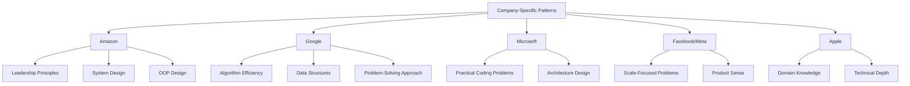

# Company-Specific Challenges

## Introduction

When preparing for technical interviews, understanding the unique challenges and patterns favored by specific companies can significantly improve your chances of success. Different tech companies often have distinct interview styles, preferred problem types, and evaluation criteria that reflect their engineering culture and values.

This guide will help you identify and prepare for company-specific challenges, enabling you to tailor your preparation strategy for your target companies.

## Why Companies Have Different Interview Patterns

Companies develop unique interviewing approaches based on several factors:

- **Company Values and Culture**: Amazon may focus on leadership principles, while Google might emphasize algorithmic thinking
- **Technical Stack**: A company using React heavily might ask more front-end specific questions
- **Historical Success**: Companies tend to repeat question patterns that have successfully identified strong candidates
- **Team-Specific Needs**: Database teams may focus on SQL optimization, while mobile teams ask about mobile architecture

## Identifying Company-Specific Patterns

Before diving into specific preparation, you need to understand what makes each company's interview process unique:

### Research Methods

1. **Official Company Resources**
   - Company careers pages often provide interview preparation guidance
   - Engineering blogs sometimes discuss the hiring process

2. **Online Platforms**
   - LeetCode has company-specific question collections
   - Glassdoor contains interview experiences from past candidates

3. **Network Connections**
   - Connect with current or former employees
   - Join communities where interview experiences are shared

### Common Company Patterns

While each company is unique, here are some well-known patterns:



## Preparing for Specific Companies

Let's look at how to prepare for interviews at some major tech companies:

### Amazon

Amazon's interviews typically focus on their leadership principles alongside technical skills:

1. **Leadership Principles**
   - Prepare stories that demonstrate customer obsession, ownership, and bias for action
   - Expect behavioral questions that probe these principles

2. **Technical Focus Areas**
   - System design with scalability concerns
   - Object-oriented programming questions
   - Medium-difficulty algorithm questions

**Example Amazon Interview Problem:**

```javascript
// Problem: Design a logging system that can handle different log levels and destinations
// This tests OOP design skills and the "Invent and Simplify" leadership principle

class Logger {
  constructor(level = 'INFO', destinations = ['CONSOLE']) {
    this.level = level;
    this.destinations = destinations;
    this.logLevels = {
      'DEBUG': 0,
      'INFO': 1,
      'WARNING': 2,
      'ERROR': 3,
      'CRITICAL': 4
    };
    this.outputs = {
      'CONSOLE': (msg) => console.log(msg),
      'FILE': (msg) => this.writeToFile(msg),
      'DATABASE': (msg) => this.writeToDatabase(msg)
    };
  }

  log(message, level = 'INFO') {
    // Only log if the message level is >= current logger level
    if (this.logLevels[level] >= this.logLevels[this.level]) {
      const logMessage = `[${level}] ${new Date().toISOString()}: ${message}`;
      
      // Send to all configured destinations
      this.destinations.forEach(dest => {
        this.outputs[dest](logMessage);
      });
      
      return true;
    }
    return false;
  }
  
  // Additional methods for specific destinations
  writeToFile(message) {
    // Implementation for file writing would go here
    console.log(`Writing to file: ${message}`);
  }
  
  writeToDatabase(message) {
    // Implementation for database logging would go here
    console.log(`Writing to database: ${message}`);
  }
  
  // Methods to configure the logger
  addDestination(destination) {
    if (this.outputs[destination] && !this.destinations.includes(destination)) {
      this.destinations.push(destination);
    }
  }
  
  setLevel(level) {
    if (this.logLevels[level] !== undefined) {
      this.level = level;
    }
  }
}

// Example usage
const logger = new Logger('WARNING', ['CONSOLE', 'FILE']);
logger.log('This is debug info', 'DEBUG'); // Won't log (DEBUG < WARNING)
logger.log('System warning', 'WARNING'); // Will log to console and file
logger.log('Critical error', 'CRITICAL'); // Will log to console and file
logger.addDestination('DATABASE');
logger.log('Another critical issue', 'CRITICAL'); // Will log to all three destinations
```

**Output:**
```
Writing to file: [WARNING] 2023-07-15T14:22:34.567Z: System warning
[WARNING] 2023-07-15T14:22:34.567Z: System warning
Writing to file: [CRITICAL] 2023-07-15T14:22:34.568Z: Critical error
[CRITICAL] 2023-07-15T14:22:34.568Z: Critical error
Writing to file: [CRITICAL] 2023-07-15T14:22:34.569Z: Another critical issue
[CRITICAL] 2023-07-15T14:22:34.569Z: Another critical issue
Writing to database: [CRITICAL] 2023-07-15T14:22:34.569Z: Another critical issue
```

### Google

Google interviews emphasize strong computer science fundamentals:

1. **Algorithm Efficiency**
   - Focus on time and space complexity optimization
   - Expect to discuss multiple approaches with tradeoffs

2. **Data Structures**
   - Deep knowledge of arrays, trees, graphs, and hash tables
   - Understanding when to use specific data structures

3. **Problem-Solving Process**
   - Clear communication of your thought process
   - Testing your solution with edge cases

**Example Google Interview Problem:**

```python
# Problem: Given a binary tree, find the length of the longest path where each node 
# in the path has the same value.

class TreeNode:
    def __init__(self, val=0, left=None, right=None):
        self.val = val
        self.left = left
        self.right = right

def longest_uni_value_path(root):
    longest = [0]  # Using a list to allow modification in recursive function
    
    def dfs(node):
        if not node:
            return 0
            
        # Get lengths from child nodes
        left_length = dfs(node.left)
        right_length = dfs(node.right)
        
        # Reset lengths if values don't match
        left_arrow = 0
        if node.left and node.left.val == node.val:
            left_arrow = left_length + 1
            
        right_arrow = 0
        if node.right and node.right.val == node.val:
            right_arrow = right_length + 1
        
        # Update global maximum (path can go through root, so we add both arrows)
        longest[0] = max(longest[0], left_arrow + right_arrow)
        
        # Return the longer one for path extension
        return max(left_arrow, right_arrow)
    
    dfs(root)
    return longest[0]

# Example usage
# Tree:     1
#          / \
#         4   5
#        / \   \
#       4   4   5
root = TreeNode(1)
root.left = TreeNode(4)
root.right = TreeNode(5)
root.left.left = TreeNode(4)
root.left.right = TreeNode(4)
root.right.right = TreeNode(5)

print(f"Longest uni-value path length: {longest_uni_value_path(root)}")
```

**Output:**
```
Longest uni-value path length: 2
```

### Microsoft

Microsoft's interviews typically blend practical problem-solving with design questions:

1. **Practical Coding Problems**
   - Focus on code that works correctly and handles edge cases
   - Emphasis on clean, maintainable solutions

2. **Architecture Design**
   - Designing components and systems
   - Understanding trade-offs in design decisions

**Example Microsoft Interview Problem:**

```csharp
// Problem: Implement a simple file system with create, delete, and find operations

using System;
using System.Collections.Generic;
using System.Linq;

public class FileSystem
{
    private class Node
    {
        public string Name { get; set; }
        public bool IsFile { get; set; }
        public Dictionary<string, Node> Children { get; set; }
        public string Content { get; set; }

        public Node(string name, bool isFile)
        {
            Name = name;
            IsFile = isFile;
            if (!isFile)
            {
                Children = new Dictionary<string, Node>();
            }
        }
    }

    private Node root;

    public FileSystem()
    {
        root = new Node("/", false);
    }

    public List<string> Find(string path, string pattern)
    {
        // Navigate to the directory
        string[] parts = path.Split('/', StringSplitOptions.RemoveEmptyEntries);
        Node current = root;
        
        foreach (var part in parts)
        {
            if (!current.Children.ContainsKey(part) || current.Children[part].IsFile)
            {
                return new List<string>(); // Directory doesn't exist
            }
            current = current.Children[part];
        }
        
        // Search for matching files and directories
        List<string> results = new List<string>();
        FindMatches(current, pattern, "", results);
        return results;
    }
    
    private void FindMatches(Node node, string pattern, string currentPath, List<string> results)
    {
        foreach (var child in node.Children)
        {
            string fullName = currentPath + "/" + child.Key;
            
            // Check if name matches pattern (simplified wildcard handling)
            if (MatchesPattern(child.Key, pattern))
            {
                results.Add(fullName);
            }
            
            // Recursively search subdirectories
            if (!child.Value.IsFile)
            {
                FindMatches(child.Value, pattern, fullName, results);
            }
        }
    }
    
    private bool MatchesPattern(string name, string pattern)
    {
        // Simple pattern matching - "*" means any characters
        if (pattern == "*") return true;
        
        if (pattern.StartsWith("*") && pattern.EndsWith("*"))
        {
            string middle = pattern.Substring(1, pattern.Length - 2);
            return name.Contains(middle);
        }
        else if (pattern.StartsWith("*"))
        {
            string end = pattern.Substring(1);
            return name.EndsWith(end);
        }
        else if (pattern.EndsWith("*"))
        {
            string start = pattern.Substring(0, pattern.Length - 1);
            return name.StartsWith(start);
        }
        else
        {
            return name == pattern;
        }
    }

    public bool CreateFile(string filePath, string content)
    {
        return Create(filePath, true, content);
    }
    
    public bool CreateDirectory(string dirPath)
    {
        return Create(dirPath, false, null);
    }
    
    private bool Create(string path, bool isFile, string content)
    {
        string[] parts = path.Split('/', StringSplitOptions.RemoveEmptyEntries);
        Node current = root;
        
        // Navigate to parent directory, creating directories as needed
        for (int i = 0; i < parts.Length - 1; i++)
        {
            string part = parts[i];
            
            if (!current.Children.ContainsKey(part))
            {
                current.Children[part] = new Node(part, false);
            }
            else if (current.Children[part].IsFile)
            {
                return false; // Cannot create in a file
            }
            
            current = current.Children[part];
        }
        
        // Create the final file or directory
        string name = parts[parts.Length - 1];
        
        if (current.Children.ContainsKey(name))
        {
            return false; // Already exists
        }
        
        current.Children[name] = new Node(name, isFile);
        
        if (isFile)
        {
            current.Children[name].Content = content;
        }
        
        return true;
    }
    
    public bool Delete(string path)
    {
        string[] parts = path.Split('/', StringSplitOptions.RemoveEmptyEntries);
        
        if (parts.Length == 0)
        {
            return false; // Cannot delete root
        }
        
        Node current = root;
        
        // Navigate to parent directory
        for (int i = 0; i < parts.Length - 1; i++)
        {
            string part = parts[i];
            
            if (!current.Children.ContainsKey(part) || current.Children[part].IsFile)
            {
                return false; // Path doesn't exist
            }
            
            current = current.Children[part];
        }
        
        // Delete the final node
        string name = parts[parts.Length - 1];
        
        if (!current.Children.ContainsKey(name))
        {
            return false; // Doesn't exist
        }
        
        current.Children.Remove(name);
        return true;
    }
}

// Usage example:
// var fs = new FileSystem();
// fs.CreateDirectory("/documents");
// fs.CreateFile("/documents/resume.txt", "My resume content");
// fs.CreateDirectory("/documents/projects");
// var files = fs.Find("/documents", "*.txt");
// Console.WriteLine(string.Join(", ", files)); // Output: /documents/resume.txt
// fs.Delete("/documents/resume.txt");
```

## Company-Specific Preparation Strategies

Now that we've seen examples of company patterns, here's how to prepare effectively:

### 1. Create a Company-Specific Study Plan

For each target company, build a customized study plan:

```javascript
// Example structure for a company preparation plan
const amazonPrepPlan = {
  technicalFocus: [
    'Dynamic Programming',
    'Object-Oriented Design',
    'System Design (distributed systems)'
  ],
  behavioralPrep: {
    leadershipPrinciples: [
      { principle: 'Customer Obsession', stories: ['Project X success story'] },
      { principle: 'Ownership', stories: ['When I fixed production bug Y'] }
    ]
  },
  resources: [
    'Amazon Leadership Principles documentation',
    'System Design primer',
    'LeetCode Amazon question collection'
  ],
  schedule: {
    week1: 'Focus on algorithms and data structures',
    week2: 'Practice OOP design problems',
    week3: 'System design practice and behavioral prep',
    week4: 'Mock interviews and final review'
  }
};
```

### 2. Practice with Real Questions

Collect and practice using past interview questions from your target companies:

- Use platforms like LeetCode, HackerRank, or AlgoExpert that have company-specific question sets
- Focus on questions reported within the last 6-12 months as most relevant
- Simulate the actual interview environment when practicing

### 3. Company Culture Research

Understand the company's engineering culture to better align your answers:

- Read engineering blogs published by the company
- Follow company tech leaders on social media
- Understand the company's products in depth
- Research recent technical challenges they've faced

### 4. Mock Interviews

Practice with people familiar with the specific company if possible:

- Find former or current employees for practice sessions
- Join interview preparation communities
- Record your sessions to identify areas for improvement

## Common Mistakes to Avoid

When preparing for company-specific challenges, avoid these pitfalls:

1. **Over-generalizing preparation**: Not tailoring your study plan to specific companies
2. **Neglecting behavioral aspects**: Technical skills alone aren't enough
3. **Focusing only on algorithms**: Missing system design or domain-specific knowledge
4. **Not practicing communication**: Failing to clearly articulate your thought process
5. **Ignoring company values**: Not connecting your answers to what the company cares about

## Success Stories

Here's how real candidates have succeeded with company-specific preparation:

> "After three failed Google interviews, I finally analyzed their pattern. I noticed they cared deeply about algorithm efficiency and data structure choices. I spent two months focusing specifically on space-time complexity analysis and advanced data structures. In my fourth interview, I was able to discuss three different approaches to each problem with clear complexity analysis. I received an offer one week later."
> — Software Engineer at Google

> "For my Amazon interview, I made sure every answer tied back to their leadership principles. When asked about handling team conflicts, I structured my response around 'Earn Trust' and 'Have Backbone; Disagree and Commit.' The interviewer specifically mentioned how well my examples aligned with Amazon's values."
> — Senior Developer at Amazon

## Summary

Preparing for company-specific challenges requires a tailored approach that goes beyond generic interview preparation:

1. **Research** to understand the unique patterns of your target companies
2. **Create** a customized preparation plan for each company
3. **Practice** with relevant questions and mock interviews
4. **Connect** your skills and experiences to the company's values and needs

By understanding what makes each company's interview process unique, you'll be better equipped to showcase your skills in the most relevant way and increase your chances of success.

## Additional Resources

- **Books**: 
  - "Cracking the Coding Interview" by Gayle Laakmann McDowell
  - "System Design Interview" by Alex Xu

- **Online Practice**: 
  - LeetCode Premium (for company-specific questions)
  - Pramp (for peer mock interviews)

- **Communities**:
  - Blind (for company-specific interview experiences)
  - Reddit's r/cscareerquestions

## Exercises

1. **Company Analysis**: Choose three companies you're interested in and research their interview patterns. Create a table comparing their focus areas.

2. **Pattern Recognition**: Find five recent interview experiences for a specific company and identify common themes or questions.

3. **Mock Interview**: Practice a company-specific interview with a friend, focusing on both technical questions and behavioral aspects aligned with that company's values.

4. **Leadership Principle Stories**: For Amazon specifically, prepare a story for each of their leadership principles based on your past experiences.

5. **System Design Practice**: Choose a product from a target company and practice designing a scaled-down version of it, focusing on the architectural patterns that company is known for.

Remember that company-specific preparation is about quality, not quantity. It's better to deeply understand the patterns and expectations of a few target companies than to have shallow knowledge of many.