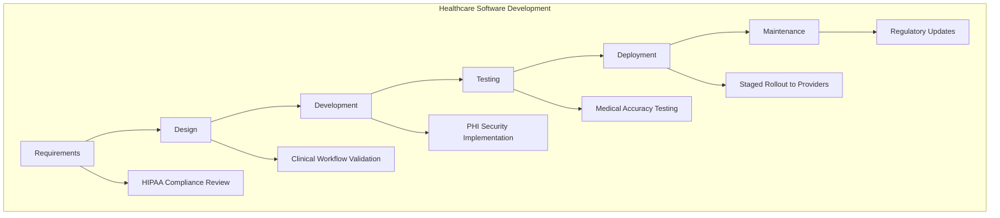

# Industry-Specific Knowledge

## Introduction

When preparing for a programming role, technical skills alone aren't always enough to stand out. Companies often seek candidates who understand their specific industry's challenges, terminology, and workflows. This industry-specific knowledge—also called domain expertise—can be the differentiating factor that helps you land the job and succeed in your role.

In this guide, we'll explore why industry knowledge matters, how to acquire it for different sectors, and how to effectively demonstrate it during the interview process.

## Why Industry Knowledge Matters

Understanding the industry context where your code will operate provides several advantages:

- **Better Problem-Solving**: You can create more effective solutions when you understand the real-world problems your code is addressing.
- **Improved Communication**: You can speak the language of stakeholders and understand their needs.
- **Faster Onboarding**: Less time learning domain concepts means more productive coding sooner.
- **Higher Value Addition**: Employers value developers who can contribute beyond just writing code.

## Common Industries and Their Knowledge Requirements

Let's explore a few industries and the domain knowledge that would benefit a programmer in each:

### Finance and Banking

Financial technology (FinTech) requires understanding concepts like:

- Payment processing flows
- Banking regulations (e.g., KYC, AML)
- Security and compliance requirements
- Financial instruments and markets

**Example**: A developer working on a trading platform should understand order types, market mechanics, and regulatory requirements.

```javascript
// Function to validate a stock trade order
function validateTradeOrder(order) {
  // Check if market is open
  if (!isMarketOpen(order.stockSymbol)) {
    return {
      valid: false,
      reason: "Market is closed for trading"
    };
  }
  
  // Check if order meets regulatory requirements
  if (order.value > 1000000 && !order.hasLargeTradeApproval) {
    return {
      valid: false,
      reason: "Large trades require additional approval per SEC regulation"
    };
  }
  
  // Additional industry-specific validations
  return { valid: true };
}
```

### Healthcare

Healthcare software development requires knowledge of:

- Medical terminology and workflows
- Patient privacy laws (HIPAA in the US)
- Electronic health record (EHR) systems
- Clinical protocols and procedures

**Example**: A developer building a patient scheduling system needs to understand appointment types, provider availability, and insurance verification processes.

```python
# Function demonstrating healthcare domain knowledge
def schedule_patient_appointment(patient_id, provider_id, appointment_type, date_time):
    # Check if appointment type requires prior authorization
    if appointment_type in REQUIRES_PRIOR_AUTH:
        if not has_insurance_authorization(patient_id, appointment_type):
            raise Exception("Prior authorization required for this procedure")
            
    # Verify provider credentials for this procedure
    if not provider_can_perform(provider_id, appointment_type):
        raise Exception("Provider not credentialed for this procedure type")
        
    # Check appropriate time allocation based on procedure type
    required_minutes = PROCEDURE_DURATIONS[appointment_type]
    
    # HIPAA-compliant logging
    log_phi_access("Appointment creation", patient_id, "Scheduling")
    
    # Create appointment with appropriate duration
    return create_appointment(patient_id, provider_id, date_time, required_minutes)
```

### E-commerce

E-commerce development benefits from understanding:

- Order fulfillment processes
- Payment gateway integrations
- Inventory management
- Consumer behavior and analytics

**Example**: A developer working on an e-commerce platform should understand concepts like shopping cart abandonment, conversion funnels, and inventory management.

```javascript
// E-commerce specific cart functionality with domain knowledge
function calculateCartTotal(cartItems, userProfile, shippingAddress) {
  let subtotal = 0;
  let taxAmount = 0;
  let shippingCost = 0;
  
  // Calculate product total with inventory verification
  for (const item of cartItems) {
    // Check inventory availability (domain-specific knowledge)
    if (!isInStock(item.productId, item.quantity)) {
      throw new Error(`Insufficient inventory for ${item.productName}`);
    }
    
    subtotal += item.price * item.quantity;
  }
  
  // Apply tax rules based on shipping location (domain-specific knowledge)
  taxAmount = calculateTaxForJurisdiction(shippingAddress, subtotal);
  
  // Calculate shipping based on warehouse proximity and rules
  shippingCost = calculateShippingCost(cartItems, shippingAddress);
  
  // Apply relevant promotions based on user segment
  const discounts = calculateEligibleDiscounts(cartItems, userProfile);
  
  return {
    subtotal,
    tax: taxAmount,
    shipping: shippingCost,
    discounts,
    total: subtotal + taxAmount + shippingCost - discounts
  };
}
```

## How to Acquire Industry-Specific Knowledge

Gaining domain expertise takes time, but here are effective strategies to accelerate the process:

### 1. Research and Self-Study

- Read industry publications, blogs, and books
- Follow thought leaders in the target industry
- Take online courses specific to the domain

### 2. Practical Experience

- Build projects that solve industry-specific problems
- Contribute to open-source projects in the domain
- Create simulations of industry systems

### 3. Networking and Mentorship

- Connect with professionals working in the industry
- Attend industry conferences and meetups
- Find mentors who can explain domain concepts

### 4. Company-Specific Research

Before interviews, research the specific company's:
- Products and services
- Business model and revenue streams
- Technical challenges and solutions
- Industry position and competitors

## Demonstrating Industry Knowledge in Interviews

Once you've acquired domain expertise, showcase it during your interview process:

### Resume and Cover Letter

Highlight relevant industry knowledge:

```
PROJECTS
---------
Patient Portal System (Healthcare)
• Developed scheduling module compliant with HIPAA regulations
• Integrated with major EHR systems using HL7 FHIR standards
• Implemented clinical workflow optimizations based on provider feedback
```

### During Technical Interviews

Connect technical solutions to business contexts:

```java
// When discussing a solution, demonstrate domain knowledge
public class InsuranceClaimProcessor {
    public ClaimResult processInsuranceClaim(Claim claim) {
        // Demonstrate healthcare industry knowledge in your explanation
        // "I'm checking pre-authorization first because for certain procedure
        // codes, insurance providers require authorization before services"
        if (requiresPreAuth(claim.getProcedureCode()) && 
            !hasPreAuthorization(claim)) {
            return ClaimResult.REJECTED_NO_AUTH;
        }
        
        // More processing logic
    }
}
```

### Behavioral Questions

Use the STAR method (Situation, Task, Action, Result) with industry context:

"When I worked on a trading platform, I noticed our system didn't account for extended-hours trading. I researched SEC regulations around after-hours trades, learned about the different execution rules, and implemented a solution that properly flagged extended-hours orders and applied the correct execution logic. This reduced order rejections by 15% during extended trading hours."

## Industry-Specific Process Knowledge

Beyond technical concepts, understanding industry workflows and methodologies is valuable:



Different industries have unique requirements for each stage of the software development lifecycle. Being familiar with these variations demonstrates deeper domain knowledge.

## Summary

Industry-specific knowledge creates a significant competitive advantage in your job search and career growth. By understanding the domain where your code will operate, you can:

1. Build more effective solutions
2. Communicate better with stakeholders
3. Stand out during the interview process
4. Add more value beyond your technical skills

Investing time to learn about your target industry will make you a more well-rounded developer and increase your chances of landing your ideal role.

## Additional Resources

- Join industry-specific developer communities
- Explore open datasets related to your target industry
- Practice with simulated business problems
- Research regulatory requirements for different sectors

## Practice Exercises

1. Choose an industry and research its key technical challenges
2. Build a small application that addresses a specific industry problem
3. Document industry-specific requirements that would affect your code
4. Practice explaining how your technical solution addresses business needs
5. Identify and learn 10 industry-specific terms relevant to developers