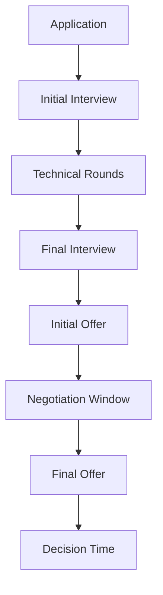

# Salary Negotiation

## Introduction

Salary negotiation is a critical skill for programmers at all career stages. Whether you're accepting your first job offer or transitioning to a new role, how you negotiate can significantly impact your compensation package. Many developers leave thousands of dollars on the table by not negotiating effectively or, worse, not negotiating at all.

This guide will walk you through the entire negotiation process, from research to the final counteroffer. We'll cover company-specific strategies, timing, and scripts you can adapt to your situation.

## Why Negotiation Matters

Negotiating your salary isn't just about getting more money now—it affects your lifetime earnings. Here's why it's crucial:

1. **Compound Effect**: Each salary serves as the baseline for future increases.
2. **Market Value**: Companies often have salary ranges, and coming in at the lower end means you're undervalued.
3. **Respect**: Thoughtful negotiation demonstrates your professional value.

## Before the Interview: Preparation Phase

### Research Company Compensation Structures

Different companies structure compensation differently. Some key components include:

- Base salary
- Bonuses (signing, performance, retention)
- Equity/stock options
- Benefits (healthcare, retirement contributions, etc.)
- Perks (remote work, flexible hours, education stipends)

### Find Company-Specific Salary Data

```jsx
// Example sites for salary research
const researchSites = [
  "levels.fyi",
  "Glassdoor",
  "Blind",
  "PayScale",
  "Comparably"
];

// Function to estimate salary range
function estimateSalaryRange(company, role, location, yearsOfExperience) {
  // Research on above sites would provide these values
  return {
    minimum: calculateMinimum(company, role, location, yearsOfExperience),
    median: calculateMedian(company, role, location, yearsOfExperience),
    maximum: calculateMaximum(company, role, location, yearsOfExperience)
  };
}

// Example usage
const targetSalary = estimateSalaryRange("TechCorp", "Frontend Developer", "Seattle", 3);
console.log(`Target salary range: $${targetSalary.minimum}k - $${targetSalary.maximum}k`);
```

**Output:**
```
Target salary range: $115k - $145k
```

### Understand Timing in the Process



## During the Interview: Strategic Positioning

### Avoid Premature Salary Discussions

One common mistake is revealing your salary expectations too early. When asked about compensation expectations before receiving an offer:

**Sample Response:**
```
"I'm currently focused on determining if this role is the right fit for both of us. I'd prefer to discuss compensation once we've established mutual interest. At that point, I'm confident we can find a package that reflects my value to your team."
```

### When Pressed for a Number

If the interviewer insists on a number, use these techniques:

1. **The Range Technique**: Provide a range based on your research with your desired salary at the lower end.
2. **The Deflection**: Ask about their budgeted range for the position.

```jsx
// Example range calculation
function calculateSalaryRange(desiredSalary) {
  return {
    low: desiredSalary,
    high: Math.round(desiredSalary * 1.2) // 20% above your target
  };
}

const myDesiredSalary = 130000;
const rangeToProvide = calculateSalaryRange(myDesiredSalary);
console.log(`I'm looking for something in the $${rangeToProvide.low/1000}k to $${rangeToProvide.high/1000}k range.`);
```

**Output:**
```
I'm looking for something in the $130k to $156k range.
```

## After Receiving an Offer: The Negotiation Phase

### The First Rule: Always Negotiate

When you receive an offer, remember:

1. The first offer is rarely the best offer
2. Companies expect negotiation
3. The worst outcome is usually that they stick to the original offer

### Effective Negotiation Framework

Follow this structure for your negotiation response:

1. **Express enthusiasm**: Show genuine interest in the role
2. **Highlight your value**: Remind them of your unique skills
3. **Present your counteroffer**: Be specific about what you're asking for
4. **Remain flexible**: Indicate willingness to find common ground

### Sample Negotiation Script

```jsx
const negotiationScript = `
Thank you so much for the offer! I'm really excited about the possibility of joining [Company] and contributing to [specific project/team].

After reviewing the details and considering my experience with [relevant skill], where I [achieved specific result], I was hoping we could discuss the compensation package. Based on my research of similar roles at [Company] and comparable positions in the industry, I was expecting something closer to $[your target] for the base salary.

I believe this better reflects the value I can bring to the team, particularly with my background in [specific skill they emphasized during interviews].

Is there flexibility to adjust the offer in this direction? I'm definitely open to discussing options that would work for both of us.
`;

console.log(negotiationScript);
```

### Negotiating Beyond Base Salary

Remember that compensation includes more than just base salary:

```jsx
// Components to consider in negotiation
const compensationComponents = [
  { component: "Base Salary", negotiability: "Medium to High" },
  { component: "Signing Bonus", negotiability: "High" },
  { component: "Equity/Stock Options", negotiability: "Medium to High" },
  { component: "Performance Bonus", negotiability: "Medium" },
  { component: "Relocation Assistance", negotiability: "High" },
  { component: "Remote Work Flexibility", negotiability: "Medium" },
  { component: "Professional Development Budget", negotiability: "High" },
  { component: "Start Date", negotiability: "High" }
];

// If base salary is fixed, focus on other elements
function alternativeNegotiationFocus(baseSalaryOffered, baseSalaryDesired) {
  const difference = baseSalaryDesired - baseSalaryOffered;
  
  if (difference <= 0) return "Accept the offer";
  
  return {
    signingBonus: Math.round(difference * 0.5), // Ask for 50% of the difference as a signing bonus
    additionalEquity: Math.round(difference * 0.3 / 1000), // Convert some to equity units
    educationBudget: 5000,
    extraVacationDays: 5
  };
}

// Example
const alternativePackage = alternativeNegotiationFocus(120000, 135000);
console.log("Alternative negotiation package:", alternativePackage);
```

**Output:**
```
Alternative negotiation package: {
  signingBonus: 7500,
  additionalEquity: 5,
  educationBudget: 5000,
  extraVacationDays: 5
}
```

## Company-Specific Negotiation Tactics

### Big Tech Companies (FAANG+)

These companies typically have:
- Standardized compensation bands
- Significant equity components
- Formal negotiation processes

**Strategy:** Leverage competing offers and focus on your level placement, as this determines your compensation band.

### Startups

Startups often have:
- Limited cash but more equity flexibility
- Less formalized negotiation processes
- More role flexibility

**Strategy:** Negotiate for equity and growth opportunities if cash is constrained.

### Mid-Size Companies

These typically have:
- More flexible compensation structures than big tech
- Less equity upside than startups
- Room for creativity in the total package

**Strategy:** Focus on the total compensation package including benefits, work-life balance, and growth opportunities.

## Common Objections and Responses

### "This is the best we can do"

```jsx
const responseToFixedBudget = `
I understand budget constraints can be challenging. Could we discuss:
1. A performance review in 6 months instead of a year with the possibility of a salary adjustment?
2. A one-time signing bonus to bridge the gap?
3. Additional equity or benefits that might have more flexibility?
`;

console.log(responseToFixedBudget);
```

### "We need to be fair to other team members"

```jsx
const responseToInternalEquity = `
I completely understand the importance of internal equity. My request is based on the specific value I bring with my experience in [specific relevant skill/achievement]. I'm confident that my contributions will justify this adjustment within your team structure.
`;

console.log(responseToInternalEquity);
```

## When to Accept an Offer

Consider these factors when deciding:

1. **Total package value**: Calculate the real value of all components
2. **Growth opportunity**: Will this position advance your career?
3. **Work environment**: Is this somewhere you want to work daily?
4. **Market conditions**: How does this offer compare to the current market?

```jsx
// Decision framework
function evaluateOffer(offer, marketValue, growthPotential, cultureFit) {
  const financialScore = offer / marketValue; // 1.0 means at market
  
  // Weight factors according to your priorities
  const weights = {
    financial: 0.4,
    growth: 0.3,
    culture: 0.3
  };
  
  const overallScore = (
    financialScore * weights.financial +
    growthPotential * weights.growth +
    cultureFit * weights.culture
  );
  
  // Score interpretation
  if (overallScore > 0.9) return "Strong Accept";
  if (overallScore > 0.8) return "Accept";
  if (overallScore > 0.7) return "Consider with Reservations";
  return "Decline or Negotiate Further";
}

// Example usage
const decision = evaluateOffer(
  135000, // Offered compensation
  130000, // Market value
  0.9,    // Growth potential (0-1)
  0.8     // Culture fit (0-1)
);

console.log(`Decision recommendation: ${decision}`);
```

**Output:**
```
Decision recommendation: Strong Accept
```

## Summary

Effective salary negotiation requires preparation, strategy, and confidence:

1. **Research thoroughly**: Know your market value and company-specific information
2. **Time it right**: Avoid salary discussions until you have an offer
3. **Always negotiate**: The first offer is rarely the best offer
4. **Consider the full package**: Look beyond base salary
5. **Remain professional**: Maintain positive relationships throughout the process

Remember that negotiation is a normal part of the hiring process. Employers expect it, and it demonstrates your professional value. With practice, you'll become more comfortable and effective at securing compensation that reflects your true worth.

## Additional Resources

- Books:
  - "Never Split the Difference" by Chris Voss
  - "Bargaining for Advantage" by G. Richard Shell
  - "Crucial Conversations" by Kerry Patterson et al.

- Practice Exercises:
  1. Research salary ranges for your target role and location
  2. Draft a negotiation script using the framework provided
  3. Role-play negotiation scenarios with a friend
  4. Calculate the value of different compensation packages

By mastering salary negotiation, you're not just securing better compensation for your current role—you're building a skill that will benefit you throughout your entire career.