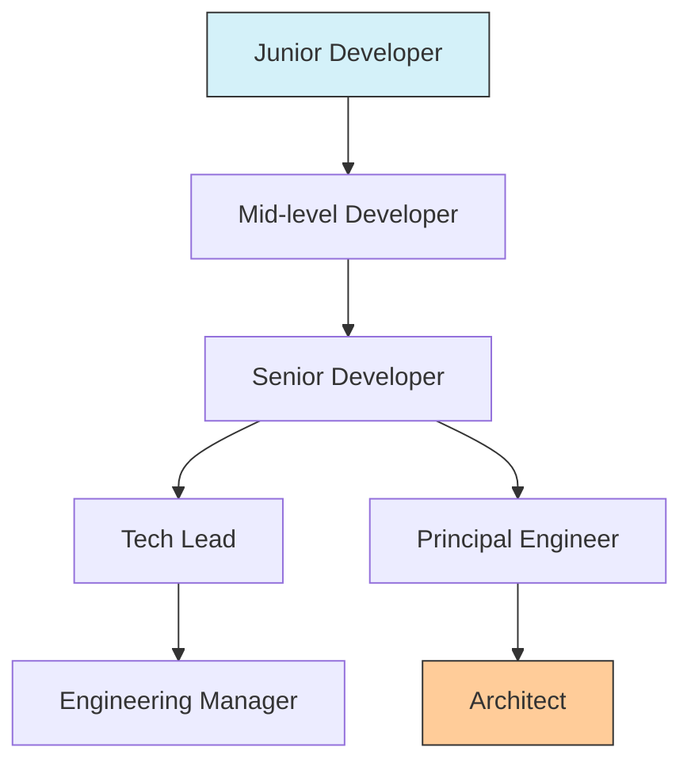

# Offer Evaluation

## Introduction

Congratulations! You've made it through the technical interviews and received a job offer. While reaching this milestone is exciting, the journey isn't quite over. Evaluating job offers carefully is a critical step in your programming career journey. This guide will help you understand how to assess offers comprehensively, beyond just the salary figure.

## Why Offer Evaluation Matters

Many beginners focus solely on the base salary, but an offer comprises multiple components that affect your career trajectory, work-life balance, and overall satisfaction. Making an informed decision requires understanding all aspects of what a company is offering.

## Components of a Job Offer

### 1. Compensation Package

#### Base Salary

This is your regular paycheck amount. While important, it's just one piece of the puzzle.

```javascript
// Example: Comparing annual base salaries
const companyABaseSalary = 95000; // $95,000 per year
const companyBBaseSalary = 105000; // $105,000 per year

console.log(`Company A offers $${companyABaseSalary} as base salary`);
console.log(`Company B offers $${companyBBaseSalary} as base salary`);

// Output:
// Company A offers $95000 as base salary
// Company B offers $105000 as base salary
```

#### Bonuses

- **Signing Bonus**: One-time payment for joining the company
- **Performance Bonus**: Tied to individual or company performance
- **Retention Bonus**: Incentives to stay with the company

```javascript
// Example: Calculating total first-year compensation with bonuses
function calculateFirstYearComp(baseSalary, signingBonus, expectedPerformanceBonus) {
  return baseSalary + signingBonus + expectedPerformanceBonus;
}

const companyAFirstYear = calculateFirstYearComp(95000, 10000, 5000);
const companyBFirstYear = calculateFirstYearComp(105000, 5000, 10000);

console.log(`Company A first-year total: $${companyAFirstYear}`); // $110,000
console.log(`Company B first-year total: $${companyBFirstYear}`); // $120,000
```

#### Equity/Stock Options

For startups and public companies, equity can be a significant part of compensation.

```javascript
// Example: Understanding equity value
function estimateEquityValue(numShares, estimatedShareValue, vestingYears) {
  const annualValue = (numShares * estimatedShareValue) / vestingYears;
  return {
    totalValue: numShares * estimatedShareValue,
    annualValue: annualValue
  };
}

const companyAEquity = estimateEquityValue(1000, 15, 4);
const companyBEquity = estimateEquityValue(500, 50, 4);

console.log(`Company A equity: Total $${companyAEquity.totalValue}, Annual $${companyAEquity.annualValue}`);
console.log(`Company B equity: Total $${companyBEquity.totalValue}, Annual $${companyBEquity.annualValue}`);

// Output:
// Company A equity: Total $15000, Annual $3750
// Company B equity: Total $25000, Annual $6250
```

#### Benefits

- Health insurance
- Retirement plans (401k, matching contributions)
- Paid time off
- Remote work options
- Professional development budget

```javascript
// Example: Calculating the value of benefits
function calculateBenefitsValue(healthInsurance, retirementMatch, otherBenefits) {
  return healthInsurance + retirementMatch + otherBenefits;
}

const companyABenefits = calculateBenefitsValue(
  8000,  // Health insurance premium covered by employer
  4750,  // 5% match on $95,000 salary
  3000   // Other benefits (gym, transit, etc.)
);

const companyBBenefits = calculateBenefitsValue(
  6000,  // Health insurance premium covered by employer
  5250,  // 5% match on $105,000 salary
  2000   // Other benefits
);

console.log(`Estimated annual benefits value - Company A: $${companyABenefits}`);
console.log(`Estimated annual benefits value - Company B: $${companyBBenefits}`);

// Output:
// Estimated annual benefits value - Company A: $15750
// Estimated annual benefits value - Company B: $13250
```

### 2. Career Growth Opportunities

- Learning opportunities
- Mentorship
- Promotion paths
- Skills development
- Project exposure



### 3. Company Culture and Work Environment

- Work-life balance
- Company values
- Team dynamics
- Management style
- Office environment or remote work policy

### 4. Project and Technology Stack

- Technologies you'll be working with
- Project types and impact
- Innovation opportunities
- Technical challenges

### 5. Company Stability and Growth

- Funding status (for startups)
- Market position
- Growth trajectory
- Layoff history

## Creating a Decision Matrix

A decision matrix can help you objectively evaluate multiple offers based on your priorities.

```javascript
// Example decision matrix implementation
function evaluateOffer(criteria, weights, ratings) {
  let totalScore = 0;
  
  for (const criterion in criteria) {
    const weight = weights[criterion];
    const rating = ratings[criterion];
    totalScore += weight * rating;
  }
  
  return totalScore;
}

// Define criteria
const criteria = {
  compensation: "Total compensation package",
  growthOpportunities: "Career growth potential",
  workLifeBalance: "Work-life balance",
  techStack: "Technology stack interest",
  companyStability: "Company stability"
};

// Define your personal weights (should sum to 1)
const weights = {
  compensation: 0.3,
  growthOpportunities: 0.25,
  workLifeBalance: 0.2,
  techStack: 0.15,
  companyStability: 0.1
};

// Rate each company (scale of 1-10)
const companyARatings = {
  compensation: 7,
  growthOpportunities: 9,
  workLifeBalance: 6,
  techStack: 8,
  companyStability: 7
};

const companyBRatings = {
  compensation: 9,
  growthOpportunities: 7,
  workLifeBalance: 8,
  techStack: 6,
  companyStability: 9
};

const companyAScore = evaluateOffer(criteria, weights, companyARatings);
const companyBScore = evaluateOffer(criteria, weights, companyBRatings);

console.log(`Company A overall score: ${companyAScore.toFixed(2)}`);
console.log(`Company B overall score: ${companyBScore.toFixed(2)}`);

// Output:
// Company A overall score: 7.45
// Company B overall score: 7.85
```

## Negotiation Basics

Once you've evaluated the offer, you might want to negotiate for better terms.

### Tips for Effective Negotiation:

1. **Do your research**: Understand the market rate for your role, experience, and location
2. **Prioritize what matters**: Identify which components are most important to you
3. **Be professional**: Maintain a positive and collaborative tone
4. **Consider the full package**: Negotiate beyond just base salary
5. **Get it in writing**: Ensure all agreed-upon terms are documented

```javascript
// Example: Preparing for a negotiation
function prepareNegotiationPoints(currentOffer, marketData, priorities) {
  const negotiationPoints = [];
  
  for (const component in priorities) {
    if (currentOffer[component] < marketData[component]) {
      negotiationPoints.push({
        component: component,
        currentOffer: currentOffer[component],
        marketRate: marketData[component],
        priority: priorities[component],
        gap: marketData[component] - currentOffer[component]
      });
    }
  }
  
  // Sort by priority (highest first)
  return negotiationPoints.sort((a, b) => b.priority - a.priority);
}

// Example usage:
const offer = {
  baseSalary: 95000,
  signingBonus: 5000,
  equity: 1000,
  paidTimeOff: 15
};

const marketData = {
  baseSalary: 105000,
  signingBonus: 10000,
  equity: 1500,
  paidTimeOff: 20
};

const myPriorities = {
  baseSalary: 10,  // Highest priority
  signingBonus: 5,
  equity: 8,
  paidTimeOff: 7
};

const negotiationPoints = prepareNegotiationPoints(offer, marketData, myPriorities);
console.log("Negotiation points in order of priority:");
negotiationPoints.forEach(point => {
  console.log(`${point.component}: Current ${point.currentOffer}, Market ${point.marketRate}, Gap ${point.gap}`);
});

// Output:
// Negotiation points in order of priority:
// baseSalary: Current 95000, Market 105000, Gap 10000
// equity: Current 1000, Market 1500, Gap 500
// paidTimeOff: Current 15, Market 20, Gap 5
// signingBonus: Current 5000, Market 10000, Gap 5000
```

## Real-World Case Study

Let's examine a realistic scenario comparing two offers for a junior developer position:

### Offer A: Established Tech Company
- Base Salary: $95,000
- Signing Bonus: $10,000
- Annual Bonus Target: 10% of base salary
- Equity: 100 shares (current value: $150/share), vesting over 4 years
- Benefits: Comprehensive health insurance, 5% 401k match, 20 days PTO
- Work Environment: Hybrid (3 days in office), structured environment
- Technology: Established tech stack, stable projects

### Offer B: Fast-Growing Startup
- Base Salary: $85,000
- Signing Bonus: $5,000
- Annual Bonus: Depends on company performance
- Equity: 2,000 shares (estimated value: $10/share), vesting over 4 years
- Benefits: Basic health insurance, no 401k match yet, unlimited PTO
- Work Environment: Fully remote, flexible hours
- Technology: Cutting-edge tech stack, greenfield projects

### Analysis

```javascript
// Comparing first-year total compensation
function compareFirstYearComp(offerA, offerB) {
  const offerATotal = offerA.base + offerA.signing + (offerA.base * offerA.bonusTarget);
  const offerBTotal = offerB.base + offerB.signing; // No guaranteed bonus
  
  console.log(`Offer A first-year compensation: $${offerATotal}`);
  console.log(`Offer B first-year compensation: $${offerBTotal}`);
  
  // Equity comparison
  const offerAEquityAnnual = (offerA.shares * offerA.shareValue) / 4;
  const offerBEquityAnnual = (offerB.shares * offerB.shareValue) / 4;
  
  console.log(`Offer A annual equity value: $${offerAEquityAnnual}`);
  console.log(`Offer B annual equity value: $${offerBEquityAnnual}`);
}

const offerA = {
  base: 95000,
  signing: 10000,
  bonusTarget: 0.1,
  shares: 100,
  shareValue: 150
};

const offerB = {
  base: 85000,
  signing: 5000,
  shares: 2000,
  shareValue: 10
};

compareFirstYearComp(offerA, offerB);

// Output:
// Offer A first-year compensation: $114500
// Offer B first-year compensation: $90000
// Offer A annual equity value: $3750
// Offer B annual equity value: $5000
```

### Decision Factors

Beyond the numbers, the decision should account for:

1. **Risk tolerance**: The startup has higher risk but potentially higher reward
2. **Work style preference**: Structured vs. flexible environment
3. **Career goals**: Specialization in established technologies vs. exposure to various cutting-edge technologies
4. **Life circumstances**: Remote work flexibility vs. office culture benefits

## Common Pitfalls to Avoid

1. **Focusing only on base salary**: Consider the total compensation and benefits
2. **Ignoring growth potential**: A lower-paying job with better growth might be better long-term
3. **Overlooking company culture**: Cultural fit affects your daily satisfaction
4. **Neglecting to negotiate**: Most initial offers have room for improvement
5. **Making rushed decisions**: Take time to thoroughly evaluate all aspects

## Summary

Evaluating job offers effectively requires:
- Understanding the full compensation package
- Assessing career growth opportunities
- Considering company culture and work environment
- Evaluating the technology and projects
- Examining company stability and trajectory

By creating a personalized decision matrix and thoroughly analyzing all components of your offers, you can make an informed decision that aligns with your career goals and personal values.

## Additional Resources

- **Books**:
  - "Negotiating Your Salary: How to Make $1000 a Minute" by Jack Chapman
  - "Cracking the Tech Career" by Gayle Laakmann McDowell

- **Websites**:
  - Glassdoor and Levels.fyi for salary information
  - Blind for anonymous tech company reviews

## Exercises

1. Create a personal decision matrix with your own criteria and weights
2. Research the market rate for your target position in your preferred location
3. Practice a negotiation conversation with a friend or mentor
4. Develop a list of questions to ask about growth opportunities during your final interviews