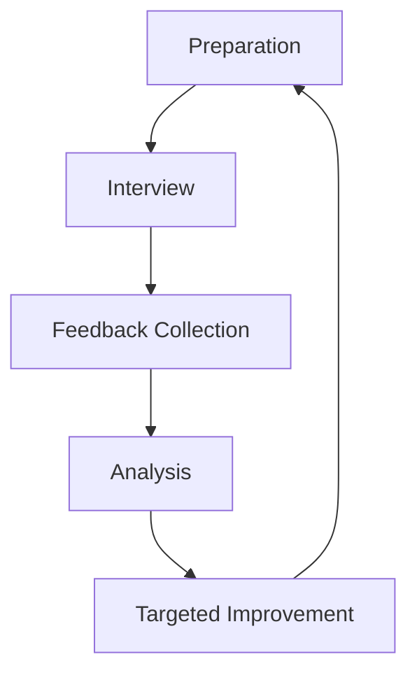

# Interview Feedback Loop

## Introduction

The interview feedback loop is a structured approach to continuously improving your technical interview performance through deliberate practice and reflection. Rather than treating each interview as an isolated event, this method transforms interviews into valuable learning experiences, regardless of the outcome.

In the competitive landscape of programming jobs, mastering the interview process is as important as mastering technical skills. By implementing a feedback loop, you create a systematic way to identify weaknesses, address them, and track your growth over time.

## What is the Interview Feedback Loop?

The interview feedback loop is a cyclical process that follows these key stages:



Let's explore each stage in detail:

### 1. Preparation

This initial phase focuses on getting ready for company-specific interviews by researching:
- The company's interview format and process
- Common questions they ask
- Technical areas they emphasize
- Cultural aspects and values they prioritize

### 2. Interview

Participate in the actual interview while remaining mindful of:
- Questions you find challenging
- Your performance on different topics
- Interviewer reactions and cues
- Time management during the interview

### 3. Feedback Collection

Immediately after the interview, document as much information as possible:

```javascript
// Example Interview Feedback Template
const interviewFeedback = {
  company: "TechCorp",
  position: "Junior Developer",
  date: "2023-04-15",
  interviewers: ["Jane Smith", "John Doe"],
  questions: [
    {
      question: "Implement a function to reverse a linked list",
      myPerformance: 3, // 1-5 scale
      notes: "Struggled with edge cases, took too long"
    },
    // Additional questions...
  ],
  strengths: ["Problem-solving approach", "Communication"],
  weaknesses: ["Runtime analysis", "Edge case handling"],
  overallImpression: "Positive but needs improvement in algorithms"
};
```

Even if the company doesn't provide formal feedback, you can create your own assessment by:
- Writing down all questions you remember
- Noting your performance on each question
- Identifying areas where you struggled
- Recording any feedback the interviewer shared

### 4. Analysis

Review the collected feedback to identify patterns:
- Which types of questions consistently challenge you?
- Are there specific technical areas where you need improvement?
- Do you notice any behavioral or communication issues?
- How does your performance compare to previous interviews?

### 5. Targeted Improvement

Based on your analysis, create a focused improvement plan:
- Prioritize weaknesses that appear most frequently
- Develop specific strategies to address each weakness
- Set measurable goals for improvement
- Allocate study time proportionally to your needs

## Implementing Your Own Interview Feedback Loop

Let's walk through a practical implementation of this process:

### Step 1: Create a Feedback Tracking System

You need a system to record and track interview experiences. This could be as simple as a spreadsheet or as sophisticated as a dedicated application. Here's a basic structure:

```javascript
class InterviewTracker {
  constructor() {
    this.interviews = [];
  }
  
  addInterview(companyName, position, date, questions, selfAssessment) {
    this.interviews.push({
      companyName,
      position,
      date,
      questions,
      selfAssessment,
      companySentFeedback: null
    });
  }
  
  updateWithCompanyFeedback(interviewIndex, feedback) {
    if (interviewIndex >= 0 && interviewIndex < this.interviews.length) {
      this.interviews[interviewIndex].companySentFeedback = feedback;
    }
  }
  
  getWeakAreas() {
    // Analyze all interviews to find common weak points
    const weaknessCounter = {};
    
    this.interviews.forEach(interview => {
      interview.selfAssessment.weakAreas.forEach(area => {
        weaknessCounter[area] = (weaknessCounter[area] || 0) + 1;
      });
    });
    
    return Object.entries(weaknessCounter)
      .sort((a, b) => b[1] - a[1])
      .map(entry => entry[0]);
  }
}

// Usage example
const tracker = new InterviewTracker();
tracker.addInterview(
  "TechCorp",
  "Junior Developer",
  "2023-04-15",
  [
    { topic: "Linked Lists", question: "Reverse a linked list", performance: 2 },
    { topic: "Arrays", question: "Find duplicates in an array", performance: 4 }
  ],
  { 
    overallRating: 3,
    weakAreas: ["Data structures", "Time complexity analysis"],
    strongAreas: ["Problem-solving approach", "Communication"]
  }
);

// Later, if you receive company feedback
tracker.updateWithCompanyFeedback(0, {
  status: "Rejected",
  feedback: "Strong communication but needs improvement in algorithm efficiency"
});

// Find your most common weak areas
const weakestAreas = tracker.getWeakAreas();
console.log("Areas to focus on:", weakestAreas);
// Output: Areas to focus on: ["Data structures", "Time complexity analysis"]
```

### Step 2: Post-Interview Reflection

Immediately after each interview, take 15-30 minutes for reflection:

1. Write down all questions you remember
2. Rate your performance on each question (1-5 scale)
3. Identify what went well and what didn't
4. Note any specific feedback provided by the interviewer

Example reflection output:

```
Interview Reflection: FrontEnd Inc.
Date: March 15, 2023
Position: Junior Frontend Developer

Questions:
1. "Explain event bubbling in JavaScript" (Performance: 4/5)
   - Explained the concept clearly but missed mentioning event.stopPropagation()
   
2. "Implement a debounce function" (Performance: 2/5)
   - Got stuck on the closure implementation
   - Interviewer had to provide hints

3. "Describe the virtual DOM in React" (Performance: 5/5)
   - Provided a comprehensive explanation with examples

Weak Areas:
- Advanced JavaScript concepts (closures, this binding)
- Performance optimization techniques

Strong Areas:
- React knowledge
- Communication skills

Action Items:
- Review closure implementations and practice debounce/throttle functions
- Study JavaScript event handling in depth
```

### Step 3: Pattern Identification

After several interviews, analyze your data to identify recurring patterns:

```javascript
function analyzeInterviewPerformance(interviews) {
  const topicPerformance = {};
  
  // Calculate average performance by topic
  interviews.forEach(interview => {
    interview.questions.forEach(q => {
      if (!topicPerformance[q.topic]) {
        topicPerformance[q.topic] = { total: 0, count: 0 };
      }
      
      topicPerformance[q.topic].total += q.performance;
      topicPerformance[q.topic].count += 1;
    });
  });
  
  // Convert to averages and sort
  const performanceByTopic = Object.entries(topicPerformance)
    .map(([topic, data]) => ({
      topic,
      averageScore: data.total / data.count,
      interviewCount: data.count
    }))
    .sort((a, b) => a.averageScore - b.averageScore);
    
  return {
    weakestTopics: performanceByTopic.slice(0, 3),
    strongestTopics: performanceByTopic.slice(-3).reverse(),
    mostCommonTopics: performanceByTopic
      .sort((a, b) => b.interviewCount - a.interviewCount)
      .slice(0, 5)
  };
}

// Output example
const analysis = analyzeInterviewPerformance(tracker.interviews);
console.log("Focus on these weak areas:", analysis.weakestTopics);
// Output: Focus on these weak areas: [
//   { topic: "Dynamic Programming", averageScore: 1.5, interviewCount: 2 },
//   { topic: "System Design", averageScore: 2.0, interviewCount: 3 },
//   { topic: "Binary Trees", averageScore: 2.3, interviewCount: 4 }
// ]
```

### Step 4: Targeted Improvement Plan

Based on your analysis, create a focused study plan:

```javascript
function createStudyPlan(weakAreas, timeAvailable) {
  // Calculate total weight of all weak areas
  const totalWeight = weakAreas.reduce(
    (sum, area) => sum + (6 - area.averageScore) * area.interviewCount, 0
  );
  
  // Allocate time proportionally to weakness severity
  return weakAreas.map(area => {
    const areaWeight = (6 - area.averageScore) * area.interviewCount;
    const timeAllocation = Math.round(
      (areaWeight / totalWeight) * timeAvailable
    );
    
    return {
      topic: area.topic,
      hoursToSpend: timeAllocation,
      priority: areaWeight,
      resources: getResourcesForTopic(area.topic)
    };
  }).sort((a, b) => b.priority - a.priority);
}

function getResourcesForTopic(topic) {
  // This would be a database or mapping of topics to recommended resources
  const resourceMap = {
    "Dynamic Programming": [
      "Grokking Dynamic Programming Patterns",
      "LeetCode DP problems (Easy to Hard)",
      "MIT OCW - Introduction to Algorithms"
    ],
    // Other topics...
  };
  
  return resourceMap[topic] || ["Search for resources on " + topic];
}

// Generate a 20-hour study plan
const studyPlan = createStudyPlan(analysis.weakestTopics, 20);
console.log("Your personalized study plan:", studyPlan);
// Output example:
// Your personalized study plan: [
//   {
//     topic: "Dynamic Programming",
//     hoursToSpend: 10,
//     priority: 9.0,
//     resources: ["Grokking Dynamic Programming Patterns", ...]
//   },
//   ...
// ]
```

### Step 5: Rinse and Repeat

After implementing your improvement plan:
1. Schedule new interviews focusing on companies that test your weak areas
2. Apply your improved skills
3. Collect new feedback
4. Analyze your progress
5. Adjust your study plan based on the new data

This cycle creates a continuous improvement system that progressively strengthens your interview performance.

## Real-World Application Example

Let's look at a case study of how the interview feedback loop works in practice:

> **Case Study: Sarah's Journey to a Backend Developer Role**
> 
> Sarah was a self-taught programmer who struggled with technical interviews. After five failed interviews, she implemented the feedback loop process:
> 
> **Initial Analysis:**
> - Consistently struggled with system design questions
> - SQL query performance questions were problematic
> - Time complexity analysis was weak
> - Communication during coding was strong
> 
> **Targeted Improvement Plan:**
> - Dedicated 15 hours to system design study
> - Spent 10 hours on advanced SQL optimization
> - Practiced time complexity analysis daily
> 
> **Results After Implementation:**
> - Passed the next system design interview
> - Significantly improved SQL responses
> - More confidently explained time complexity
> - Received an offer on her next interview

## Handling Rejection Constructively

Rejection is an inevitable part of the job search process. The feedback loop helps transform rejection from a negative experience into a growth opportunity:

1. **Separate emotion from analysis**: Wait 24 hours after a rejection before analyzing the feedback
2. **Request specific feedback**: Send a polite email asking for specific areas of improvement
3. **Look for patterns**: Compare the feedback to previous interviews
4. **Set concrete goals**: "I will solve 20 medium-level algorithm problems" rather than "I will get better at algorithms"

Example email requesting feedback:

```
Subject: Thank you for the interview opportunity

Dear [Interviewer's Name],

Thank you for taking the time to interview me for the [Position] role. While I'm disappointed to hear I won't be moving forward, I'm committed to improving my skills.

Would you be willing to share any specific feedback about areas where I could improve? Any insights would be invaluable for my professional development.

Thank you again for the opportunity.

Best regards,
[Your Name]
```

## Company-Specific Adaptation

Different companies emphasize different aspects of technical and cultural fit. Adapt your feedback loop to account for these differences:

- **Big Tech Companies**: Focus on algorithm efficiency, data structures, and system design
- **Startups**: Emphasize practical problem-solving and cultural alignment
- **Finance/Banking**: Pay special attention to performance optimization and security
- **Consulting**: Highlight communication skills and problem breakdown

Example company-specific preparation:

```javascript
const companyProfiles = {
  "TechGiant": {
    interviewFocus: ["Algorithms", "System Design", "Data Structures"],
    culturalEmphasis: "Scale and efficiency",
    preparationStrategy: "LeetCode hard problems, system design practice",
    feedbackPatterns: "Typically focuses on technical depth"
  },
  "StartupX": {
    interviewFocus: ["Practical Coding", "Architecture", "Cultural Fit"],
    culturalEmphasis: "Autonomy and impact",
    preparationStrategy: "Build something relevant to their product, research their tech stack",
    feedbackPatterns: "Often emphasizes versatility and learning ability"
  }
};

function tailorPreparation(companyName) {
  const profile = companyProfiles[companyName];
  if (!profile) return "Research this company's interview style";
  
  return `
Focus areas for ${companyName}:
- Technical: ${profile.interviewFocus.join(", ")}
- Cultural: ${profile.culturalEmphasis}
- Preparation: ${profile.preparationStrategy}
- Feedback focus: ${profile.feedbackPatterns}
  `;
}

console.log(tailorPreparation("TechGiant"));
```

## Summary

The Interview Feedback Loop transforms the challenging process of technical interviews into a structured learning system. By methodically collecting, analyzing, and acting upon interview feedback, you create a personalized improvement path that addresses your specific weaknesses.

Key takeaways:
1. Document detailed feedback after every interview
2. Analyze patterns to identify your consistent weak areas
3. Create targeted improvement plans based on data
4. Measure your progress over time
5. Adapt your approach for different companies

Remember, every interview—successful or not—provides valuable data that can improve your chances of success in future opportunities.

## Additional Resources and Exercises

### Resources

- "Cracking the Coding Interview" by Gayle Laakmann McDowell
- [Tech Interview Handbook](https://techinterviewhandbook.org)
- [System Design Primer](https://github.com/donnemartin/system-design-primer)

### Exercises

1. **Create Your Feedback System**:
   Build a simple spreadsheet or application to track your interview experiences.

2. **Mock Interview Analysis**:
   Participate in 3 mock interviews and apply the feedback loop process.

3. **Pattern Recognition Exercise**:
   Review 5+ past interviews and identify your top 3 weak areas.

4. **Study Plan Generation**:
   Create a 2-week study plan based on your identified weaknesses.

5. **Rejection Email Template**:
   Draft a professional email requesting specific feedback after a rejection.

By consistently applying the Interview Feedback Loop, you'll transform from a candidate who hopes to succeed into one who systematically improves with every interview experience.