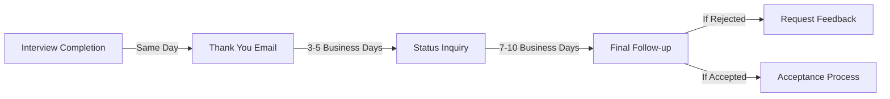

# Post-Interview Follow-up

## Introduction

After completing a technical interview for a programming position, many candidates make the mistake of simply waiting for a response. However, the post-interview period presents valuable opportunities to reinforce your candidacy and demonstrate your continued interest in the position. This guide will walk you through the essential steps and best practices for following up after a programming interview, specifically tailored to company-specific contexts.

## Why Post-Interview Follow-up Matters

A thoughtful follow-up can differentiate you from equally qualified candidates by:

1. Demonstrating your continued interest in the position
2. Showcasing your professionalism and communication skills
3. Providing an opportunity to address any missed points during the interview
4. Keeping you fresh in the interviewer's mind during decision-making
5. Building a relationship that could be valuable even if you don't get this specific role

## Timeline for Follow-up Communications



## The Thank You Email

### When to Send

Send a thank you email within 24 hours of your interview, ideally the same day.

### Components of an Effective Thank You Email

1. **Subject Line**: Clear and specific reference to your interview
2. **Greeting**: Personalized to your interviewer(s)
3. **Expression of Gratitude**: Specific thanks for their time
4. **Reference to Discussion Points**: Recall specific topics discussed
5. **Additional Information**: Address any questions you couldn't answer fully
6. **Reaffirmation of Interest**: Express continued interest in the role
7. **Professional Closing**: Include your contact information

### Example Thank You Email

```
Subject: Thank You for the Software Developer Interview

Dear Ms. Johnson,

Thank you for taking the time to discuss the Junior Software Developer position with me today. I appreciated learning more about the team's current projects, especially the new customer data platform you're developing.

Our conversation about optimizing database queries particularly resonated with me. After our discussion, I recalled a similar challenge I faced during my internship project. I've attached a brief case study showing how I improved query performance by 40% using indexing techniques we discussed.

I'm excited about the possibility of joining your team and contributing to your upcoming API integration project. The collaborative environment you described aligns perfectly with my working style.

Please don't hesitate to contact me if you need any additional information about my experience or skills.

Best regards,
John Smith
johnsmith@email.com
(555) 123-4567
```

## Following Up on Application Status

### When to Check Status

If you haven't heard back within the timeframe provided, wait one additional week before sending a status inquiry email.

### Status Inquiry Email Template

```
Subject: Following Up on Software Developer Application - [Your Name]

Dear [Interviewer/Hiring Manager],

I hope this email finds you well. I'm writing to follow up on my application for the Software Developer position. I enjoyed our conversation on [Interview Date] and remain very interested in the opportunity to join [Company Name].

I understand this is a busy time, but I wanted to inquire about the status of my application and the hiring timeline. Any updates you can provide would be greatly appreciated.

Thank you for your consideration.

Best regards,
[Your Name]
[Your Contact Information]
```

## Company-Specific Follow-up Strategies

Different companies have different recruitment processes and cultures. Here's how to tailor your follow-up:

### Large Tech Companies

- **Expected Timeline**: Often 1-2 weeks for initial feedback
- **Follow-up Channel**: Email is preferred, address to your recruiter
- **Content Focus**: Reference specific technical discussions and how they relate to the company's products
- **Frequency**: Limit to 2-3 follow-ups maximum

### Startups

- **Expected Timeline**: Can be faster (days) or slower (weeks) depending on their stage
- **Follow-up Channel**: Email or LinkedIn connection with interviewer
- **Content Focus**: Emphasize your adaptability and willingness to wear multiple hats
- **Frequency**: Can be slightly more frequent but remain respectful

### Enterprise Companies

- **Expected Timeline**: Often longer, 2-4 weeks
- **Follow-up Channel**: Formal email through established channels
- **Content Focus**: Highlight relevant experience and understanding of enterprise processes
- **Frequency**: More structured, follow their stated timeline

## Following Up After Coding Challenges

If your interview included a coding challenge or technical assessment, your follow-up should specifically address this component.

### Example Follow-up For Coding Challenge

```
Subject: Additional Thoughts on Coding Challenge - Junior Developer Position

Dear Mr. Garcia,

Thank you again for the opportunity to interview for the Junior Developer role and complete the coding challenge involving the inventory tracking system.

After further reflection, I realized there's an optimization I could have implemented in my solution. By using a hash map for product lookups instead of the linear search I implemented, the time complexity could be reduced from O(n) to O(1), which would be more scalable for larger inventory datasets.

I've attached a brief pseudocode snippet showing this improvement, which maintains all the functionality of my original solution while improving performance.

I'm excited about the potential to bring this kind of analytical thinking to real-world challenges at [Company Name].

Sincerely,
[Your Name]
```

## What To Do If You Don't Get A Response

If your follow-ups go unanswered:

1. **Wait Appropriate Time**: Give at least 2 weeks before considering other actions
2. **Try Alternative Contact**: Reach out to another interviewer or HR contact
3. **LinkedIn Connection**: Send a connection request with personalized message
4. **Reassess and Move On**: After 3-4 weeks without response, focus on other opportunities
5. **Maintain Professionalism**: Never express frustration in communications

## If You Receive a Rejection

A rejection doesn't mean the end of your relationship with the company:

### Example Response to Rejection

```
Subject: Thank You for the Opportunity

Dear Ms. Williams,

Thank you for informing me of your decision regarding the Software Developer position. While I'm disappointed I won't be joining your team at this time, I appreciate the opportunity to have interviewed with [Company Name].

The insights I gained about your development workflow and technical stack were valuable. I would welcome the chance to be considered for future positions that might be a better fit for my skills, particularly in [specific area discussed].

Would you be willing to provide any feedback on my interview performance that might help me improve?

Thank you again for your time and consideration.

Best regards,
[Your Name]
```

## Building Long-term Relationships

The post-interview period can be the beginning of a professional relationship, even if you don't get the job:

1. **Connect on LinkedIn**: Send personalized connection requests to your interviewers
2. **Engage with Company Content**: Comment on and share the company's social media posts
3. **Attend Company Events**: Participate in webinars, meetups, or open houses
4. **Periodic Check-ins**: Send occasional updates about your professional development
5. **Refer Qualified Candidates**: If you know someone who would be a good fit, make a referral

## When You Receive an Offer

If your follow-up results in a job offer, continue professional communications:

1. **Express Gratitude**: Thank them for the opportunity
2. **Confirm Receipt**: Acknowledge that you've received the offer
3. **Timeline for Decision**: Provide a timeframe for your response
4. **Ask Questions**: Clarify any details about the role, compensation, or start date
5. **Formal Acceptance/Decline**: Respond formally in writing

## Practical Exercise

Create your own customized follow-up email template based on a company you're interested in. Research the company's:

1. Culture and communication style
2. Recent projects or news
3. Technical stack and methodologies
4. Hiring process timeframe

Then draft a thank you email that reflects your research and demonstrates your specific interest in their organization.

## Summary

Effective post-interview follow-up shows professionalism and maintains momentum in your job search. Remember these key points:

- Send a thank you email within 24 hours
- Personalize your communications based on the company and interviewer
- Reference specific discussion points from your interview
- Be respectful of timelines and professional in all communications
- Use rejection as an opportunity for feedback and relationship-building
- Track all communications to maintain organization in your job search

## Additional Resources

- **Books**: "The 2-Hour Job Search" by Steve Dalton
- **Online Courses**: LinkedIn Learning courses on professional communication
- **Tools**: Email tracking software to know when your message is opened
- **Communities**: Programming job search forums where you can share experiences

Remember that the post-interview period is still part of your interview. Every interaction is an opportunity to reinforce your candidacy and demonstrate your professional communication skills.