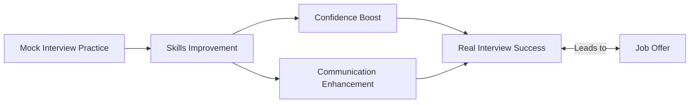

# Mock Interview Techniques

## Introduction

Mock interviews are simulated interview experiences that help you prepare for real technical interviews in the programming industry. They provide a safe environment to practice your technical skills, communication abilities, and problem-solving approaches without the pressure of an actual job interview. This guide will walk you through effective techniques to maximize the benefits of mock interviews, helping you build confidence and competence for your future programming career.

## Why Mock Interviews Matter

Mock interviews are crucial for several reasons:

1. They help identify your strengths and weaknesses
2. They reduce anxiety and build confidence
3. They improve your technical communication skills
4. They provide practice with time constraints
5. They familiarize you with common interview patterns



## Setting Up Effective Mock Interviews

### Finding the Right Partner

An effective mock interview partner can be:

- A peer who is also preparing for interviews
- A mentor or senior developer
- A professional mock interviewer
- An instructor or teaching assistant

Your partner should be knowledgeable enough to evaluate your technical answers and provide constructive feedback.

### Creating a Realistic Environment

To maximize the benefits of your mock interview:

- Choose a quiet, distraction-free space
- Set up a proper video call if conducting remotely
- Have coding tools ready (whiteboard, shared code editor, etc.)
- Set a specific time duration (typically 45-60 minutes)
- Establish clear roles (interviewer and interviewee)

### Structuring the Session

A well-structured mock interview typically follows this format:

1. **Introduction** (2-3 minutes)
2. **Technical questions or coding problems** (30-40 minutes)
3. **Behavioral questions** (10-15 minutes)
4. **Questions for the interviewer** (3-5 minutes)
5. **Feedback session** (10-15 minutes)

## Essential Mock Interview Techniques

### 1. Think Aloud Protocol

The "think aloud" technique involves verbalizing your thought process as you work through problems. This gives the interviewer insight into your problem-solving approach.

**Example:**

```javascript
// Problem: Find the maximum subarray sum

// Think aloud process might sound like this:
"I'm thinking of using Kadane's algorithm for this problem. "
"First, I'll initialize two variables: 'currentMax' and 'globalMax' to the first element. "
"Then I'll iterate through the array starting from the second element..."

// Code implementation
function maxSubArraySum(arr) {
  if (arr.length === 0) return 0;
  
  let currentMax = arr[0];
  let globalMax = arr[0];
  
  for (let i = 1; i < arr.length; i++) {
    // Decide whether to start a new subarray or extend the existing one
    currentMax = Math.max(arr[i], currentMax + arr[i]);
    
    // Update the global maximum if needed
    globalMax = Math.max(globalMax, currentMax);
  }
  
  return globalMax;
}

// Example usage
const array = [-2, 1, -3, 4, -1, 2, 1, -5, 4];
console.log(maxSubArraySum(array)); // Output: 6 (from subarray [4, -1, 2, 1])
```

### 2. Clarifying Questions

Always ask clarifying questions before diving into a solution. This demonstrates thorough thinking and helps avoid solving the wrong problem.

**Example questions to ask:**

- "What are the constraints on the input size?"
- "Should I handle edge cases like empty inputs or null values?"
- "Is there a time or space complexity requirement?"
- "Can you provide an example input and expected output?"

### 3. Problem-Solving Framework

Using a consistent framework helps organize your approach:

1. **Understand** the problem thoroughly
2. **Plan** your approach (consider multiple strategies)
3. **Implement** your solution step by step
4. **Test** with examples and edge cases
5. **Optimize** if time permits

### 4. Handling Difficult Questions

When you encounter a question you're not immediately sure how to solve:

1. **Don't panic** - Interviewers often want to see how you handle challenging situations
2. **Break it down** into smaller, more manageable parts
3. **Start with a naive solution** - Having any solution is better than none
4. **Work towards optimization** - Improve your initial solution step by step

**Example:**

```python
# If asked to implement a complex algorithm like Dijkstra's:

# First acknowledge the challenge
"This is a complex problem. Let me think about it step by step..."

# Break it down
"First, I need a way to represent the graph. Then I'll need to track distances, visited nodes, and implement the main algorithm logic..."

# Start with pseudocode if needed
"""
1. Initialize distances array with infinity for all nodes except start node
2. Initialize a priority queue with start node
3. While priority queue is not empty:
   a. Extract node with minimum distance
   b. For each neighbor:
      i. Calculate new potential distance
      ii. If new distance is shorter, update distance and add to queue
"""

# Then implement the actual code
def dijkstra(graph, start):
    distances = {node: float('infinity') for node in graph}
    distances[start] = 0
    unvisited = list(graph.keys())
    
    while unvisited:
        current = min(unvisited, key=lambda node: distances[node])
        
        if distances[current] == float('infinity'):
            break
            
        for neighbor, weight in graph[current].items():
            distance = distances[current] + weight
            
            if distance < distances[neighbor]:
                distances[neighbor] = distance
                
        unvisited.remove(current)
        
    return distances
```

### 5. Effective Communication Techniques

Strong communication is as important as technical skills:

- **Use precise technical terminology** when appropriate
- **Maintain a conversational tone** - Avoid monologuing
- **Check in with the interviewer** - "Does that approach make sense?"
- **Admit when you don't know something** - But explain how you would find out

## Common Mock Interview Scenarios

### 1. Algorithmic Problems

These focus on data structures and algorithms knowledge. Practice problems involving:

- Arrays and strings
- Linked lists
- Trees and graphs
- Dynamic programming
- Sorting and searching

**Example scenario:**

```java
// Problem: Implement a function to check if a binary tree is balanced

public class TreeNode {
    int val;
    TreeNode left;
    TreeNode right;
    
    TreeNode(int val) {
        this.val = val;
    }
}

public boolean isBalanced(TreeNode root) {
    // A null tree is balanced
    if (root == null) return true;
    
    // Helper function to get height
    return getHeight(root) != -1;
}

private int getHeight(TreeNode node) {
    // Base case: empty tree has height 0
    if (node == null) return 0;
    
    // Get height of left subtree
    int leftHeight = getHeight(node.left);
    if (leftHeight == -1) return -1; // Propagate the unbalanced signal
    
    // Get height of right subtree
    int rightHeight = getHeight(node.right);
    if (rightHeight == -1) return -1; // Propagate the unbalanced signal
    
    // If the subtrees' heights differ by more than 1, the tree is unbalanced
    if (Math.abs(leftHeight - rightHeight) > 1) return -1;
    
    // Return the height of this subtree
    return Math.max(leftHeight, rightHeight) + 1;
}
```

### 2. System Design Questions

For more senior roles, you may encounter system design questions. Practice:

- API design
- Database schema design
- Scalability considerations
- Handling trade-offs

**Example approach:**

```
"For designing a URL shortener service, I'd consider these components:

1. API endpoints:
   - POST /shorten - Creates a shortened URL
   - GET /{code} - Redirects to the original URL

2. Database design:
   - Table with columns for original_url, short_code, creation_date, expiry_date

3. URL shortening algorithm:
   - Could use base62 encoding of an auto-incremented ID
   - Or a cryptographic hash function with collision handling

4. Scalability considerations:
   - Read-heavy workload, so we'd want to implement caching
   - Potential for database sharding if we have a high write volume
   - CDN integration for global performance"
```

### 3. Behavioral Questions

Technical interviews often include behavioral components. Practice responses to:

- "Tell me about yourself"
- "Describe a challenging project you worked on"
- "How do you handle disagreements with team members?"

**Example response structure:**
```
Situation: "In my last project, we were facing a tight deadline..."
Task: "I needed to optimize a database query that was causing slowdowns..."
Action: "I analyzed the query execution plan and identified redundant joins..."
Result: "The query performance improved by 80%, allowing us to meet our deadline..."
```

## Role Reversal: Being the Interviewer

Taking the interviewer role in mock interviews provides valuable perspective:

1. **Prepare relevant questions** at an appropriate difficulty level
2. **Take notes** on how the interviewee solves problems
3. **Provide hints** if they get stuck, similar to a real interview
4. **Give constructive feedback** focusing on both strengths and areas for improvement

## Recording and Reviewing Sessions

Consider recording your mock interviews (with permission) to:

- Identify verbal tics or filler words
- Review your technical explanations for clarity
- Observe your body language and non-verbal communication
- Track improvement over multiple sessions

## Creating an Improvement Plan

After each mock interview:

1. **Document feedback** received from your partner
2. **Categorize areas for improvement** (technical knowledge, communication, etc.)
3. **Create specific action items** with deadlines
4. **Schedule follow-up mock interviews** to test improvements

## Common Mock Interview Mistakes to Avoid

1. **Not taking it seriously** - Approach mock interviews with the same professionalism as real ones
2. **Focusing only on coding** - Communication and problem-solving process matter too
3. **Neglecting feedback** - The feedback session is perhaps the most valuable part
4. **Using the same partner** - Different interviewers provide different perspectives
5. **Memorizing solutions** - Focus on understanding approaches rather than memorizing specific solutions

## Mock Interview Resources

Here are some ways to find mock interview opportunities:

- **Peer programming groups** at your school or online
- **Career services** at educational institutions
- **Online platforms** that connect programmers for practice
- **Coding meetups** in your local community

## Summary

Mock interviews are an invaluable tool in your programming career preparation arsenal. By simulating realistic interview conditions, practicing effective communication, and implementing structured feedback, you can significantly improve your performance in actual technical interviews.

Remember that the goal isn't just to pass interviews, but to become a better programmer and communicator in the process. Each mock interview is an opportunity to identify weaknesses and transform them into strengths.

## Practice Exercises

1. **Schedule a mock interview** with a peer this week
2. **Record yourself** answering common interview questions
3. **Create a list** of your strengths and areas for improvement
4. **Practice the "think aloud" technique** with LeetCode or HackerRank problems
5. **Develop a personal story bank** for common behavioral questions