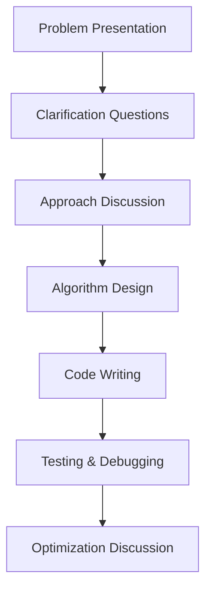

# Whiteboard Practice

## Introduction

Whiteboard interviews are a common practice in the tech industry where candidates are asked to solve coding problems using a whiteboard rather than a computer. This approach tests not only your coding abilities but also your problem-solving skills, communication, and how you think through complex problems under pressure.

In this guide, we'll explore how to effectively approach whiteboard interviews, common patterns, strategies to practice, and techniques to communicate your thought process clearly.

## Why Do Companies Use Whiteboard Interviews?

Companies use whiteboard interviews to evaluate:

1. **Problem-solving skills**: How you break down complex problems into manageable pieces
2. **Technical knowledge**: Your understanding of algorithms, data structures, and programming concepts
3. **Communication abilities**: How well you explain your approach and reasoning
4. **Adaptability**: How you handle feedback and iterate on solutions
5. **Performance under pressure**: How you manage stress in an interview setting

## The Whiteboard Interview Process

A typical whiteboard interview follows these steps:



### 1. Understanding the Problem

Before writing any code, make sure you fully understand the problem:

- **Listen carefully**: Pay close attention to all details provided by the interviewer.
- **Ask clarifying questions**: Don't hesitate to ask about input formats, edge cases, constraints, and expected outputs.
- **Confirm your understanding**: Restate the problem in your own words to verify your understanding.

#### Example Clarification Questions:

- "What are the constraints on the input size?"
- "Are there any time or space complexity requirements?"
- "Should I handle invalid inputs, and if so, how?"
- "Can you provide a sample input and expected output?"

### 2. Planning Your Approach

Once you understand the problem:

- **Think out loud**: Share your thought process with the interviewer.
- **Discuss multiple approaches**: Consider different strategies before committing to one.
- **Use examples**: Walk through small examples to illustrate your thinking.

### 3. Writing Code on the Whiteboard

When you start writing code:

- **Write neatly and organize your code**: Leave space between lines for additions or corrections.
- **Use meaningful variable names**: This makes your code more readable.
- **Break down complex operations**: Use helper functions for clarity.
- **Be mindful of syntax**: While perfect syntax isn't always required, try to maintain proper indentation and structure.

### 4. Testing Your Solution

After writing your solution:

- **Trace through your code**: Walk through your solution step by step with a simple example.
- **Check edge cases**: Verify your solution works for empty inputs, single elements, or other edge cases.
- **Identify bugs**: Look for potential issues and correct them.

### 5. Analyzing and Optimizing

Finally:

- **Discuss time and space complexity**: Analyze the efficiency of your solution.
- **Suggest optimizations**: If possible, propose ways to improve your solution.
- **Be receptive to feedback**: If the interviewer suggests improvements, engage constructively.

## Common Whiteboard Problems

### 1. Array and String Manipulation

These problems involve operations on arrays or strings, such as searching, sorting, or transforming data.

#### Example: Finding a Pair with a Given Sum

**Problem**: Given an array of integers and a target sum, find a pair of numbers that add up to the target.

**Whiteboard Approach**:

```javascript
function findPair(nums, target) {
  // Use a hash map to store values we've seen
  const seen = {};
  
  for (let i = 0; i < nums.length; i++) {
    const complement = target - nums[i];
    
    // If we've seen the complement, return the pair
    if (seen[complement] !== undefined) {
      return [seen[complement], i];
    }
    
    // Store current number's index
    seen[nums[i]] = i;
  }
  
  // No pair found
  return null;
}
```

**Input**:
```
nums = [2, 7, 11, 15]
target = 9
```

**Output**:
```
[0, 1] (because nums[0] + nums[1] = 2 + 7 = 9)
```

### 2. Linked List Operations

These problems involve manipulating linked list structures, such as reversing, merging, or detecting cycles.

#### Example: Reversing a Linked List

**Problem**: Reverse a singly linked list.

**Whiteboard Approach**:

```javascript
function reverseLinkedList(head) {
  let prev = null;
  let current = head;
  
  while (current !== null) {
    // Save next node
    const next = current.next;
    
    // Reverse the pointer
    current.next = prev;
    
    // Move pointers one step forward
    prev = current;
    current = next;
  }
  
  return prev; // New head
}
```

### 3. Tree and Graph Traversals

These problems involve navigating and manipulating tree or graph data structures.

#### Example: Binary Tree Level Order Traversal

**Problem**: Given a binary tree, return its level order traversal (breadth-first).

**Whiteboard Approach**:

```javascript
function levelOrderTraversal(root) {
  if (!root) return [];
  
  const result = [];
  const queue = [root];
  
  while (queue.length > 0) {
    const levelSize = queue.length;
    const currentLevel = [];
    
    for (let i = 0; i < levelSize; i++) {
      const node = queue.shift();
      currentLevel.push(node.val);
      
      if (node.left) queue.push(node.left);
      if (node.right) queue.push(node.right);
    }
    
    result.push(currentLevel);
  }
  
  return result;
}
```

### 4. Dynamic Programming

These problems involve breaking down a problem into simpler subproblems and building up to a solution.

#### Example: Fibonacci Sequence

**Problem**: Compute the nth Fibonacci number.

**Whiteboard Approach** (using dynamic programming):

```javascript
function fibonacci(n) {
  // Base cases
  if (n <= 1) return n;
  
  // Initialize array for dynamic programming
  const fib = new Array(n + 1);
  fib[0] = 0;
  fib[1] = 1;
  
  // Fill the array using bottom-up approach
  for (let i = 2; i <= n; i++) {
    fib[i] = fib[i - 1] + fib[i - 2];
  }
  
  return fib[n];
}
```

## Strategies for Success

### 1. UMPIRE Framework

The UMPIRE framework is a structured approach to solve whiteboard problems:

- **Understand**: Ensure you comprehend the problem fully.
- **Match**: Identify similar problems or patterns you're familiar with.
- **Plan**: Develop a strategy before coding.
- **Implement**: Write your solution clearly.
- **Review**: Check your solution for errors.
- **Evaluate**: Analyze time and space complexity.

### 2. Communication Tips

- **Narrate your thought process**: Keep the interviewer informed about your thinking.
- **Ask for guidance when stuck**: It's okay to request hints.
- **Use diagrams**: Visual aids can clarify complex ideas.
- **Be confident but humble**: Show confidence in your approach while being open to feedback.

### 3. Common Pitfalls to Avoid

- **Diving into code too quickly**: Take time to understand and plan.
- **Getting stuck on syntax**: Focus on the algorithm rather than perfect syntax.
- **Working in silence**: Continuous communication is key.
- **Ignoring edge cases**: Consider empty inputs, negative values, etc.
- **Getting discouraged**: Everyone struggles; persistence is important.

## Practical Tips for Whiteboard Practice

### 1. Setting Up a Practice Environment

- **Use an actual whiteboard**: Simulate the real experience.
- **Time yourself**: Practice under time constraints.
- **Find a practice partner**: Have someone play the role of the interviewer.
- **Record yourself**: Analyze your communication and problem-solving approach.

### 2. Building a Practice Routine

- **Daily problem-solving**: Solve at least one problem daily.
- **Mock interviews**: Regular practice with feedback.
- **Review fundamentals**: Refresh your knowledge of algorithms and data structures.
- **Learn from solutions**: Study efficient approaches to problems you struggle with.

## Real-World Application: How Whiteboard Skills Transfer to Actual Development

While whiteboard interviews might seem artificial, the skills they test are valuable in real development:

1. **Breaking down complex problems**: Just as in whiteboard interviews, real development requires deconstructing large problems.
2. **Communicating technical ideas**: Developers must explain their approaches to colleagues.
3. **Analyzing efficiency**: Optimizing code is crucial in production environments.
4. **Adapting to constraints**: Development often occurs under various limitations.

### Example: Database Query Optimization

In a real-world scenario, optimizing a database query follows a similar process to solving a whiteboard problem:

1. **Understand** the query requirements and current performance issues.
2. **Plan** different approaches (indexing, query restructuring).
3. **Implement** changes incrementally.
4. **Test** performance improvements.
5. **Analyze** the efficiency gains and any trade-offs.

## Common Algorithms and Data Structures to Master

### Key Algorithms:

- Binary Search
- Depth-First Search (DFS)
- Breadth-First Search (BFS)
- Merge Sort and Quick Sort
- Dijkstra's Algorithm
- Dynamic Programming approaches

### Essential Data Structures:

- Arrays and Strings
- Linked Lists
- Stacks and Queues
- Hash Tables
- Trees (Binary Trees, Binary Search Trees)
- Graphs
- Heaps

## Summary

Whiteboard interviews are challenging but mastering them is possible with structured practice. Remember:

1. **Understand before coding**: Clarify the problem completely.
2. **Communicate continuously**: Share your thought process throughout.
3. **Practice regularly**: Build confidence through repetition.
4. **Learn from mistakes**: Each problem teaches valuable lessons.
5. **Stay calm**: Manage stress to showcase your true abilities.

The skills you develop preparing for whiteboard interviews will benefit your overall development career, improving how you approach problems, communicate solutions, and write efficient code.

## Additional Resources

### Practice Platforms:
- LeetCode
- HackerRank
- CodeSignal
- AlgoExpert

### Recommended Books:
- "Cracking the Coding Interview" by Gayle Laakmann McDowell
- "Elements of Programming Interviews" by Adnan Aziz, Tsung-Hsien Lee, and Amit Prakash
- "Algorithm Design Manual" by Steven Skiena

### Practice Exercises

1. **Easy**: Implement a function to check if a string is a palindrome.
2. **Medium**: Design an algorithm to find all pairs of integers in an array that sum to a specific target.
3. **Hard**: Implement a function to serialize and deserialize a binary tree.
4. **Challenge**: Design a simplified version of a consistent hashing algorithm.

Remember that improvement comes with consistent practice. Schedule regular whiteboard sessions, seek feedback, and gradually tackle more complex problems to build your confidence and skills for technical interviews.