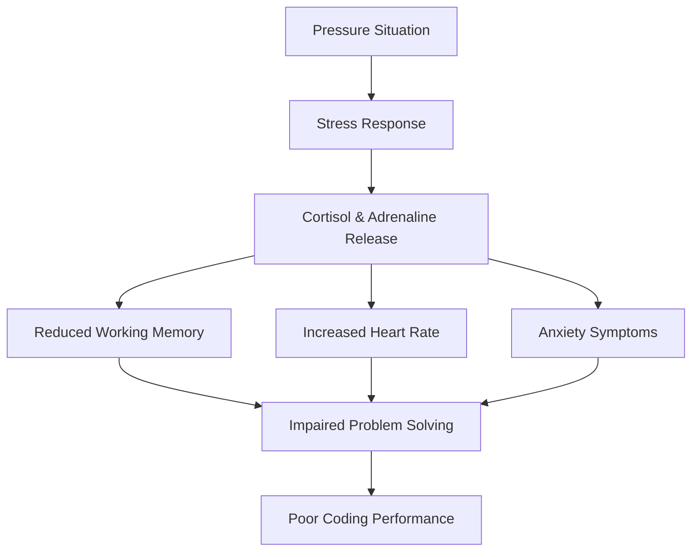

# Coding Under Pressure

## Introduction

Coding interviews can be stressful experiences, especially when you're solving problems with a ticking clock and watchful eyes. "Coding Under Pressure" is a critical skill that separates candidates who freeze up from those who can perform effectively despite the stress. This guide will help you develop techniques to maintain your composure, think clearly, and demonstrate your programming abilities even in high-pressure situations.

## Why Pressure Affects Coding Performance

When we experience pressure, our brain's cognitive resources become partially occupied with stress responses, leaving fewer resources for problem-solving. This can manifest as:

- **Tunnel vision** - focusing too narrowly on one approach
- **Working memory limitations** - forgetting important details
- **Decision paralysis** - inability to choose between options
- **Time distortion** - poor awareness of how much time has elapsed

<br />



## Techniques for Coding Under Pressure

### 1. Preparation: The Foundation of Confidence

The best way to handle pressure is through thorough preparation:

- **Consistent practice** with timed coding challenges
- **Study common patterns** in interview problems
- **Build a mental library** of problem-solving approaches
- **Rehearse explaining** your thought process aloud

```javascript
// Example: Using a preparation checklist before interviews
const interviewPrep = {
  dataStructures: ["Arrays", "Linked Lists", "Trees", "Graphs", "Hash Tables"],
  algorithms: ["Sorting", "Searching", "Dynamic Programming", "Greedy"],
  practiceRegimen: {
    daily: "2 LeetCode problems (1 easy, 1 medium)",
    weekly: "1 mock interview with a friend",
    biweekly: "1 hard problem with time constraint"
  },
  reviewProcess: () => {
    console.log("1. Solve without help first");
    console.log("2. Review optimal solutions");
    console.log("3. Identify knowledge gaps");
    console.log("4. Target practice on weak areas");
  }
};
```

### 2. The 4-Step Interview Approach

When facing a problem under pressure, follow this structured approach:

#### Step 1: Understand & Clarify
Take time to fully understand the problem before jumping into code.

```python
# Don't rush to code! Clarify with examples first
def solve_problem(input_data):
    # Step 1: Clarify with examples
    # Example: If input is [1, 2, 3, 4, 5]
    # Expected output should be 15 (sum)
    
    # Ask questions:
    # - What if the input is empty?
    # - Are there any constraints on time/space complexity?
    # - Will there be negative numbers?
    
    # Only proceed when you're clear on requirements
    pass
```

#### Step 2: Plan Your Approach
Develop a solution strategy before coding.

```python
# Step 2: Plan before coding
def solve_problem(input_data):
    # High-level plan:
    # 1. Initialize a sum variable
    # 2. Iterate through each number
    # 3. Add each number to the sum
    # 4. Return the final sum
    
    # Time complexity: O(n) where n is length of input
    # Space complexity: O(1) - constant extra space
    
    # Now you're ready to code
    pass
```

#### Step 3: Code with Clarity
Focus on writing clean, readable code rather than optimizing prematurely.

```python
# Step 3: Implement the solution clearly
def find_sum(numbers):
    # Edge case: empty input
    if not numbers:
        return 0
    
    total = 0
    for num in numbers:
        total += num
    
    return total
```

#### Step 4: Test Thoroughly
Verify your solution with test cases before declaring "done."

```python
# Step 4: Test your solution
def test_find_sum():
    # Test case 1: Normal case
    assert find_sum([1, 2, 3, 4, 5]) == 15
    
    # Test case 2: Empty array
    assert find_sum([]) == 0
    
    # Test case 3: Single element
    assert find_sum([42]) == 42
    
    # Test case 4: Negative numbers
    assert find_sum([-1, -2, -3]) == -6
    
    # Test case 5: Mixed numbers
    assert find_sum([-1, 2, -3, 4]) == 2
    
    print("All test cases passed!")
```

### 3. Time Management Techniques

Managing your limited time effectively is crucial:

#### The 3-Tier Time Allocation

1. **First 25%**: Understand the problem and plan your approach
2. **Middle 50%**: Implement your solution
3. **Final 25%**: Test and refine

#### Example Time Allocation for a 60-minute Coding Challenge:

```javascript
const timeManagement = {
  understanding: '15 minutes',
  implementation: '30 minutes',
  testing: '15 minutes',
  
  adjustStrategy: (difficulty) => {
    if (difficulty === 'hard') {
      return {
        understanding: '20 minutes',
        implementation: '25 minutes',
        testing: '15 minutes'
      };
    }
    return timeManagement;
  }
};
```

### 4. Handling Mental Blocks

When your mind goes blank under pressure:

#### Technique: The 30-Second Reset

1. **Recognize** the mental block
2. **Breathe** deeply for 5 seconds
3. **Restate** the problem in simple terms
4. **Start** with what you know for certain

```python
# When facing a mental block:
def reset_approach():
    # 1. Take a deep breath
    # 2. Write out the simplest case
    # 3. Solve that case manually
    # 4. Generalize from there
    
    # Example: If stuck on a complex array problem
    # Start with a single-element array solution
    
    simplest_case = [42]
    # Solve for this case
    # Then try a two-element array, etc.
```

### 5. Communication Under Pressure

Interviewers value clear communication about your thinking process:

```javascript
// Example of verbalizing your thought process
function explainThinking() {
  console.log("I'm considering using a hashmap here because we need O(1) lookups");
  console.log("An alternative would be sorting first, which would be O(n log n)");
  console.log("Let me compare the trade-offs of both approaches...");
  
  // Even when stuck, communicate:
  if (stuck) {
    console.log("I'm trying to identify the edge case that's causing an issue");
    console.log("Let me trace through an example to find where the logic breaks");
  }
}
```

## Real-World Scenario: The Two-Sum Problem

Let's apply these techniques to a common interview question:

> Given an array of integers and a target sum, return the indices of two numbers that add up to the target.

### Under Pressure Approach:

#### Step 1: Understand & Clarify

```python
# Problem: Two Sum
# Input: nums = [2, 7, 11, 15], target = 9
# Output: [0, 1] (because nums[0] + nums[1] = 2 + 7 = 9)

# Questions to clarify:
# - Can there be multiple valid pairs? (Assume: return any one valid pair)
# - Are there duplicate numbers in the array? (Consider both cases)
# - What if no solution exists? (Assume: return empty array)
```

#### Step 2: Plan Your Approach

```python
# Approach 1: Brute Force
# - Check every pair of numbers (nested loops)
# - Time: O(n²), Space: O(1)

# Approach 2: Hash Map
# - Store each number and its index
# - For each number, check if (target - number) exists in the map
# - Time: O(n), Space: O(n)

# Let's go with Approach 2 for better time complexity
```

#### Step 3: Code with Clarity

```python
def two_sum(nums, target):
    # Map to store numbers we've seen and their indices
    seen = {}
    
    # Check each number in the array
    for i, num in enumerate(nums):
        # Calculate the complement we need
        complement = target - num
        
        # If complement exists in our map, we found a solution
        if complement in seen:
            return [seen[complement], i]
        
        # Otherwise, add current number to map
        seen[num] = i
    
    # If no solution found
    return []
```

#### Step 4: Test Thoroughly

```python
def test_two_sum():
    # Test case 1: Standard case
    assert sorted(two_sum([2, 7, 11, 15], 9)) == sorted([0, 1])
    
    # Test case 2: Different order
    assert sorted(two_sum([3, 2, 4], 6)) == sorted([1, 2])
    
    # Test case 3: Duplicate numbers
    assert sorted(two_sum([3, 3], 6)) == sorted([0, 1])
    
    # Test case 4: No solution
    assert two_sum([1, 2, 3], 7) == []
    
    print("All test cases passed!")
```

## Common Pressure Pitfalls and How to Avoid Them

| Pitfall | Symptoms | Prevention Technique |
|---------|----------|----------------------|
| Analysis Paralysis | Unable to decide on an approach | Time-box your planning to 25% of available time |
| Premature Optimization | Trying to write perfect code first try | Start with a working solution, then optimize |
| Tunnel Vision | Getting stuck on one approach | Explicitly consider 2-3 different strategies |
| Details Fixation | Getting stuck on minor syntax issues | Focus on algorithm correctness, note syntax to fix later |
| Clock Anxiety | Constantly checking the time | Set specific milestones instead of watching the clock |

## Practicing Under Pressure

To build your "pressure muscles":

1. **Use a timer** for all practice problems
2. **Record yourself** solving problems and explaining your thinking
3. **Practice with artificial constraints** (e.g., solve in half the expected time)
4. **Join mock interview platforms** with real-time feedback

```javascript
// Set up a practice regimen
const pressurePracticeRegimen = {
  daily: {
    activity: "1 leetcode problem with timer",
    duration: "30 minutes"
  },
  weekly: {
    activity: "mock interview with peer",
    duration: "45 minutes"
  },
  monthly: {
    activity: "full interview simulation",
    duration: "2 hours"
  },
  progressMetrics: [
    "Problems solved within time constraint",
    "Clarity of verbal explanation",
    "Optimization of initial solutions",
    "Handling of unexpected edge cases"
  ]
};
```

## Summary

Coding under pressure is a skill that improves with deliberate practice. Remember these key points:

- **Preparation builds confidence** - consistent practice reduces anxiety
- **Follow a structured approach** - understand, plan, code, test
- **Manage your time explicitly** - allocate time for each phase
- **Communicate clearly** - explain your thought process even when stuck
- **Practice with constraints** - simulate pressure to build resilience

By incorporating these techniques into your interview preparation, you'll be better equipped to demonstrate your true coding abilities, even in high-stress situations.

## Exercises

1. **Timer Challenge**: Solve a medium difficulty problem in 20 minutes, recording your approach.
2. **Explanation Practice**: Solve a problem while explaining your thought process aloud.
3. **Edge Case Hunt**: Take a solved problem and identify all possible edge cases.
4. **Optimization Exercise**: Improve the time or space complexity of a working solution.
5. **Mock Interview Exchange**: Practice with a friend, taking turns as interviewer and candidate.

## Additional Resources

- Visit our "Algorithm Patterns" section to build your problem-solving toolkit
- Check out the "Common Interview Questions" guide for frequently asked coding challenges
- Join our weekly mock interview sessions in the community forum
- Use the "Code Review" section to get feedback on your solutions