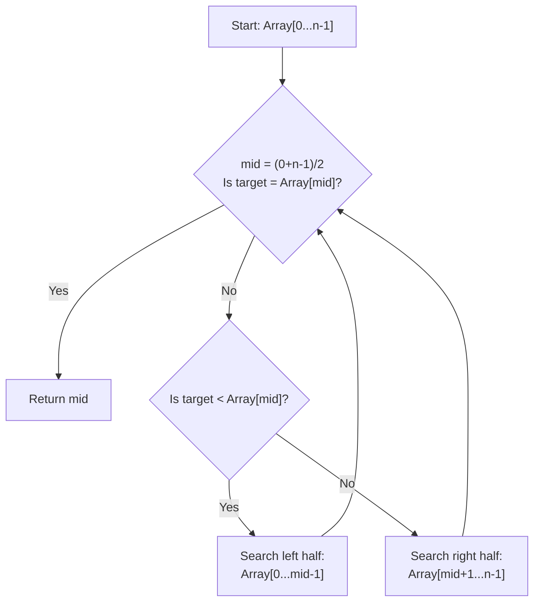

# Explaining Solutions Verbally

## Introduction

One of the most challenging aspects of technical interviews isn't just solving the problem—it's explaining your solution clearly and convincingly. Even brilliant solutions can fall flat if you can't communicate your approach effectively. This skill—verbally explaining your code—is essential not only for interviews but also for your future career as a programmer where you'll need to discuss technical solutions with teammates, managers, and stakeholders.

This guide will walk you through techniques for articulating your thought process, explaining algorithms, and demonstrating your problem-solving skills through clear verbal communication.

## Why Verbal Explanations Matter

Interviewers assess your verbal explanations for several key reasons:

1. **Thought Process Transparency**: They want to see how you approach problems, not just the final solution.
2. **Communication Skills**: Programming is collaborative—you need to explain complex ideas clearly.
3. **Understanding Depth**: A good explanation proves you truly understand the solution, not just memorized it.
4. **Problem-Solving Approach**: Your explanation reveals how you break down complex problems.

## Framework for Explaining Solutions

### 1. The PREP Method

Use this framework to structure your verbal explanations:

- **P** - Problem understanding
- **R** - Reasoning and approach
- **E** - Execution details
- **P** - Performance analysis

Let's see this in action with a simple example:

```js
// Problem: Find the maximum element in an array
function findMax(arr) {
  if (arr.length === 0) return null;
  
  let max = arr[0];
  for (let i = 1; i < arr.length; i++) {
    if (arr[i] > max) {
      max = arr[i];
    }
  }
  return max;
}
```

#### Verbal Explanation Using PREP:

**Problem Understanding**:
"This problem asks us to find the maximum value in an array of numbers. If the array is empty, we'll return null to indicate there's no maximum."

**Reasoning and Approach**:
"I'll solve this by keeping track of the maximum value seen so far as I iterate through the array. Initially, I'll assume the first element is the maximum, then update this value whenever I encounter a larger element."

**Execution Details**:
"I start by handling the edge case of an empty array by returning null. Then I initialize a variable `max` with the first array element. I iterate through the remaining elements, comparing each one with our current maximum. If I find a larger value, I update `max`. After examining all elements, `max` will contain the largest value."

**Performance Analysis**:
"This solution has O(n) time complexity because we need to examine each element exactly once. The space complexity is O(1) since we only use a single variable regardless of input size. This is optimal because we must examine every element at least once to determine the maximum."

### 2. Begin With a High-Level Overview

Always start with a brief, high-level summary before diving into details:

"My approach uses a linear search to find the maximum value by making a single pass through the array while tracking the largest element seen so far."

This gives the interviewer an immediate understanding of your solution strategy.

## Techniques for Clear Explanations

### Use Concrete Examples

Walk through a specific example to illustrate how your algorithm works:

```
Input array: [3, 7, 2, 8, 1]

Initial max = 3
Check 7 > 3? Yes, max becomes 7
Check 2 > 7? No, max stays 7
Check 8 > 7? Yes, max becomes 8
Check 1 > 8? No, max stays 8

Final output: 8
```

### Visualize with Diagrams

When explaining more complex algorithms, consider drawing diagrams. For instance, if explaining a binary search algorithm:



### Narrate Time and Space Complexity

Always explain the efficiency of your solution:

"This algorithm has a time complexity of O(n) because we iterate through each element once. The space complexity is O(1) since we only use a fixed amount of extra memory regardless of input size."

## Common Pitfalls to Avoid

### 1. Code-First, Explanation Later

**Wrong Approach**: Diving straight into coding without explaining your plan.

**Better Approach**: "Before I write any code, let me walk through my approach. I'm planning to solve this using a greedy algorithm where..."

### 2. Rushing Through Explanations

**Wrong Approach**: "So I'll just loop through and check each element and return the max."

**Better Approach**: Systematic explanation following the PREP framework, pacing yourself and checking for interviewer understanding.

### 3. Overly Technical Jargon

**Wrong Approach**: "I'll utilize a linear time bounded iteration construct to traverse the data structure and perform element-wise comparisons."

**Better Approach**: "I'll go through the array once, comparing each value to the current maximum."

### 4. Neglecting Edge Cases

**Wrong Approach**: Explaining only the happy path without addressing edge cases.

**Better Approach**: "Let me first handle some edge cases. If the array is empty, we should return null because there's no maximum element."

## Real-World Example: Explaining a Two-Sum Solution

Let's walk through explaining a complete solution to the classic "Two Sum" problem:

**Problem**: Given an array of integers and a target sum, return the indices of two numbers that add up to the target.

```js
function twoSum(nums, target) {
  const numMap = {};
  
  for (let i = 0; i < nums.length; i++) {
    const complement = target - nums[i];
    
    if (numMap[complement] !== undefined) {
      return [numMap[complement], i];
    }
    
    numMap[nums[i]] = i;
  }
  
  return null; // No solution found
}

// Example usage:
// Input: nums = [2, 7, 11, 15], target = 9
// Output: [0, 1] (because nums[0] + nums[1] = 2 + 7 = 9)
```

### Verbal Explanation:

**Problem Understanding**:
"The Two Sum problem asks us to find the indices of two numbers in an array that sum to a given target value. We need to return these indices as a pair."

**Reasoning and Approach**:
"I'll use a hash map to solve this efficiently. For each element, I'll check if its complement (target minus current element) exists in our map. If it does, we've found our pair. If not, I'll add the current element to the map and continue."

**Execution Details**:
"I start by creating an empty object called `numMap` to store numbers we've seen and their indices. Then I iterate through the array once. For each number, I calculate its complement—what we'd need to add to the current number to reach the target. If this complement already exists in our map, we've found our answer and return both indices. If not, I store the current number and its index in our map and continue searching."

**Performance Analysis**:
"This solution has O(n) time complexity because we make a single pass through the array. The space complexity is also O(n) in the worst case, where we might need to store almost all elements in our hash map. This is more efficient than a naive O(n²) approach that would check every pair of elements."

**Example Walkthrough**:
"Let me trace through the example `[2, 7, 11, 15]` with target `9`:
1. Start with empty map `{}`
2. Process 2: Complement is 9-2=7, not in map. Add 2→0 to map: `{2: 0}`
3. Process 7: Complement is 9-7=2, found in map! Return [0, 1]

So our answer is [0, 1], meaning nums[0] + nums[1] = 2 + 7 = 9."

## Practice Exercises

To improve your verbal explanation skills:

1. **Record Yourself**: Solve problems out loud and record your explanations. Review to identify areas for improvement.

2. **Pair Programming**: Practice with a friend taking turns explaining solutions to each other.

3. **Rubber Duck Debugging**: Explain your code to an inanimate object (or pretend interviewer) to clarify your thoughts.

4. **Time-Box Explanations**: Practice giving concise explanations within 2-3 minutes to develop precision.

## Summary

Explaining your solutions verbally is a critical skill for technical interviews and professional development. By following the PREP framework, using concrete examples, and practicing clear communication, you'll significantly improve your ability to articulate complex technical concepts.

Remember these key points:
- Start with a high-level overview before details
- Use the PREP framework to structure your explanation
- Illustrate with specific examples
- Discuss time and space complexity
- Address edge cases
- Practice regularly

## Additional Resources

- "Cracking the Coding Interview" by Gayle Laakmann McDowell (Chapters on communication)
- [MIT OpenCourseWare: Technical Communication](https://ocw.mit.edu/courses/comparative-media-studies-writing/21w-732-science-writing-and-new-media-fall-2010/)
- [LeetCode Discussion Forum](https://leetcode.com/discuss/) (Study how others explain their solutions)

The ability to clearly explain your solutions is often what separates good candidates from great ones. With dedicated practice using these techniques, you'll develop the communication skills necessary to excel in technical interviews and your programming career.