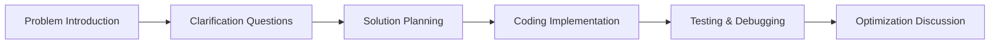

# Time Management During Interviews

Technical interviews can be stressful, and one of the biggest challenges many candidates face is managing their time effectively. Whether you're given 30 minutes or 2 hours, how you allocate your time can significantly impact your performance and success rate.

## Why Time Management Matters

In a technical interview, you're not just being evaluated on whether you can solve the problem—you're also being assessed on:

- How you approach problems
- Your ability to work under pressure
- Your communication skills
- Your efficiency and organization

Poor time management can lead to:
- Unfinished solutions
- Rushed coding with bugs
- Skipping important steps like testing
- Appearing disorganized to the interviewer

## The Typical Interview Timeline

Most technical coding interviews follow a similar pattern:



Let's break down how much time you should allocate to each stage of a 45-minute interview:

| Stage | Time Allocation | Purpose |
|-------|----------------|---------|
| Problem Clarification | 3-5 minutes | Understand requirements and edge cases |
| Solution Planning | 5-10 minutes | Brainstorm approaches and select the best one |
| Coding Implementation | 20-25 minutes | Translate your approach into working code |
| Testing & Debugging | 5-7 minutes | Verify correctness and fix issues |
| Optimization Discussion | Remaining time | Discuss improvements and complexity |

## Stage 1: Problem Clarification (3-5 minutes)

This is your opportunity to ensure you understand exactly what the problem is asking for.

**What to do:**
- Repeat the problem in your own words
- Ask about input/output formats
- Clarify constraints (time/space complexity requirements)
- Discuss edge cases
- Ask for example inputs/outputs if not provided

**Example dialogue:**

"So, I understand we're trying to find the kth largest element in an unsorted array. Before I start, I'd like to clarify a few things:
1. Can the array contain duplicate elements?
2. What should I return if k is larger than the array size?
3. Should I modify the original array or return a new one?"

## Stage 2: Solution Planning (5-10 minutes)

Take time to think before you code. Rushing into implementation without a plan often leads to wasted time.

**What to do:**
- Think aloud about possible approaches
- Consider time and space complexity for each approach
- Use examples to validate your approach
- Draw diagrams or illustrations if helpful
- Get confirmation from the interviewer before proceeding

**Example approach:**

"For finding the kth largest element, I'm considering two approaches:

1. Sorting the array and returning the kth element from the end. This would be O(n log n) time complexity.

2. Using a min-heap of size k, which would give us O(n log k) time complexity.

Since k could be much smaller than n, the heap approach might be more efficient. Let me work through a small example to verify..."

## Stage 3: Coding Implementation (20-25 minutes)

This is usually the longest stage, where you translate your approach into actual code.

**What to do:**
- Write clean, readable code
- Use meaningful variable names
- Add comments for complex sections
- Keep talking through what you're doing
- If stuck, don't panic—communicate your thought process

**Example code for finding the kth largest element using a heap:**

```python
import heapq

def findKthLargest(nums, k):
    # Create a min heap
    min_heap = []
    
    # Process each number in the array
    for num in nums:
        # Add the current number to the heap
        heapq.heappush(min_heap, num)
        
        # If heap size exceeds k, remove the smallest element
        if len(min_heap) > k:
            heapq.heappop(min_heap)
    
    # The root of the heap is the kth largest element
    return min_heap[0]

# Example usage
nums = [3, 2, 1, 5, 6, 4]
k = 2
result = findKthLargest(nums, k)
print(f"The {k}th largest element is: {result}")  # Output: The 2nd largest element is: 5
```

## Stage 4: Testing & Debugging (5-7 minutes)

Never skip this stage! Testing demonstrates thoroughness and attention to detail.

**What to do:**
- Test with the example cases provided
- Test with edge cases (empty array, k=1, k=array length)
- Trace through the execution step by step
- Fix any bugs you find
- Verify time and space complexity

**Example testing:**

"Let me test this solution with a few examples:

1. For input `[3, 2, 1, 5, 6, 4]` and k=2:
   - After processing all elements, our min-heap will contain [5, 6]
   - The root (smallest in the heap) is 5, which is the 2nd largest element ✓

2. Edge case: If the array is `[1]` and k=1:
   - Our heap will just contain [1]
   - The root is 1, which is the largest (and only) element ✓

3. Let me check if there's a bug when we have duplicates:
   - For input `[3, 2, 3, 1, 2, 4, 5, 5, 6]` and k=4:
   - Our heap will contain [3, 4, 5, 6] (smallest to largest)
   - The root is 3, which is the 4th largest element ✓"

## Stage 5: Optimization Discussion (Remaining time)

Use any remaining time to discuss improvements and demonstrate your depth of knowledge.

**What to do:**
- Analyze the time and space complexity of your solution
- Suggest alternative approaches or optimizations
- Discuss trade-offs between different solutions
- Show awareness of real-world considerations

**Example discussion:**

"My solution using a min-heap has a time complexity of O(n log k) and space complexity of O(k).

An alternative approach would be using QuickSelect, which has an average time complexity of O(n) but a worst-case of O(n²). The benefit is that it uses O(1) extra space.

In a real-world scenario, if k is very small compared to n, the heap solution is probably best. If k is close to n, sorting might be simpler. If memory is a constraint and k is large, QuickSelect could be preferable."

## Common Time Management Mistakes to Avoid

1. **Jumping straight to coding** without clarifying the problem
2. **Getting stuck in one approach** for too long
3. **Over-optimizing prematurely** before getting a working solution
4. **Not leaving time for testing**
5. **Spending too long on explanations** rather than demonstrating skills

## Strategies When You're Running Out of Time

If you find yourself running out of time during an interview:

1. **Communicate your awareness** of the time constraint
2. **Prioritize getting a working solution** even if it's not optimal
3. **Outline your approach** even if you can't fully implement it
4. **Pseudo-code the remaining parts** if you can't finish coding
5. **Explain what you would do** with more time

**Example communication:**

"I notice we're running short on time. Let me complete this basic solution first, and then if we have time, I can optimize it further. The current approach has a time complexity of O(n log n), but I believe we could improve it to O(n) using the approach I mentioned earlier."

## Practice Exercises

To improve your time management skills, try these exercises:

1. Set a timer for 45 minutes and solve a medium-level leetcode problem, strictly adhering to the time allocations suggested above.

2. Record yourself solving a problem and review how much time you spent on each stage.

3. Practice with a friend who can act as an interviewer and give you feedback on your pacing.

4. Try solving the same problem multiple times, getting faster each time while maintaining solution quality.

## Real-World Example: Time Management in Action

Let's walk through a complete example of how effective time management might look in a real interview.

**Problem:** Design an algorithm to find all pairs of numbers in an array that sum to a specific target.

**Time allocation for a 45-minute interview:**

1. **Clarification (4 minutes)**
   - "Let me make sure I understand: I need to find all pairs of integers in an array that add up to a given target value, correct?"
   - "Can the array contain duplicates?"
   - "Can a single element be used in multiple pairs?"
   - "What should I return if there are no valid pairs?"

2. **Solution Planning (8 minutes)**
   - "My first thought is a brute force approach using nested loops to check every possible pair. That would be O(n²) time complexity."
   - "A more efficient approach would use a hash map to store elements we've seen, allowing us to find pairs in O(n) time."
   - "Let me illustrate with a small example: for array [1, 5, 3, 7] and target 8, we'd find pairs (1,7) and (5,3)."

3. **Coding Implementation (22 minutes)**

```python
def find_pairs_with_sum(arr, target):
    result = []
    seen = {}
    
    for index, num in enumerate(arr):
        complement = target - num
        
        if complement in seen:
            # For each occurrence of the complement, add a pair
            for prev_index in seen[complement]:
                result.append((complement, num))
                
        # Add current number to seen dictionary
        if num in seen:
            seen[num].append(index)
        else:
            seen[num] = [index]
            
    return result

# Example usage
arr = [1, 5, 3, 7, 3]
target = 8
pairs = find_pairs_with_sum(arr, target)
print(f"Pairs that sum to {target}: {pairs}")  # Output: Pairs that sum to 8: [(1, 7), (5, 3), (5, 3)]
```

4. **Testing & Debugging (7 minutes)**
   - "Let's test with the example: [1, 5, 3, 7, 3] and target 8."
   - "Wait, I see an issue - we're double-counting pairs when we have duplicates. Let me fix that."
   - "Also, I need to ensure we don't count the same index twice."
   - *Makes necessary corrections to the code*
   - "Let's verify with edge cases: empty array, single element array, etc."

5. **Optimization Discussion (4 minutes)**
   - "The solution has O(n) time complexity and O(n) space complexity."
   - "If memory is a concern, we could sort the array first and use two pointers, which would be O(n log n) time but use only O(1) extra space."
   - "In a distributed system with very large datasets, we might consider..."

## Summary

Effective time management during technical interviews is a skill that requires practice. Remember these key points:

- Allocate your time consciously between problem clarification, planning, coding, testing, and optimization
- Communicate clearly throughout the process
- Don't rush into coding without understanding the problem
- Always leave time for testing
- If time runs short, prioritize a working solution over an optimized one

By mastering time management, you'll be able to showcase your technical skills more effectively and increase your chances of success in programming interviews.

## Additional Resources

- Practice with timed coding challenges on platforms like LeetCode and HackerRank
- Set up mock interviews with peers where you strictly time each section
- Record your practice sessions to identify where you tend to spend too much time
- Create a personalized checklist for each interview stage to keep yourself on track