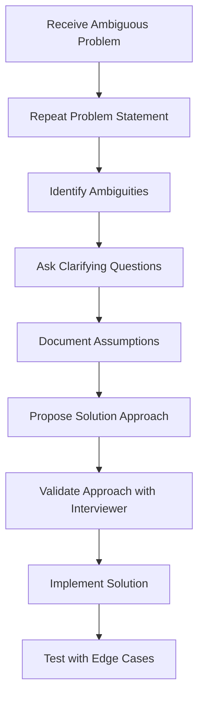

# Handling Ambiguous Problems

## Introduction

During technical interviews, you'll often encounter ambiguous problems—questions that are intentionally vague, open-ended, or missing critical information. These challenges test not just your coding abilities but also your problem-solving approach, communication skills, and ability to work with incomplete information. 

Interviewers use ambiguous problems to evaluate how you:
- Ask clarifying questions
- Make and validate assumptions
- Break down complex problems
- Consider edge cases
- Communicate your thought process

This skill is crucial because real-world programming challenges rarely come with perfect specifications. Let's explore how to effectively handle ambiguity in technical interviews.

## The Clarification Framework

When faced with an ambiguous problem, follow this structured approach:



### 1. Repeat the Problem 

Begin by restating the problem in your own words. This confirms your initial understanding and might immediately reveal unclear aspects.

**Example:**
"So I understand that I need to implement a function that finds the most frequent element in a collection. Let me make sure I understand the requirements correctly..."

### 2. Identify Key Ambiguities

Analyze the problem for vague or missing information. Common ambiguities include:

- Input formats and constraints
- Output expectations
- Edge cases
- Performance requirements
- Allowed data structures or algorithms

### 3. Ask Clarifying Questions

Formulate specific questions to resolve each ambiguity. Good questions demonstrate your analytical thinking and experience.

**Example Questions:**
- "What data types can the input contain?"
- "How should I handle ties when multiple elements have the same frequency?"
- "Should the function be case-sensitive when comparing strings?"
- "What's the expected size of the input? Do we need to optimize for very large datasets?"
- "How should I handle empty inputs or error conditions?"

## Example: Handling an Ambiguous Problem

Let's walk through a typical ambiguous interview problem:

> **Interviewer:** "Design a function to find duplicates."

This is intentionally vague. Let's apply our framework:

### Step 1: Repeat and Identify Ambiguities

"I need to design a function to find duplicates. Before I start, I'd like to clarify a few things about the problem."

Ambiguities:
- What type of collection are we searching in? (Array, string, tree, etc.)
- What constitutes a duplicate? (Exact match, pattern, etc.)
- Should we return all duplicates or just detect if duplicates exist?
- What should the return format be?
- Are there any constraints on time or space complexity?

### Step 2: Ask Clarifying Questions

**Example dialogue:**

You: "What kind of collection will I be searching for duplicates in?"

Interviewer: "Let's say it's an array of integers."

You: "Should I return all duplicate values, or just identify if duplicates exist?"

Interviewer: "Return all duplicate values in the array."

You: "Should I return each duplicate value once, or every instance of duplicated values?"

Interviewer: "Just return each duplicate value once, in any order."

You: "Are there any constraints on time or space complexity I should be aware of?"

Interviewer: "Optimize for time complexity if possible."

### Step 3: Document Assumptions

"Based on our discussion, here's my understanding of the problem:
- I'll implement a function that takes an array of integers
- It should return an array containing each duplicate value exactly once
- I should optimize for time complexity
- The function doesn't need to preserve the original order of elements"

### Step 4: Propose a Solution Approach

"I'll solve this using a hash set to track seen elements:
1. Create an empty hash set to store seen elements
2. Create an empty result array for duplicates
3. Iterate through the input array
4. For each element, check if it's already in the hash set
   - If yes, add it to the duplicates array (if not already there)
   - If no, add it to the hash set
5. Return the duplicates array"

### Step 5: Implement the Solution

```javascript
function findDuplicates(arr) {
  const seen = new Set();
  const duplicates = new Set();
  
  for (const num of arr) {
    if (seen.has(num)) {
      duplicates.add(num);
    } else {
      seen.add(num);
    }
  }
  
  return Array.from(duplicates);
}
```

### Step 6: Test with Examples and Edge Cases

```javascript
// Example 1: Basic case
console.log(findDuplicates([1, 2, 3, 2, 1, 4, 5, 4]));
// Output: [1, 2, 4]

// Example 2: No duplicates
console.log(findDuplicates([1, 2, 3, 4, 5]));
// Output: []

// Example 3: All duplicates
console.log(findDuplicates([1, 1, 1, 1]));
// Output: [1]

// Example 4: Empty array
console.log(findDuplicates([]));
// Output: []
```

## Common Types of Ambiguous Problems

### 1. System Design Problems

These are intentionally open-ended and require making assumptions about scale, user behavior, and requirements.

**Example:** "Design a URL shortening service like bit.ly"

**Approach:**
- Clarify functional requirements: What should the service do?
- Establish non-functional requirements: Scale? Latency? Availability?
- Define constraints: How short should URLs be? Expiration policy?
- Sketch the system architecture and API design
- Discuss trade-offs in your approach

### 2. Algorithm Optimization Problems

Often lacking specific constraints on input size or performance expectations.

**Example:** "Implement a function to find the kth largest element in an array"

**Clarification questions:**
- "Is the array sorted?"
- "Can the array contain duplicates?"
- "What's the expected size of the array and value of k?"
- "Is memory usage a concern?"

### 3. Data Structure Selection Problems

When the problem doesn't specify which data structure to use.

**Example:** "Implement a cache"

**Clarification questions:**
- "What eviction policy should I use? (LRU, FIFO, etc.)"
- "What's the capacity of the cache?"
- "What operations need to be supported and their expected time complexity?"
- "What types of keys and values will be stored?"

## Real-World Application

Let's see a practical example of handling ambiguity in a real-world scenario:

**Scenario:** You're tasked with implementing a search feature for a product catalog.

**Initial ambiguous request:**
"We need a search function for our products."

**Clarification process:**
1. What fields should be searchable? (name, description, category, etc.)
2. Should it be exact match or support partial matches?
3. Do we need to rank results by relevance?
4. What's the expected response time?
5. Should it support filters alongside search?
6. What's the size of the product catalog?

**Refined problem:**
After clarification, you might arrive at: "Implement a search function that searches product names and descriptions, supports partial matching, returns results sorted by relevance, and handles a catalog of ~10,000 products with sub-second response time."

## Implementation Strategies

When implementing solutions to ambiguous problems:

### 1. Start Simple

Begin with a basic solution that handles the core requirements. You can then optimize or extend it:

```javascript
// Simple search implementation
function searchProducts(products, query) {
  const normalizedQuery = query.toLowerCase();
  
  return products.filter(product => {
    const nameMatch = product.name.toLowerCase().includes(normalizedQuery);
    const descMatch = product.description.toLowerCase().includes(normalizedQuery);
    return nameMatch || descMatch;
  });
}
```

### 2. Handle Edge Cases

Consider boundary conditions based on your clarifications:

```javascript
// Improved with edge case handling
function searchProducts(products, query) {
  // Handle empty query
  if (!query || query.trim() === '') {
    return [];
  }
  
  const normalizedQuery = query.toLowerCase().trim();
  
  return products.filter(product => {
    const nameMatch = product.name?.toLowerCase().includes(normalizedQuery) || false;
    const descMatch = product.description?.toLowerCase().includes(normalizedQuery) || false;
    return nameMatch || descMatch;
  });
}
```

### 3. Iterate and Refine

Based on feedback, enhance your solution:

```javascript
// Refined with relevance scoring
function searchProducts(products, query) {
  if (!query || query.trim() === '') {
    return [];
  }
  
  const normalizedQuery = query.toLowerCase().trim();
  const results = [];
  
  for (const product of products) {
    let relevance = 0;
    
    // Check name match (higher weight)
    if (product.name?.toLowerCase().includes(normalizedQuery)) {
      relevance += 2;
      
      // Exact match gets higher score
      if (product.name.toLowerCase() === normalizedQuery) {
        relevance += 3;
      }
    }
    
    // Check description match
    if (product.description?.toLowerCase().includes(normalizedQuery)) {
      relevance += 1;
    }
    
    if (relevance > 0) {
      results.push({ ...product, relevance });
    }
  }
  
  // Sort by relevance score
  return results.sort((a, b) => b.relevance - a.relevance);
}
```

## Communication Tips

How you communicate during the clarification process is as important as the technical solution:

### Do:
- Think aloud to share your reasoning
- Acknowledge constraints as you discover them
- Frame assumptions clearly: "Based on what we've discussed, I'm assuming..."
- Use visual aids (diagrams, pseudocode) to clarify your approach
- Confirm your understanding at key points

### Don't:
- Rush to code without sufficient clarification
- Make assumptions without stating them
- Stick to a complex approach when a simpler solution emerges
- Dismiss edge cases without consideration

## Summary

Handling ambiguous problems is a critical skill that demonstrates your ability to:

1. **Identify missing information** through analytical thinking
2. **Ask targeted questions** to resolve ambiguities
3. **Make reasonable assumptions** when necessary
4. **Communicate clearly** throughout the problem-solving process
5. **Adapt your approach** as new information emerges

Remember that ambiguous problems in interviews simulate real-world scenarios where requirements are often unclear or evolving. Your process for handling these situations reveals your problem-solving maturity and communication skills—qualities that are highly valued in professional developers.

## Practice Exercises

To improve your ambiguity-handling skills, try these exercises:

1. **Reverse engineering**: Have a friend describe the output of a function, and you need to determine what the function does.

2. **Specification refinement**: Take vague product requirements like "Create a user dashboard" and practice expanding them into detailed specifications.

3. **Mock interviews**: Practice with ambiguous interview questions like:
   - "Design a parking lot system"
   - "Implement a file system"
   - "Create a function to detect patterns"

4. **Real-world practice**: When receiving tasks at work or school, intentionally identify ambiguities and practice clarifying them before starting implementation.

The more you practice identifying and resolving ambiguities, the more natural and efficient your problem-solving approach will become during technical interviews.